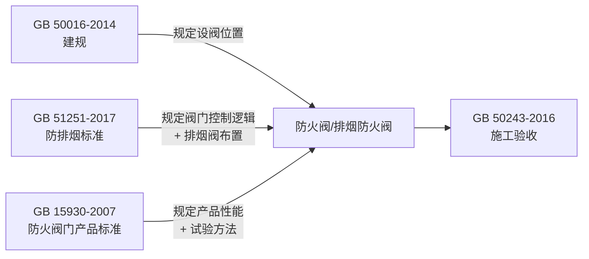

# GB 15930-2007 建筑通风和排烟系统用防火阀门

> [!important] 标准基本信息
> - **标准编号**：GB 15930-2007
> - **标准名称**：建筑通风和排烟系统用防火阀门
> - **英文名称**：Fire dampers for building venting and smoke-venting system
> - **发布部门**：中华人民共和国国家质量监督检验检疫总局、中国国家标准化管理委员会
> - **施行日期**：**2008 年 6 月 1 日**
> - **代替标准**：GB 15930-1995《防火阀试验方法》
> - **性质**：强制性国家标准（消防产品认证依据）

GB 15930-2007 是建筑通风和排烟系统用防火阀门的**产品标准**，规定了防火阀、排烟防火阀、排烟阀三类产品的术语定义、分类与标记、技术要求、试验方法、检验规则及标志、包装等。该标准是消防产品**强制性认证（CCC）** 的依据文件，也是 GB50016-2014 建筑设计防火规范(2018版) 和 GB51251-2017 建筑防烟排烟系统技术标准 中防火阀选型的底层技术支撑。

---

## 一、三类阀门定义与核心区别

GB 15930-2007 定义了通风和排烟系统中的三种核心阀门，三者在功能、动作温度和安装位置上存在本质区别：

| 项目 | **防火阀** | **排烟防火阀** | **排烟阀** |
|------|-----------|--------------|-----------|
| **英文名称** | Fire Damper | Fire/Smoke Damper (280°C) | Smoke Damper |
| **定义** | 安装在通风、空调系统管道上，平时常开，火灾时当管道内烟气温度达到 **70°C** 时自动关闭 | 安装在机械排烟系统管道上，平时常开/常闭，火灾时当排烟管道内烟气温度达到 **280°C** 时自动关闭 | 安装在机械排烟系统各支管端部（排烟口），平时常闭，火灾时手动或电动开启进行排烟 |
| **常态** | 常开 | 常开 或 常闭 | **常闭** |
| **动作温度** | **70°C ± 2°C** | **280°C ± 3°C** | 不依赖温度（手动/电动开启） |
| **核心功能** | 温度达到 70°C → **自动关闭** → 切断火灾蔓延路径 | 温度达到 280°C → **自动关闭** → 停止排烟，保护风机 | 火灾信号 → **开启** → 排出烟气 |
| **安装位置** | 穿越防火分区处、穿越机房隔墙处、竖井水平支管等（依据 GB 50016 第 9.3.11 条） | 排烟风机入口处、排烟支管接入干管处 | 各防烟分区排烟口处 |
| **复位方式** | 手动复位 | 手动复位 | 手动或电动复位 |

### 1.1 功能逻辑对比

```mermaid
graph TD
    subgraph 防火阀-Fire Damper
        A1[平时: 常开] -->|管道温度≥70°C| A2[熔断器动作] --> A3[阀门关闭] --> A4[切断火灾蔓延]
    end
    subgraph 排烟防火阀-280°C Damper
        B1[平时: 常开/常闭] -->|排烟温度≥280°C| B2[熔断器动作] --> B3[阀门关闭] --> B4[停止排烟, 保护风机]
        B1 -->|火灾信号| B5[电动/手动开启] --> B6[排烟]
    end
    subgraph 排烟阀-Smoke Damper
        C1[平时: 常闭] -->|火灾信号| C2[电动/手动开启] --> C3[排烟口排烟]
    end
```

> [!warning] 关键区别 —— 防"火" vs 排"烟"
> - **防火阀（70°C）**：核心任务是**隔断火源**——当烟气温度达到 70°C 时意味着火灾已蔓延至管道内，此时必须关闭阀门阻止火势通过风管传播。
> - **排烟阀**：核心任务是**排出烟气**——火灾初期需开启排烟，保障人员疏散；只有当烟气温度高到 280°C 时（意味着已接近轰燃），排烟防火阀才关闭以保护排烟风机。

---

## 二、型号命名规则

GB 15930-2007 规定了防火阀门的统一型号编制规则，格式如下：

```
[功能代号] [结构代号] - [动作方式] - 公称尺寸
```

### 2.1 功能代号

| 功能代号 | 含义 | 产品类型 |
|----------|------|---------|
| **FHF** | 防火阀 | Fire damper（70°C） |
| **PFHF** | 排烟防火阀 | Fire/Smoke damper（280°C） |
| **PYF** | 排烟阀 | Smoke damper（排烟口） |

### 2.2 型号示例

| 型号 | 解读 |
|------|------|
| **FHF-W-630×500** | 防火阀，温度熔断器动作（W），公称尺寸 630×500mm |
| **PFHF-WSDc-K-1000×800** | 排烟防火阀，温控/手控/电控电磁铁动作，远距离控制，公称尺寸 1000×800mm |
| **PYF-SDc-K-800×600** | 排烟阀，手控/电控电磁铁动作，远距离控制，公称尺寸 800×600mm |

> [!tip] 动作方式代号含义
> - **W** —— 温度熔断器自动关闭
> - **S** —— 手动关闭/开启
> - **Dc** —— 电磁铁（DC 24V）控制
> - **Dj** —— 电动执行机构
> - **K** —— 远距离控制（缆索或控制箱）

---

## 三、技术指标与性能要求

### 3.1 耐火性能

| 指标 | 要求 | 试验方法 |
|------|------|---------|
| **耐火时间** | ≥ **1.50 h**（所有三类阀门均不低于 1.5h） | 按标准升温曲线（ISO 834）在耐火试验炉中进行 |
| **耐火试验要求** | 试验期间阀门应保持规定的开启/关闭状态，不得出现影响功能的变形或损坏 | 完整性+隔热性判定 |

### 3.2 动作温度

| 阀门类型 | 公称动作温度 | 允差 |
|----------|-------------|------|
| **防火阀** | **70°C** | ±2°C |
| **排烟防火阀** | **280°C** | ±3°C |
| **排烟阀** | 不适用（非温控） | — |

### 3.3 漏风量

| 阀门类型 | 常态下漏风量要求 | 关闭状态下漏风量要求 |
|----------|-----------------|---------------------|
| 防火阀（常开） | ≤ **500 m³/(h·m²)**（压差 300Pa 时） | ≤ **200 m³/(h·m²)**（压差 300Pa 时，关闭状态） |
| 排烟防火阀（常开/常闭） | 同防火阀 | ≤ **200 m³/(h·m²)** |
| 排烟阀（常闭） | ≤ **200 m³/(h·m²)**（压差 300Pa 时，关闭状态） | — |

### 3.4 其他关键性能指标

| 性能指标 | 要求 | 说明 |
|----------|------|------|
| **复位功能** | 手动复位机构应操作灵活、可靠，复位后阀门应能正常复位至初始状态 | 防火阀和排烟防火阀必须手动复位（不得自动复位） |
| **控制可靠性** | 电控阀门在额定电压的 85%~110% 范围内应能正常工作 | DC 24V 或 AC 220V |
| **启闭可靠性** | 经 50 次启闭循环后，阀门仍应符合全部性能要求 | 耐久性验证 |
| **耐腐蚀性** | 金属部件应经防腐处理，耐盐雾试验 ≥96h | 保证长期使用可靠性 |
| **绝缘电阻** | 电控装置带电部件与壳体之间 ≥20MΩ | 电气安全 |

---

## 四、试验方法概要

GB 15930-2007 规定了完整的型式试验方法：

| 试验项目 | 试验方法 | 判定依据 |
|----------|---------|----------|
| **耐火试验** | 按 ISO 834 标准升温曲线加热 1.5h，测量背火面温升和完整性 | 完整性不失效 + 隔热性温升 ≤140°C（平均）/ ≤180°C（最高） |
| **动作温度试验** | 在温控箱中以 1°C/min 速率升温，记录熔断器动作温度 | 70°C ± 2°C（防火阀）/ 280°C ± 3°C（排烟防火阀） |
| **漏风量试验** | 在专用漏风量测试台上施加300Pa压差，测量漏风量 | 常态 ≤500，关闭 ≤200 m³/(h·m²) |
| **盐雾试验** | 96h 中性盐雾试验，试验后阀门功能正常 | 无严重锈蚀，启闭正常 |
| **启闭循环** | 50 次全行程启闭循环 | 试验后各项性能仍达标 |

---

## 五、与关联标准的联动关系

GB 15930-2007 是产品标准，定义了阀门"怎么做"和"怎么测"；而设计标准定义阀门"用在哪儿"和"怎么用"。两者必须配套使用：

| 标准 | 关系 | 内容 |
|------|------|------|
| **GB 50016-2014**（建规） | 🔗 设计依据 | 第 9.3.11 条规定防火阀必须设置的 **6 类位置** |
| **GB 51251-2017**（防排烟标准） | 🔗 设计+控制依据 | 第 6 章规定排烟防火阀在 280°C 时联锁关闭排烟风机；第 4 章规定排烟阀的设置间距和数量 |
| **GB 50243-2016**（施工验收） | 🔗 安装验收依据 | 第 6 章规定防火阀安装要求（距墙 ≤200mm、检修口等） |



> [!important] 选型与采购要点
> 1. 确认阀门 **CCC 认证证书** 有效，产品型号与认证范围一致
> 2. 防火阀 / 排烟防火阀必须具备**手动复位**功能（自动复位不符合消防规范）
> 3. 排烟阀需具备 **DC 24V 远程开启** 和 **手动开启** 双重功能
> 4. 阀门铭牌上应清晰标明型号、公称尺寸、动作温度、耐火时间、出厂编号

---

## 六、风管制造中的阀门接口要求

防火阀门的安装连接与风管制造密切相关，在 CAMduct 风管制造流程中需重点关注：

| 制造环节 | 接口要求 | 关联内容 |
|----------|---------|----------|
| **法兰匹配** | 阀门两端法兰应与风管法兰规格一致，螺栓孔对齐 | 风管连接方式 |
| **管段长度** | 防火阀**前后各 2.0m** 范围内风管应采用防火保护（≥ 阀门同等耐火极限） | GB 50243 第 6.2.3 条 |
| **三通/弯头** | 防火阀附近的三通、弯头等管件不应影响阀门叶片全行程启闭 | 管件制造(弯头三通等) |
| **柔性接头** | 阀门两端不应直接连接柔性短管 | 柔性短管耐火性能不足 |
| **检修口预留** | 阀门安装位置对应的吊顶/隔墙处必须留设检修口 | GB 50243 |
| **气流方向** | 阀门上标示的气流方向箭头必须与系统气流方向一致 | 安装方向错误将导致阀门无法正常关闭 |

---

## 七、常见问题与禁忌

> [!danger] 常见错误
> 
> | 错误做法 | 危害 | 正确做法 |
> |----------|------|---------|
> | 用防火阀（70°C）代替排烟防火阀（280°C）安装在排烟系统上 | 排烟时管道正常温度可能超过 70°C（可达 150~200°C），导致阀门误关闭，排烟失效 | 排烟系统必须使用 **280°C 排烟防火阀** |
> | 防火阀安装在距防火墙 >200mm 处 | 防火墙与阀门之间的风管段成为"防火盲区"，火灾可从此段蔓延 | 阀门紧靠防火墙安装，距墙 ≤200mm |
> | 排烟阀未设远程复位功能 | 火灾后阀门无法复位，影响系统恢复 | 选用带电动执行机构的排烟阀 |
> | 阀门安装在无法操作的隐蔽处 | 无法进行手动测试和复位 | 留设检修口，确保操作手柄可达 |
> | 不同类型阀门混用 | 系统功能混乱，消防验收不通过 | 严格按照设计图纸和系统功能选用对应阀门类型 |

---

## 八、相关页面导航

- 建筑防火规范（防火阀设置位置）→ GB50016-2014 建筑设计防火规范(2018版)
- 防排烟系统设计（阀门控制逻辑）→ GB51251-2017 建筑防烟排烟系统技术标准
- 风管耐火试验方法 → GBT17428-2009 通风管道耐火试验方法
- 风管法兰连接方式 → 风管连接方式
- 弯头、三通等管件制造 → 管件制造(弯头三通等)
- 风管施工质量验收 → [GB50243-2016 通风与空调工程施工质量验收规范](/knowledge/pipe-fitting-spec/GB50243-2016-通风与空调工程施工质量验收规范/)

---

> 📅 **文档创建**：2026-05-25
> 📌 本页内容基于 GB 15930-2007 标准文本整理。工程使用请以官方出版的纸质标准为准。
> 🔥 防火阀门是**强制性认证消防产品（CCC）**，采购时必须查验 CCC 证书和型式检验报告，无证产品严禁使用。
