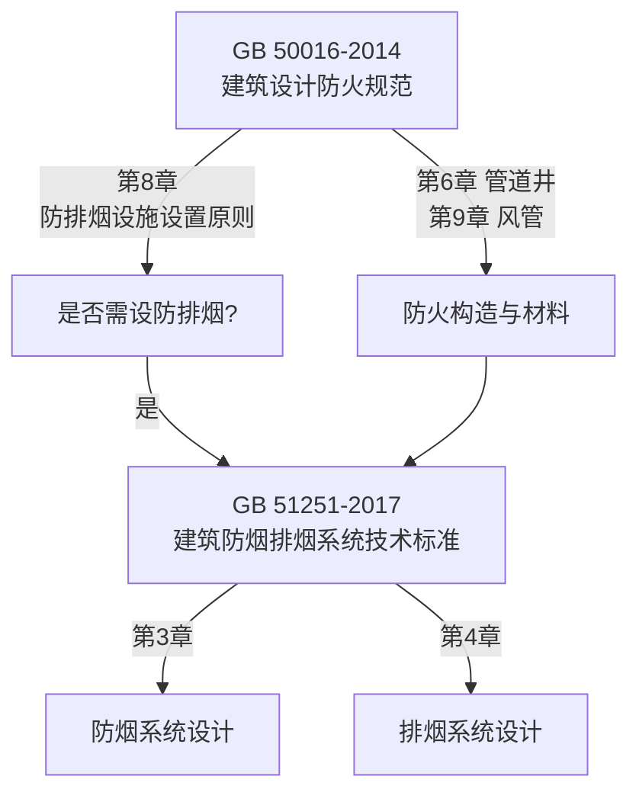

# GB 50016-2014 建筑设计防火规范（2018年版）

> [!important] 标准基本信息
> - **标准编号**：GB 50016-2014（2018年版）
> - **标准名称**：建筑设计防火规范
> - **英文名称**：Code for fire protection design of buildings
> - **发布部门**：中华人民共和国住房和城乡建设部、中华人民共和国国家质量监督检验检疫总局
> - **施行日期**：**2015 年 5 月 1 日**（2018年局部修订版施行日期：2018年10月1日）
> - **代替标准**：GB 50016-2006《建筑设计防火规范》和 GB 50045-95《高层民用建筑设计防火规范》（2005年版）
> - **性质**：**强制性国家标准**（全部条文均为强制性条文，必须严格执行）

GB 50016-2014（2018年版）是中国建筑防火设计的**母规范**，简称"建规"，适用于所有新建、扩建和改建的工业与民用建筑。该规范合并了原《建筑设计防火规范》与《高层民用建筑设计防火规范》，形成了统一的建筑防火设计技术体系。其中涉及通风管道的章节对暖通专业的防火设计具有**直接约束力**。

---

## 一、与通风管道相关的关键章节

GB 50016-2014 共分 12 章正文和 3 个附录。与通风管道系统直接相关的核心章节如下：

| 章节 | 标题 | 与风管系统的关系 |
|------|------|-----------------|
| **第 6 章** | 建筑构造 | 管道井设置、防火分隔、穿越防火分区构造要求 |
| **第 9 章** | 供暖、通风和空气调节 | 🔑 通风管道防火设计**核心章节**，涵盖防火阀设置、管道材料、保温材料燃烧性能等 |

此外，第 5 章（防火分区和层数）对防火分区的划分原则，以及第 7 章（灭火救援设施）对排烟设施的布局，也间接影响通风管道的系统设计。

---

## 二、第 9 章 —— 供暖、通风和空气调节（核心章节）

第 9 章是暖通专业防火设计的依据，共分 4 节：

| 节号 | 内容 | 重点 |
|------|------|------|
| **9.1** | 一般规定 | 甲/乙类厂房空气循环限制、可燃气体管道限制 |
| **9.2** | 供暖 | 供暖管道与可燃物间距 | 
| **9.3** | 通风和空气调节 | 🔥 **核心节**——风管材料、穿越防火墙、防火阀设置、保温材料 |
| **9.4** | 燃油/燃气锅炉房通风 | 事故通风要求 |

---

## 三、防火阀设置位置要求（第 9.3.11 条）

> [!warning] 第 9.3.11 条——防火阀必设位置
> 通风、空气调节系统的风管在下列部位应设置**公称动作温度为 70°C 的防火阀**：

| 序号 | 设置部位 | 设置原因 |
|------|---------|----------|
| **①** | **穿越防火分区处** | 防止火灾通过风管从一个防火分区蔓延到相邻防火分区 |
| **②** | **穿越通风、空气调节机房的房间隔墙和楼板处** | 防止火灾蔓延至设备机房，保护核心设备 |
| **③** | **穿越重要的或火灾危险性大的场所的房间隔墙和楼板处** | 保护重要功能区域（档案室、变配电室等） |
| **④** | **穿越防火分隔处的变形缝两侧** | 建筑变形缝是防火薄弱环节，需两侧均设防火阀 |
| **⑤** | **垂直风管与每层水平风管交接处的水平管段上** | 防止火灾在竖井内竖向蔓延——"烟囱效应"阻断 |
| **⑥** | **公共建筑内厨房的排油烟管道**（按防火分区设置，在与竖向排风管连接的支管处） | 厨房是火灾高发区域，排油烟管道油脂积聚风险极高 |

> [!important] 卫生间排风支管特殊规定
> 公共建筑的浴室、卫生间和厨房的**竖向排风管**，应采取防止回流措施或在支管上设置防火阀。当设置防火阀确有困难时，应**在每层支管上设置公称动作温度为 70°C 的防火阀**。

### 3.1 防火阀安装通用要求

| 要求项 | 具体内容 |
|--------|---------|
| **安装位置** | 防火阀宜靠近防火分隔处设置，**距墙表面不应大于 200mm** |
| **穿越防火墙** | 风管与防火墙之间的缝隙应采用**防火封堵材料**严密填实 |
| **暗装要求** | 安装在吊顶等隐蔽部位的防火阀，应在便于操作的部位设置**检修口** |
| **阀门动作** | 防火阀应能**手动复位**，且在阀门两侧各 2.0m 范围内的风管应采取防火保护措施 |
| **联锁控制** | 防火阀关闭时，应能联锁关闭相应的送风机/排风机（通过 GB 51251 配套执行） |

---

## 四、通风管道穿越防火分区要求

### 4.1 第 6 章相关条文

| 条文 | 内容 | 工程要点 |
|------|------|---------|
| **6.1.5** | 防火墙上不应开设门、窗、洞口，确需开设时应设置**不可开启**或**火灾时能自行关闭**的甲级防火门/窗 | 防火墙上**不得直接开风管洞口** |
| **6.1.6** | 管道穿过防火墙时，应采用**防火封堵材料**将墙与管道之间的空隙紧密填实 | 穿墙套管厚度 ≥1.6mm |
| **6.2.9** | 建筑内的电缆井、管道井应在**每层楼板处**采用不低于楼板耐火极限的不燃材料或防火封堵材料封堵 | 竖向管井每层封堵 |
| **6.3.5** | 防烟、排烟、供暖、通风和空气调节系统中的管道，穿越防火隔墙、楼板和防火墙处的**孔隙应采用防火封堵材料封堵** | 穿墙穿楼板全部封堵 |

### 4.2 管道井设置要求

| 要求项 | 具体内容 |
|--------|---------|
| **井壁耐火极限** | 管道井井壁的耐火极限不应低于 **1.00h** |
| **检修门** | 管道井上的检查门应采用**丙级防火门**（防烟系统管井应采用**乙级防火门**） |
| **井内管道** | 管道井内敷设的管道（含风管）应采用**不燃材料**制作 |
| **楼层封堵** | 管道井应在**每层楼板处**采用不低于楼板耐火极限的不燃材料封堵 |

---

## 五、管道保温材料燃烧性能等级要求

> [!warning] 保温材料燃烧性能要求
> 通风、空气调节系统的风管及设备采用的**绝热材料**（保温材料），其燃烧性能等级应符合下列规定：

| 应用场景 | 燃烧性能等级要求 | 常见材料 |
|----------|-----------------|----------|
| **穿越防火分区、穿越机房隔墙/楼板的风管** | **A 级（不燃材料）** | 岩棉、玻璃棉、硅酸铝棉 |
| **设于建筑物内的通风空调风管**（一般区域） | **不低于 B1 级（难燃材料）** | 橡塑保温（B1级）、酚醛泡沫、聚氨酯（B1级） |
| **电加热器前后 800mm 范围** | **A 级（不燃材料）** | 岩棉管壳、硅酸钙 |

> [!important] A 级 与 B1 级的区别
> - **A 级**：不燃材料——在空气中受到火烧或高温作用时**不起火、不微燃、不碳化**（如金属、玻璃棉、岩棉、混凝土）
> - **B1 级**：难燃材料——在空气中受到火烧或高温作用时**难起火、难微燃、难碳化**，火源移除后燃烧或微燃立即停止（如经阻燃处理的橡塑、酚醛泡沫）

---

## 六、通风管道材料要求

### 6.1 风管本体材料

| 条文 | 要求 |
|------|------|
| **9.3.13** | 通风、空气调节系统的风管应采用**不燃材料**制作（确有困难时，可采用难燃材料，但不得穿越防火分区） |
| **9.3.14** | 排除、输送有燃烧或爆炸危险气体、蒸气和粉尘的排风系统，风管应采用**不燃材料**并应**直接通到室外安全处** |
| **9.3.16** | 燃油/燃气锅炉房的通风管道应采用**不燃材料** |

### 6.2 柔性短管

| 使用部位 | 材料要求 |
|----------|---------|
| 一般通风空调系统 | 可采用**难燃 B1 级**材料（帆布、硅胶玻纤布） |
| **防排烟系统** | 必须采用**不燃 A 级**材料（防火硅胶玻纤布），长度 150~250mm |
| 变形缝处 | 应采用**不燃 A 级**柔性短管 |

---

## 七、与防排烟标准的衔接

GB 50016-2014 第 8 章（"防烟和排烟设施"）仅给出原则性要求（哪些建筑需设置防排烟系统），具体的设计、计算、设备选型则指引至 GB51251-2017 建筑防烟排烟系统技术标准。两者关系如下：

---

## 八、2018 年局部修订要点

2018年版相对于2014版的主要修订中，与通风管道相关的关键变化包括：

| 修订内容 | 影响 |
|----------|------|
| 完善了老年人照料设施的防火设计要求 | 新增对养老设施防排烟系统的专门规定 |
| 明确了建筑高度 >250m 的建筑防火加强措施 | 超高层建筑风管耐火极限需相应提高 |
| 修订了部分消防电梯设置要求 | 消防电梯前室加压送风要求的调整 |
| 调整了疏散距离、防火分区面积等参数 | 间接影响防排烟分区划分 |

---

## 九、对风管制造与安装的工程要点

| 工程环节 | 关键控制点 | 标准依据 |
|----------|-----------|----------|
| **板材选型** | 防排烟风管必须使用不燃材料；一般风管优先不燃 | 9.3.13、9.3.14 |
| **保温施工** | 穿越防火分区及机房处保温必须为A级 | 9.3.15 |
| **防火阀安装** | 6类必设位置 + 距墙 ≤200mm | 9.3.11 |
| **穿墙封堵** | 全部穿越处均需防火封堵材料填实 | 6.1.6、6.3.5 |
| **管井施工** | 井壁 ≥1.0h + 每层封堵 + 丙级/乙级防火门 | 6.2.9 |
| **柔性接管** | 防排烟系统必须用A级不燃柔性短管 | 9.3.14 |

---

## 十、相关页面导航

- 防排烟系统设计 → GB51251-2017 建筑防烟排烟系统技术标准
- 风管耐火试验 → GBT17428-2009 通风管道耐火试验方法
- 防火阀门标准 → GB15930-2007 建筑通风和排烟系统用防火阀门
- 风管保温构造 → 保温风管
- 风管连接方式 → 风管连接方式
- 风管施工质量验收 → GB50243-2016 通风与空调工程施工质量验收规范
- 风管施工规范 → GB50738-2011 通风与空调工程施工规范

---

> 📅 **文档创建**：2026-05-25
> 📌 本页内容基于 GB 50016-2014（2018年版）标准文本整理。工程使用请以官方出版的纸质标准为准。
> ⚠️ GB 50016-2014 是**全文强制性标准**，所有条文均具有法律强制力，违反即构成违法。
