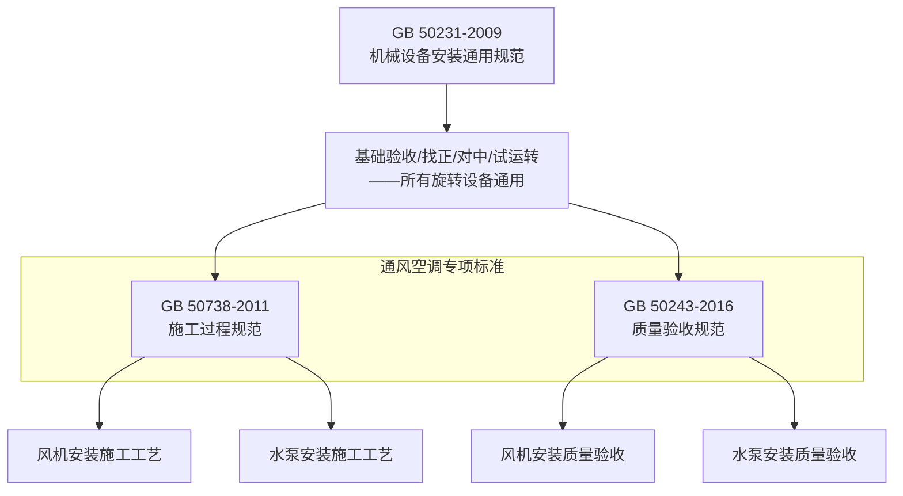

# GB50231-2009 机械设备安装工程施工及验收通用规范

> [!important] 标准基本信息
> - **标准编号**：GB 50231-2009
> - **标准名称**：机械设备安装工程施工及验收通用规范
> - **英文名称**：General code for construction and acceptance of mechanical equipment installation engineering
> - **发布部门**：中华人民共和国住房和城乡建设部、中华人民共和国国家质量监督检验检疫总局
> - **施行日期**：**2009 年 10 月 1 日**
> - **代替标准**：GB 50231-98《机械设备安装工程施工及验收通用规范》
> - **性质**：国家标准（强制性条文以黑体字标识）

GB 50231-2009 是**各类机械设备安装的通用性基础规范**，提供从基础验收到试运转的全过程技术要求和验收准则。对于 HVAC 工程而言，风机、水泵、制冷压缩机、冷却塔等旋转设备的安装均需同时满足 GB 50231（通用要求）和 GB 50243 / GB 50738（专项要求）的双重规定。

---

## 一、适用范围

> [!note] GB 50231-2009 适用范围
> 本规范适用于**各类机械设备安装工程**从设备开箱检验到空负荷试运转合格为止的施工及验收全过程，涵盖：
> - 金属切削机床、锻压设备、铸造设备
> - **风机**（离心式、轴流式、混流式）
> - **泵类**（离心泵、轴流泵、混流泵）
> - **压缩机**（离心式、螺杆式、往复式）
> - 制冷设备、空调设备
> - 起重运输设备、电梯等

对于 HVAC 工程而言，GB 50231 是风机、水泵、制冷主机等核心设备安装的**底层通用规范**——它规定了所有旋转机械设备共通的安装要求，而 GB 50738 和 GB 50243 则在此基础上增加通风空调系统的专项要求。

---

## 二、核心安装流程（六大环节）

GB 50231-2009 按照设备安装的通用工序链组织，形成 **6 大核心环节**：

### 2.1 基础验收

设备基础是设备安装的根基，GB 50231 对基础验收提出严格要求：

| 验收项目 | 标准要求 | 检验方法 |
|----------|----------|----------|
| **基础强度** | 混凝土强度 ≥ 设计强度 75% 方可安装；≥ 100% 方可重载试车 | 查验混凝土试块报告 |
| **基础位置** | 纵横轴线偏差 ≤ ±20mm | 经纬仪/钢尺测量 |
| **基础标高** | 偏差 ≤ -20mm（不允许正偏差，以防设备悬空） | 水准仪测量 |
| **预埋地脚螺栓孔** | 中心位置偏差 ≤ ±10mm；孔深偏差 ≤ +20mm/0；孔壁垂直度 ≤ 10mm | 钢尺、线锤 |
| **基础表面** | 表面平整、无裂纹、无蜂窝麻面；预埋钢板标高偏差 ≤ +0/-10mm | 目视 + 水准仪 |

> [!warning] 基础验收不合格
> 基础验收不合格的不得进行设备就位安装。如需二次灌浆，应在设备初步找平找正后、地脚螺栓孔灌浆强度 ≥75% 时进行。

### 2.2 设备就位

| 项目 | 技术要求 |
|------|----------|
| **起重吊装** | 使用设备自带的吊耳或规定吊点；严禁利用设备连接管口、法兰作为吊点 |
| **垫铁布置** | 每组垫铁 ≤5 块（含平垫铁和斜垫铁），垫铁组放置在地脚螺栓两侧 |
| **垫铁接触** | 垫铁与基础接触面积 ≥50%；用 0.05mm 塞尺检查，塞入深度 ≤ 垫铁长度的 1/3 |
| **垫铁点焊** | 设备找正后，同组垫铁应相互点焊牢固（振动设备尤其重要） |

### 2.3 找正调平

找正调平是设备安装最关键的精度控制环节：

| 精度项目 | 通用要求 | 测量工具 |
|----------|----------|----------|
| **水平度** | 纵横向水平度偏差 ≤ 0.2/1000（风机/泵类通行标准） | 框式水平仪（精度 0.02mm/m） |
| **标高** | 偏差 ≤ ±10mm | 水准仪 |
| **中心线** | 与基准线偏差 ≤ ±5mm | 拉钢丝线 + 钢尺 |
| **垂直度** | 立式设备：≤ 0.5/1000 | 线锤或经纬仪 |

> [!tip] 水平度调整方法
> 设备水平度调整采用**三点调整法**：
> 1. 首先在设备底座对角位置放置两组主要垫铁，初步调整
> 2. 然后在其余地脚螺栓处配置辅助垫铁
> 3. 通过增减垫铁厚度或调整斜垫铁楔入量，实现水平度精确达标
> 4. 对于振动敏感的精密设备，建议使用**减振垫块**配合调平

### 2.4 地脚螺栓

| 技术要求 | 说明 |
|----------|------|
| **垂直度** | 地脚螺栓应垂直安装，倾斜偏差 ≤ 螺栓全长的 1/100 |
| **露出长度** | 拧紧后螺栓露出螺母 2～3 个螺距 |
| **紧固力** | 使用力矩扳手按设计扭矩对角均匀拧紧 |
| **灌浆保护** | 地脚螺栓孔内灌浆凝固后（强度 ≥75%），方可最终紧固螺栓 |
| **防松措施** | 振动设备地脚螺栓应配置双螺母或弹簧垫圈 |

### 2.5 装配对中

对于 HVAC 旋转设备，联轴器对中是影响设备寿命和运行噪音的关键：

| 对中精度项目 | 要求 |
|--------------|------|
| **径向位移（同心度）** | 刚性联轴器 ≤ 0.05mm；弹性联轴器 ≤ 0.10mm |
| **轴向倾斜（角向偏差）** | ≤ 0.2/1000 |
| **端面间隙** | 符合设备技术文件规定（通常 2～6mm） |
| **皮带轮对中** | 两轮端面在同一平面内，偏差 ≤ 1mm |

> [!important] 对中检测方法
> 使用**百分表法**（径向 + 轴向双表）测量联轴器对中：将百分表固定在主动轴联轴器上，旋转测量从动轴联轴器外圆和端面的跳动值。至少测量上、下、左、右四个方位。

### 2.6 试运转

GB 50231 规定的设备试运转分三个阶段：

| 阶段 | 内容与要求 |
|------|-----------|
| **盘车检查** | 手动转动设备转子，检查有无卡涩、异响；叶轮与机壳无刮擦 |
| **点动试车** | 瞬时通电，确认旋转方向正确后方可正式启动 |
| **空负荷试运转** | 连续运行 ≥2h；检查轴承温升、振动值、噪音在允许范围内 |
| **负荷试运转** | 通入介质（风/水），连续运行至系统稳定；测量风量/风压/流量/扬程 |

**空负荷试运转合格标准：**

| 检测项目 | 合格标准 | 检测方法 |
|----------|----------|----------|
| **轴承温度** | 滑动轴承 ≤65°C，滚动轴承 ≤75°C（温升 ≤35°C） | 红外测温仪/热电偶 |
| **振动值** | 风机 ≤4.6mm/s（刚性基础）/ ≤7.1mm/s（弹性基础） | 振动分析仪 |
| **噪音** | 距离设备 1m 处 ≤85dB(A) | 声级计 |

---

## 三、HVAC 相关设备安装专项要求

### 3.1 风机安装

GB 50231 对风机的安装要求与 [GB50243-2016 通风与空调工程施工质量验收规范](/knowledge/pipe-fitting-spec/gb50243-2016-通风与空调工程施工质量验收规范/)|GB 50243 / [GB50738-2011 通风与空调工程施工规范](/knowledge/pipe-fitting-spec/gb50738-2011-通风与空调工程施工规范/)|GB 50738 互为补充：

| 项目 | GB 50231-2009 通用要求 | HVAC 专项要求 |
|------|------------------------|---------------|
| **水平度** | ≤ 0.2/1000 | 同左，且风机主轴与电机主轴同心 |
| **减振器** | 按设备重量选型，各减振器压缩差 ≤2mm | 增加隔振效率要求（通常 ≥85%） |
| **进出口连接** | — | 风机进出口与风管之间必须设置**柔性短管**（长度 150～300mm） |
| **防护罩** | 外露传动部位必须设防护罩 | 同左，且防护网网格 ≤25mm |

#### 离心风机安装要点

| 步骤 | 操作要求 |
|------|----------|
| 1. 底座安装 | 底座中心线与基础中心线对中；底座纵/横向水平度 ≤0.2/1000 |
| 2. 机壳与转子 | 机壳就位后，调整叶轮与集流器（进风口）的**径向间隙**和**轴向重叠量**；间隙均匀，偏差 ≤ 产品说明书的 1.5 倍 |
| 3. 电机对中 | 使用百分表进行联轴器找正，径向位移 ≤0.05mm（刚性联轴器） |
| 4. 皮带传动机型 | 两皮带轮端面在同一平面，皮带松紧度适度；电机滑轨的调节螺栓需加防松螺母 |
| 5. 试运转 | 先点动确认转向；空负荷连续试运转 ≥2h；轴承温度、振动值符合标准 |

#### 轴流风机安装要点

| 步骤 | 操作要求 |
|------|----------|
| 1. 风筒安装 | 风筒水平度（或倾斜度）符合设计要求；风筒之间法兰连接紧密 |
| 2. 叶轮间隙 | 叶片尖端与风筒内壁的**径向间隙**必须均匀，周向间隙偏差 ≤ 平均间隙的 50%（通常径向单边间隙 2～5mm） |
| 3. 传动装置 | 直联式：电机与叶轮轴向同心；皮带式：同离心风机皮带安装要求 |
| 4. 安装方向 | 风筒上的气流方向箭头必须与设计气流方向一致 |

### 3.2 水泵安装

| 项目 | GB 50231 要求 | 补充说明 |
|------|---------------|----------|
| **基础** | 混凝土基础，重量 ≥ 水泵重量的 1.5 倍（减振基础 ≥ 2 倍） | 空调水泵通常采用惯性台座 + 弹簧减振器 |
| **水平度** | ≤ 0.1/1000（精密泵 ≤ 0.05/1000） | 使用精密框式水平仪 |
| **吸入管** | 不得有"气袋"——即吸入管在接近泵入口处不得高于泵入口 | 应呈水平或略向下坡向水泵 |
| **联轴器对中** | 径向 ≤ 0.05mm，轴向 ≤ 0.2/1000 | 带有中间联轴器的长轴泵需分段对中 |
| **盘车检查** | 手动盘车无卡涩，转子转动灵活 | 若有卡涩需检查密封填料是否过紧 |
| **试运转** | 关闭出口阀启动 → 逐渐开阀至设计工况 → 检查流量/扬程/电流 | 闭阀运行时间 ≤3min |

---

## 四、与 HVAC 标准体系的关系

> [!note] 标准使用优先级
> 当 GB 50231 与 GB 50738 / GB 50243 要求不一致时，遵循以下原则：
> 1. **专项标准优先**：GB 50738 / GB 50243 中的专项要求优先于 GB 50231 通用要求
> 2. **严格标准优先**：若通用标准更严格（如 GB 50231 对泵的水平度要求为 0.1/1000，优于专项的 0.2/1000），按严格标准执行
> 3. **设备技术文件优先**：设备制造商提供的安装说明书要求优于国家标准（前提是不低于强制条文要求）

---

## 五、与 CAMduct 工作流的关联

在 CAMduct 风管制造体系中，GB 50231 的影响主要在于**设备安装环境**的准备：

1. **风机出口连接**：CAMduct 生成的末端风管需为标准法兰接口，确保与风机出口法兰匹配
2. **柔性短管**：风机进出口的风管连接段应在 CAMduct 中标注"柔性连接"要求，车间依此制作法兰配对段
3. **支吊架设计**：GB 50231 要求的减振安装需在 BIM 深化设计阶段预留足够的安装空间和结构荷载
4. **试运转关联**：系统调试阶段风机启动前，需确认 CAMduct 输出的管段安装完毕且密封测试合格

> 📌 CAMduct 本身不直接引用 GB 50231，但其输出的风管产品必须在满足 GB 50231 安装要求的设备基础上进行装配。

---

## 六、相关页面导航

- 设备安装软件侧 → 系统要求与安装
- 风管质量验收标准 → [GB50243-2016 通风与空调工程施工质量验收规范](/knowledge/pipe-fitting-spec/gb50243-2016-通风与空调工程施工质量验收规范/)
- 风管施工工艺规范 → [GB50738-2011 通风与空调工程施工规范](/knowledge/pipe-fitting-spec/gb50738-2011-通风与空调工程施工规范/)
- 中国 & 国际标准总览 → 行业标准与规范
- 软件产品套件介绍 → Fabrication产品套件
- 自定义报告模板（含设备试运转报告） → 自定义报告模板

---

> 📅 **文档创建**：2026-05-25
> 📌 本页内容基于 GB 50231-2009 标准文本整理。工程使用请以官方出版的纸质标准为准。
> ⚠️ GB 50231-2009 中以黑体字标识的条文为强制性条文，必须严格执行。
