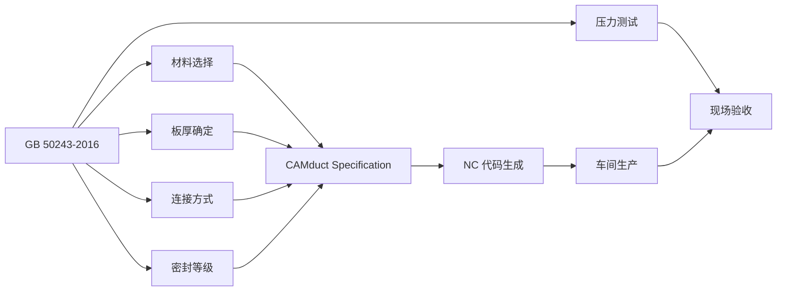

# GB50243-2016 通风与空调工程施工质量验收规范

> [!important] 标准基本信息
> - **标准编号**：GB 50243-2016
> - **标准名称**：通风与空调工程施工质量验收规范
> - **英文名称**：Code of acceptance for construction quality of ventilation and air conditioning works
> - **发布部门**：中华人民共和国住房和城乡建设部、中华人民共和国国家质量监督检验检疫总局
> - **施行日期**：**2017 年 7 月 1 日**
> - **代替标准**：GB 50243-2002《通风与空调工程施工质量验收规范》
> - **性质**：强制性国家标准（部分条文为强制性条文，必须严格执行）

GB 50243-2016 是中国通风与空调工程施工质量验收领域的**核心强制性国家标准**，适用于工业与民用建筑中通风与空调工程的施工质量验收。该标准是风管制造、安装、调试全过程质量控制的法定依据，也是 CAMduct 软件在中国项目中设置 Specification 参数时必须参照的标准之一。

---

## 一、标准架构（12 章 + 5 附录）

GB 50243-2016 共设 **12 章**正文和 **5 个附录**，结构完整覆盖从材料进场到竣工验收的全链条：

| 章节 | 标题 | 核心内容 |
|------|------|----------|
| **第 1 章** | 总则 | 适用范围、基本原则、与相关标准的关系 |
| **第 2 章** | 术语 | 风管、部件、漏风量、漏光检测等关键术语定义 |
| **第 3 章** | 基本规定 | 质量验收的划分（子分部/分项）、验收程序与组织、抽样方案 |
| **第 4 章** | 风管与配件制作 | 金属/非金属/复合材料风管及配件的制作质量要求 |
| **第 5 章** | 风管部件与消声器制作 | 风口、风阀、消声器、静压箱等产品的质量验收 |
| **第 6 章** | 风管系统安装 | 支吊架、风管连接、风管穿越结构、阀门安装等 |
| **第 7 章** | 风机与空气处理设备安装 | 风机、空调机组、风机盘管、VAV 末端等设备安装 |
| **第 8 章** | 冷热源与辅助设备安装 | 制冷机组、锅炉、冷却塔、水泵、换热器等 |
| **第 9 章** | 空调水系统 | 空调冷热水管、冷却水管、冷凝水管的安装与验收 |
| **第 10 章** | 防腐与绝热 | 管道与设备的防腐涂装、风管与水管绝热层施工 |
| **第 11 章** | 系统调试 | 单机试运转、系统联动调试、风量平衡、室内参数测定 |
| **第 12 章** | 竣工验收 | 验收条件、验收文件、观感质量检查 |

### 附录结构

| 附录 | 内容 | 用途 |
|------|------|------|
| **附录 A** | 风管与配件检查批质量验收记录 | 标准化验收表格 |
| **附录 B** | 风管系统安装检查批质量验收记录 | 标准化验收表格 |
| **附录 C** | 风管强度及严密性测试 | 🔑 核心测试方法——漏风量/漏光法 |
| **附录 D** | 洁净室测试 | 洁净室风管系统的洁净度、风速、压差等测试 |
| **附录 E** | 工程质量验收记录 | 分部工程质量验收总表 |

---

## 二、10 条强制性条文（黑体字条文）

GB 50243-2016 设有 **10 条强制性条文**（标准中以黑体字标识），必须严格执行，涉及安全、消防、卫生等关键领域：

| 序号 | 条文编号 | 核心要求 | 涉及领域 |
|------|----------|----------|----------|
| 1 | **4.2.2** | 风管材料品种、规格、性能必须符合设计要求和国家现行标准 | 材料进场检验 |
| 2 | **4.2.5** | 非金属风管和复合材料风管的耐火极限必须满足设计要求 | 防火安全 |
| 3 | **5.2.7** | 防排烟系统的柔性短管必须采用不燃材料 | 消防排烟 |
| 4 | **6.2.2** | 防火风管的本体、框架与固定材料必须为不燃材料 | 防火分区 |
| 5 | **6.2.3** | 风管穿越防火分区必须设置防火阀，且防火阀距防火墙表面 ≤200mm | 防火封堵 |
| 6 | **7.2.2** | 通风机传动装置的外露部位及直通大气的进出口必须装设防护罩 | 机械安全 |
| 7 | **7.2.10** | 静电式空气净化装置的金属外壳必须可靠接地 | 电气安全 |
| 8 | **7.2.11** | 电加热器的安装必须符合非燃烧材料隔热、与风机联锁等安全规定 | 电气防火 |
| 9 | **8.2.4** | 燃气系统管道安装必须符合设计文件与 GB 50028 规定 | 燃气安全 |
| 10 | **8.2.5** | 空调制冷剂管道安装的焊接、试验必须符合设计文件的规定 | 压力管道安全 |

> [!warning] 强制性条文的法律效力
> 以上 10 条强制性条文是 GB 50243-2016 中具有**法律强制力**的条款。根据《建设工程质量管理条例》，违反强制性条文将面临责令改正、罚款、停业整顿等行政处罚；造成安全事故的，依法追究刑事责任。在 CAMduct 项目的质量控制过程中，必须将此 10 条作为**不可逾越的红线**。

---

## 三、四大修订亮点（对比 GB 50243-2002）

GB 50243-2016 相较于其前身 GB 50243-2002，进行了系统性的修订，主要体现为四大亮点：

### 3.1 增加新技术、新材料内容

| 新增内容 | 说明 |
|----------|------|
| **纤维增强硅酸钙板风管** | 新型非金属耐火风管，替代传统玻璃钢风管在防排烟领域的应用 |
| **聚氨酯（PU）/酚醛（PF）复合风管** | 自带保温层的新型轻质风管，符合节能趋势 |
| **玻纤复合风管** | 内壁吸声 + 保温一体化的复合材料风管 |
| **TDC/TDF 共板法兰连接技术** | 正式纳入标准，明确适用条件和验收要求 |

> [!tip] CAMduct 适配提示
> CAMduct 2024/2025 版本的数据库已原生支持复合风管的参数配置。对于中国项目，需在 `Spec Editor` 中对应建立复合风管的板材定义与连接规则。

### 3.2 子分部工程重新划分

GB 50243-2016 对通风与空调分部工程下的**子分部划分**进行了优化调整，使其更符合现代建筑工程的实际组织方式：

| 原 GB 50243-2002 划分 | 现行 GB 50243-2016 划分 |
|------------------------|--------------------------|
| 送排风系统 | **送风系统 / 排风系统**（分开独立验收） |
| 防排烟系统 | **防排烟系统**（增加防烟内容） |
| 除尘系统 | **除尘系统**（技术指标更新） |
| 空调风系统 | **舒适性空调风系统 / 工艺性空调风系统** |
| 净化空调系统 | **洁净空调系统**（标准提升至 ISO 等级） |
| 制冷系统 | **冷热源系统**（含热泵、锅炉） |
| 空调水系统 | **空调水系统**（新增冷凝水管验收要求） |

### 3.3 采用 GB/T 2828.11 抽样检验方案

GB 50243-2016 将工程质量验收的抽样检验方法从简单的百分比抽样更新为基于 **GB/T 2828.11-2008《计数抽样检验程序 第 11 部分：小总体声称质量水平的评定程序》** 的统计抽样方案：

| 对比维度 | GB 50243-2002 | GB 50243-2016 |
|----------|---------------|---------------|
| 抽样方法 | 固定百分比（如 10%） | 基于 AQL 的统计抽样 |
| 风险控制 | 无统计学依据 | 控制生产方与使用方风险 |
| 批量适应性 | 大/小批量同比例 | 小总体特殊处理 |
| 判定准则 | 简单的合格/不合格计数 | Ac/Re 判定数组 |

### 3.4 取消"综合性能测定"移交使用单位

GB 50243-2016 明确规定：**工程竣工后，综合效能的测定与调整由建设单位或使用单位负责**，不再作为施工验收的组成部分。这一修订厘清了施工方与业主方的责任边界。

---

## 四、风管强度及严密性测试（附录 C）

附录 C 是 GB 50243-2016 中最具实操价值的技术章节，规定了风管系统**强度试验**与**严密性试验**的完整方法。

### 4.1 测试分类与适用条件

| 测试类型 | 适用系统 | 测试方法 | 合格标准 |
|----------|----------|----------|----------|
| **漏光法** | 低压风管（P ≤ 500Pa） | 在黑暗环境中用 100W 安全照明灯在风管内部照射，外部观察漏光点 | 每 10m 接缝漏光点 ≤2 处，且 100m 接缝漏光点 ≤16 处 |
| **漏风量法** | 中压/高压/洁净风管 | 使用漏风量测试仪对管段加压，测定单位面积漏风量 | 按压力等级对应的允许漏风量判定 |

### 4.2 风管允许漏风量

| 压力等级 | 允许漏风量 Q_L (m³/h·m²) | 公式与参数 |
|----------|--------------------------|------------|
| **低压** | Q_L ≤ 0.1056 × P^0.65 | P 为工作压力 (Pa) |
| **中压** | Q_L ≤ 0.0352 × P^0.65 | 约为低压的 1/3 |
| **高压** | Q_L ≤ 0.0117 × P^0.65 | 约为低压的 1/9 |

> [!important] 测试要求要点
> - 测试压力为**工作压力**的 1.5 倍，且不低于 500Pa
> - 低压风管可先做漏光检测，合格后免做漏风量测试（但洁净系统必须做漏风量）
> - 中压和高压风管**必须**做漏风量测试
> - 测试管段应包含直管、弯头、三通等典型构件，具有代表性

---

## 五、洁净室测试（附录 D）

附录 D 针对洁净空调系统提出专项测试要求：

| 测试项目 | 方法/仪器 | 标准要求 |
|----------|-----------|----------|
| **洁净度** | 尘埃粒子计数器，按 ISO 14644 标准 | 达到设计洁净等级 |
| **风速/风量** | 热线风速仪或风量罩 | 达到设计风量和换气次数 |
| **静压差** | 微压计 | 不同洁净级别区域之间 ≥5Pa，洁净区与非洁净区之间 ≥10Pa |
| **温湿度** | 温湿度记录仪 | 达到设计参数（通常温度 22±2°C，湿度 45%～65%） |
| **噪声** | 声级计 | 洁净室内噪声限值 |

---

## 六、与 SMACNA 标准对照

GB 50243-2016 与 SMACNA HVAC Duct Construction Standards 在多个维度上可相互参照：

| 对比维度 | GB 50243-2016（中国） | SMACNA（北美） |
|----------|----------------------|-----------------|
| **核心定位** | 质量验收标准（结果导向） | 施工构造标准（方法导向） |
| **压力分级** | 低压/中压/高压，以 Pa 为单位 | ±½\"～±10\" w.g.，以英寸水柱为单位 |
| **板材厚度** | 第 4 章表 4.2.3-1/2/3 按压力等级 + 大边尺寸 | Table 1-1 按压力等级 + 大边尺寸 |
| **密封等级** | 按压力等级自动对应密封要求 | Seal Class A/B/C 独立可选 |
| **漏风量测试** | 附录 C（漏光法 + 漏风量法） | Leakage Test Manual（专门标准册） |
| **连接方式** | 包含角钢法兰、共板法兰（TDC/TDF）、插接 | 详细法兰/接缝构造图 |
| **加强筋** | 原则上按设计或参照执行 | 提供详细加固间距表 |
| **强制性** | 黑体字条文具有法律强制力 | 合同引用后具有约束力 |

> [!note] CAMduct 中的标准映射
> 在中国项目中使用 CAMduct 时，可将 GB 50243 的压力等级与板材厚度表映射到 CAMduct 的 Specification 模块中。例如：
> - GB "低压" → CAMduct Pressure Class "Low"
> - GB "中压" → CAMduct Pressure Class "Medium"
> - GB "高压" → CAMduct Pressure Class "High"
> - 板材厚度值使用 GB 50243 表 4.2.3-1/2/3 的参数覆盖 SMACNA 默认值

---

## 七、与 CAMduct 工作流的关联

在 CAMduct 风管制造流程中，GB 50243-2016 的影响覆盖以下环节：

1. **Specification 配置**：将 GB 50243 的板材厚度表、连接方式、密封等级等参数输入 CAMduct 的 `Spec Editor`
2. **压力等级标签**：在 CAMduct 中对每个管段标注压力等级（低压/中压/高压），驱动自动选型
3. **质量记录输出**：CAMduct 可输出风管批次标签，辅助 GB 50243 要求的质量验收记录

---

## 八、相关页面导航

- 风管形状与压力等级分类 → 风管类型与规格
- 法兰连接、插接、咬口连接详解 → 风管连接方式
- 中国 & 国际标准总览 → 行业标准与规范
- 施工过程规范（配套使用） → [GB50738-2011 通风与空调工程施工规范](/knowledge/pipe-fitting-spec/gb50738-2011-通风与空调工程施工规范/)
- 风管技术规程 → JGJ 141-2017（待创建）

---

> 📅 **文档创建**：2026-05-25
> 📌 本页内容基于 GB 50243-2016 标准文本整理。工程使用请以官方出版的纸质标准为准。
> ⚠️ GB 50243-2016 的强制性条文具有法律效力，施工过程中必须严格遵守。
