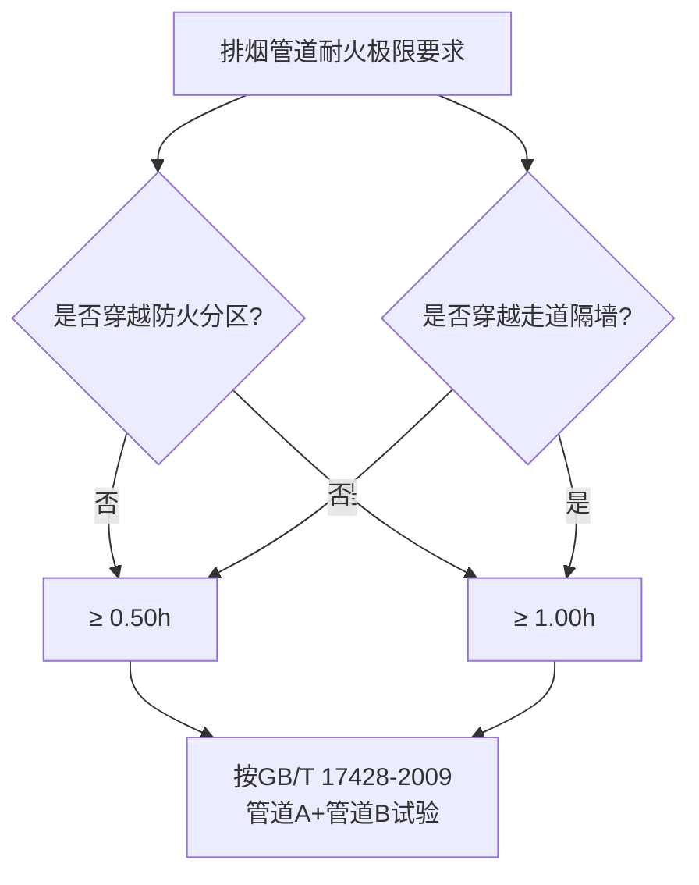
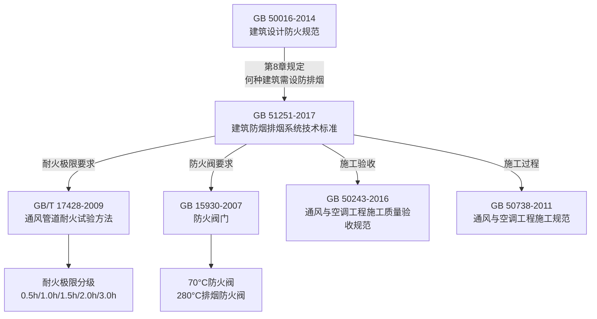

# GB 51251-2017 建筑防烟排烟系统技术标准

> [!important] 标准基本信息
> - **标准编号**：GB 51251-2017
> - **标准名称**：建筑防烟排烟系统技术标准
> - **英文名称**：Technical standard for smoke management systems in buildings
> - **发布部门**：中华人民共和国住房和城乡建设部、中华人民共和国国家质量监督检验检疫总局
> - **施行日期**：**2018 年 8 月 1 日**
> - **性质**：**强制性国家标准**（部分条文为强制性条文，必须严格执行）
> - **主编单位**：公安部四川消防研究所

GB 51251-2017 是中国**首部专门针对建筑防烟排烟系统的综合性技术标准**，填补了此前防排烟设计主要依据 GB 50016 原则性条款的空白。该标准覆盖防烟系统设计、排烟系统设计、系统控制、施工安装、调试、验收及维护管理全生命周期，是暖通防火设计的**第一执行依据**。

---

## 一、标准架构（9 章 + 7 附录）

| 章节 | 标题 | 核心内容 |
|------|------|----------|
| **第 1 章** | 总则 | 适用范围、与其他标准的关系 |
| **第 2 章** | 术语和符号 | 关键术语定义（防烟/排烟/储烟仓/清晰高度等） |
| **第 3 章** | 防烟系统设计 | 自然通风防烟、机械加压送风防烟 |
| **第 4 章** | 排烟系统设计 | 🔑 自然排烟、机械排烟、排烟管道、排烟口 |
| **第 5 章** | 补风系统 | 补风口设置、补风量、补风方式 |
| **第 6 章** | 系统控制 | 火灾自动报警联动、手动控制 |
| **第 7 章** | 施工 | 风管施工、设备安装、支吊架 |
| **第 8 章** | 系统调试 | 单机调试、联动调试 |
| **第 9 章** | 验收与维护管理 | 验收标准、定期检验、维护保养 |

| 附录 | 内容 |
|------|------|
| 附录 A | 不同火灾规模下排烟量计算参数 |
| 附录 B | 排烟口最大允许排烟量 |
| 附录 C | 防烟系统常见设计参数 |
| 附录 D | 机械排烟系统设计计算示例 |
| 附录 E | 加压送风量计算 |
| 附录 F | 施工质量验收记录 |
| 附录 G | 本标准用词说明 |

---

## 二、🔥 风管耐火极限——核心要求

GB 51251-2017 对风管耐火极限的要求是整部标准中最受关注的内容之一，直接影响风管材质选择、构造方案和工程成本。

### 2.1 加压送风管道——第 3.3.9 条

> [!warning] 3.3.9 条——机械加压送风系统管道耐火极限
> 机械加压送风系统应采用**管道送风**，且不应采用土建风道。加压送风管道应符合下列规定：

| 设置位置 | 耐火极限要求 | 附加要求 |
|----------|-------------|----------|
| **设置在独立的管道井内** | 管道井井壁的耐火极限 ≥ **1.00h** | 管道井上的检查门应采用**乙级防火门** |
| **未设置在管道井内（水平布置或与非消防管道共井）** | 送风管道耐火极限 ≥ **1.00h** | 管道本身需满足 1.0h 耐火极限（完整性+隔热性） |

> [!important] 管道井 vs 管道的区别
> - 加压送风管位于**独立管井**内：管井井壁承担耐火分隔功能，风管本体可降低要求
> - 加压送风管**不设独立管井**：风管本体需具备 1.0h 耐火极限（需按 GB/T 17428 试验验证）

### 2.2 排烟管道——第 4.4.8 条

> [!warning] 4.4.8 条——排烟管道耐火极限（核心条文）
> 排烟管道应符合下列规定：

| 设置工况 | 耐火极限要求 | 适用场景 |
|----------|-------------|----------|
| **一般情况（同一防火分区内）** | ≥ **0.50h** | 排烟风管位于同一防火分区内部，未穿越防火分隔 |
| **穿越防火分区时** | ≥ **1.00h** | 排烟风管从一个防火分区进入另一个防火分区时 |
| **设置在走道吊顶内** | ≥ **0.50h** | 走道是人员疏散通道，需保证排烟可靠性 |
| **穿越疏散走道隔墙** | ≥ **1.00h** | 保护疏散通道的防火安全 |

### 2.3 补风管道——第 5.2.7 条

| 设置工况 | 耐火极限要求 |
|----------|-------------|
| 补风管道穿越防火分区 | ≥ **1.00h** |
| 补风管道（同一防火分区内） | ≥ **0.50h** |

---

## 三、排烟风管材质要求

GB 51251-2017 第 4.4.8 条条文说明中对排烟风管的材质给出了明确指引，形成了三类认可方案：

### 3.1 三种排烟风管构造方案

| 方案 | 材料与构造 | 适用场景 | 优缺点 |
|------|-----------|----------|--------|
| **方案一：金属风管 + 防火包裹** | 镀锌钢板（常规厚度）外覆防火板/岩棉+防火涂料 | 最常见方案，技术成熟 | ✅ 成本可控、加工方便 ⚠️ 包裹施工质量监控关键 |
| **方案二：金属风管 + 内衬防火材料** | 镀锌钢板内衬硅酸钙板或防火板 | 空间受限的场合 | ✅ 不增加外径尺寸 ⚠️ 内衬施工困难、清洁维护不便 |
| **方案三：成品耐火风管** | 工厂预制的硅酸钙板风管、玻镁板风管 | 高耐火极限要求（≥1.5h） | ✅ 耐火性能稳定 ⚠️ 造价较高、需专用配件 |

> [!tip] 方案选择建议
> - 普通工程优先选择 **方案一**（镀锌钢板 + 防火包裹），通过 GB/T 17428-2009 耐火试验取得认证
> - 超高层 / 重要公共建筑建议使用 **方案三**（成品耐火风管），保证 1.5h~2.0h 耐火极限
> - 方案二较少使用，仅在空间极为受限且耐火要求为 0.5h 时考虑

### 3.2 排烟风管连接与密封的特殊要求

| 要求项 | 具体内容 |
|--------|---------|
| **连接方式** | 推荐法兰连接；插接、咬口连接需经耐火试验验证密封可靠性 |
| **密封材料** | 必须使用**耐火密封垫**（耐火温度 ≥280°C），不得使用普通橡胶垫 |
| **支吊架** | 支吊架在高温下不得先于风管失效，间距需加密 |
| **穿墙封堵** | 套管 + 防火封堵材料，封堵的耐火极限不低于风管的耐火极限 |

---

## 四、风管设计计算方法

### 4.1 排烟风管风速限值

| 风管材质 | 最大设计风速 (m/s) |
|----------|-------------------|
| **金属风管** | **20 m/s** |
| **非金属风管**（硅酸钙板、玻镁板等） | **15 m/s** |
| **土建风道**（内表面光滑） | **10 m/s** |
| **土建风道**（内表面粗糙） | **7 m/s** |

### 4.2 加压送风系统风速限值

| 管道部位 | 最大设计风速 |
|----------|-------------|
| 加压送风口 | **7 m/s** |
| 加压送风管（金属） | **20 m/s** |
| 加压送风管（非金属） | **15 m/s** |

### 4.3 排烟量计算原则

| 空间类型 | 排烟量计算依据 |
|----------|---------------|
| 公共建筑/工业建筑（净高 ≤6m） | 按防烟分区面积 ×60 m³/(h·m²)，且 ≥15000 m³/h |
| 公共建筑/工业建筑（净高 >6m） | 按火灾增长系数和清晰高度等参数计算（附录A） |
| 中庭（体积 ≤17000m³） | 按 6 次/h 换气，且 ≥102000 m³/h |
| 中庭（体积 >17000m³） | 按 4 次/h 换气，且 ≥102000 m³/h |
| 汽车库 | 按 GB 50067《汽车库设计防火规范》 |

---

## 五、系统控制要求

GB 51251-2017 第 6 章规定了防排烟系统的控制逻辑，核心要求：

| 控制项 | 联动触发条件 | 控制动作 |
|--------|-------------|----------|
| **加压送风机启动** | 防火分区内 2 个独立火灾探测器报警 | 启动本分区及上下相邻分区送风机 + 开启前室/楼梯间送风口 |
| **排烟风机启动** | 防烟分区内 2 个独立火灾探测器报警 | 启动本分区排烟风机 + 全开本分区排烟口/阀 |
| **排烟防火阀关闭联动** | 排烟防火阀入口烟气温度 ≥280°C | 联锁关闭排烟风机 + 补风机关闭 |
| **加压送风余压控制** | 前室与走道压差 >50Pa 或楼梯间 >50Pa | 旁通阀泄压 / 变频调节 |

---

## 六、与关联标准联动

GB 51251-2017 并非孤立标准，它与多个防火相关标准形成**执行链条**：

| 关联标准 | 关联内容 | 联动要求 |
|----------|---------|----------|
| **GB/T 17428-2009** | 风管耐火极限试验 | GB 51251 的耐火极限值需通过 GB/T 17428 试验验证 |
| **GB 15930-2007** | 防火阀/排烟防火阀 | 第 6 章系统控制中要求的防火阀须符合 GB 15930 标准 |
| **GB 50016-2014** | 防火分区划分、防火构造 | 防排烟分区依据 GB 50016 防火分区划定 |
| **GB 50243-2016** | 风管施工质量验收 | 防排烟风管施工质量验收按 GB 50243 执行 |

---

## 七、施工安装要点

GB 51251-2017 第 7 章对防排烟风管的施工安装提出了高于常规空调风管的要求：

| 施工环节 | 特殊要求 |
|----------|---------|
| **风管制作** | 板材拼接应采用**咬口或焊接**，不得采用单纯铆接；法兰连接垫片应采用**不燃材料** |
| **支吊架** | 排烟风管的支吊架间距 ≤ 空调风管间距 × 0.8 |
| **防火包裹** | 防火板包裹应连续、无空隙；岩棉包裹应使用钢丝网固定并覆保护层 |
| **穿越变形缝** | 两侧均设防火阀，柔性短管为 A 级不燃材料 |
| **管道井内风管** | 风管安装后应立即封堵楼板孔洞，防火封堵的耐火极限 ≥ 楼板耐火极限 |

---

## 八、验收与维护管理

| 验收项目 | 关键验收指标 |
|----------|-------------|
| **风管严密性** | 按 GB 50243 中压系统要求进行漏风量测试 |
| **防火阀安装** | 距墙 ≤200mm，手动复位功能正常，联锁信号有效 |
| **耐火极限** | 核查风管耐火试验报告（按 GB/T 17428），防火包裹施工记录 |
| **系统联动** | 模拟火灾信号，检测风机启停、阀门动作、余压控制全流程 |

> [!warning] 维护管理要求
> 防排烟系统应**每半年**至少进行一次功能检测，包括：风机运转、阀门动作、风速风量测定、联动控制测试。检测结果应形成书面记录并归档。

---

## 九、相关页面导航

- 风管耐火试验方法与分级 → GBT17428-2009 通风管道耐火试验方法
- 建筑防火母规范 → GB50016-2014 建筑设计防火规范(2018版)
- 防火阀门技术标准 → GB15930-2007 建筑通风和排烟系统用防火阀门
- 风管保温与防火包裹 → 保温风管
- 法兰连接、插接、咬口连接 → 风管连接方式
- 风管施工质量验收 → GB50243-2016 通风与空调工程施工质量验收规范
- 风管施工过程规范 → GB50738-2011 通风与空调工程施工规范

---

> 📅 **文档创建**：2026-05-25
> 📌 本页内容基于 GB 51251-2017 标准文本整理。工程使用请以官方出版的纸质标准为准。
> ⚠️ GB 51251-2017 是强制性国家标准，其强制性条文必须严格执行。风管耐火极限不满足要求将导致消防验收不通过。
