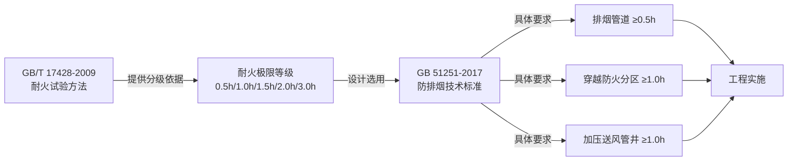

# GB/T 17428-2009 通风管道耐火试验方法

> [!important] 标准基本信息
> - **标准编号**：GB/T 17428-2009
> - **标准名称**：通风管道耐火试验方法
> - **英文名称**：Fire resistance test method of ventilation ducts
> - **发布部门**：中华人民共和国国家质量监督检验检疫总局、中国国家标准化管理委员会
> - **施行日期**：**2010 年 4 月 1 日**
> - **代替标准**：GB 17428-1998《通风管道的耐火试验方法》
> - **性质**：推荐性国家标准（GB/T）
> - **国际采标**：参照 ISO 6944-1:2008《Fire containment — Elements of building construction — Part 1: Ventilation ducts》

GB/T 17428-2009 是评价**水平通风管道在标准火条件下耐火性能**的核心试验方法标准。该标准规定了通风管道耐火试验的术语定义、试验设备、试验条件、试验程序及判定准则，是防排烟风管产品认证和工程验收的**技术基础**。

---

## 一、适用范围与核心定位

GB/T 17428-2009 适用于**水平布置**的通风管道（包括直管段、弯头、三通等典型构件）在标准升温曲线条件下的耐火性能试验。其核心目的是通过统一的试验方法，客观评价风管在火灾条件下的：

- **承载能力**（结构稳定性）
- **完整性**（Integrity）——阻止火焰和热气体穿透的能力
- **隔热性**（Insulation）——限制背火面温升的能力

> [!note] 标准适用范围
> 本标准适用于建筑通风和空调系统中使用的**所有类型通风管道**，包括但不限于：金属风管、非金属风管、复合材料风管、防火板包裹风管。试验方法本身不限定风管材质和制造工艺。

---

## 二、火作用模式（管道 A / 管道 B）

GB/T 17428-2009 最核心的技术特点是定义了**两种火作用模式**，分别模拟风管在实际火灾中可能遭遇的两种受火场景：

| 火作用模式 | 受火面 | 模拟场景 | 试验布置要点 |
|-----------|--------|----------|-------------|
| **管道 A** | 风管**外部** | 火灾发生在风管所处的空间内（走道/竖井），火焰从外部加热风管 | 风管安装在耐火试验炉上方，炉内火焰接触风管外表面 |
| **管道 B** | 风管**内部** | 火灾通过风管内部蔓延，火焰和热气体在风管内部传播 | 在风管内部施加火焰/热气，外部为常温环境 |

> [!warning] 选型关键区别
> 工程选型时必须根据风管实际安装位置和使用条件选择对应试验模式的认证产品。例如：**穿越防火分区的排烟风管**应同时满足管道A（外部火灾考验）和管道B（内部烟气考验）的要求；而安装在**独立管井内的加压送风管**主要关注管道B（内部正压高温烟气）场景。

---

## 三、试验设备与测量系统

GB/T 17428-2009 对试验设备和测量仪器提出了严格的技术要求：

### 3.1 核心试验设备

| 设备名称 | 功能描述 | 技术要求 |
|----------|----------|----------|
| **耐火试验炉** | 提供标准升温曲线（ISO 834）的加热环境 | 炉内温度按 T-T₀=345 lg(8t+1) 控制，温度偏差 ≤±100°C（前10min）/ ≤±50°C（10min后） |
| **燃烧系统** | 燃气或燃油喷嘴，提供稳定的热输出 | 炉内压力控制在 20±3 Pa（距炉顶100mm处） |
| **约束框架** | 固定风管试件，模拟实际安装条件 | 约束条件与实际工程一致 |
| **引风系统** | 在管道B模式中产生管道内部气流 | 气流速度可调，模拟实际通风工况 |

### 3.2 温度测量系统

| 传感器 | 用途 | 布置要求 |
|--------|------|----------|
| **炉内热电偶** | 测量炉内温度，控制升温曲线 | ≥6 个，均匀分布在炉膛内 |
| **背火面热电偶** | 测量风管外表面（管道B）或内表面（管道A）温升 | 布置在代表性位置，间距 ≤500mm |
| **移动热电偶** | 检测裂缝处逸出气体温度 | 手持式，用于完整性判定 |

### 3.3 压力测量系统

| 测量项目 | 仪器 | 精度要求 |
|----------|------|---------|
| **炉内压力** | 压力传感器 / 微压计 | ±2 Pa |
| **管道内部静压**（管道A模式） | 差压变送器 | ±5 Pa |
| **管道入口/出口动压**（管道B模式） | 皮托管 + 微压计 | ±5% |

---

## 四、试验程序

### 4.1 试件准备

- 试件长度一般 ≥3m（含直管段及至少1个典型接头/弯头）
- 试件应为**实际生产产品**，不得专门为试验制作特殊件
- 试件养护期：非金属风管需达到规定的养护龄期（通常 ≥28天）
- 安装方式与工程实际一致（支吊架间距、连接方式等）

### 4.2 试验步骤

| 步骤 | 操作内容 |
|------|---------|
| **1. 安装** | 将试件安装在耐火试验炉上方（管道A）或连接至炉体（管道B），按约束条件固定 |
| **2. 传感器调试** | 连接并校准全部热电偶、压力传感器，确认数据采集系统正常 |
| **3. 预加载** | 管道B模式需开启引风机，建立规定气流 |
| **4. 点火** | 点燃燃烧器，开始计时，炉温按ISO 834曲线上升 |
| **5. 持续观测** | 全程记录温度、压力数据，观察试件变形、开裂、火焰穿透等现象 |
| **6. 终止条件** | 达到判定失效标准或规定耐火时间 |

> [!tip] 试验持续时间
> 试验持续至试件**出现失效判定准则中的任一情形**，或达到预定的耐火极限等级时间为止。如果试件在目标耐火时间前失效，则判定该试件的耐火极限低于目标等级。

---

## 五、判定准则

GB/T 17428-2009 从**完整性**和**隔热性**两个维度判定耐火性能：

### 5.1 完整性（Integrity）失效判定

| 序号 | 失效情形 | 判定方法 |
|------|---------|----------|
| ① | **棉垫被点燃** | 在试件背火面裂缝处放置棉垫（100mm×100mm×20mm），持续30秒，棉垫被点燃 |
| ② | **缝隙探棒穿透** | 用 φ6mm 探棒可穿过裂缝进入炉内，且可沿裂缝移动 ≥150mm；或用 φ25mm 探棒可穿过裂缝 |
| ③ | **背火面出现持续火焰** | 肉眼观察到背火面有持续 ≥10秒 的火焰 |

### 5.2 隔热性（Insulation）失效判定

| 序号 | 失效情形 | 判定方法 |
|------|---------|----------|
| ① | **平均温升超限** | 背火面热电偶的平均温升超过 **140°C**（相对于初始温度） |
| ② | **最高温升超限** | 任一处背火面热电偶的温升超过 **180°C**（相对于初始温度） |

> [!important] 判定逻辑
> 完整性 和 隔热性 为**并列判定条件**。**任一条件先达到失效标准，即以该时刻作为试件的耐火极限。**两者中取较小值作为该试件的最终耐火极限。

---

## 六、耐火极限分级

GB/T 17428-2009 规定的耐火极限分级以**小时（h）**为单位，分为以下 5 个等级：

| 耐火极限等级 | 时间要求 | 应用场景示例 |
|------------|----------|-------------|
| **0.5 h** | ≥30 分钟 | 一般排烟风管、普通民用建筑加压送风管道 |
| **1.0 h** | ≥60 分钟 | 穿越一个防火分区的风管、楼梯间加压送风管道 |
| **1.5 h** | ≥90 分钟 | 穿越两个及以上防火分区的风管、重要公建排烟管 |
| **2.0 h** | ≥120 分钟 | 超高层建筑防排烟系统、避难层穿越管道 |
| **3.0 h** | ≥180 分钟 | 特殊消防设计要求（隧道、大型综合体核心区等） |

---

## 七、与 GB 51251-2017 的应用关联

GB/T 17428-2009 是试验方法标准，而 GB51251-2017 建筑防烟排烟系统技术标准 是设计应用标准，两者配合使用：

GB 51251-2017 第 4.4.8 条明确要求排烟管道的耐火极限不应低于 0.5h，其耐火极限的判定**必须以 GB/T 17428-2009 的试验结果为依据**，且要求同时满足完整性和隔热性两项指标。同样，第 3.3.9 条对加压送风管道管井的耐火极限要求（≥1.0h）也依托此标准进行验证。

---

## 八、对风管制造的要求

基于 GB/T 17428-2009 试验方法，风管制造需重点关注：

| 制造环节 | 关键要求 | 关联标准 |
|----------|---------|----------|
| **板材选择** | 使用经过耐火试验认证的板材（镀锌钢板、防火板、硅酸钙板等） | GB 8624 燃烧性能分级 |
| **连接方式** | 法兰连接面需保证在高温下的密封性，防止完整性过早失效 | 风管连接方式 |
| **保温/防火包裹** | 使用不燃或难燃保温材料，包裹构造需通过管道A模式试验 | 保温风管 |
| **支吊架设计** | 高温下支吊架不得先于风管失效，需考虑高温承载力 | GB 50016 |
| **穿墙节点** | 风管穿越防火分隔处的封堵构造需与风管同等耐火极限 | GB 50016 |

---

## 九、相关页面导航

- 风管保温与防火包裹 → 保温风管
- 法兰连接、插接、咬口连接 → 风管连接方式
- 防排烟系统设计要求 → GB51251-2017 建筑防烟排烟系统技术标准
- 建筑防火规范 → GB50016-2014 建筑设计防火规范(2018版)
- 防火阀门标准 → GB15930-2007 建筑通风和排烟系统用防火阀门
- 风管制造标准 → GB50243-2016 通风与空调工程施工质量验收规范

---

> 📅 **文档创建**：2026-05-25
> 📌 本页内容基于 GB/T 17428-2009 标准文本整理。工程使用请以官方出版的纸质标准为准。
> 🔥 GB/T 17428-2009 虽然是推荐性标准，但被 GB 51251-2017 等强制性标准引用后，其试验方法在相关领域具有**强制性效力**。
