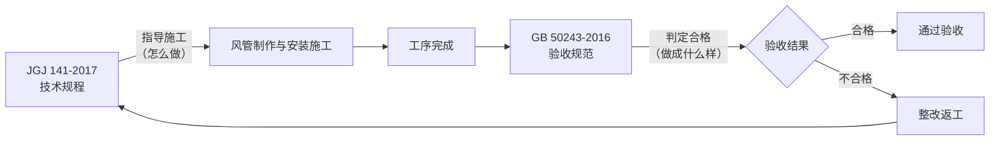

# JGJ 141-2017 通风管道技术规程

> [!important] 标准基本信息
> - **标准编号**：JGJ 141-2017
> - **标准名称**：通风管道技术规程
> - **英文名称**：Technical specification for ventilation duct
> - **发布部门**：中华人民共和国住房和城乡建设部
> - **施行日期**：**2017 年 9 月 1 日**
> - **代替标准**：JGJ 141-2004《通风管道技术规程》
> - **性质**：行业标准（推荐性）
> - **主编单位**：中国建筑科学研究院
> - **参编单位**：北京市设备安装工程集团有限公司、上海市安装工程集团有限公司、中国建筑第八工程局有限公司等

JGJ 141-2017 是中国通风管道制作与安装的**核心行业技术规程**，侧重于风管制作、安装过程中的**技术细节与工艺要求**。与 GB50243-2016 通风与空调工程施工质量验收规范|GB 50243-2016 配套使用——JGJ 141 指导"怎么做"，GB 50243 判定"做成什么样才算合格"。

---

## 一、标准架构（9 章）

JGJ 141-2017 共设 **9 章**，覆盖从材料选择到完工验收的全过程：

| 章节 | 标题 | 核心内容 |
|------|------|----------|
| **第 1 章** | 总则 | 适用范围、基本原则、与相关标准的衔接 |
| **第 2 章** | 术语 | 风管、配件、部件、严密性等关键术语定义 |
| **第 3 章** | 基本规定 | 通用技术要求、施工准备、材料进场检验 |
| **第 4 章** | 金属风管 | 钢板风管、不锈钢板风管、铝板风管的制作技术 |
| **第 5 章** | 非金属风管 | 玻璃钢风管、硬聚氯乙烯风管、复合材料风管 |
| **第 6 章** | 风管配件及部件 | 弯头、三通、变径管、阀门、消声器等 |
| **第 7 章** | 风管制作 | 🔑 咬口连接、焊接、法兰制作、加固等工艺 |
| **第 8 章** | 风管安装 | 支吊架、风管连接、穿越结构、防火封堵 |
| **第 9 章** | 检验与验收 | 质量检查、严密性试验、验收记录 |

---

## 二、风管压力分类（核心基础）

JGJ 141-2017 按工作压力将风管系统分为三个等级，这是所有后续技术要求的基础：

| 压力等级 | 工作压力 P (Pa) | 风管内静压范围 | 适用场景举例 |
|----------|:--------------:|----------------|-------------|
| **低压** | P ≤ 500 | ±500 Pa 以内 | 普通舒适空调、一般通风系统 |
| **中压** | 500 < P ≤ 1500 | ±500 ~ ±1500 Pa | 大风量系统、部分工艺通风 |
| **高压** | P > 1500 | > ±1500 Pa | 高压空调系统、工业除尘/排烟 |

> [!note] 压力等级与严密性等级的关系
> 风管的压力等级直接决定了严密性等级的选取——压力越高，严密性要求越严格。详见下文#五、严密性等级（A/B/C 级）|第五节。

---

## 三、板材厚度选用

### 3.1 金属风管板材厚度（钢板）

JGJ 141-2017 规定了不同压力等级下，矩形风管钢板的最小厚度。以普通钢板（Q235）为例：

| 风管大边尺寸 b (mm) | 低压 (≤500Pa) | 中压 (500~1500Pa) | 高压 (>1500Pa) |
|---------------------|:-----------:|:----------------:|:-----------:|
| b ≤ 320 | 0.50 mm | 0.75 mm | 0.75 mm |
| 320 < b ≤ 450 | 0.60 mm | 0.75 mm | 1.00 mm |
| 450 < b ≤ 630 | 0.75 mm | 1.00 mm | 1.00 mm |
| 630 < b ≤ 1000 | 0.75 mm | 1.00 mm | 1.20 mm |
| 1000 < b ≤ 1250 | 1.00 mm | 1.20 mm | 1.50 mm |
| 1250 < b ≤ 2000 | 1.20 mm | 1.50 mm | 2.00 mm |
| 2000 < b ≤ 4000 | 按设计要求 | 按设计要求 | 按设计要求 |

> [!tip] 与 CAMduct 的对应关系
> 上表数据是 CAMduct **Specification 模块**中"中国标准"参数模板的底层依据。在设置 Specification 时，选择对应的压力等级，软件可自动核查所选板厚是否符合 JGJ 141 的要求。

### 3.2 特殊材质板材

| 材质 | 最小厚度（低压/中压） | 特殊要求 |
|------|:----------------:|---|
| **不锈钢板** | 与钢板相同或略薄 | ≤2mm 可采用咬口连接；>2mm 应采用焊接 |
| **铝板** | 比钢板厚一级 | 咬口成型注意回弹量 |

对于矩形风管制造和圆形风管制造，板材厚度的选择逻辑相同——均按压力等级 + 管径/大边尺寸查表确定。

---

## 四、风管加固要求

当风管大边尺寸或管径超过一定限值，或压力等级较高时，必须采取加固措施以防止风管鼓胀变形：

| 加固条件 | 矩形风管 | 圆形风管 |
|----------|:---------|:---------|
| **需加固的最小大边尺寸** | 大边 ≥ 630 mm（中低压）/ 大边 ≥ 1250 mm（高压） | 直径 ≥ 1000 mm 或按设计要求 |
| **加固方式** | 角钢加固框、点加固、压筋、内部拉杆 | 角钢法兰加固环、压筋 |

### 加固形式分类

| 加固方式 | 适用情况 | 特点 |
|----------|----------|------|
| **角钢加固框** | 大截面矩形风管 | 刚性最好，最常用 |
| **点加固** | 中低压矩形风管 | 施工简便，节约材料 |
| **压筋加固** | 圆形/矩形风管 | 增大板面刚度，成本低 |
| **内部拉杆 (Tie Rod)** | 大截面矩形风管 | 减少外部占用空间 |

加固间距按风管大边尺寸与压力等级确定——大边越大、压力越高，加固间距越小。

---

## 五、严密性等级（A/B/C 级）

JGJ 141-2017 将风管严密性分为 **A、B、C** 三个等级，与 GB50243-2016 通风与空调工程施工质量验收规范|GB 50243-2016 附录 C 的测试方法配合使用：

| 严密性等级 | 适用压力范围 | 密封要求 | 典型应用 |
|:--------:|-------------|----------|----------|
| **A 级（低压）** | P ≤ 500 Pa | 接缝处密封（咬口缝、铆钉缝） | 一般通风系统、舒适空调 |
| **B 级（中压）** | 500 < P ≤ 1500 Pa | 所有横向缝、纵向缝均需密封 | 中压空调系统、净化空调预过滤段 |
| **C 级（高压）** | P > 1500 Pa | 所有接缝、开口、穿越处严格密封 + 漏风量测试 | 高压系统、洁净室、排烟系统 |

> [!warning] 严密性验收
> - **低压系统**：可采用**漏光法**进行严密性检测（定性判断）
> - **中压系统**：应在漏光检测合格后，按比例进行**漏风量测试**（定量检测）
> - **高压系统**：**必须全部进行漏风量测试**，不允许仅做漏光检测

---

## 六、风管连接方式

JGJ 141-2017 规定了三种主要的风管段间连接方式，也是 风管连接方式 的核心内容：

| 连接方式 | 适用压力 | 工艺特点 | 优/缺点 |
|----------|:-------:|----------|--------|
| **角钢法兰连接** | 低压/中压/高压 | 传统方式。角钢制框→与风管铆接→螺栓连接 | ✅ 刚度好、密封可靠 ❌ 耗材多、效率较低 |
| **共板法兰连接 (TDF)** | 低压/中压 | 风管板材直接翻边成型法兰，用卡条固定 | ✅ 效率高、省材料 ❌ 高压下密封不如角钢法兰 |
| **插接式连接 (S&D)** | 低压 | 承插方式，配合密封胶 | ✅ 快速安装 ❌ 仅适用于低压小尺寸风管 |

### 连接方式选用原则

```
压力等级 → 大边尺寸 → 连接方式选择：

低压, b ≤ 1000mm → 插接/共板法兰
低压, b > 1000mm → 共板法兰/角钢法兰
中压, b ≤ 1500mm → 共板法兰
中压, b > 1500mm → 角钢法兰
高压, 所有尺寸 → 角钢法兰
```

---

## 七、与 GB 50243-2016 的衔接关系

JGJ 141-2017 与 GB50243-2016 通风与空调工程施工质量验收规范|GB 50243-2016 构成**"技术规程 + 验收规范"的配套组合**，是风管工程全过程质量管理的双核心：



| 对比维度 | JGJ 141-2017（技术规程） | GB 50243-2016（验收规范） |
|----------|---------------------------|----------------------------|
| **标准性质** | 行业推荐性标准 (JGJ) | 强制性国家标准 (GB) |
| **核心内容** | 风管制作的**工艺方法与技术要求** | 施工完成后的**质量验收标准** |
| **板材厚度表** | ✅ 提供详细选用表 | 引用 JGJ 141 的数据 |
| **加固方案** | ✅ 各类加固详图与间距表 | 规定加固后强度验收要求 |
| **严密性测试** | 按等级规定密封要求 | 附录 C 提供漏风量测试方法 |
| **法律地位** | 技术依据，推荐性 | 部分条文为强制性条文，具有法律效力 |

> [!tip] 工程实践要点
> - 施工方案编制时，以 **JGJ 141** 作为工艺依据
> - 质量验收时，以 **GB 50243** 作为判定准则
> - 两者在板材厚度、加固间距、严密性等级方面的数值要求**应当一致**——若出现矛盾，以 GB 50243 的强制性要求为准

---

## 八、CAMduct 应用提示

JGJ 141-2017 的以下内容与 CAMduct Fabrication 数据库直接相关：

| JGJ 141 内容 | CAMduct 对应模块 | 配置要点 |
|-------------|-----------------|---------|
| 板材厚度选用表 | Specification → Material Thickness | 按压力等级 + 大边尺寸建立规则 |
| 风管加固要求 | Specification → Stiffening | 设置加固类型与间距自动匹配 |
| 连接方式（法兰） | Specification → Connector | 配置 TDF/角钢法兰/插接参数 |
| 严密性等级 | Specification → Sealing | 关联 Seal Class A/B/C |

---

## 九、相关标准

- GB50243-2016 通风与空调工程施工质量验收规范|GB 50243-2016 — 验收规范（配套使用）
- GB50738-2011 通风与空调工程施工规范|GB 50738-2011 — 施工过程规范
- JGJT260-2011 采暖通风与空气调节工程检测技术规程|JGJ/T 260-2011 — 检测技术规程
- GB51251-2017 建筑防烟排烟系统技术标准|GB 51251-2017 — 防排烟风管专项标准

## 十、相关笔记

- 风管类型与规格
- 矩形风管制造
- 圆形风管制造
- 风管连接方式
- 中国标准索引

---

> 📅 **最后更新**：2026-05-25
