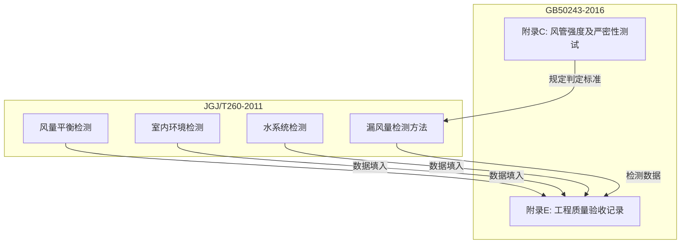

# JGJ/T 260-2011 采暖通风与空气调节工程检测技术规程

> [!important] 标准基本信息
> - **标准编号**：JGJ/T 260-2011
> - **标准名称**：采暖通风与空气调节工程检测技术规程
> - **英文名称**：Technical specification for test of heating, ventilating and air conditioning engineering
> - **发布部门**：中华人民共和国住房和城乡建设部
> - **施行日期**：**2012 年 4 月 1 日**
> - **性质**：**推荐性行业标准**（JGJ/T —— "/T" 表示推荐性）
> - **主编单位**：中国建筑科学研究院

JGJ/T 260-2011 是中国暖通空调工程**检测技术的综合性规程**，规定了从风管系统、水系统到室内环境的一整套检测方法、仪器要求和判定标准。该标准是 [GB50243-2016 通风与空调工程施工质量验收规范](/knowledge/pipe-fitting-spec/GB50243-2016-通风与空调工程施工质量验收规范/)|GB 50243-2016 附录 C（风管严密性测试）与附录 E（工程验收记录）在检测操作层面的**技术支撑文件**。

---

## 一、标准架构

JGJ/T 260-2011 按检测对象分为多个专项，覆盖暖通空调工程的全部检测需求：

| 章节 | 检测对象 | 核心内容 |
|------|----------|----------|
| **风管系统检测** | 风管系统 | 漏风量、风量平衡、风管强度 |
| **水系统检测** | 空调水系统 | 管道压力试验、冲洗、流量平衡 |
| **设备检测** | 风机/水泵/空调机组 | 转速、振动、噪声、性能参数 |
| **室内环境检测** | 房间/区域 | 温度、湿度、风速、噪声、照度 |
| **控制系统检测** | 自控系统 | 传感器校准、执行器动作、联动逻辑 |

---

## 二、检测仪器精度要求

JGJ/T 260-2011 对各类检测仪器的精度和量程提出了明确要求，确保检测数据的可靠性和可复现性：

### 2.1 风系统检测仪器

| 仪器名称 | 精度要求 | 量程要求 | 用途 |
|----------|:--------:|----------|------|
| **风速仪（热球式/叶轮式）** | ±(0.1 m/s + 5% 读数) | 0.1 ~ 30 m/s | 风口风速、风管断面风速 |
| **风压计（微压计）** | ±1.0 Pa 或 ±1% 读数 | 0 ~ 2000 Pa | 风管静压、全压、动压 |
| **毕托管** | 系数 0.99 ~ 1.01 | — | 与微压计配合测风速/风量 |
| **漏风量测试仪** | ±5% 读数 | 按被测系统压力选型 | 风管严密性测试 |

### 2.2 环境检测仪器

| 仪器名称 | 精度要求 | 量程要求 | 用途 |
|----------|:--------:|----------|------|
| **温度计（数字式）** | ±0.3°C | -10 ~ +60°C | 室内干球温度 |
| **湿度计** | ±5% RH | 10% ~ 98% RH | 室内相对湿度 |
| **声级计** | ±1.0 dB(A) | 30 ~ 130 dB(A) | 室内/设备噪声 |
| **转速表** | ±1% 读数 | 0 ~ 9999 rpm | 风机/水泵转速 |

> [!warning] 仪器校准要求
> 所有检测仪器在投入使用前必须经法定计量检定机构校准或检定合格，且在有效期内。检测过程中如发现仪器异常，应立即停止使用并重新校准。

---

## 三、风管漏风量检测方法（核心）

风管漏风量检测是 JGJ/T 260-2011 的**核心内容**，与 [GB50243-2016 通风与空调工程施工质量验收规范](/knowledge/pipe-fitting-spec/GB50243-2016-通风与空调工程施工质量验收规范/)|GB 50243-2016 **附录 C**（风管强度及严密性测试）配套实施：

### 3.1 检测原理

```
漏风量测试原理：

[空气压缩机/风机] → [流量计] → [节流阀] → [被测风管段]
                                           ↓
                                     [压力计监测]
                                     
保持被测风管段内静压 = 工作压力
读取流量计读数 → 即为该压力下的漏风量
将实测漏风量与允许漏风量比较 → 判定合格与否
```

### 3.2 测试步骤

| 步骤 | 操作 | 要求 |
|------|------|------|
| **1. 分段封堵** | 将风管系统按管段或楼层分段，两端用盲板封堵 | 封堵严密，管路与盲板间加密封垫 |
| **2. 开孔连接** | 在被测段上开设测试孔，连接加压设备与压力计 | 测试孔位置远离封堵端，避免端部效应 |
| **3. 加压** | 启动风机/压缩机，缓慢加压至试验压力 | 试验压力 = 工作压力（或设计规定值） |
| **4. 稳压** | 保持试验压力，稳压 5 分钟 | 期间压力波动 ≤ 2% |
| **5. 读数** | 读取流量计显示的漏风量 | 至少读取 3 次，取平均值 |
| **6. 判定** | 对比实测漏风量与允许漏风量 | 实测 ≤ 允许 → 合格 |

### 3.3 允许漏风量标准

按 [GB50243-2016 通风与空调工程施工质量验收规范](/knowledge/pipe-fitting-spec/GB50243-2016-通风与空调工程施工质量验收规范/)|GB 50243-2016 附录 C 的规定：

| 风管压力等级 | 允许漏风量 Q_L (m³/h·m²) | 计算公式 |
|:----------:|--------------------------|----------|
| **低压** | Q_L ≤ 0.1056 × P^0.65 | P — 试验压力 (Pa) |
| **中压** | Q_L ≤ 0.0352 × P^0.65 | 允许值为低压的 1/3 |
| **高压** | Q_L ≤ 0.0117 × P^0.65 | 允许值为低压的 1/9 |

> [!tip] 两种测试方法的适用性
> - **漏光法**（定性检测）—— 仅适用于**低压系统**。用 100W 带保护罩低压照明灯在风管外侧照射，内侧观察有无可见漏光点。
> - **漏风量测试**（定量检测）—— **中压系统**按 20% 比例抽检，且不少于 1 个系统；**高压系统**必须全部检测。

---

## 四、风量平衡检测

### 4.1 风量测定方法

风管断面风量通过风速测定间接获得：

$$Q = V_{\text{avg}} \times A \times 3600$$

式中：
- Q — 风量 (m³/h)
- V_avg — 断面平均风速 (m/s)
- A — 风管断面积 (m²)

> [!note] 断面风速测定要点
> 1. 测点应布置在**风管直管段**，距上游局部构件 ≥ 5 倍管径，距下游局部构件 ≥ 2 倍管径
> 2. 矩形风管断面按**等面积法**划分网格（每个网格 ≤ 0.05 m²），逐点测量
> 3. 圆形风管断面按**等面积环法**划分，沿两个垂直直径各测 5~10 点

### 4.2 风量平衡判定

| 系统类型 | 允许偏差 | 说明 |
|----------|:------:|------|
| **总风量** | ±10% 设计值 | 风机出口或主干管实测总风量与设计总风量 |
| **各支管/风口风量** | ±15% 设计值 | 末端风口风量与设计值 |
| **送回风平衡** | ±10% | 送风总量与回风总量之差 |

---

## 五、水系统检测

JGJ/T 260-2011 亦规定空调水系统的检测方法：

| 检测项目 | 方法 | 合格标准 |
|----------|------|----------|
| **管道强度试验** | 水压试验，试验压力 = 1.5 倍工作压力 | 稳压 10min → 降至工作压力 → 60min 无渗漏 |
| **管道冲洗** | 清水循环冲洗 | 出水口水色与透明度与进水口一致 |
| **水力平衡** | 各环路流量实测 | 允许偏差 ±15% 设计流量 |

---

## 六、室内环境检测

### 6.1 检测项目与标准

| 项目 | 检测方法 | 判定依据 |
|------|----------|----------|
| **温度** | 测点距地面 1.1m（坐姿）或 1.7m（站姿），距外墙 ≥ 0.5m | 设计值 ±1°C（舒适性空调） |
| **相对湿度** | 与温度同点测量 | 设计值 ±10% RH |
| **风速** | 风口下方人员活动区 | ≤ 0.3 m/s（舒适性空调） |
| **噪声 (A声级)** | 距地面 1.2m，排除本底噪声干扰 | ≤ 设计值 (NC/NR 曲线) |

### 6.2 检测数量

- 每个空调房间至少 1 个测点
- 房间面积 > 100 m²，每增加 100 m² 增设 1 个测点
- 总检测点数不少于房间总数的 5%，且 ≥ 3 间

---

## 七、与 GB 50243-2016 的关系



| 对比维度 | GB 50243-2016（验收规范） | JGJ/T 260-2011（检测规程） |
|----------|---------------------------|----------------------------|
| **内容定位** | 规定"合格标准"——允许漏风量数值、偏差限值 | 规定"如何检测"——测试步骤、仪器选择、数据处理 |
| **漏风量** | 附录 C 给出允许漏风量公式 | 详细测试方法与操作流程 |
| **室内环境** | 规定验收参数与限值 | 规定测点布置、读数次数、计算方法 |
| **关系** | 目标/标准 | 手段/方法 |

> [!tip] 工程应用要点
> 在实际工程中，JGJ/T 260-2011 是**检测单位编制检测方案**的直接依据。检测完成后，检测报告中的实测数据与 GB 50243-2016 的验收标准比对，得出合格与否的结论。

---

## 八、相关标准

- [GB50243-2016 通风与空调工程施工质量验收规范](/knowledge/pipe-fitting-spec/GB50243-2016-通风与空调工程施工质量验收规范/)|GB 50243-2016 — 验收规范（附录 C/E 为核心关联）
- JGJ141-2017 通风管道技术规程|JGJ 141-2017 — 风管技术规程（规定密封要求）
- [GB50738-2011 通风与空调工程施工规范](/knowledge/pipe-fitting-spec/GB50738-2011-通风与空调工程施工规范/)|GB 50738-2011 — 施工过程规范

---

> 📅 **最后更新**：2026-05-25
