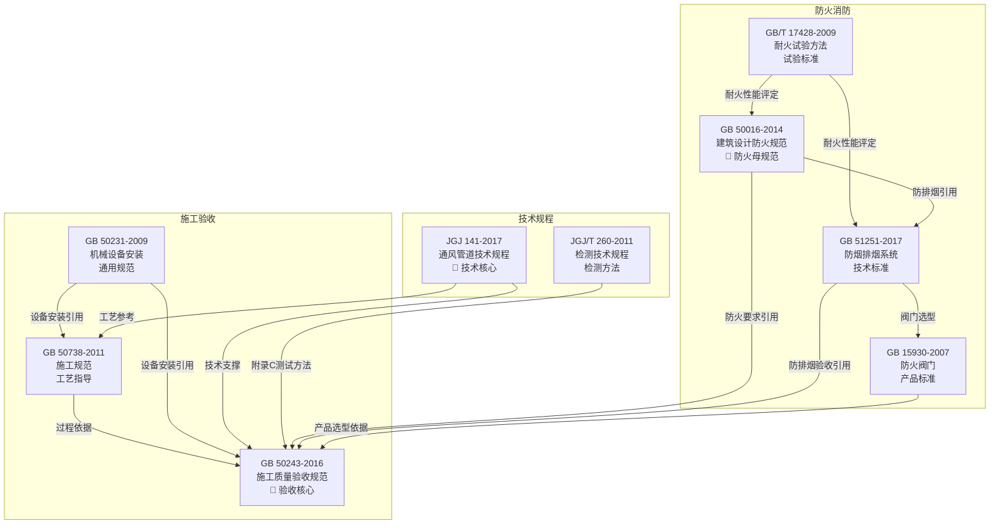
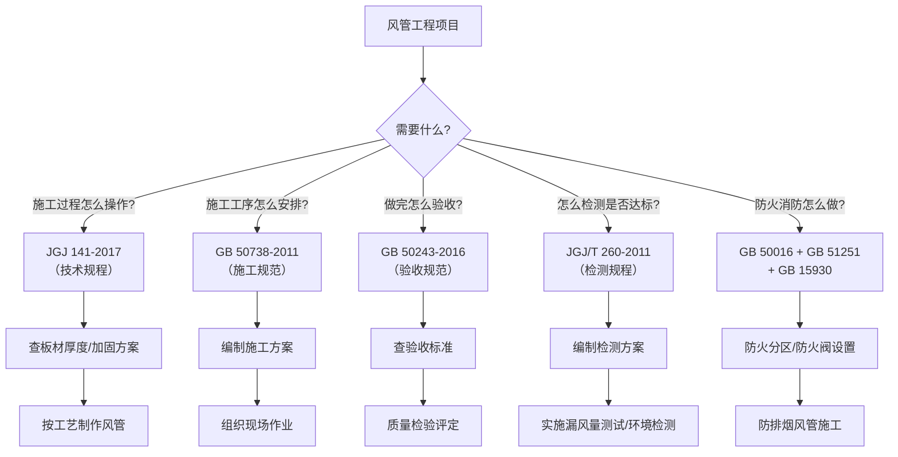

# 中国标准索引

> [!important] 索引概览
> 本索引收录风管制造与安装工程相关的 **10 项标准**，涵盖施工验收、防火消防、技术规程和管道配件四大类。每项标准均有独立的详细笔记，点击 双链 可跳转查看完整内容。

---

## 一、标准清单

### 🔧 施工验收类

| 序号 | 标准编号 | 标准名称 | 施行日期 | 核心内容简介 |
|:----:|----------|----------|:--------:|------------|
| 1 | **GB 50243-2016** | 通风与空调工程施工质量验收规范 | 2017-07-01 | 🔑 **验收核心标准**。风管与设备安装的质量验收准则，含 10 条强制性条文。附录 C 提供漏风量/漏光测试方法。 |
| 2 | **GB 50738-2011** | 通风与空调工程施工规范 | 2012-05-01 | **施工过程规范**。规定材料进场、风管制作、设备安装的施工工艺与操作要点。与 GB 50243 配套使用。 |
| 3 | **GB 50231-2009** | 机械设备安装工程施工及验收通用规范 | 2009-10-01 | **设备安装通用规范**。风机、水泵、压缩机等旋转设备的安装、对中、试运转通用要求。 |

### 🔥 防火消防类

| 序号 | 标准编号 | 标准名称 | 施行日期 | 核心内容简介 |
|:----:|----------|----------|:--------:|------------|
| 4 | **GB/T 17428-2009** | 通风管道耐火试验方法 | 2010-04-01 | 风管耐火性能试验标准。定义管道 A/B 两种火作用模式，规定完整性/隔热性判定准则。 |
| 5 | **GB 50016-2014** | 建筑设计防火规范（2018 年版） | 2015-05-01 | **建筑防火母规范**。第 9 章为暖通防火设计核心，规定防火阀设置、风管材料燃烧性能等强制性要求。 |
| 6 | **GB 51251-2017** | 建筑防烟排烟系统技术标准 | 2018-08-01 | 🔑 **防排烟专项标准**。覆盖防烟/排烟系统设计、施工、调试、验收全生命周期。 |
| 7 | **GB 15930-2007** | 建筑通风和排烟系统用防火阀门 | 2008-06-01 | **防火阀产品标准**。定义防火阀(70°C)、排烟防火阀(280°C)、排烟阀三类产品，CCC 认证依据。 |

### 📐 技术规程类

| 序号 | 标准编号 | 标准名称 | 施行日期 | 核心内容简介 |
|:----:|----------|----------|:--------:|------------|
| 8 | **JGJ 141-2017** | 通风管道技术规程 | 2017-09-01 | 🔑 **风管技术核心规程**。风管压力分类（低/中/高）、板材厚度表、加固方案、连接方式（角钢法兰/共板法兰/插接）、严密性等级（A/B/C）。 |
| 9 | **JGJ/T 260-2011** | 采暖通风与空气调节工程检测技术规程 | 2012-04-01 | **检测技术规程**。漏风量检测方法、风量平衡、水系统检测、室内环境（温湿度/噪声/风速）检测。 |

### 📦 管道配件类

| 序号 | 标准编号 | 标准名称 | 施行日期 | 核心内容简介 |
|:----:|----------|----------|:--------:|------------|
| 10 | **GB/T 9112~9124** | 钢制管法兰 PN 系列 | — | **管道法兰国家标准**。定义 PN 压力等级（PN2.5~PN160），规定各口径法兰的外径、螺栓孔中心圆、孔数、螺栓规格。与风管法兰是两个体系，互不通用。 |

---

## 二、标准关系图

---

## 三、详细笔记索引

### 施工验收

- **GB50243-2016 通风与空调工程施工质量验收规范|GB 50243-2016** — 📁 GB50243-2016-章节索引|12章+5附录分章节笔记
- **GB50738-2011 通风与空调工程施工规范|GB 50738-2011** — 📁 GB50738-2011-章节索引|18章分章节笔记（8个核心章）
- **GB50231-2009 机械设备安装工程施工及验收通用规范|GB 50231-2009** — 📁 GB50231-2009-章节索引|4章分章节笔记

### 防火消防

- **GBT17428-2009 通风管道耐火试验方法|GB/T 17428-2009** — 📁 GBT17428-2009-章节索引|4章分章节笔记（A/B类试验）
- **GB50016-2014 建筑设计防火规范(2018版)|GB 50016-2014** — 📁 GB50016-2014-章节索引|5节HVAC相关分章节笔记
- **GB51251-2017 建筑防烟排烟系统技术标准|GB 51251-2017** — 📁 GB51251-2017-章节索引|6章核心分章节笔记
- **GB15930-2007 建筑通风和排烟系统用防火阀门|GB 15930-2007** — 📁 GB15930-2007-章节索引|4章分章节笔记

### 技术规程

- **JGJ141-2017 通风管道技术规程|JGJ 141-2017** — 📁 JGJ141-2017-章节索引|6章核心分章节笔记
- **JGJT260-2011 采暖通风与空气调节工程检测技术规程|JGJ/T 260-2011** — 📁 JGJT260-2011-章节索引|4章分章节笔记

### 管道配件

- **管道法兰PN系列/管道法兰PN系列国标速查|GB/T 9112~9124 钢制管法兰 PN 系列** — 📁 管道法兰PN系列/管道法兰PN系列国标速查|1篇速查笔记

---
## 四、分章节笔记总览

| 标准 | 目录 | 分章节文件数 | 覆盖 |
|------|------|:---------:|------|
| GB 50243-2016 | GB50243-2016-章节索引\|📁 | 13 | 12章 + 附录索引 |
| GB 50738-2011 | GB50738-2011-章节索引\|📁 | 9 | 8个核心章 + 索引 |
| GB 50231-2009 | GB50231-2009-章节索引\|📁 | 5 | 4章 + 索引 |
| GB/T 17428-2009 | GBT17428-2009-章节索引\|📁 | 5 | 4章 + 索引 |
| GB 50016-2014 | GB50016-2014-章节索引\|📁 | 6 | 5节 + 索引 |
| GB 51251-2017 | GB51251-2017-章节索引\|📁 | 7 | 6章 + 索引 |
| GB 15930-2007 | GB15930-2007-章节索引\|📁 | 5 | 4章 + 索引 |
| JGJ 141-2017 | JGJ141-2017-章节索引\|📁 | 7 | 6章 + 索引 |
| JGJ/T 260-2011 | JGJT260-2011-章节索引\\|📁 | 5 | 4章 + 索引 |
| GB/T 9112~9124 | 管道法兰PN系列/管道法兰PN系列国标速查\\|📁 | 1 | 速查笔记 |
| **合计** | | **63** | |

---

## 五、标准选用流程

---

## 六、标准层级关系

| 层级 | 类型 | 标准 | 说明 |
|:----:|------|------|------|
| **L1** | 母规范 | GB 50016-2014 | 建筑防火总体要求，所有风管防火措施的法律源头 |
| **L2** | 施工与验收规范 | GB 50243-2016 / GB 50738-2011 / GB 50231-2009 | 施工质量与工艺流程的强制性要求 |
| **L3** | 技术规程 | JGJ 141-2017 / JGJ/T 260-2011 | 专项技术细节与检测方法 |
| **L4** | 产品/试验标准 | GB 15930-2007 / GB/T 17428-2009 / GB 51251-2017 | 产品性能要求与试验方法 |

> [!tip] 快速记忆
> - **做什么（设计意图）** → GB 50016 / GB 51251
> - **怎么做（施工过程）** → JGJ 141 / GB 50738
> - **做成什么样（验收判定）** → GB 50243
> - **怎么证明达标（检测验证）** → JGJ/T 260 / GB/T 17428
> - **用什么产品（设备选型）** → GB 15930

---

> 📅 **最后更新**：2026-06-08
