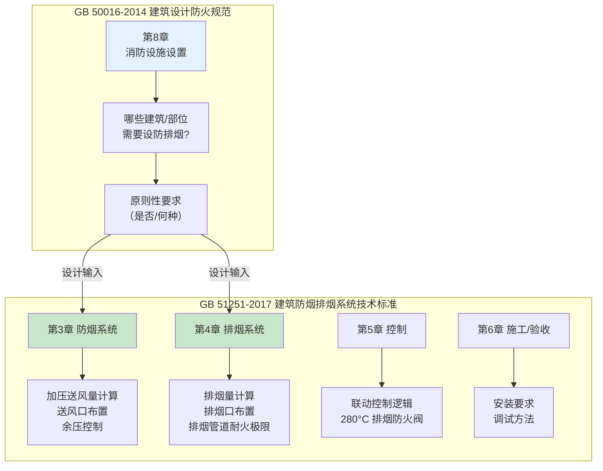
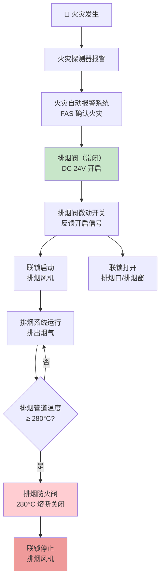

# 第10章 防烟和排烟（概要）

> [!important] 章节定位
> GB 50016-2014 第8章"消防设施设置"和第10章相关条文给出了**建筑物是否需要设置防排烟设施**的原则性判定条件。但具体的设计方法、计算参数、系统配置、施工验收等详细技术要求，则由专项标准 **GB51251-2017 建筑防烟排烟系统技术标准** 承接。本章是 GB 50016 与 GB 51251 之间的**衔接桥梁**——建规告诉你"要不要做"，防排烟标准告诉你"怎么做"。

---

## 一、GB 50016 与 GB 51251 的分工关系

| 维度 | GB 50016（建规） | GB 51251（防排烟标准） |
|------|:--------------:|:---------------------:|
| **作用** | 确定**是否需要设**防排烟 | 规定**如何设计施工**防排烟 |
| **内容深度** | 原则性、判定性 | 计算、配置、控制、验收 |
| **对风管专业** | 间接影响（系统有无） | **直接影响**（风管规格/耐火/施工） |
| **强制性** | 全部条文强制 | 强制性条文 + 推荐性条文 |

---

## 二、防烟与排烟的基本概念

### 2.1 防烟 vs 排烟

| 对比 | 防烟系统 | 排烟系统 |
|------|----------|----------|
| **目的** | 防止烟气进入疏散通道 | 将烟气排出室外 |
| **方式** | **加压送风**——使疏散通道（楼梯间/前室）保持正压 | **机械排烟**或**自然排烟** |
| **保护区域** | 楼梯间、前室、避难层（间） | 房间、走道、中庭 |
| **风管材质要求** | A 级不燃 | A 级不燃 |
| **风管耐火要求** | 按 GB 51251 第 3.3 节 | 按 GB 51251 第 4.4.8 条（≥1.0h） |

### 2.2 自然排烟 vs 机械排烟

| 对比 | 自然排烟 | 机械排烟 |
|------|----------|----------|
| **原理** | 利用热压和风压，通过可开启外窗自然排出烟气 | 通过排烟风机强制排出烟气 |
| **适用条件** | 有外窗的房间、走道 | 无外窗、超长走道、中庭、地下空间 |
| **排烟口面积** | ≥ 地面面积 2%~5% | 排烟口按设计风速确定 |
| **可靠性** | 依赖外部风环境 | 主动控制，更可靠 |
| **风管需求** | **无风管**（仅开窗） | 需要**完整排烟风管系统** |
| **规范依据** | GB 50016 第 8 章 + GB 51251 第 4.3 节 | GB 51251 第 4.4 节 |

---

## 三、GB 50016 中需设防排烟的典型建筑/部位

### 3.1 需设防烟设施

| 建筑部位 | 防烟方式 |
|----------|----------|
| 疏散楼梯间（高度 > 10m 或地下 > 2 层） | 加压送风 |
| 消防电梯前室 | 加压送风 |
| 合用前室（楼梯+消防电梯） | 加压送风 |
| 避难层（间） | 加压送风 |

### 3.2 需设排烟设施

| 建筑/部位 | 排烟方式 | 排烟量要求 |
|-----------|----------|-----------|
| **中庭**（高度 > 12m） | 机械排烟 | 按体积计算 |
| **长度 > 20m 的内走道** | 机械排烟或自然排烟 | 按 GB 51251 |
| **地上无窗房间**（面积 > 50m²） | 机械排烟 | 按 GB 51251 |
| **地下/半地下房间**（面积 > 50m²） | 机械排烟 | 按 GB 51251 |
| **歌舞娱乐放映游艺场所** | 机械排烟 | 按 GB 51251 |
| **中庭周围回廊** | 机械排烟 | 按 GB 51251 |

> [!tip] 快速记忆
> - **内走道 > 20m** → 必设排烟
> - **无窗房间 > 50m²** → 必设排烟
> - **地下房间 > 50m²** → 必设排烟
> - **楼梯间/前室** → 必设防烟（加压送风）

---

## 四、排烟管道耐火极限要求（GB 51251 第 4.4.8 条）

虽然详细要求参见 GB 51251，但这是风管制造中必须了解的关键数据：

| 排烟管道敷设位置 | 耐火极限要求 | 试验方法 |
|-----------------|:----------:|----------|
| 排烟管道（独立管井内） | ≥ **0.5 h** | GB/T 17428（B类内部火试验） |
| 排烟管道（穿越防火分区或敷设于其他管道井内） | ≥ **1.0 h** | GB/T 17428（B类内部火试验） |
| 排烟管道（穿越疏散走道、楼梯间等） | ≥ **1.0 h** | GB/T 17428（B类内部火试验） |
| 补风管道 | ≥ **0.5 h** | GB/T 17428（A类外部火试验） |

### 4.1 排烟管道耐火构造方案

| 方案 | 耐火极限 | 构造要点 |
|------|:--------:|----------|
| **防火包裹风管** | 0.5 ~ 3.0 h | 镀锌钢板 + 岩棉/硅酸钙板外包 |
| **防火板风管** | 1.0 ~ 3.0 h | 硅酸钙板/防火板制成的成品风管 |
| **外包防火板** | 1.0 ~ 2.0 h | 在金属风管外侧包覆防火板 |

---

## 五、排烟系统的控制逻辑概要

| 控制节点 | 动作 | 说明 |
|----------|------|------|
| **火灾确认** | FAS 发出排烟指令 | 由两个独立探测器或一个探测器+手动报警按钮确认 |
| **排烟阀开启** | DC 24V 电控 + 手动 | 常闭排烟阀打开，形成排烟通路 |
| **连锁启风机** | 排烟阀微动开关反馈 → 启风机 | 确保先开阀、后启风机（防止风机憋压） |
| **280°C 保护** | 排烟防火阀熔断 → 停风机 | 防止高温烟气损坏风机，并防止火灾通过排烟管扩散 |

---

## 六、与风管制造的接口要点

| 制造/施工要点 | 具体要求 | 出处 |
|--------------|----------|:----:|
| **排烟风管须不燃材料** | 镀锌钢板/不锈钢，A 级 | GB 50016 9.3.13 |
| **排烟管道耐火极限** | ≥ 0.5h ~ 1.0h（按敷设位置） | GB 51251 4.4.8 |
| **排烟风管保温须 A 级** | 岩棉/玻璃棉，不得用橡塑 | GB 50016 9.3.15 |
| **排烟口/排烟阀常闭** | 配合 DC 24V 执行器 | GB 15930 |
| **排烟风机入口 280°C 阀** | 排烟防火阀 PFHF 型 | GB 15930 + GB 51251 |
| **柔性接管须 A 级** | 防火硅胶玻纤布 | GB 50016 9.3.14 |
| **耐火试验** | 排烟管道须做 B 类（内部火）耐火试验 | GB/T 17428 |

---

## 🔗 相关页面

- ⭐ **防排烟专项标准（必读）** → GB51251-2017 建筑防烟排烟系统技术标准
- 防火阀六类必设位置 → 第9章2节 通风与空调系统防火阀设置
- 风管材料与保温燃烧性能 → 第9章3节 风管材料与保温燃烧性能
- 防火阀门产品标准 → GB15930-2007 建筑通风和排烟系统用防火阀门
- 风管耐火试验方法 → GBT17428-2009 通风管道耐火试验方法
- 防排烟风管施工验收 → GB50243-2016 通风与空调工程施工质量验收规范
- 章节总览 → GB50016-2014-章节索引|GB50016-2014 章节索引

---

← 返回 GB50016-2014-章节索引|GB50016-2014 章节索引
