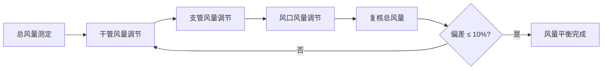

# 第11章 系统调试

第 11 章规定了通风与空调系统安装完毕后、竣工验收前的**系统调试**要求，包括单机试运转、系统联动调试、风量平衡和室内环境参数测定。

---

## 11.1 调试前提条件

系统调试前必须满足以下条件：

- [x] 风管系统、水系统、电气系统全部安装完毕，检验批/分项验收合格
- [x] 管道系统水压试验/冲洗合格
- [x] 电气设备和主回路绝缘测试合格
- [x] 风管内杂物清理干净，风口和过滤器均已安装
- [x] 调试方案经审核批准，调试人员到位
- [x] 各阀门、防火阀、调节阀处于正常位置

---

## 11.2 单机试运转

### 11.2.1 试运转项目与合格标准

| 设备类型 | 试运转内容 | 合格标准 |
|----------|-----------|----------|
| **风机** | 点动 → 启动 → 连续运行 ≥ 2h | 运转平稳，无异常振动噪声；轴承温升 ≤ 40°C（滚动轴承）/ ≤ 20°C（滑动轴承） |
| **水泵** | 点动 → 启动 → 连续运行 ≥ 2h | 运转平稳，填料函泄漏量正常（≤ 20 滴/min）；轴承温升合格 |
| **空调机组** | 启动 → 连续运行 ≥ 2h | 各功能段运行正常，冷热盘管供回水温度正常 |
| **风机盘管** | 三速开关逐档测试 | 各档风速正常，凝水盘排水通畅 |
| **冷却塔** | 风机 + 水泵联动运行 | 布水均匀，风机运转平稳 |
| **冷水机组/热泵** | 厂家指导下调试 | 制冷/制热量、COP 达到性能指标 |

### 11.2.2 风机试运转重点检查

| 检查项目 | 方法 | 标准 |
|----------|------|------|
| 叶轮旋转方向 | 目测 | 与机壳标识方向一致 |
| 运行电流 | 钳形电流表 | 不超过额定电流 |
| 振动速度 | 振动计 | ≤ 4.6 mm/s（刚性基础）/ ≤ 7.1 mm/s（弹性基础） |
| 噪声 | 声级计 | 不超过产品铭牌值 |

---

## 11.3 系统联动调试

单机试运转合格后，进行全系统联动调试：

| 调试阶段 | 内容 | 目的 |
|----------|------|------|
| **风系统联动** | 风阀全开 → 逐台启动风机 → 模拟火灾信号测防排烟联动 | 验证风系统各设备协调运行 |
| **水系统联动** | 水泵运行 → 冷水机组启动 → 末端空调联动 | 验证冷量输送和分配 |
| **全系统联动** | 风系统 + 水系统 + 自控系统联合运行 ≥ 8h | 验证全系统稳定性 |

---

## 11.4 风量平衡

风量平衡是调试的核心环节，目标是为每个风口分配合格的风量：

### 11.4.1 风量平衡步骤

### 11.4.2 风量允许偏差

| 项目 | 允许偏差 |
|------|----------|
| 系统总风量 | 设计值的 **+10% / -10%** |
| 各风口风量 | 设计值的 **+15% / -15%**（舒适性空调）/ **+10% / -10%**（工艺性空调） |

### 11.4.3 风量测量方法

| 测量位置 | 仪器 | 方法 |
|----------|------|------|
| 主风管 | 皮托管 + 微压计 | 等面积环分点法，测量动压后计算风速和风量 |
| 风口 | 风量罩 | 直接读取，快速高效 |
| 风口（无风量罩） | 风速仪 | 多点测量取平均风速 × 风口有效面积 |

> [!tip] CAMduct 关联
> CAMduct 在 展开图与套料 环节可输出风管的截面面积，供现场风量计算参考。同时，系统设计风量决定了每一段风管的截面尺寸，CAMduct Specification 中的截面参数应与设计风量匹配。

---

## 11.5 室内环境参数测定

| 参数 | 仪器 | 标准 |
|------|------|------|
| **温度** | 玻璃温度计/电子温度计 | 设计温度 ± 2°C（舒适性）/ ± 1°C（工艺性） |
| **相对湿度** | 干湿球温度计/电子湿度计 | 设计湿度 ± 10% |
| **噪声** | 声级计（A 计权） | NC 曲线或 NR 曲线达标，一般办公 NR-35~40 |
| **风速** | 热线风速仪 | 风口出风速度符合设计（一般散流器 2~4 m/s） |

### 噪声测量要点

| 参数 | 要求 |
|------|------|
| 测点位置 | 距地面 1.2m，距墙 ≥ 1.0m，距风口 ≥ 1.5m |
| 背景噪声修正 | 室内噪声实测值 - 背景噪声 ≥ 10dB 时免修正；3~9dB 时修正；< 3dB 时数据无效 |
| 测量工况 | 空调系统在正常运行工况下稳定 ≥ 30min 后测量 |

---

## 11.6 与 CAMduct 的关联

| 调试内容 | CAMduct 关联 |
|----------|-------------|
| 风量分配 | CAMduct 输出的材料清单包含各管段**截面尺寸**和**风量标识**，供调试人员参考 |
| 调节阀定位 | CAMduct 图纸上标注各支管的调节阀编号，方便风量平衡时分区域调试 |
| 系统压力 | CAMduct Specification 中的压力等级（Low/Med/High）须与现场实测风管静压一致，验证出厂设定是否准确 |
| 漏风量参考 | CAMduct 输出的接缝总长度可辅助估算风管系统漏风量（配合附录 C） |

← 返回 GB50243-2016-章节索引|GB50243-2016 章节索引
