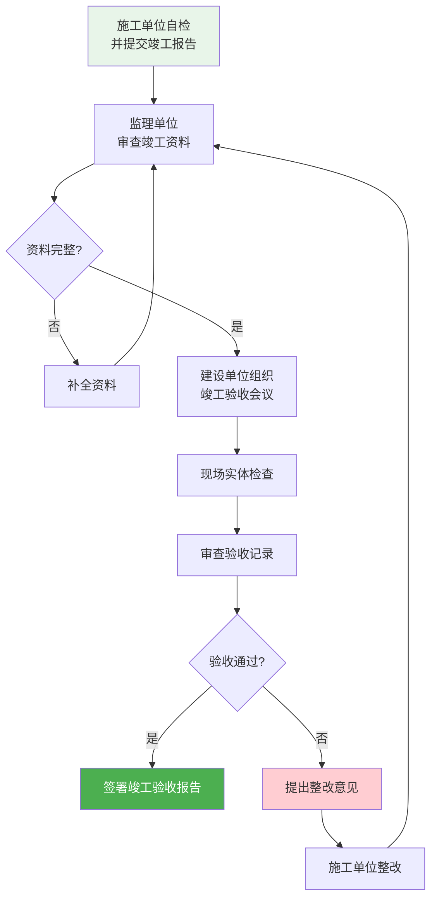

# 第12章 竣工验收

第 12 章是 GB 50243-2016 的**收官章**，规定了通风与空调工程竣工验收的条件、程序、文件和观感质量检查要求。

---

## 12.1 竣工验收条件

通风与空调工程竣工验收必须满足以下**全部条件**：

- [x] 所有子分部工程、分项工程均已完成并**验收合格**
- [x] 系统调试已完成，各项性能指标满足设计和规范要求（[第11章 系统调试](/knowledge/pipe-fitting-spec/第11章-系统调试/)|第11章）
- [x] 强制性条文涉及的项目全部合格，并有**书面验收记录**
- [x] 竣工图纸和工程变更文件完整
- [x] 设备使用说明书和维护手册已移交建设单位
- [x] 工程遗留问题已处理完毕或达成处理协议

---

## 12.2 竣工验收程序

| 步骤 | 责任方 | 输出文件 |
|------|--------|----------|
| 1. 施工单位自检 | 施工单位 | 《工程竣工报告》 |
| 2. 监理审核 | 监理单位 | 《工程质量评估报告》 |
| 3. 组织验收会议 | 建设单位 | 验收会议纪要 |
| 4. 现场检查 | 验收组（建设/监理/施工/设计） | 现场检查记录 |
| 5. 签署验收 | 验收组 | 《竣工验收报告》 |

---

## 12.3 竣工验收文件清单

| 序号 | 文件名称 | 说明 |
|------|----------|------|
| 1 | **图纸会审记录** | 施工前对设计图纸的审查确认 |
| 2 | **设计变更通知单** | 施工过程中的设计变更文件 |
| 3 | **材料/设备出厂合格证及检测报告** | 所有风管材料、阀门、设备的合格证明 |
| 4 | **隐蔽工程验收记录** | 风管穿越结构、管道埋设等隐蔽工程 |
| 5 | **检验批质量验收记录** | 附录 A/B 格式的验收表格 |
| 6 | **分项/子分部/分部工程质量验收记录** | 逐级汇总的验收记录 |
| 7 | **风管漏风量/漏光检测记录** | 附录 C 测试报告 |
| 8 | **水系统水压试验/冲洗记录** | 水系统试验报告 |
| 9 | **单机试运转记录** | 每台设备的试运转报告 |
| 10 | **系统联动调试记录** | 全系统联动运行 ≥ 8h 记录 |
| 11 | **风量平衡测试记录** | 各风口实测风量与设计风量对比 |
| 12 | **室内环境参数检测记录** | 温湿度、噪声、风速等 |
| 13 | **竣工图** | 真实反映工程实体的最终图纸 |

---

## 12.4 观感质量检查

观感质量检查是竣工验收的**现场实体环节**，验收组通过目测和简单工具对工程外观进行检查：

### 12.4.1 风管观感检查

| 检查项目 | 要求 |
|----------|------|
| 风管横平竖直 | 无明显歪斜、下沉、变形 |
| 支吊架 | 排列整齐，防腐完好，螺栓紧固 |
| 风管表面 | 无破损、无污染、镀锌层完好 |
| 保温层外观 | 平整美观，铝箔无破损，接缝严密 |
| 法兰连接 | 螺栓齐全、紧固，垫片不外露 |
| 标识 | 风管系统标识（送风/回风/排烟）清晰 |

### 12.4.2 设备与阀门观感检查

| 检查项目 | 要求 |
|----------|------|
| 设备表面 | 清洁无损，防锈漆完好 |
| 阀门手轮 | 完整、启闭方向标识清楚 |
| 保温 | 表面平整，防潮层完好 |
| 标识牌 | 设备铭牌清晰，系统编号齐全 |

### 12.4.3 机房与管道井观感检查

| 检查项目 | 要求 |
|----------|------|
| 机房整洁 | 地面无积水、无油污，通道畅通 |
| 管道排列 | 横平竖直，间距均匀 |
| 管道标识 | 介质名称、流向箭头清晰 |
| 穿墙/楼板封堵 | 封堵严密、平整美观 |

---

## 12.5 验收判定标准

| 判定 | 条件 |
|------|------|
| ✅ **验收合格** | 所有主控项目合格，一般项目抽样合格，观感质量符合要求，文件齐全 |
| ❌ **验收不合格** | 主控项目有不合格项，或一般项目抽样不合格且整改后仍不合格 |
| ⚠️ **局部验收** | 部分子分部工程不具备联动调试条件时，可对已完工子分部先行验收 |

> [!important] 验收不合格的处理
> 验收不合格的工程，不得交付使用。施工单位须在规定期限内完成整改，整改完成后重新组织验收。涉及强制性条文的不合格项，必须**逐一整改闭合**，不得漏项。

---

## 12.6 与 CAMduct 的关联

竣工验收阶段，CAMduct 的价值体现在：

| CAMduct 输出 | 竣工关联 |
|-------------|----------|
| **NC 代码/切割清单** | 作为风管制造的**过程追溯记录**，纳入竣工文件 |
| **风管批次标签** | 印制在风管上的批次信息，供现场验收时快速识别 |
| **材料用量清单** | 与设计材料总量对比，验证材料供应与管理 |
| **As-Built图纸** | CAMduct 输出的管段图可作为竣工图的**风管部分基础** |
| **质量报告** | 在 自定义报告模板 中生成符合 GB 50243 附录 A/B 格式的检验批记录 |

> [!tip] 竣工全链路闭环
> 从 CAMduct 的 Specification 配置（第4章） → 生产制造 → 现场安装 → 系统调试（第11章） → 竣工验收（第12章），GB 50243 的质量要求贯穿始终。CAMduct 在这一链路中起到**数据生成和记录追溯**的关键作用。

---

## 12.7 GB 50243-2016 全文完

> [!summary] GB 50243-2016 核心要点回顾
> 1. **12 章 + 5 附录**，覆盖风管制作 → 安装 → 防腐绝热 → 调试 → 竣工验收全流程
> 2. **10 条强制性条文**，涉及材料性能、防火安全、机械安全、电气安全、燃气/压力管道安全
> 3. **GB/T 2828.11 统计抽样**替代传统百分比抽样，科学控制验收风险
> 4. **附录 C（风管强度与严密性测试）** 是风管质量验证的核心实操章节
> 5. **与 CAMduct 深度关联**：Specification 配置、板材厚度、密封等级、压力分类均根源于此

---

← 返回 GB50243-2016-章节索引|GB50243-2016 章节索引
