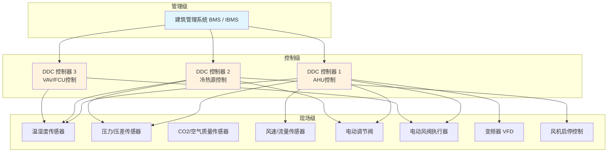

# 第13章 监测与控制系统

> [!important] 章节定位
> 第13章规定楼宇自动化系统（BAS）中暖通空调相关传感器、控制器（DDC）、执行器的安装和接线施工要求。监测与控制系统是实现空调系统节能运行和智能运维的**神经系统**，安装质量直接影响控制精度和系统可靠性。

---

## 一、系统架构概览

---

## 二、传感器安装

### 2.1 温湿度传感器

| 安装位置 | 技术要求 |
|----------|----------|
| **室内温湿度** | 距地 1.5～1.8m，避开阳光直射、热源、送风口直吹区 |
| **风管温度** | 插入风管中心位置，插入深度 ≥ 风管直径/高度的 1/2 |
| **水管温度** | 插入深度 ≥ 管径 1/2，方向与水流方向一致或逆流 |
| **室外温湿度** | 北侧/背阴处，距地 ≥ 2m，设防辐射罩 |
| **接线** | 屏蔽双绞线，屏蔽层单端接地 |

> [!warning] 温度传感器安装通病
> - ❌ 室内传感器安装在送风口直吹区 → 读数偏冷
> - ❌ 水管传感器插入深度不足 → 响应慢、读数不准
> - ❌ 风管传感器仅插入保温层未接触气流 → 完全失效

### 2.2 压力/压差传感器

| 安装位置 | 技术要求 |
|----------|----------|
| **风管静压** | 取压口设在风速稳定处，避开涡流区（弯头/三通后 ≥ 3D） |
| **过滤器压差** | 高压侧接过滤器前，低压侧接过滤器后 |
| **风机压差** | 高压侧接风机出口，低压侧接风机进口 |
| **水管压力** | 取压口设在管道侧面（不在底部/顶部），设隔离阀 |
| **引压管** | 短而直，不得有急弯，坡度 ≥ 1/100 坡向传感器 |

### 2.3 CO₂ / 空气质量传感器

| 安装位置 | 技术要求 |
|----------|----------|
| **室内安装** | 距地 1.5～1.8m，避开人员呼吸直吹区（距离 ≥ 0.5m） |
| **回风管安装** | 插入回风管中心，远离新风入口 |
| **标定** | 安装后需标定（标准气体法或空气标定） |
| **维护** | 定期清洁传感器探头，防止灰尘覆盖 |

### 2.4 风速/风量传感器

| 安装位置 | 技术要求 |
|----------|----------|
| **直管段要求** | 上游 ≥ 5D，下游 ≥ 2D（D 为风管直径） |
| **插入深度** | 多点平均风速测杆，覆盖风管截面 |
| **方向** | 箭头方向与气流方向一致 |
| **VAV 箱传感器** | 出厂已标定，现场不得拆卸 |

---

## 三、DDC 控制器安装与接线

### 3.1 控制柜/箱安装

| 项目 | 技术要求 |
|------|----------|
| **安装位置** | 干燥、通风、便于检修处，距地 ≥ 1.2m |
| **环境温度** | 0～50°C（超出范围需加温控设备） |
| **防潮** | 相对湿度 ≤ 90%（无结露），必要时设除湿加热器 |
| **接地** | 控制柜需可靠接地，接地电阻 ≤ 4Ω（或 ≤ 1Ω 按设计要求） |
| **电源** | 独立回路供电，设 UPS 不间断电源（≥ 30min） |

### 3.2 DDC 接线规范

| 接线类型 | 技术要求 |
|----------|----------|
| **信号线** | 屏蔽双绞线（RVVP），屏蔽层单端接地（在 DDC 端） |
| **通信线** | 总线型拓扑用专用通信线（如 Belden 9841 for BACnet MS/TP） |
| **强弱电分离** | 🔑 信号线与电源线**不得同管/同槽敷设**，间距 ≥ 300mm |
| **线径** | AI/AO 信号：≥ 0.5mm²；DI/DO 信号：≥ 0.75mm² |
| **端子** | 冷压接线端子，线号标记清晰 |
| **备用** | 每台 DDC 预留 ≥ 10% I/O 点和端子 |

### 3.3 DDC 上电前检查

| 检查项目 | 要求 |
|----------|------|
| 接线正确性 | 按接线图逐点核对 |
| 对地绝缘 | 信号回路对地绝缘电阻 ≥ 20MΩ |
| 电源电压 | AC 24V ±10% 或 DC 24V ±5%（视型号） |
| 接地 | 接地可靠，接地电阻达标 |
| 通信终端电阻 | 总线两端正确设置 120Ω 终端电阻 |

---

## 四、执行器安装

### 4.1 电动风阀执行器

| 项目 | 技术要求 |
|------|----------|
| **安装方向** | 执行器输出轴与风阀轴同心，偏差 ≤ 1° |
| **联轴器** | 紧固可靠，无打滑 |
| **旋转角度** | 0～90°（或按风阀要求），限位开关准确 |
| **手动操作** | 带手动释放按钮，断电时可手动开/关 |
| **信号匹配** | 0～10V DC 或 4～20mA，对应 0～100% 开度 |
| **防水** | 室外/高湿处选 IP54 以上防护等级 |

### 4.2 电动水阀执行器（调节阀）

| 项目 | 技术要求 |
|------|----------|
| **阀体安装** | 阀体箭头与水流方向一致 |
| **执行器安装** | 与阀体连接牢固，行程匹配 |
| **阀门位置** | 便于检修，阀前后留直管段 |
| **信号反馈** | 阀位反馈信号接入 DDC AI 通道 |
| **开关时间** | 一般 60～120s（全行程），按设计要求 |

### 4.3 变频器 (VFD) 安装

| 项目 | 技术要求 |
|------|----------|
| **安装位置** | 通风良好处，距墙 ≥ 100mm（散热） |
| **电源侧** | 进线设断路器 + 接触器（紧急停机） |
| **输出侧** | 输出电抗器（长距离 > 50m 时必设），抑制谐波和谐振 |
| **控制信号** | 0～10V / 4～20mA 速度给定，启/停 DO 信号 |
| **接地** | PE 端可靠接地，屏蔽电缆屏蔽层接地 |
| **EMC** | 输入/输出滤波器，防止对传感器信号干扰 |

---

## 五、系统联调前检查

| 检查内容 | 要求 |
|----------|------|
| **传感器信号** | 用标准信号源逐点校准，偏差 ≤ 1% FS |
| **执行器动作** | 0% / 50% / 100% 三点测试，动作平稳无卡阻 |
| **DDC 程序** | 控制逻辑下载验证，PID 参数初步设定 |
| **通信** | BACnet / Modbus 通信正常，数据刷新 ≤ 2s |
| **人机界面** | 上位机画面正确，数据点对应无误 |
| **异常报警** | 模拟超限/故障，报警正确触发 |

---

## 🔗 相关页面

- 传感器安装位置的风管系统 → [第7章 风管系统安装](/knowledge/pipe-fitting-spec/第7章-风管系统安装/)
- 被控制的风机与设备 → [第8章 风机与空气处理设备安装](/knowledge/pipe-fitting-spec/第8章-风机与空气处理设备安装/)
- 系统联调与试运行 → [第16章 系统试运行与调试](/knowledge/pipe-fitting-spec/第16章-系统试运行与调试/)
- 验收标准 → [GB50243-2016 通风与空调工程施工质量验收规范](/knowledge/pipe-fitting-spec/gb50243-2016-通风与空调工程施工质量验收规范/)

---

← 返回 GB50738-2011-章节索引|GB50738-2011 章节索引
