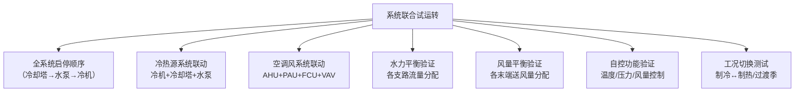

# 第14-15章 监测与控制 + 系统试运行

> [!important] 章节定位
> 第14章规定系统调试前的准备工作和试运行条件，第15章规定设备单机试运转和系统联合试运转的具体技术要求。两章合并覆盖从**安装完毕到系统投入运行**之间的全部调试验证环节，是施工阶段的最后一个技术环节。

---

## 第一部分：监测与控制安装（配合第13章）

---

## 一、传感器安装

### 1.1 温度传感器

| 项目 | 安装要求 |
|------|----------|
| **室内温度传感器** | 安装在可反映房间平均温度的位置，避开送风口、热源、外墙和阳光直射处；安装高度 1.2~1.5m |
| **风道温度传感器** | 安装于能反映混合温度的直管段，距弯头/三通 ≥ 3 倍管径；插入深度超过风管中心 |
| **水管温度传感器** | 探头应完全浸入水中，安装在直管段，避开弯头和阀门；插入深度 ≥ 管径的 1/2 |
| **室外温度传感器** | 安装于通风良好且不受建筑物热辐射影响的背阴面，设有防雨罩 |

### 1.2 湿度传感器

| 项目 | 安装要求 |
|------|----------|
| **室内湿度传感器** | 与温度传感器同理，避开潮湿源和送风口 |
| **风道湿度传感器** | 安装于混合均匀的直管段，探头不得接触管壁 |
| **防护** | 传感器探头应装有不锈钢烧结过滤器（防尘防油污） |

### 1.3 压力传感器 / 压差开关

| 项目 | 安装要求 |
|------|----------|
| **过滤器压差开关** | 高压侧（取压口）在过滤网前，低压侧在过滤网后；取压管不得阻塞、不得积水 |
| **风机压差开关** | 用于风机运行状态监测（皮带断裂报警），取压口分别位于风机进出口 |
| **水管压力传感器** | 安装于直管段，取压口水平方向（避免积气），前后设检修阀 |
| **防冻开关** | 感温毛细管均匀覆盖预热盘管表面，不得扭曲和交叉 |

### 1.4 风速/风量传感器

| 类型 | 安装要求 |
|------|----------|
| **风道风速传感器** | 安装于直管段（前 ≥ 5D，后 ≥ 3D），探头方向与实际气流方向一致 |
| **VAV 末端风速传感器** | 十字取压管置于 VAV 箱入口，取压管方向正确，引出至控制器 |
| **新风量传感器** | 安装于新风管直段，避开新风口和防火阀 |

---

## 二、DDC 控制器安装与接线

### 2.1 控制器安装

| 项目 | 要求 |
|------|------|
| **安装位置** | 安装于 DDC 控制箱/柜内，环境温度 0~50°C，湿度 ≤ 90%RH 无凝露 |
| **电源** | 24VAC 或 24VDC，使用专用隔离变压器供电 |
| **接地** | DDC 控制柜必须可靠接地，接地电阻 ≤ 4Ω |
| **标识** | 每个 DDC 模块贴设备编号标签，与系统图和施工图一致 |

### 2.2 接线规范

| 项目 | 要求 |
|------|------|
| **信号线与电源线** | 必须分开敷设，间距 ≥ 300mm，交叉处垂直通过 |
| **屏蔽线** | 模拟信号（4~20mA/0~10V）必须使用屏蔽双绞线，屏蔽层单端接地 |
| **线缆标识** | 每根线缆两端贴线号管，标识与接线图一致 |
| **接线端子** | 端子紧固可靠，线芯不外露；每个端子最多接入 2 根导线 |
| **通信总线** | BACnet MS/TP / Modbus RTU 使用屏蔽双绞线，总线两端接终端电阻（120Ω） |

### 2.3 监控功能列表

| 监控对象 | AI（模拟输入） | AO（模拟输出） | DI（数字输入） | DO（数字输出） |
|----------|:---:|:---:|:---:|:---:|
| **冷水机组** | 供回水温度 | — | 运行状态、故障报警 | 启停控制 |
| **冷却塔** | 进出水温度 | 风机变频 | 运行状态、故障报警 | 风机启停 |
| **水泵** | — | 变频控制 | 运行状态、故障报警 | 启停控制 |
| **空调机组 (AHU)** | 送风温度、回风温度/湿度 | 冷/热水阀开度 | 运行状态、故障报警、过滤网压差 | 风机启停 |
| **新风机组 (PAU)** | 新风温度、送风温度 | 冷/热水阀开度 | 运行状态、故障报警、防冻 | 风机启停 |
| **风机盘管 (FCU)** | 房间/回风温度 | 水阀开度 | — | 风机三速 |
| **VAV 末端** | 风量、房间温度 | 风阀开度 | — | — |

---

## 第二部分：系统试运行（第14-15章）

---

## 三、系统试运行条件（第14章 — 系统调试准备）

> [!warning] 试运行前必须满足以下所有条件

### 3.1 施工完成度确认

| 确认项目 | 要求 |
|----------|------|
| **风系统** | 风管、风管部件、风机及空气处理设备全部安装完毕，经外观检查合格 |
| **水系统** | 管道、阀门、水泵、冷热源设备全部安装完毕，水压试验和冲洗合格 |
| **电气系统** | 设备供电线路敷设完毕，控制柜接线完成，接地电阻合格 |
| **自控系统** | DDC 控制器安装接线完毕，传感器/执行器安装完毕，单点对点测试完成 |
| **保温** | 风管和水管的保温、防潮层施工完成 |

### 3.2 安全与组织条件

| 条件 | 要求 |
|------|------|
| **试运行方案** | 应编制试运行方案并经审批，内容包括调试项目、方法、仪表清单、安全措施 |
| **人员** | 调试人员应熟悉设备操作和自控系统，持有相应资质 |
| **安全防护** | 设备运转部位防护罩安装就位；配电柜挂设警示标识 |
| **通信** | 控制室与设备机房之间通信畅通（对讲机/电话） |
| **仪表校验** | 所有测试仪表（风速仪、温度计、压力表等）经检定/校准并在有效期内 |

### 3.3 环境条件

| 条件 | 要求 |
|------|------|
| **建筑封闭** | 建筑外围护结构（门窗、幕墙）基本封闭 |
| **临时电源** | 如正式电尚未接入，临时电容量须满足系统全部设备同时启动的需求 |
| **冷热源** | 冷源（冷冻水）或热源（热水/蒸汽）应具备供应条件 |

---

## 四、设备单机试运转（第15章）

### 4.1 风机单机试运转

| 检查项目 | 合格标准 |
|----------|----------|
| **旋转方向** | 叶轮旋转方向与机壳箭头标记一致 |
| **启动电流** | 无异常冲击电流，启动时间正常 |
| **轴承温升** | 滑动轴承 ≤ 60°C，滚动轴承 ≤ 80°C |
| **振动** | 风机轴承座垂直和水平方向振动速度 ≤ 4.6mm/s（刚性基础）或 ≤ 7.1mm/s（弹性基础） |
| **噪声** | 无异常冲击声、摩擦声 |
| **试运转时间** | ≥ 2 小时 |

### 4.2 水泵单机试运转

| 检查项目 | 合格标准 |
|----------|----------|
| **旋转方向** | 泵轴旋转方向与泵壳箭头标记一致 |
| **启动** | 关闭出口阀启动（闭阀启动），逐渐开阀 |
| **轴承温升** | 滚动轴承 ≤ 75°C，滑动轴承 ≤ 65°C |
| **振动** | 振动速度 ≤ 2.8mm/s（转速 ≤ 1800rpm）或 ≤ 4.5mm/s（转速 > 1800rpm） |
| **机械密封** | 泄漏量 ≤ 3 滴/分钟 |
| **试运转时间** | ≥ 2 小时 |

### 4.3 冷水机组单机试运转

| 检查项目 | 合格标准 |
|----------|----------|
| **绝缘电阻** | 压缩机电机绝缘电阻 ≥ 5MΩ（500V 兆欧表） |
| **相序** | 相序正确，无缺相 |
| **油位/油温** | 压缩机润滑油位在视镜正常范围，油温正常 |
| **压力** | 吸排气压力在正常范围内，无异常波动 |
| **运行电流** | 不超过额定电流，三相电流不平衡度 ≤ 10% |
| **振动与噪声** | 无异常振动和噪声 |
| **试运转时间** | ≥ 8 小时（连续运转考核） |

### 4.4 冷却塔单机试运转

| 检查项目 | 合格标准 |
|----------|----------|
| **风机旋转方向** | 风向向上（排风式冷却塔），与机壳箭头一致 |
| **布水器** | 旋转式布水器转动正常，布水均匀 |
| **振动与噪声** | 无异常振动，噪声符合产品技术要求 |
| **补水浮球阀** | 水位自动控制正常 |
| **试运转时间** | ≥ 2 小时 |

### 4.5 空调机组（AHU）单机试运转

| 检查项目 | 合格标准 |
|----------|----------|
| **风机旋转方向** | 正确，各转速档切换正常 |
| **过滤网** | 无破损，安装到位 |
| **冷/热水盘管** | 通水后无渗漏 |
| **加湿段** | 加湿器动作正常（如有） |
| **加热段** | 电加热器与风机联锁正常（风机停→电加热断） |

### 4.6 VAV 末端单机试运转

| 检查项目 | 合格标准 |
|----------|----------|
| **风阀动作** | 0%~100% 全行程范围内无卡阻、动作平滑 |
| **风速传感器** | 与标准风速比对，偏差 ≤ 10% |
| **噪声** | 在设计风量下噪声满足设计要求 |

---

## 五、系统联合试运转

> [!important] 🔑 联合试运转是检验整个系统**设计合理性、施工质量和自控功能**的最终验证

### 5.1 联合试运转条件

| 条件 | 要求 |
|------|------|
| **单机试运转** | 所有设备单机试运转合格 |
| **水系统** | 冷冻水/冷却水/热水系统循环正常 |
| **自控系统** | DDC 程序下载验证通过，单点测试 100% 合格 |
| **安全联锁** | 防冻保护、高低压保护、过载保护、消防联锁等均验证有效 |

### 5.2 联合试运转项目

### 5.3 联合试运转验证指标

| 验证指标 | 合格标准 |
|----------|----------|
| **系统总风量** | 与设计风量偏差 ≤ 10% |
| **各风口风量** | 与设计风量偏差 ≤ 15% |
| **空调区域温度** | 达到设计温度设定值±1°C |
| **空调区域湿度** | 达到设计相对湿度±10% |
| **水系统总流量** | 与设计流量偏差 ≤ 10% |
| **噪声** | 各区域噪声值不超过设计限值（通常 NC 标注） |

### 5.4 试运转记录

每项试运转须填写**试运转记录表**，内容包括：

| 记录项 | 内容 |
|--------|------|
| **设备编号/名称** | 对应设备标签 |
| **试运转时间** | 起止时间、持续时间 |
| **实测参数** | 电压、电流、温度、压力、振动值、转速等 |
| **运行状况** | 正常 / 异常（描述） |
| **处理措施** | 异常情况的原因分析和处理结果 |
| **签字** | 调试负责人、施工负责人、监理签字 |

---

## 🔗 相关页面

- 监测与控制系统的完整安装指南 → 第13章 监测与控制系统
- 系统试运行与调试详细流程 → 第16章 系统试运行与调试
- 空调设备安装 → 第11章 空调设备安装
- 风机与空气处理设备安装 → 第8章 风机与空气处理设备安装
- 质量验收标准（调试部分） → GB50243-2016 通风与空调工程施工质量验收规范
- 检测技术规程 → JGJT260-2011 采暖通风与空气调节工程检测技术规程

---

← 返回 GB50738-2011-章节索引|GB50738-2011 章节索引
