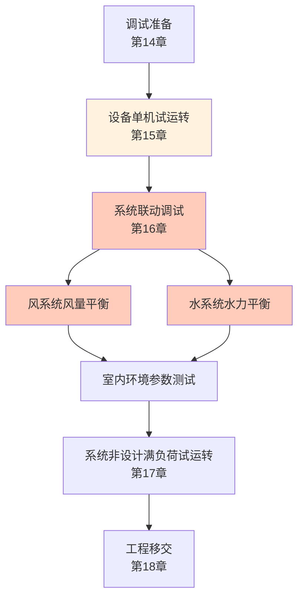

# 第16章 系统试运行与调试

> [!important] 章节定位
> 第16章（对应原标准第14～16章调试相关内容综合）是 GB 50738 施工流程的**收尾核心章**，涵盖设备单机试运转、系统无生产负荷联合试运转、风量测定与调整、水系统水力平衡。调试是系统从「安装完成」到「功能合格」的**决定性环节**。

> [!tip] GB 50738 调试章节对照
> GB 50738 将调试拆分为三章：第14章（调试准备）、第15章（设备单机试运转）、第16章（系统无生产负荷联合试运转）。本笔记将三章核心内容整合，以实用视角呈现完整调试流程。

---

## 一、调试总流程



### 1.1 调试条件

| 条件 | 检查内容 |
|------|----------|
| **施工完成** | 风管、水管、设备、电气、自控全部安装完成 |
| **试压合格** | 水系统试压合格、风管漏风量测试合格 |
| **清洁** | 风管内部清洁无异物、水系统冲洗合格 |
| **电源** | 供电可靠，电压偏差 ≤ ±10% |
| **自控** | DDC 上电，传感器标定，执行器动作正常 |
| **安全** | 转动部件防护罩齐全，消防系统可用 |

---

## 二、设备单机试运转

### 2.1 风机试运转（⭐ 最重要）

| 工序 | 技术要求 |
|------|----------|
| **启动前检查** | 叶轮与机壳无摩擦、轴承润滑良好、皮带/联轴器正常 |
| **点动** | 点动电机检查旋转方向，方向错误立即停机倒相 |
| **启动** | 启动后立即检查电流、振动、噪声 |
| **连续运行** | 🔑 **连续运行 ≥ 2h**，每 30min 记录一次 |
| **轴承温度** | 滚动轴承 ≤ 80°C，滑动轴承 ≤ 60°C |
| **振动** | 振幅 ≤ 0.08mm（1500rpm）、≤ 0.06mm（3000rpm） |
| **电流** | 运行电流 ≤ 额定电流，三相电流不平衡度 ≤ 10% |

### 2.2 水泵试运转

| 工序 | 技术要求 |
|------|----------|
| **灌泵** | 首次启动必须灌泵排气（离心泵） |
| **启动** | 出口阀关闭状态下启动（减少启动电流） |
| **连续运行** | 🔑 **连续运行 ≥ 2h** |
| **轴承温度** | ≤ 70°C（滚动）、≤ 65°C（滑动） |
| **振动** | ≤ 0.07mm（1500rpm）、≤ 0.05mm（3000rpm） |
| **机械密封** | 泄漏量 ≤ 3 滴/min |
| **填料密封** | 泄漏量 ≤ 20 滴/min |

### 2.3 冷水机组试运转

| 工序 | 技术要求 |
|------|----------|
| **启动前检查** | 油位正常、制冷剂压力正常、水流量确认 |
| **启动** | 按主机启动程序启动 |
| **连续运行** | 🔑 **连续运行 ≥ 2h**（含加载/卸载循环） |
| **参数记录** | 蒸发/冷凝压力温度、油温油压、电流、COP |
| **保护测试** | 模拟水流开关断开/高压/低压/油压差保护，验证自动停机 |

---

## 三、系统联动调试程序

### 3.1 联动调试步骤

```
1. 风系统启动：新风阀全开 → 回风阀全开 → 排风阀全开 → 送风机启动 → 回/排风机启动
2. 水系统启动：冷冻水泵启动 → 冷却水泵启动 → 冷却塔启动 → 冷水机组启动
3. 自控联动：DDC 投入自动控制 → 传感器信号确认 → 执行器联调
4. 模式切换：制冷模式 / 制热模式 / 过渡季全新风模式切换验证
```

### 3.2 联动调试检查内容

| 检查项目 | 合格标准 |
|----------|----------|
| **启停顺序** | 按设计要求连锁启停，风机-风阀-水泵-冷机互锁正确 |
| **防火阀连锁** | 防火阀关闭 → 对应风机自动停机 |
| **防冻保护** | 冬季盘管温度过低 → 新风阀自动关闭 + 水泵强制运行 |
| **电加热连锁** | 电加热器必须在送风机启动后才能投入，风机停机自动切断 |
| **压差报警** | 过滤器压差超限 → 报警信号正确输出 |

---

## 四、风量测定与调整

### 4.1 风量测定方法

| 测定位置 | 方法 | 仪器 |
|----------|------|------|
| **风口风量** | 风量罩直接测量 | 风量罩（Balometer） |
| **风管风量** | 风速 × 截面积（多点网格法） | 风速仪/毕托管 + 微压计 |
| **主风管风量** | 截面划分为 ≤ 200mm×200mm 网格，逐点测速取平均 | 毕托管 + 微压计 |

### 4.2 风量平衡与调整

| 步骤 | 内容 |
|:----:|------|
| **1** | 测量各风口实际风量 |
| **2** | 计算各风口风量与设计风量的偏差 |
| **3** | 优先调整主风管阀门（干管→支管→末端） |
| **4** | 逐级调节支管风阀开度 |
| **5** | 重复测量直到各风口风量达标 |

### 4.3 风口风量允许偏差（⭐ 核心指标）

| 系统类型 | 风口风量允许偏差 |
|----------|:----------------:|
| **一般空调通风系统** | 🔑 ≤ **±15%** |
| **洁净空调系统** | ≤ ±10% |
| **变风量 (VAV) 系统** | ≤ ±10%（在设计风量下） |

> [!warning] 风量平衡通病
> - ❌ 远端风口风量不足 → 干管阀门未调、支管阻力不平衡
> - ❌ 仅调末端不调干管 → 反复测量始终无法达标
> - ❌ 将总风量调至设计值就停止 → 未逐口测量验证
> - ❌ 用风速仪单点测风口 → 应使用风量罩（多点平均更准确）

---

## 五、水系统水力平衡

### 5.1 平衡方法

| 方法 | 适用系统 | 步骤 |
|------|----------|------|
| **比例平衡法** | 同程/异程系统 | 先调最不利环路，再逐级按比例调其他环路 |
| **温差法** | 末端温差较大的系统 | 根据各末端供回水温差判断流量分配 |
| **智能平衡阀法** | 带压力/温度独立控制的系统 | 设定目标流量，平衡阀自动调节 |

### 5.2 平衡步骤

```
1. 全开水系统所有阀门
2. 测量各支路/末端的流量（或温差推算）
3. 找出最不利环路（流量最小的环路），将其阀门全开
4. 以此为基准，按比例关小其他环路阀门
5. 重复测量 → 调节 → 测量，直到各环路流量偏差 ≤ ±10%
```

### 5.3 水力平衡验收标准

| 项目 | 合格标准 |
|------|:--------:|
| 各环路流量偏差 | ≤ ±10% |
| 总流量 | 在设计流量的 ±10% 以内 |
| 供回水温差 | 在设计温差的 ±1°C 以内 |

---

## 六、调试记录与报告

调试完成后应形成完整的调试报告，至少包括：

| 记录内容 | 说明 |
|----------|------|
| 单机试运转记录 | 风机/水泵/冷机 2h 运行参数 |
| 风量平衡报告 | 各风口设计风量 vs 实测风量 vs 偏差 |
| 水力平衡报告 | 各环路设计流量 vs 实测流量 |
| 自控功能验证 | 启停顺序、报警联锁、控制精度 |
| 室内环境参数 | 温湿度、噪声、风速等 |

---

## 🔗 相关页面

- 调试前的风管系统安装 → [第7章 风管系统安装](/knowledge/pipe-fitting-spec/第7章-风管系统安装/)
- 调试前的设备安装 → [第8章 风机与空气处理设备安装](/knowledge/pipe-fitting-spec/第8章-风机与空气处理设备安装/)
- 自控系统与调试配合 → [第13章 监测与控制系统](/knowledge/pipe-fitting-spec/第13章-监测与控制系统/)
- 检测技术规程（测试方法） → JGJT260-2011 采暖通风与空气调节工程检测技术规程
- 验收标准（GB 50243 第11章） → [GB50243-2016 通风与空调工程施工质量验收规范](/knowledge/pipe-fitting-spec/GB50243-2016-通风与空调工程施工质量验收规范/)

---

← 返回 GB50738-2011-章节索引|GB50738-2011 章节索引
