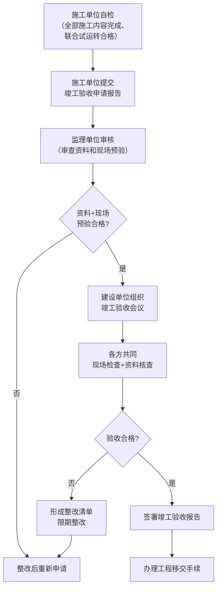

# 第17-18章 竣工验收 + 资料归档

> [!important] 章节定位
> 第17章规范系统调试完成后的竣工验收条件、验收程序和验收内容。第18章规定竣工资料的编制、整理和归档要求。两章合并构成通风与空调工程**施工阶段闭环的最后环节**，实现从施工过程到工程移交的完整交付。

---

## 第一部分：竣工验收（第17章）

---

## 一、竣工验收条件

### 1.1 前置条件检查清单

| 序号 | 验收条件 | 状态确认 |
|:----:|----------|:--------:|
| 1 | 设计文件和合同约定的全部施工内容已完成 | □ |
| 2 | 所有分项/分部工程质量验收合格 | □ |
| 3 | 单机试运转全部合格 | □ |
| 4 | 系统联合试运转合格，各项性能指标达标 | □ |
| 5 | 自控系统功能验收合格 | □ |
| 6 | 消防联动测试合格（防排烟系统） | □ |
| 7 | 洁净度测试合格（洁净空调系统） | □ |
| 8 | 施工过程中发现的问题已整改完毕并闭合 | □ |

> [!warning] 不得组织竣工验收的情形
> - 系统联合试运转不合格或主要性能指标未达到设计要求
> - 存在影响安全和使用功能的严重质量缺陷且未整改
> - 竣工资料严重缺失
> - 消防、环保等专项验收未通过（如适用）

---

## 二、竣工验收程序

### 2.1 验收流程

### 2.2 验收参与方

| 参与方 | 职责 |
|--------|------|
| **建设单位** | 组织者，主持竣工验收会议 |
| **设计单位** | 确认施工是否满足设计要求 |
| **施工单位** | 汇报施工情况，配合现场检查和测试 |
| **监理单位** | 汇报监理工作，提出质量评估意见 |
| **勘察单位** | （如涉及地基基础工程）确认地质条件 |

### 2.3 验收内容

#### （1）资料核查

| 核查资料类别 | 具体内容 |
|--------------|----------|
| **施工管理资料** | 施工合同、开工报告、施工组织设计/专项方案审批文件 |
| **材料/设备资料** | 出厂合格证、质量证明文件、型式检验报告、进场验收记录 |
| **施工记录** | 施工日志、隐蔽工程验收记录、焊接记录、试压记录 |
| **检测报告** | 漏风量检测报告、水压试验报告、气密性试验报告、洁净度检测报告（如适用） |
| **调试记录** | 单机试运转记录、系统联合试运转记录、自控功能测试记录 |
| **质量验收记录** | 检验批验收记录、分项/分部工程验收记录 |

#### （2）现场检查

| 检查项目 | 检查内容与方法 |
|----------|----------------|
| **风系统** | 抽查主要风口风量（仪器实测）、风管外观（平整度、保温完好性）、防火阀安装位置与动作 |
| **水系统** | 抽查水泵运行参数、管道保温完整性、阀门操作灵活性、冷凝水排水通畅性 |
| **设备运行** | 主要设备（冷水机组、AHU、冷却塔等）运转参数检查 |
| **自控系统** | 抽查 10%~20% 监控点的读数准确性、控制回路响应时间 |
| **防排烟** | 联动启动测试、排烟口风速、加压送风余压（消防专项验收可先行完成） |
| **噪声** | 用声级计抽查主要功能区域噪声级 |

---

## 三、竣工验收报告

### 3.1 竣工验收报告编制

| 报告要素 | 内容 |
|----------|------|
| **工程概况** | 工程名称、地点、规模、合同编号 |
| **验收范围** | 本次验收的工程范围 |
| **验收依据** | 设计文件、施工合同、引用标准（GB 50738、GB 50243 等） |
| **质量控制资料核查结论** | 合格 / 基本合格 / 不合格 |
| **现场检查结论** | 各项现场检查结果评价 |
| **验收结论** | 通过验收 / 整改后重新验收 |
| **签字栏** | 建设、设计、施工、监理各方签字盖章 |

### 3.2 验收不合格的处理

| 不合格情形 | 处理措施 |
|------------|----------|
| **一般缺陷** | 施工单位限期整改，监理复验确认 |
| **严重缺陷** | 责令停工整改，重新组织竣工验收 |
| **功能不达标** | 分析原因、制定补强方案，经设计认可后实施 |
| **资料缺陷** | 限期补齐或重新整理 |

---

## 第二部分：资料归档（第18章）

---

## 四、竣工图编制

### 4.1 竣工图编制要求

| 项目 | 要求 |
|------|------|
| **编制依据** | 施工图 + 设计变更通知单 + 工程洽商记录 + 现场实测 |
| **编制原则** | 「**按图施工，如实标注**」——凡与施工图不一致的，均在竣工图上标注实际做法 |
| **标注方式** | 杠改法（在原位杠改标注）或重绘法（大面积变更时重新绘制） |
| **图幅与比例** | 与施工图一致 |
| **章戳** | 竣工图必须加盖「竣工图」章，监理/建设单位签认 |

### 4.2 竣工图应反映的主要内容

| 竣工图类型 | 应标注的关键信息 |
|------------|------------------|
| **风管平面图** | 风管实际路由（含施工中因避让管线调整的部分）、变径位置、防火阀/调节阀型号和位置 |
| **风管系统图** | 各系统（送风/排风/防排烟）实际标高、管径、风量 |
| **水系统图** | 管道实际管径、阀门型号位置、仪表位置 |
| **设备安装图** | 设备安装位置、减振方式、管道接口 |
| **自控系统图** | DDC 控制器编号、传感器/执行器型号和安装位置、通信总线拓扑 |
| **机房大样图** | 设备平面布置、管道配管、支吊架布置 |

---

## 五、竣工资料整理

### 5.1 竣工资料归档清单

GB 50738-2011 第18章要求按以下分类整理归档：

| 资料类别 | 归档文件清单 |
|----------|--------------|
| **A 类：施工管理文件** | 施工合同、开工报告、施工组织设计、施工许可证、资质文件 |
| **B 类：材料/设备质量证明文件** | 风管板材、法兰、紧固件、设备、阀门、保温材料等合格证与检测报告 |
| **C 类：施工技术文件** | 施工方案、技术交底记录、焊接工艺评定 |
| **D 类：施工记录** | 施工日志、隐蔽工程验收记录、风管漏风量检测、水压试验、气密性试验 |
| **E 类：质量验收文件** | 检验批验收记录、分项/分部工程质量验收记录 |
| **F 类：调试验收文件** | 单机试运转记录、联合试运转记录、自控功能测试、竣工验收报告 |
| **G 类：竣工图** | 全套竣工图（含电子版 DWG/PDF） |
| **H 类：其他** | 声像资料（施工过程照片/视频）、设备操作维护手册、备品备件清单 |

### 5.2 资料整理要求

| 项目 | 要求 |
|------|------|
| **组卷原则** | 按档案管理要求分类、编号、组卷 |
| **页码编排** | 每卷资料连续编排页码 |
| **卷内目录** | 每卷前附卷内目录，列出文件名和页码 |
| **案卷目录** | 全部案卷编制总目录 |
| **装订** | 纸质资料线装或胶装，不得用订书钉 |
| **电子版** | 竣工资料和竣工图同步制作电子版（PDF 扫描件 + CAD 原图）备份 |

---

## 六、工程移交

### 6.1 移交内容

| 移交项 | 内容 |
|--------|------|
| **实体移交** | 完成竣工验收的建筑通风与空调系统实体 |
| **资料移交** | 全套竣工资料（含竣工图） |
| **备品备件** | 按合同约定移交易损件、专用工具等 |
| **培训** | 对使用/物业管理单位进行设备操作和维护培训 |

### 6.2 操作培训要点

| 培训对象 | 培训内容 |
|----------|----------|
| **工程运行管理人员** | 设备启停操作、工况切换、故障判断与应急处理 |
| **维修保养人员** | 日常巡检项目、滤网更换周期、皮带更换、润滑保养 |
| **楼宇自控人员** | DDC 操作界面、监控画面、报警处理、历史数据查询 |

### 6.3 质量保修

| 项目 | 要求 |
|------|------|
| **保修期限** | 按《建设工程质量管理条例》：通风与空调工程最低保修期为 **2 个供冷（热）期** |
| **保修责任** | 保修期内因施工质量原因造成的质量问题由施工单位免费维修 |
| **保修书** | 工程移交时施工单位向建设单位出具工程质量保修书 |

---

## 七、与 GB 50243 竣工验收的协调

| 对比项 | GB 50738（本规范） | GB 50243（验收规范） |
|--------|:------------------:|:---------------------:|
| **竣工验收前提** | 施工过程完成 → 试运转合格 | 全部检验批/分项/分部验收合格 → 系统调试合格 |
| **验收主体** | 建设单位组织 | 监理（建设）单位组织检验批验收 |
| **验收文件** | 竣工验收报告 | 工程质量验收记录（GB 50243 附录） |
| **最终成果** | 工程移交 + 竣工资料归档 | 工程质量验收结论 |

> [!tip] 两规范衔接要点
> GB 50738 第17-18章关注的是**工程施工整体层面的竣工验收和移交**，而 GB 50243 关注的是**各检验批/分项/分部工程的质量验收**。实际操作中，GB 50243 的质量验收是 GB 50738 竣工验收的前提条件之一——只有质量验收全部通过，才能进入竣工验收程序。

---

## 🔗 相关页面

- 系统试运行与调试 → 第14-15章 监测与控制+系统试运行
- 联合试运转详细流程 → [第16章 系统试运行与调试](/knowledge/pipe-fitting-spec/第16章-系统试运行与调试/)
- 质量验收标准（竣工验收部分） → [GB50243-2016 通风与空调工程施工质量验收规范](/knowledge/pipe-fitting-spec/GB50243-2016-通风与空调工程施工质量验收规范/)
- 检测技术规程 → JGJT260-2011 采暖通风与空气调节工程检测技术规程
- 章节导航 → GB50738-2011-章节索引|GB50738-2011 章节索引

---

← 返回 GB50738-2011-章节索引|GB50738-2011 章节索引
