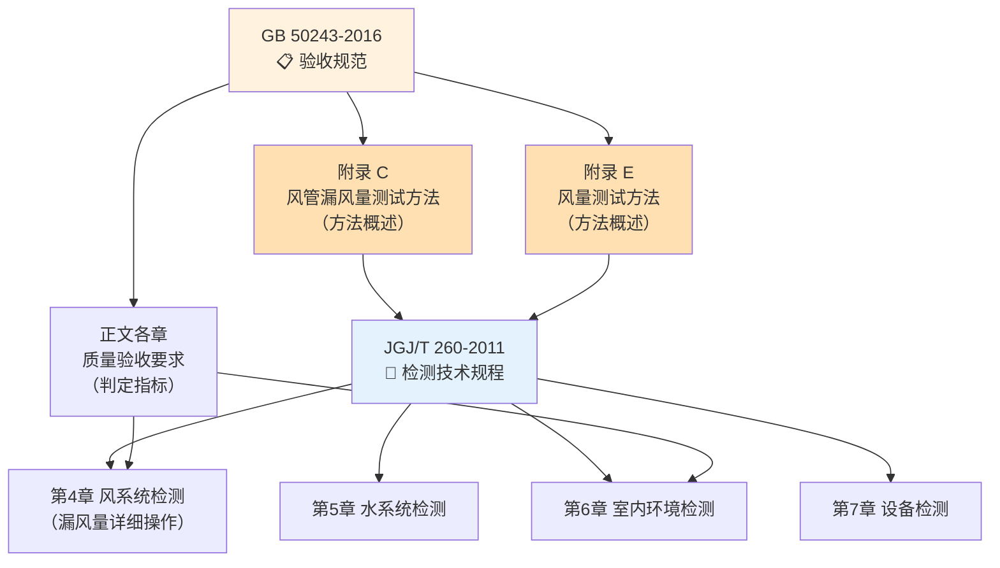
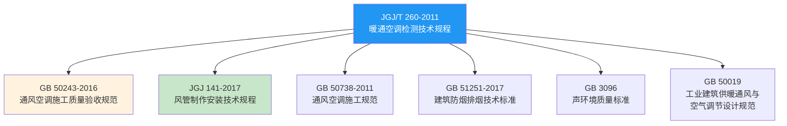

# 第1章 总则

第 1 章是 JGJ/T 260-2011 的**纲领性章节**，明确了本检测技术规程的编制目的、适用范围，以及本规程与验收规范 GB 50243 附录 C/E 之间的承接关系——检测规程是验收规范中测试方法的**具体实施指南**。

---

## 1.1 规程目的

JGJ/T 260-2011《采暖通风与空气调节工程检测技术规程》制定的核心目的包括：

| 序号 | 目的 | 说明 |
|:----:|------|------|
| 1 | **统一检测方法** | 规范暖通空调工程在施工过程、调试阶段和竣工验收阶段的各类检测项目的操作方法、仪器选用和数据记录 |
| 2 | **保证检测数据可靠性** | 通过规定仪器精度、检测条件、操作步骤和数据处理方法，确保检测结果的准确性、可重复性和可比性 |
| 3 | **提供判定依据** | 为 GB 50243 中的质量验收指标（漏风量、风量偏差、温湿度偏差、噪声等）提供具体的量测手段和判定方法 |
| 4 | **推动检测技术进步** | 将先进检测技术（如超声波流量计、红外热像仪、数字式微压计等）纳入规程，提升工程检测的科学性 |
| 5 | **保障室内环境品质** | 通过系统检测确保暖通空调系统的实际运行效果达到设计要求，保证室内热舒适、空气品质和声环境 |

> [!abstract] 一句话概括
> JGJ/T 260 解决的是暖通空调系统 **"怎么测、怎么判"** 的问题——它是 GB 50243 验收规范的**检测方法实施细则**。

---

## 1.2 适用范围

### 1.2.1 工程范围

JGJ/T 260-2011 适用于**民用建筑**中下列采暖、通风与空气调节工程的检测：

| 适用工程类型 | 典型检测内容 |
|-------------|:----------|
| **集中供暖系统** | 室内温度、供回水温度、水力平衡、锅炉/换热站参数 |
| **舒适性空调系统** | 温湿度、风速、风量平衡、噪声、系统能耗 |
| **通风系统** | 风量、风压、风机性能、风管漏风量 |
| **防排烟系统** | 风管漏风量（高压密封）、风机性能、风口风速 |
| **洁净空调系统** | 洁净度、风量、压差、温湿度、噪声 |
| **制冷/热泵系统** | 制冷（热）量、COP/EER、冷冻水/冷却水温度与流量 |

### 1.2.2 检测阶段覆盖

| 阶段 | 检测重点 |
|:----:|----------|
| **施工过程检测** | 材料进场复验、风管漏风量抽检、管道水压试验、设备开箱检验 |
| **单机试运转检测** | 风机转速/电流/温升、水泵扬程/流量、空调机组性能 |
| **系统调试检测** | 风量平衡、水力平衡、室内环境参数、噪声 |
| **竣工验收检测** | 系统总风量、漏风量终检、室内环境终检、能效参数 |

### 1.2.3 不适用范围

> [!note] 不适用
> 本规程不适用于：① 工业通风除尘系统的专项检测（参照相关行业标准）；② 实验室级别的精密检测；③ 空气污染物浓度检测（参照 GB/T 18883 等室内空气质量标准）。

---

## 1.3 与 GB 50243-2016 附录 C/E 的关系

> [!important] ⭐ 核心关系
> JGJ/T 260-2011 是 GB 50243-2016《通风与空调工程施工质量验收规范》中**附录 C（风管漏风量测试方法）**和**附录 E（通风空调系统风量测试方法）**的细化与扩展，形成了"验收要求 → 检测方法"的**二层体系**。

### 1.3.1 二层体系对照

### 1.3.2 分工层次

| 层级 | 标准/附录 | 内容 | 粒度 |
|:----:|----------|------|:----:|
| **第1层：要求层** | GB 50243 正文各章 | 各项目的**质量指标**和**合格判定标准** | 粗 — "允许漏风量 ≤ ..." |
| **第2层：方法概述层** | GB 50243 附录 C / E | 测试方法的**基本原理**和**主要步骤** | 中 — "采用孔板流量计..." |
| **第3层：操作细则层** | JGJ/T 260-2011 | 检测的**完整操作流程**、仪器精度要求、数据处理公式、判定依据 | 细 — 仪器精度 ±1.5%、测试前阀门全开、每种方法的详细步骤 |

### 1.3.3 具体承接关系

| GB 50243 内容 | JGJ/T 260 对应章节 | 承接说明 |
|:------------|:------------------|:------|
| 附录 C — 风管漏风量测试 | **第4章 风系统检测** | JGJ/T 260 详细规定了漏光法和漏风量法的仪器清单、操作步骤（含步骤编号）、漏风量计算公式中每个系数的查表方法、测试装置连接图 |
| 附录 E — 风量测试 | **第4章 风系统检测** | JGJ/T 260 补充了风口风量罩法、毕托管断面法的详细操作，以及风量平衡的判定标准（偏差 ≤ 15%） |
| 正文第 6 章 — 水系统 | **第5章 水系统检测** | JGJ/T 260 细化了水压试验的加压程序、水力平衡的调节步骤、流量测定仪表的选择 |
| 正文第 8 章 — 系统调试 | **第6章 室内环境检测** | JGJ/T 260 规定了温湿度测点布置规则、噪声测点高度（1.2m）和距墙距离（≥ 1m）、照度测点网格尺寸 |
| 正文第 7 章 — 设备安装 | **第7章 设备检测** | JGJ/T 260 补充了风机、水泵、空调机组的性能检测方法和判定标准 |

> [!tip] 使用建议
> 在工程检测实践中，**先查 GB 50243 找"合格标准是什么"**，**再查 JGJ/T 260 找"怎么测才能证明合格"**。二者配合使用才能形成完整的质量验证闭环。

---

## 1.4 与其他标准的引用关系

| 引用标准 | 关系说明 |
|----------|----------|
| **GB 50243-2016** | 🔗 **直接配套**：JGJ/T 260 的检测结果为 GB 50243 的质量判定提供数据依据 |
| **JGJ 141-2017** | 风管技术规程，JGJ/T 260 的漏风量检测方法直接验证 JGJ 141 密封等级的达标情况 |
| **GB 50738-2011** | 施工规范，提供检测所需的施工过程背景信息 |
| **GB 51251-2017** | 防排烟标准，防排烟系统风管的特殊检测要求（高压密封 D 级） |
| **GB 3096** | 声环境质量标准，暖通空调系统噪声检测的参照基准 |
| **GB 50019** | 采暖通风设计规范，检测参数的"设计值"来源 |

---

## 🔗 相关链接

- **风系统检测操作** → 第4章 风系统检测
- **水系统检测操作** → 第5章 水系统检测
- **室内环境检测操作** → 第6章 室内环境检测
- **设备检测操作** → 第7章 设备检测
- **验收规范配合** → GB50243-2016 第3章 基本规定
- **风管密封等级** → JGJ141-2017 第3章 基本规定
- **风管严密性检测对照** → JGJ141-2017 第9章 检验与验收

← 返回 JGJT260-2011-章节索引|JGJ/T 260-2011 章节索引
