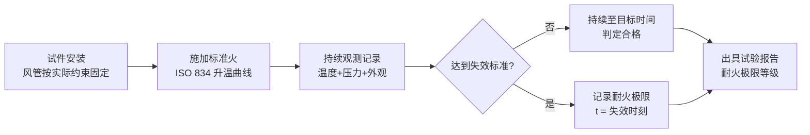
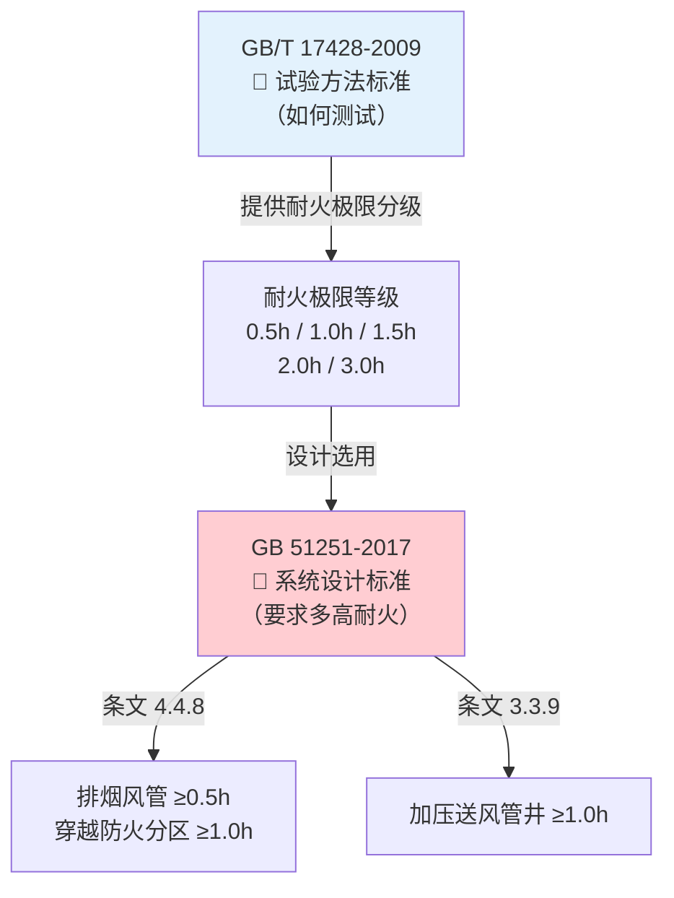

# 第1章 范围

> [!important] 章节定位
> 第1章界定了 GB/T 17428-2009 的**适用边界**——明确本标准的试验对象、适用场景、不适用范围，以及与相关标准之间的调用关系。风管耐火性能试验的策划和委托均须以本章的适用范围为基准。

---

## 一、标准适用范围

### 1.1 适用管道类型

| 管道类型 | 适用性 | 说明 |
|----------|:------:|------|
| **水平通风管道** | ✅ 适用（主体） | 本标准的核心试验对象——水平布置的通风管道。包括直管段、弯头、三通、变径等典型构件 |
| **垂直通风管道** | ✅ 参照执行 | 垂直布置的通风管道（竖井内风管、管道井内风管等）**参照**本标准的试验方法和判定准则执行，必要时可调整约束条件和加载方式 |

### 1.2 适用风管材质

| 风管材质 | 适用性 | 说明 |
|----------|:------:|------|
| **金属风管** | ✅ 适用 | 镀锌钢板风管、不锈钢风管等 |
| **非金属风管** | ✅ 适用 | 玻璃钢（FRP）风管、无机玻璃钢风管、酚醛风管等 |
| **复合材料风管** | ✅ 适用 | 铝箔复合风管、玻纤复合风管、聚氨酯复合风管等 |
| **防火板包裹风管** | ✅ 适用 | 金属风管外敷防火板/硅酸钙板/岩棉板构成的复合耐火风管 |
| **成品耐火风管** | ✅ 适用 | 工厂预制的整体式耐火风管系统 |
| **柔性风管** | ⚠️ 有特殊要求 | 柔性风管的约束和支撑方式需参照实际安装条件单独规定 |

> [!note] 标准的技术中立原则
> 本试验方法标准**不限定风管材质和制造工艺**，仅规定统一的火作用条件和判定准则。任何材质的风管，只要通过本标准规定的试验程序并满足判定准则，即可宣称具有相应等级的耐火极限。这保证了不同材质风管之间**耐火性能比对具有客观统一的基础**。

### 1.3 适用火灾条件

本标准采用**标准火暴露条件**，即 ISO 834 规定的标准时间-温度曲线：

$$T - T_0 = 345 \cdot \lg(8t + 1)$$

式中：
- $T$ — 炉内平均温度（°C）
- $T_0$ — 初始环境温度（°C）
- $t$ — 试验持续时间（min）

> 该升温曲线模拟的是**纤维素类火灾（普通建筑火灾）** 的温度发展过程，不代表烃类火灾、隧道火灾等特殊火灾场景。

### 1.4 适用评价指标

本标准通过统一试验程序评价风管在火灾条件下的三项核心性能：

| 评价指标 | 英文 | 含义 |
|----------|------|------|
| **完整性** | Integrity | 风管阻止火焰和热气体穿透的能力 |
| **隔热性** | Insulation | 风管限制背火面温度升高的能力 |
| **承载能力** | Load-bearing Capacity | 风管在高温下维持结构稳定、不垮塌的能力（适用于有承重要求的特定工况） |

---

## 二、不适用范围

| 排除项 | 原因/替代标准 |
|--------|---------------|
| 🚫 **非通风管道（如烟囱、排油烟管道）** | 结构形式和使用工况显著不同，另有专用标准 |
| 🚫 **仅用于空调送风（无防火要求）的管道** | 无耐火要求则不需执行本标准 |
| 🚫 **地下矿井通风管道** | 火灾场景特殊（甲烷/煤尘爆炸），参照矿业安全标准 |
| 🚫 **船舶/海上平台的通风管道** | 适用 SOLAS 公约和船级社规范，非建筑领域 |
| 🚫 **核设施通风管道** | 需同时满足耐辐照、抗震等特殊要求 |
| 🚫 **管道连接处的防火封堵** | 防火封堵（穿墙/穿楼板处）参照 GB 23864 等封堵材料标准单独评价 |
| 🚫 **风管支吊架的耐火性能** | 支吊架作为独立构件，其耐火性能应单独评价，但支吊架不得先于风管失效 |

---

## 三、试验方法概要

### 3.1 试验基本原理

### 3.2 两种火作用模式（管道A / 管道B）

| 模式 | 受火位置 | 模拟火灾场景 |
|:----:|----------|--------------|
| **管道 A** | 风管**外部**受火 | 火灾发生在风管所处的空间（走道/竖井/吊顶内），火焰从外部加热风管。模拟：排烟风管在着火走道中被外部火焰包围的场景 |
| **管道 B** | 风管**内部**受火 | 火灾烟气通过风管内部蔓延传播。模拟：排烟风管内部通过高温烟气的场景 |

> [!tip] 工程选型参考
> - **排烟风管**通常需同时满足**管道A + 管道B**两种模式的耐火要求
> - **加压送风管**（管井内）主要关注**管道B**模式（内部正压热气流）
> - 穿越防火分区的风管必须通过**管道A**模式试验（承受外部火灾考验）

### 3.3 判定逻辑概要

| 判定维度 | 判定工具/阈值 | 失效条件 |
|----------|:------------:|----------|
| 完整性 | 棉垫（100×100×20mm） | 放置于裂缝处 30s 被点燃 |
| 完整性 | 缝隙探棒 φ6mm / φ25mm | φ6mm探棒穿透并可沿裂缝移动 ≥150mm；或 φ25mm 探棒穿透 |
| 完整性 | 肉眼观察 | 背火面出现持续 ≥ **10秒** 的火焰 |
| 隔热性 | 背火面热电偶 | 平均温升 > **140°C** |
| 隔热性 | 背火面热电偶 | 最高温升 > **180°C** |

---

## 四、与 GB 51251 的引用关系

GB 51251-2017 第 4.4.8 条明确要求排烟管道耐火极限的判定**必须以 GB/T 17428-2009 的试验结果为依据**，并同时满足完整性和隔热性两项指标。

---

## 🔗 相关页面

- 📖 术语定义（管道A/B、完整性、隔热性）→ [第3章 术语与定义](/knowledge/pipe-fitting-spec/第3章-术语与定义/)
- 📚 引用标准清单 → [第2章 规范性引用文件](/knowledge/pipe-fitting-spec/第2章-规范性引用文件/)
- 🔥 防排烟系统设计 → GB51251-2017 建筑防烟排烟系统技术标准
- 🏗️ 建筑防火母规范 → GB50016-2014 建筑设计防火规范(2018版)
- 📑 章节总览 → GBT17428-2009-章节索引|GBT17428-2009 章节索引
- 📋 标准总览 → [中国标准索引](/knowledge/pipe-fitting-spec/中国标准索引/)

---

← 返回 GBT17428-2009-章节索引|GBT17428-2009 章节索引
