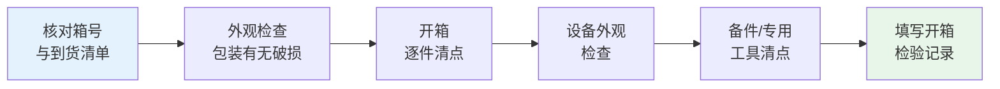

# 第2章 施工准备

> [!important] 章节定位
> 第2章是设备安装工程的**前置环节**，涵盖技术文件准备、设备开箱检验、基础验收三项核心工作。基础验收不合格则整个安装工程不合格——是强制性控制节点。

---

## 一、技术文件准备

### 1.1 必备技术文件

施工前必须备齐以下文件：

| 文件类型 | 内容要求 | 备注 |
|----------|----------|------|
| **设备安装图** | 平面布置图、剖面图、基础图、管道接口图 | 设计院出具 |
| **设备使用说明书** | 含安装说明、技术参数、维护要求 | 设备制造商提供 |
| **设备出厂合格证** | 铭牌参数与合格证一致 | 质量追溯依据 |
| **基础施工图** | 基础尺寸、预留孔洞、预埋件位置 | 土建接口 |
| **施工组织设计** | 安装方案、人员安排、进度计划 | 施工单位编制 |
| **相关标准规范** | GB 50231 + 专项设备安装规范 | 验收依据 |

### 1.2 技术交底

> [!quote] 技术交底要点
> - 施工人员必须熟悉设备图纸和技术要求
> - 各工种之间须进行**工序交底**（土建→安装→电气→调试）
> - 关键工序（吊装、找正、试运转）须编制专项施工方案
> - 对特殊环境（高温、潮湿、洁净）须有针对性措施

---

## 二、设备开箱检查

### 2.1 开箱检查流程

### 2.2 检查项目与标准

| 检查项目 | 检查内容 | 判定标准 |
|----------|----------|:--------:|
| **箱体外观** | 包装箱有无碰撞、水浸、破损痕迹 | 无严重损伤 |
| **设备外观** | 表面有无锈蚀、损伤、变形 | 无可见缺陷 |
| **铭牌核对** | 型号、规格、出厂编号与合同/合格证一致 | 完全一致 |
| **随机文件** | 说明书、合格证、图纸、装箱单 | 齐全无缺 |
| **备品备件** | 按装箱单清点备件、专用工具 | 数量匹配 |
| **加工面防锈** | 机械加工面防锈涂层是否完好 | 涂层完整 |
| **管口封堵** | 设备各管口有无封堵 | 封堵严密 |

### 2.3 开箱记录要求

> [!warning] 开箱注意事项
> - 开箱必须由**建设单位、监理单位、施工单位**三方共同参加
> - 发现问题当场拍照取证，填写《设备开箱检验记录》，三方签字确认
> - 暂不安装的设备零部件须**原箱封存**，精密部件放入恒温库房
> - 开箱后的防护包装不得随意丢弃，以便施工过程中保护设备

---

## 三、基础验收

### 3.1 基础移交条件

| 条件 | 要求 |
|------|------|
| **混凝土强度** | 达到设计强度的 75% 以上（一般养护 ≥7天） |
| **外观检查** | 基础表面平整，无蜂窝、麻面、裂纹、露筋 |
| **预留孔洞** | 位置、尺寸、深度符合设计，孔内清洁无杂物 |
| **预埋件** | 预埋钢板、地脚螺栓套管的规格、位置正确 |
| **基准点** | 基础的纵横中心线、标高基准点已标识清晰 |

### 3.2 基础尺寸允许偏差（核心表格）

| 项目 | 允许偏差 | 检测方法 |
|------|:--------:|----------|
| **坐标位置**（纵、横轴线） | ±20mm | 钢卷尺/经纬仪 |
| **不同平面的标高** | 0, −20mm | 水准仪 |
| **平面水平度**（每米） | 5mm | 水平尺 |
| **平面水平度**（全长） | 10mm | 水准仪/平尺 |
| **垂直度**（每米） | 5mm | 吊线/经纬仪 |
| **垂直度**（全高） | 10mm | 吊线/经纬仪 |
| **预埋地脚螺栓孔中心位置** | ±10mm | 钢卷尺 |
| **预埋地脚螺栓孔深度** | +20mm, 0 | 钢卷尺 |
| **预埋地脚螺栓孔孔壁垂直度** | 10mm | 吊线/直角尺 |
| **预埋地脚螺栓标高**（顶部） | +20mm, 0 | 水准仪 |
| **预埋地脚螺栓中心距** | ±2mm | 钢卷尺 |
| **预埋活动地脚螺栓锚板**标高 | +20mm, 0 | 水准仪 |
| **预埋活动地脚螺栓锚板**中心位置 | ±5mm | 钢卷尺 |
| **预埋活动地脚螺栓锚板**水平度（带槽） | 5/1000 | 水平尺 |
| **预埋活动地脚螺栓锚板**水平度（带螺纹孔） | 2/1000 | 水平尺 |

### 3.3 基础处理

| 处理项目 | 方法 | 要求 |
|----------|------|------|
| **基础表面凿毛** | 配合比 >1:2 的混凝土基础须凿毛 | 凿毛面积 ≥ 50%，麻点深度 ≥5mm |
| **地脚螺栓孔清理** | 清除孔内杂物、积水 | 孔内干燥清洁 |
| **基准线放设** | 按设计图放出纵横中心线、标高点 | 墨线清晰，冲眼标记 |
| **垫铁位置处理** | 放置垫铁处铲平或研磨 | 接触面积 ≥ 75%，水平度 ≤ 1/1000 |

> [!warning] 基础验收不合格处理
> 基础验收不合格不得进行设备安装。常见缺陷处理：
> - **标高偏差**：凿低或垫高（垫层厚度 ≤50mm）
> - **中心线偏差**：如不影响设备安装可使用，但须设计确认
> - **混凝土强度不足**：返工或加固，须设计单位出具方案

---

## 🔗 相关页面

- 基础验收合格后 → [第3章 设备就位与找正调平](/knowledge/pipe-fitting-spec/第3章-设备就位与找正调平/)
- 风机设备开箱特需注意项 → [第6章 风机安装](/knowledge/pipe-fitting-spec/第6章-风机安装/)
- 泵类设备基础特殊要求 → [第7章 泵类设备安装](/knowledge/pipe-fitting-spec/第7章-泵类设备安装/)
- 质量验收依据 → [GB50243-2016 通风与空调工程施工质量验收规范](/knowledge/pipe-fitting-spec/gb50243-2016-通风与空调工程施工质量验收规范/)

---

← 返回 GB50231-2009-章节索引|GB50231-2009 章节索引
