# 第2章 术语

第 2 章定义了 JGJ/T 260-2011 使用的**核心检测专业术语**，涵盖风系统检测、水系统检测、室内环境检测和设备检测四大领域。每个术语均给出英文对应词、定义和检测应用说明。

---

## 2.1 风系统检测术语

### 2.1.1 漏风量 (Air Leakage Rate)

| 属性 | 内容 |
|------|------|
| **定义** | 在规定试验压力下，单位时间内从风管系统（含风管本体、法兰接头、配件及设备接口处）泄漏到周围环境中的空气体积量 |
| **英文** | Air Leakage Rate |
| **单位** | m³/h（总漏风量）或 m³/(h·m²)（单位表面积漏风量） |
| **影响因素** | 风管咬口质量、法兰垫片密封效果、风管壁面完整性、密封等级 |
| **检测方法** | 漏风量法（定量）：风机 + 孔板/喷嘴流量计 + 差压计 |
| **详见** | [第4章 风系统检测](/knowledge/pipe-fitting-spec/第4章-风系统检测/)#4.1.3 漏风量法 |

### 2.1.2 漏光法 (Light Leakage Detection)

| 属性 | 内容 |
|------|------|
| **定义** | 在黑暗环境中将光源置于风管内部，从外部目视检查接缝处是否有可见光线透过的定性风管严密性检测方法 |
| **英文** | Light Leakage Detection |
| **适用范围** | 低压风管（工作压力 ≤ 500Pa）的快速严密性初检 |
| **合格标准** | 每 10m 接缝漏光点 ≤ 2 处，每处漏光长度 ≤ 5cm |
| **特点** | 快速、低成本、定性判断，不能给出漏风量的定量数据 |
| **详见** | [第4章 风系统检测](/knowledge/pipe-fitting-spec/第4章-风系统检测/)#4.1.2 漏光法 |

### 2.1.3 风量平衡 (Air Balancing)

| 属性 | 内容 |
|------|------|
| **定义** | 通过调节各分支风管的风阀开度，使系统各末端风口的实际送风（排风）量与设计风量趋于一致的过程及检测验证 |
| **英文** | Air Balancing |
| **检测指标** | 风口实测风量与设计风量偏差 ≤ 15%（一般系统），≤ 10%（洁净系统） |
| **检测仪表** | 风量罩（推荐）或风速仪 × 风口面积 |
| **详见** | [第4章 风系统检测](/knowledge/pipe-fitting-spec/第4章-风系统检测/)#4.2 风量平衡检测 |

### 2.1.4 风压 (Air Pressure)

| 属性 | 内容 |
|------|------|
| **定义** | 风管内空气相对于环境大气的压差，包括静压（垂直作用于管壁）、动压（速度头）和全压（静压 + 动压） |
| **英文** | Air Pressure |
| **检测仪表** | 毕托管 + 微压计（精度 ±0.5Pa），或数字式微压计 |
| **检测内容** | 风机全压（进出口差压）、风管沿程静压、末端风口余压 |
| **详见** | [第4章 风系统检测](/knowledge/pipe-fitting-spec/第4章-风系统检测/)#4.3 风压检测 |

### 2.1.5 孔板流量计 (Orifice Flowmeter)

| 属性 | 内容 |
|------|------|
| **定义** | 利用流体通过节流孔板时产生的差压与流量之间的特定关系来测量气体流量的装置，是漏风量检测的核心仪表 |
| **英文** | Orifice Flowmeter / Orifice Plate |
| **原理** | $Q \propto \sqrt{\Delta P}$（差压的平方根与流量成正比） |
| **构成** | 孔板（标准孔径）、取压环、差压变送器/微压计 |
| **详见** | [第4章 风系统检测](/knowledge/pipe-fitting-spec/第4章-风系统检测/)#4.1.3 漏风量法 |

---

## 2.2 水系统检测术语

### 2.2.1 水力平衡 (Hydraulic Balancing)

| 属性 | 内容 |
|------|------|
| **定义** | 通过调节各并联环路的水阀开度，使空调水系统各分支环路的实际流量与设计流量一致，消除"近热远冷"等水力失调现象的过程及检测验证 |
| **英文** | Hydraulic Balancing |
| **检测仪表** | 超声波流量计 / 电磁流量计 / 平衡阀自带测压接头 + 差压计 |
| **判定指标** | 各环路实测流量与设计流量偏差 ≤ 10% |
| **详见** | [第5章 水系统检测](/knowledge/pipe-fitting-spec/第5章-水系统检测/) |

### 2.2.2 水压试验 (Hydrostatic Pressure Test)

| 属性 | 内容 |
|------|------|
| **定义** | 对空调水系统管道充水并加压至规定试验压力（通常为工作压力的 1.5 倍），以验证管道及其连接部位强度和严密性的检测方法 |
| **英文** | Hydrostatic Pressure Test |
| **试验压力** | 1.5 倍工作压力，且不低于 0.6 MPa |
| **合格标准** | 稳压 ≥ 10min，压力降 ≤ 0.02 MPa，且管道各连接处无渗漏 |
| **详见** | [第5章 水系统检测](/knowledge/pipe-fitting-spec/第5章-水系统检测/) |

### 2.2.3 水流量 (Water Flow Rate)

| 属性 | 内容 |
|------|------|
| **定义** | 单位时间内通过管道某一截面的水体积，是评估冷冻水/冷却水/热水输配系统性能的基础参数 |
| **英文** | Water Flow Rate |
| **单位** | m³/h 或 L/s |
| **检测仪表** | 超声波流量计（管外夹装，不破坏管道）、电磁流量计、涡轮流量计 |
| **详见** | [第5章 水系统检测](/knowledge/pipe-fitting-spec/第5章-水系统检测/) |

---

## 2.3 室内环境检测术语

### 2.3.1 室内环境 (Indoor Environment)

| 属性 | 内容 |
|------|------|
| **定义** | 建筑室内影响人体舒适、健康和工作效率的物理环境要素的总和，在暖通空调检测中主要指**热环境**（温度、湿度、风速）和**声环境**（噪声） |
| **英文** | Indoor Environment |
| **检测参数** | 干球温度、相对湿度、空气流速（风速）、A 声级噪声、照度 |
| **详见** | [第6章 室内环境检测](/knowledge/pipe-fitting-spec/第6章-室内环境检测/) |

### 2.3.2 A 声级 (A-weighted Sound Level)

| 属性 | 内容 |
|------|------|
| **定义** | 经过 A 计权网络滤波后的声压级，模拟人耳对不同频率声音的敏感度差异（人耳对 1000~4000Hz 最敏感→加权系数大；低频不敏感→加权系数小），是暖通空调系统噪声评价最常用的指标 |
| **英文** | A-weighted Sound Level |
| **单位** | dB(A) |
| **检测仪表** | 精密声级计（符合 GB/T 3785.1 I 型或 II 型） |
| **测点高度** | 距地面 1.2m（坐姿人耳高度）/ 1.5m（站姿） |
| **测点距墙** | ≥ 1.0m，距窗 ≥ 1.5m |
| **详见** | [第6章 室内环境检测](/knowledge/pipe-fitting-spec/第6章-室内环境检测/) |

### 2.3.3 热舒适 (Thermal Comfort)

| 属性 | 内容 |
|------|------|
| **定义** | 人对周围热环境感到满意的心理状态，是温度、湿度、风速、平均辐射温度、人体代谢率和服装热阻的综合作用结果 |
| **英文** | Thermal Comfort |
| **评价指标** | PMV（预测平均投票值）、PPD（预测不满意百分比），按 ISO 7730 / GB/T 18049 |
| **现场简化检测** | 温度 ±1°C、相对湿度 ±5%、风速 ≤ 0.25 m/s（舒适性空调） |
| **详见** | [第6章 室内环境检测](/knowledge/pipe-fitting-spec/第6章-室内环境检测/) |

### 2.3.4 预测平均投票值 PMV (Predicted Mean Vote)

| 属性 | 内容 |
|------|------|
| **定义** | 根据人体热平衡方程，预测大量人群对给定热环境的平均热感觉投票值，标度从 -3（冷）到 +3（热），0 为中性舒适 |
| **英文** | Predicted Mean Vote (PMV) |
| **推荐范围** | ISO 7730 推荐 -0.5 ≤ PMV ≤ +0.5 |
| **对应 PPD** | PMV = 0 → PPD = 5%（仍有 5% 的人不满意） |

### 2.3.5 风速 (Air Velocity)

| 属性 | 内容 |
|------|------|
| **定义** | 室内空气流动的速度，是影响人体热舒适（吹风感）和空调气流组织效果的重要参数 |
| **英文** | Air Velocity |
| **单位** | m/s |
| **检测仪表** | 热球风速仪（低风速 0.05~5 m/s）、叶轮风速仪（中高风速 0.5~30 m/s）、热线风速仪（高精度） |
| **舒适性空调要求** | 人员活动区风速夏季 ≤ 0.30 m/s，冬季 ≤ 0.20 m/s |
| **详见** | [第6章 室内环境检测](/knowledge/pipe-fitting-spec/第6章-室内环境检测/) |

### 2.3.6 照度 (Illuminance)

| 属性 | 内容 |
|------|------|
| **定义** | 单位面积上接收到的光通量，是衡量室内光环境的定量指标 |
| **英文** | Illuminance |
| **单位** | lx（勒克斯） |
| **检测仪表** | 照度计（精度 ±5%） |
| **测点网格** | ≤ 10m² 的房间测 5 点（四角 + 中心），> 10m² 按 1~2m 间距网格布点 |
| **详见** | [第6章 室内环境检测](/knowledge/pipe-fitting-spec/第6章-室内环境检测/) |

---

## 2.4 设备检测术语

### 2.4.1 风机性能检测 (Fan Performance Test)

| 属性 | 内容 |
|------|------|
| **定义** | 对风机在系统实际工况下的风量、全压、转速、轴功率和效率等参数进行现场测定，以验证其是否满足设计要求的检测 |
| **英文** | Fan Performance Test |
| **检测参数** | 风量、全压、转速 (r/min)、电机电流 (A)、轴承温度 (°C)、振动速度 (mm/s) |
| **判定标准** | 风量/全压 ≥ 90% 设计值；轴承温度 ≤ 80°C（滚动轴承） |
| **详见** | [第7章 设备检测](/knowledge/pipe-fitting-spec/第7章-设备检测/) |

### 2.4.2 水泵性能检测 (Pump Performance Test)

| 属性 | 内容 |
|------|------|
| **定义** | 对水泵在系统实际工况下的流量、扬程、转速和轴功率进行现场测定，验证其运行工况点是否在高效区内的检测 |
| **英文** | Pump Performance Test |
| **检测参数** | 流量 (m³/h)、扬程 (m H₂O)、转速 (r/min)、电机电流 (A) |
| **判定标准** | 流量/扬程 ≥ 90% 设计值 |
| **详见** | [第7章 设备检测](/knowledge/pipe-fitting-spec/第7章-设备检测/) |

### 2.4.3 空调机组性能检测 (AHU Performance Test)

| 属性 | 内容 |
|------|------|
| **定义** | 对组合式空调机组（AHU）在系统实际运行工况下的送风量、机外余压、供冷（热）量等性能参数进行现场检测 |
| **英文** | Air Handling Unit (AHU) Performance Test |
| **检测参数** | 送风量、机外余压、进出风温湿度（计算供冷/热量）、过滤器阻力 |
| **判定标准** | 风量 ≥ 90% 额定值；供冷/热量 ≥ 90% 额定值 |
| **详见** | [第7章 设备检测](/knowledge/pipe-fitting-spec/第7章-设备检测/) |

### 2.4.4 轴承温度 (Bearing Temperature)

| 属性 | 内容 |
|------|------|
| **定义** | 风机、水泵等旋转机械的轴承在稳定运行状态下的工作温度，是判断设备安装质量和运行状态的重要指标 |
| **英文** | Bearing Temperature |
| **检测仪表** | 红外测温仪（非接触）/ 热电偶温度计 / 设备自带测温元件 |
| **合格标准** | 滚动轴承 ≤ 80°C；滑动轴承 ≤ 65°C |
| **详见** | [第7章 设备检测](/knowledge/pipe-fitting-spec/第7章-设备检测/) |

---

## 2.5 通用检测术语

### 2.5.1 检测条件 (Test Conditions)

| 属性 | 内容 |
|------|------|
| **定义** | 为保证检测结果准确性和可比性，对被检系统和环境状态所规定的先决条件和操作要求 |
| **英文** | Test Conditions |
| **基本要求** | 风管阀门全开、空调系统连续运行 ≥ 2h、室外风速 < 3 级、室内照明正常开启 |
| **详见** | [第3章 基本规定](/knowledge/pipe-fitting-spec/第3章-基本规定/)#3.3 检测条件 |

### 2.5.2 检测仪器精度 (Instrument Accuracy)

| 属性 | 内容 |
|------|------|
| **定义** | 检测仪器在规定的使用条件下，其测量结果与被测量真值之间的一致程度，通常以最大允许误差或精度等级表示 |
| **英文** | Instrument Accuracy / Measurement Accuracy |
| **管理要求** | 检测仪器须在校准/检定有效期内使用，精度须满足 JGJ/T 260 各章规定的等级要求 |
| **详见** | [第3章 基本规定](/knowledge/pipe-fitting-spec/第3章-基本规定/)#3.1 检测仪器精度要求 |

### 2.5.3 检测报告 (Test Report)

| 属性 | 内容 |
|------|------|
| **定义** | 记载检测项目、检测方法、检测仪器、检测条件、检测数据和判定结论的正式书面文件，作为工程验收和质量追溯的法定依据 |
| **英文** | Test Report |
| **基本内容** | 工程信息、检测日期、环境条件、仪器清单、检测数据、计算公式、判定结论、检测人员签名 |
| **详见** | [第3章 基本规定](/knowledge/pipe-fitting-spec/第3章-基本规定/)#3.5 检测报告格式 |

---

## 2.6 术语关系图

```mermaid
graph TB
    DETECT["暖通空调检测"] --> AIR["风系统检测"]
    DETECT --> WATER["水系统检测"]
    DETECT --> INDOOR["室内环境检测"]
    DETECT --> EQUIP["设备检测"]

    AIR --> LEAK["漏风量<br/>Air Leakage Rate"]
    AIR --> LIGHT["漏光法<br/>Light Leakage Detection"]
    AIR --> BAL["风量平衡<br/>Air Balancing"]
    AIR --> PRESS["风压<br/>Air Pressure"]

    WATER --> HYDBAL["水力平衡<br/>Hydraulic Balancing"]
    WATER --> HYDRO["水压试验<br/>Hydrostatic Test"]
    WATER --> FLOW["水流量<br/>Water Flow Rate"]

    INDOOR --> THERM["热舒适<br/>Thermal Comfort"]
    INDOOR --> NOISE["A 声级<br/>A-weighted SPL"]
    INDOOR --> VEL["风速<br/>Air Velocity"]
    INDOOR --> LUX["照度<br/>Illuminance"]

    EQUIP --> FAN["风机性能<br/>Fan Performance"]
    EQUIP --> PUMP["水泵性能<br/>Pump Performance"]
    EQUIP --> AHU["空调机组性能<br/>AHU Performance"]

    style DETECT fill:#ff9800,color:#fff
    style AIR fill:#e3f2fd
    style WATER fill:#c8e6c9
    style INDOOR fill:#fff9c4
    style EQUIP fill:#ffcc80
```

---

## 🔗 相关链接

- **风系统检测操作** → [第4章 风系统检测](/knowledge/pipe-fitting-spec/第4章-风系统检测/)
- **水系统检测操作** → [第5章 水系统检测](/knowledge/pipe-fitting-spec/第5章-水系统检测/)
- **室内环境检测操作** → [第6章 室内环境检测](/knowledge/pipe-fitting-spec/第6章-室内环境检测/)
- **设备检测操作** → [第7章 设备检测](/knowledge/pipe-fitting-spec/第7章-设备检测/)
- **检测基本规定** → [第3章 基本规定](/knowledge/pipe-fitting-spec/第3章-基本规定/)
- **风管术语对照** → JGJ141-2017 第2章 术语
- **验收规范对照** → GB50243-2016 第2章 术语

← 返回 JGJT260-2011-章节索引|JGJ/T 260-2011 章节索引
