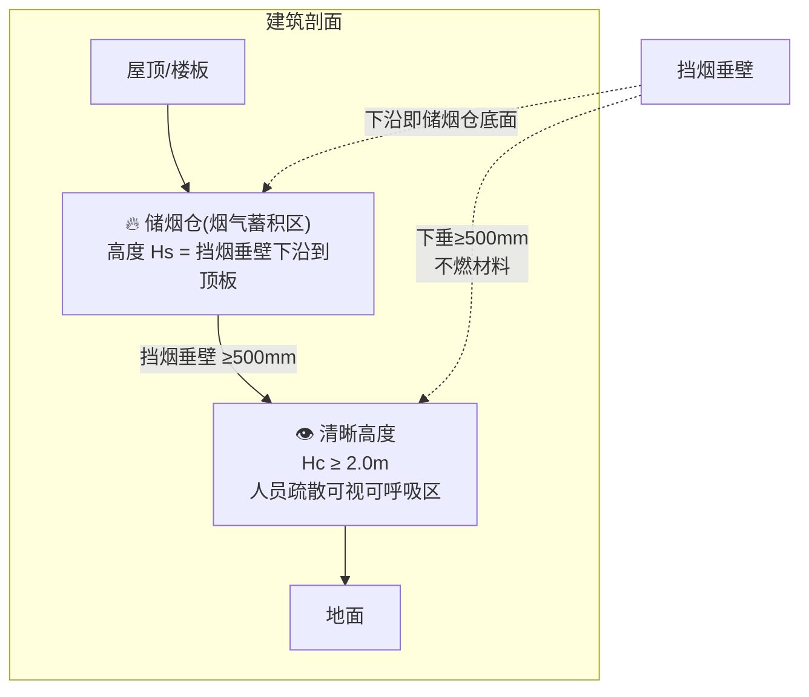
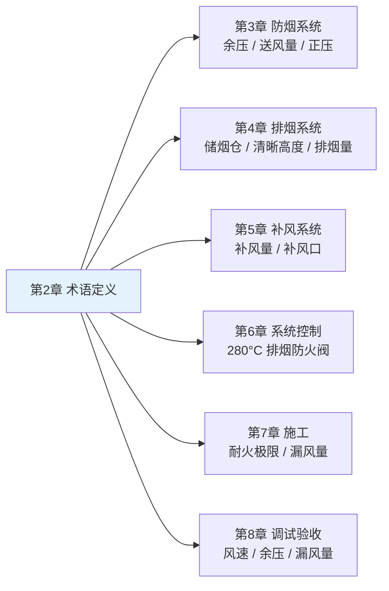

# 第2章 术语与符号

> [!abstract] 本章概要
> GB 51251-2017 第2章定义了建筑防烟排烟系统的**核心术语**和**主要符号**，是理解和正确应用后续所有技术章节的**语言学基础**。本章共定义 **15+ 个关键术语**（含中英文对照）及 A~V 共 **20+ 个**主要符号变量。

---

## 一、核心术语中英文对照表

### 1.1 系统类术语

| 序号 | 中文术语 | 英文术语 | 定义 |
|:----:|----------|----------|------|
| 1 | **防烟系统** | Smoke Control System | 采用**自然通风**或**机械加压送风**方式，防止火灾烟气进入疏散通道和避难场所的系统 |
| 2 | **排烟系统** | Smoke Exhaust System | 采用**自然排烟**或**机械排烟**方式，将火灾产生的烟气排至建筑物外的系统 |
| 3 | **机械加压送风系统** | Mechanical Pressurization System | 利用送风机向疏散通道（楼梯间、前室、避难层等）送入室外空气，使其维持一定**正压**防止烟气侵入的防烟系统 |
| 4 | **自然通风防烟** | Natural Smoke Control | 依靠建筑开口（外窗、通风井等）利用**热压+风压**将烟气排出的防烟方式 |
| 5 | **机械排烟系统** | Mechanical Smoke Exhaust System | 利用排烟风机将火灾产生的烟气通过排烟管道和排烟口排至建筑物外的排烟系统 |
| 6 | **自然排烟** | Natural Smoke Exhaust | 利用火灾时产生的**热压和浮力**，通过可开启外窗或专用排烟口将烟气排至室外的排烟方式 |
| 7 | **补风系统** | Make-up Air System | 在机械排烟时向排烟区域送入新鲜空气的系统，用于维持排烟效果和空气平衡 |

### 1.2 构件与部件类术语

| 序号 | 中文术语 | 英文术语 | 定义 |
|:----:|----------|----------|------|
| 8 | **挡烟垂壁** | Smoke Barrier / Draft Curtain | 用不燃材料制成，从顶棚下垂不小于**500mm**的固定或活动挡烟设施，用于阻挡烟气水平扩散、形成储烟仓 |
| 9 | **储烟仓** | Smoke Reservoir | 位于建筑空间顶部，由挡烟垂壁、梁或墙体围合的**蓄积火灾烟气**的空间区域 |
| 10 | **清晰高度** | Clear Height | 储烟仓下沿至室内地面的垂直距离，即火灾时人员疏散所需的最小可视和可呼吸高度，一般 ≥ 2.0m |
| 11 | **排烟口** | Smoke Exhaust Vent / Outlet | 排烟管道上用于将储烟仓内烟气吸入排烟管道的开口，分为常开型（百叶式）和常闭型（电动/手动开启） |
| 12 | **排烟防火阀** | Combined Fire and Smoke Damper | 安装在机械排烟系统管道上，平时**常开**，火灾烟气温度达到 **280°C** 时自动关闭，并能在一定时间内满足耐火完整性和隔热性要求的阀门 |
| 13 | **送风口** | Pressurization Air Supply Outlet | 机械加压送风系统管道上的送风出口，平时常闭，火灾时自动/手动开启 |

### 1.3 性能参数类术语

| 序号 | 中文术语 | 英文术语 | 定义 |
|:----:|----------|----------|------|
| 14 | **耐火极限** | Fire Resistance Rating | 在标准耐火试验条件下，建筑构件或风管从受火时起，至失去**完整性**或**隔热性**时止的持续时间（h），按 GBT17428-2009 通风管道耐火试验方法\|GB/T 17428 判定 |
| 15 | **漏风量** | Air Leakage Rate | 在规定压力差下，管道系统单位面积（m²）的漏风体积流量（m³/(h·m²)），是风管气密性的核心指标 |
| 16 | **余压** | Residual Pressure | 机械加压送风系统中，防烟区域（前室/楼梯间）与相邻非防烟区域之间的静压差，前室 **≥25Pa**，楼梯间 **≥40~50Pa** |
| 17 | **排烟量** | Smoke Exhaust Rate | 单位时间内机械排烟系统排出的烟气体积流量（m³/h），根据火灾规模、储烟仓高度等参数按附录 A/B 计算确定 |

---

## 二、关键术语的工程含义图解

### 2.1 储烟仓 → 清晰高度 → 挡烟垂壁 三者关系

> [!tip] 设计关联
> 储烟仓高度直接决定**排烟口的最小布置高度**和**排烟量计算**。清晰高度是判定排烟系统是否有效保护人员疏散的**核心安全指标**。

### 2.2 防烟 vs 排烟 系统本质区别

| 对比维度 | 防烟系统 | 排烟系统 |
|----------|----------|----------|
| **作用对象** | 疏散通道（楼梯间/前室/避难层） | 着火房间/走道/中庭 |
| **气流方向** | 向疏散通道**送风**（正压） | 从着火区域**抽风**（负压） |
| **核心目标** | 阻止烟气**进入**疏散通道 | 将烟气**排出**建筑物 |
| **常用方式** | 机械加压送风 / 自然通风 | 机械排烟 / 自然排烟 |
| **关键参数** | 余压（25Pa / 40~50Pa） | 排烟量（m³/h） |

---

## 三、主要符号表

| 符号 | 含义 | 单位 | 涉及章节 |
|:----:|------|:----:|:--------:|
| **A** | 面积（排烟口开口面积/风管截面积/储烟仓面积） | m² | 第4~5章 |
| **A₀** | 单个排烟口面积 | m² | 第4章 |
| **Aᵥ** | 自然排烟口（窗）的有效面积 | m² | 第4章 |
| **B** | 走道宽度 | m | 第4章 |
| **C** | 流量系数 | — | 第4章 |
| **d** | 排烟口当量直径 | m | 第4章 |
| **F** | 加压送风口面积 | m² | 第3章 |
| **H** | 建筑高度 / 空间净高 | m | 第3~4章 |
| **Hc** | 清晰高度 | m | 第4章 |
| **Hs** | 储烟仓高度 | m | 第4章 |
| **L** | 加压送风量 | m³/h | 第3章 |
| **M** | 烟气质量流量 | kg/s | 第4章（附录A） |
| **P** | 压力（风机全压/余压） | Pa | 第3、8章 |
| **ΔP** | 压差（前室与走道之间） | Pa | 第3章 |
| **Q** | 排烟量 / 热量释放速率 | m³/h 或 kW | 第4~5章 |
| **S** | 管道截面积 | m² | 第4、7章 |
| **T** | 温度（烟气温度/环境温度） | °C 或 K | 第4章 |
| **t** | 时间 / 耐火极限 | s 或 h | 第4章（耐火极限） |
| **V** | 风速 / 排烟口处风速 / 加压送风口风速 | m/s | 第3~4、8章 |
| **v** | 流速 | m/s | 第4章 |
| **ρ** | 密度（空气密度/烟气密度） | kg/m³ | 第3~4章 |

---

## 四、术语在条文中的引用路径

> [!important] 术语使用提醒
> 在阅读各章条文时，遇到 **储烟仓、清晰高度、排烟防火阀、余压、漏风量** 等专业术语时，务必回到本章查阅精确定义，避免因术语理解偏差导致设计错误或施工返工。

---

## 🔗 相关页面

- 📑 **章节索引**：GB51251-2017-章节索引
- 🔒 **防烟系统设计**：第3章 防烟系统设计
- 🔥 **排烟系统设计**：第4章 排烟系统设计
- 🔧 **系统施工**：第7章 系统施工
- 🧪 **风管耐火试验方法（GB/T 17428）**：GBT17428-2009 通风管道耐火试验方法
- 📋 **标准总览**：中国标准索引

---

← 返回 GB51251-2017-章节索引|GB51251-2017 章节索引
