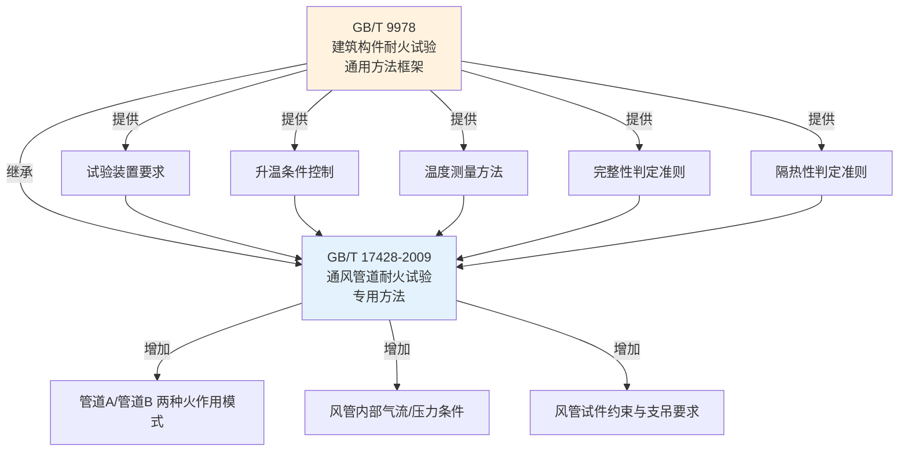
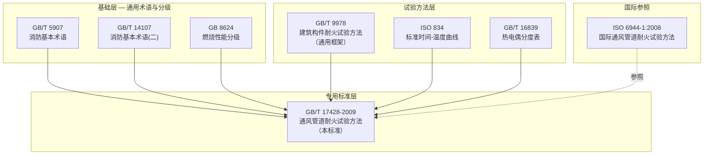

# 第2章 规范性引用文件

> [!important] 章节定位
> 第2章列出了 GB/T 17428-2009 试验程序中**必不可少的规范性引用文件**——这些文件中的条款通过本标准的引用而构成为本标准的条款。理解这些引用文件是正确执行耐火试验的**前提条件**。

---

## 一、核心引用文件总览

| 序号 | 标准编号 | 标准名称 | 在本标准中的用途 | 引用内容 |
|:----:|----------|----------|------------------|----------|
| 1 | **GB/T 9978** | 建筑构件耐火试验方法 | 🔑 **最核心引用**——提供通用的建筑构件耐火试验方法框架 | 试验装置、升温条件、温度测量、完整性/隔热性判定基础准则 |
| 2 | **GB/T 5907** | 消防基本术语 第一部分 | 统一消防术语定义 | 耐火极限、完整性、隔热性等基础概念的通用定义 |
| 3 | **ISO 834** | 耐火试验 — 建筑构件 | 国际对标——提供标准时间-温度曲线 | $T - T_0 = 345 \cdot \lg(8t + 1)$ |
| 4 | GB 8624 | 建筑材料及制品燃烧性能分级 | 风管材料燃烧性能判定 | 材料不燃性/难燃性分级依据 |
| 5 | GB/T 14107 | 消防基本术语 第二部分 | 补充消防术语 | 试验装置、测量术语 |
| 6 | GB/T 16839 | 热电偶 第一部分：分度表 | 温度测量仪器校准 | K型/N型热电偶分度与允差 |
| 7 | ISO 6944-1:2008 | Fire containment — Elements of building construction — Part 1: Ventilation ducts | 国际参照标准 | 通风管道耐火试验的国际化试验方法框架 |

---

## 二、核心引用文件的详细说明

### 2.1 GB/T 9978 — 建筑构件耐火试验方法（最关键引用）

GB/T 9978 是中国建筑构件耐火试验的**通用方法标准**，被几乎所有建筑构件的耐火试验标准引用。GB/T 17428-2009 在以下方面直接依赖 GB/T 9978：

| 引用方面 | GB/T 9978 提供的内容 | 在通风管道试验中的应用 |
|----------|---------------------|------------------------|
| **试验炉** | 耐火试验炉的设计要求、炉内温度均匀性、压力控制 | 管道A模式使用标准耐火试验炉，炉压控制在 20±3 Pa |
| **升温曲线** | ISO 834 标准时间-温度曲线及其控制允差 | 前10min 炉温偏差 ≤±100°C；10min后 ≤±50°C |
| **温度测量** | 炉内热电偶布置、背火面热电偶布置、数据采集间隔 | 炉内 ≥6个热电偶，背火面间距 ≤500mm，采集间隔 ≤1min |
| **完整性判定** | 棉垫试验、缝隙探棒试验、火焰持续时间判定 | 棉垫 100×100×20mm/30s；φ6mm探棒穿透+150mm滑动；φ25mm探棒穿透；火焰≥10s |
| **隔热性判定** | 背火面温升限值 | 平均温升 ≤140°C；最高温升 ≤180°C |

### 2.2 ISO 834 — 标准时间-温度曲线

ISO 834 是国际标准化组织制定的耐火试验基础标准，定义了全球通用的标准升温曲线：

$$T - T_0 = 345 \cdot \lg(8t + 1)$$

**曲线的工程意义**：

| 试验时间 | 炉温（°C） | 说明 |
|:--------:|:----------:|------|
| 0 min | 20 | 初始室温（假设 T₀=20°C） |
| 5 min | 576 | 快速升温阶段——模拟轰燃后火灾 |
| 10 min | 679 | 温度增长速率降低 |
| 30 min | 842 | **0.5h 耐火极限终点** |
| 60 min | 945 | **1.0h 耐火极限终点** |
| 90 min | 1006 | **1.5h 耐火极限终点** |
| 120 min | 1049 | **2.0h 耐火极限终点** |
| 180 min | 1110 | **3.0h 耐火极限终点** |

> [!warning] 曲线适用性限制
> ISO 834 标准升温曲线基于**纤维素类火灾**（木材、纸张等普通可燃物），不适用于烃类火灾（油池火）、隧道火灾（RWS/HC曲线）或石化火灾（喷射火）场景。对于特殊火灾风险建筑，可能需要采用更严苛的升温曲线。

### 2.3 GB/T 5907 — 消防基本术语

GB/T 5907 为消防领域的术语提供统一定义。GB/T 17428-2009 中使用的"耐火极限""完整性""隔热性"等术语的**基础定义**来源于此标准，本标准在此基础上结合通风管道的特点进行了**针对性细化和补充**。

---

## 三、引用文件的使用导图

---

## 四、引用文件与工程实践的关系

| 工程环节 | 涉及引用文件 | 应用场景 |
|----------|:------------:|----------|
| **风管材料选型** | GB 8624 | 确认风管本体及防火包裹材料的燃烧性能等级（A级不燃） |
| **耐火试验委托** | GB/T 9978 + ISO 834 | 第三方检测机构按此组合方法进行试验 |
| **试验报告解读** | GB/T 5907 + GB/T 9978 | 理解试验报告中的术语和判定依据 |
| **产品认证** | GB/T 17428 + GB/T 9978 | CCC认证或自愿性认证的检测依据 |
| **工程验收** | GB 51251 → GB/T 17428 → GB/T 9978 | 通过引用链追溯到最终判定依据 |

---

## 🔗 相关页面

- 📖 术语定义（完整性/隔热性/管道A/B）→ [第3章 术语与定义](/knowledge/pipe-fitting-spec/第3章-术语与定义/)
- 📐 标准适用范围 → [第1章 范围](/knowledge/pipe-fitting-spec/第1章-范围/)
- 🔥 防排烟系统设计 → GB51251-2017 建筑防烟排烟系统技术标准
- 🏗️ 建筑防火规范 → GB50016-2014 建筑设计防火规范(2018版)
- 📑 章节总览 → GBT17428-2009-章节索引|GBT17428-2009 章节索引
- 📋 标准总览 → [中国标准索引](/knowledge/pipe-fitting-spec/中国标准索引/)

---

← 返回 GBT17428-2009-章节索引|GBT17428-2009 章节索引
