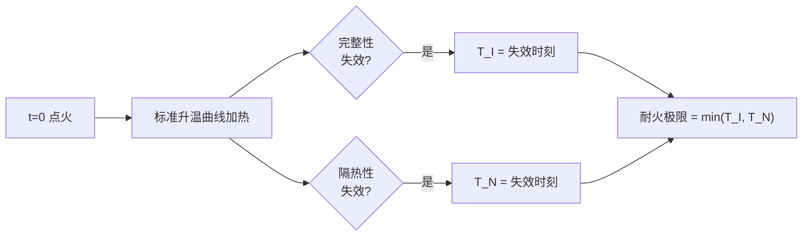
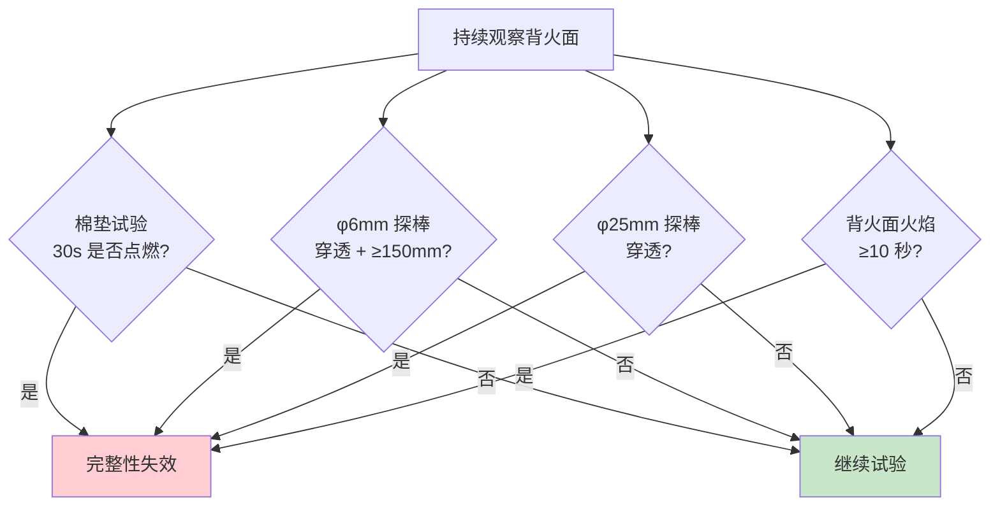
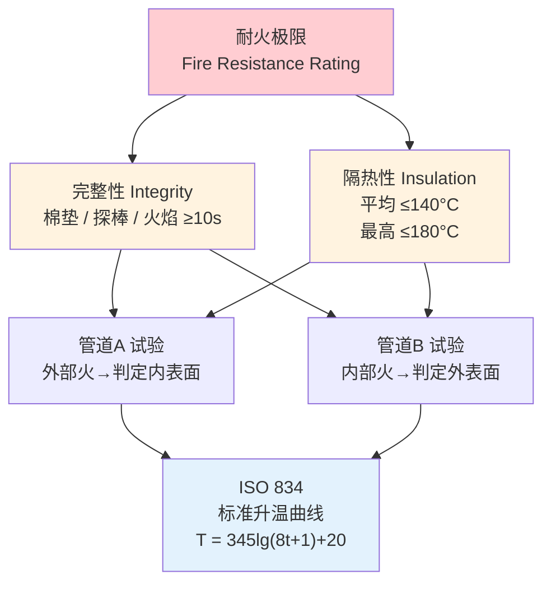

# 第3章 术语与定义

> [!abstract] 本章概要
> GB/T 17428-2009 第3章定义了通风管道耐火试验中的**核心专业术语**，这是理解并正确应用整个试验方法的**概念基础**。本章共包含 **7 个核心术语**，覆盖耐火极限、完整性、隔热性、火作用模式（管道A/管道B）和标准升温曲线。每个术语均有严格的**试验判定准则**支撑，是风管耐火性能认证的最终判定依据。

---

## 一、术语总览

| 序号 | 中文术语 | 英文术语 | 定义核心 |
|:----:|----------|----------|----------|
| 1 | **耐火极限** | Fire Resistance Rating | 从受火起至失去完整性或隔热性时止的持续时间 |
| 2 | **完整性** | Integrity | 阻止火焰和热气体穿透的能力 |
| 3 | **隔热性** | Insulation | 限制背火面温度升高的能力 |
| 4 | **管道 A** | Duct A | 风管外部受火（火源在外） |
| 5 | **管道 B** | Duct B | 风管内部受火（火源在内） |
| 6 | **标准升温曲线** | Standard Temperature-Time Curve | ISO 834 定义的时间-温度关系 |
| 7 | **背火面** | Unexposed Face | 未直接暴露于火焰的试件表面 |

---

## 二、核心术语详解

### 2.1 耐火极限 (Fire Resistance Rating)

> **定义**：在标准耐火试验条件下，通风管道试件从受火开始计时，至失去**完整性**或**隔热性**（取最先到达者）时止的持续时间，以小时（h）为单位。

| 属性 | 说明 |
|------|------|
| **计时起点** | 燃烧器点火时刻（t = 0） |
| **计时终点** | 完整性或隔热性任一判定准则**最先被触发**的时刻 |
| **计量单位** | 小时（h），分级为：0.5h / 1.0h / 1.5h / 2.0h / 3.0h |
| **判定逻辑** | 完整性失效时刻 与 隔热性失效时刻 → **取较小值** |

> [!important] 工程实践含义
> 例如：某风管完整性在 **72 分钟**时失效，隔热性在 **55 分钟**时失效 → 该风管的耐火极限为 **0.5h**（不满足 1.0h 要求，尽管完整性维持了 72 分钟）。

### 2.2 完整性 (Integrity)

> **定义**：通风管道试件在标准耐火试验条件下，阻止火焰和热气体从受火面穿透至背火面的能力。

#### 2.2.1 判定工具与准则

| 判定方法 | 判定工具 | 操作方式 | 失效条件 |
|:--------:|----------|----------|----------|
| **棉垫试验** | 棉垫（100mm×100mm×20mm） | 将棉垫置于背火面裂缝/开口处，持续 **30秒** | 棉垫被点燃（出现明火或阴燃） |
| **缝隙探棒试验** | φ6mm 探棒 | 将探棒从背火面插入裂缝 | 探棒可穿透裂缝进入炉内，且可沿裂缝移动 **≥150mm** |
| **缝隙探棒试验** | φ25mm 探棒 | 将探棒从背火面插入裂缝 | 探棒可直接穿透裂缝进入炉内（不论移动距离） |
| **火焰观察** | 肉眼/摄像 | 持续观察背火面 | 背火面出现持续 **≥10 秒** 的火焰 |

#### 2.2.2 完整性判定流程图

> [!tip] 棉垫试验细则
> 棉垫为**脱脂棉**制成，尺寸 100mm×100mm×20mm（长×宽×厚）。试验时用夹子夹持棉垫，贴近裂缝但不接触风管表面。棉垫**被点燃**（非仅变色或冒烟）即为失效。棉垫试验仅用于**完整性判定**，不参与隔热性判定。

### 2.3 隔热性 (Insulation)

> **定义**：通风管道试件在标准耐火试验条件下，限制背火面温度升高的能力。

#### 2.3.1 判定准则

| 判定指标 | 阈值 | 测量方法 |
|----------|:----:|----------|
| **平均温升** | ≤ **140°C** | 所有背火面热电偶测量温升的算术平均值（相对于初始温度） |
| **最高温升** | ≤ **180°C** | 任一背火面热电偶测量温升的最大值（相对于初始温度） |

> 温升 = 当前温度 - 初始环境温度（试验开始前实测的背景温度）

#### 2.3.2 双阈值设计的意义

| 阈值类型 | 工程含义 |
|----------|----------|
| 平均温升 ≤140°C | 保证背火面整体不会成为新的点火源，保护邻近可燃物不被引燃 |
| 最高温升 ≤180°C | 防止局部热点导致特定位置先于整体失效，限制裂缝处热气流逸出的危害 |

> [!important] 两个条件必须**同时满足**。任何一个超限即判定隔热性失效。例如：所有热电偶平均温升为 135°C（合格），但某一点温升达 185°C → 隔热性失效。

### 2.4 管道 A 与管道 B (Duct A / Duct B)

GB/T 17428-2009 最核心的技术创新在于定义了**两种火作用模式**：

| 属性 | 管道 A (Duct A) | 管道 B (Duct B) |
|------|:---------------:|:---------------:|
| **受火位置** | 风管**外部** | 风管**内部** |
| **热流方向** | 外部 → 管壁 → 内部 | 内部 → 管壁 → 外部 |
| **模拟场景** | 火灾发生在风管所处的空间（走道/竖井/吊顶），火焰包围风管 | 火灾烟气通过风管内部传播，高温气流在管内流动 |
| **试验布置** | 风管安装在耐火试验炉上方，炉内火焰直接接触风管外表面 | 风管一端连接热源（炉内），高温气体在管内流动，外部为常温 |
| **背火面** | 风管**内表面** | 风管**外表面** |
| **典型应用** | 排烟风管在着火走道中被外部火焰包围 | 排烟风管内部通过 280°C 高温烟气 |

> [!warning] 工程选型关键
> - **仅通过管道B试验**不能证明风管能承受外部火灾——必须补充管道A试验
> - 穿越防火分区的排烟风管，该分区发生火灾时风管承受**外部火**（管道A条件），风管内部通过排烟时承受**内部热气流**（管道B条件）→ **建议同时满足两种模式**
> - 独立管道井内的加压送风管，外部受管道井耐火隔墙保护，主要关注管道B模式

### 2.5 标准升温曲线 (Standard Temperature-Time Curve)

> **定义**：国际标准 ISO 834 规定的耐火试验炉内温度随时间变化的函数关系，用于统一模拟建筑火灾的温度发展过程。

$$T - T_0 = 345 \cdot \lg(8t + 1)$$

| 参数 | 含义 | 单位 |
|------|------|:----:|
| T | 炉内平均温度 | °C |
| T₀ | 初始环境温度（通常 20°C） | °C |
| t | 试验持续时间 | min |
| lg | 以10为底的对数 | — |

#### 关键时间节点温度

| 时间 | 炉温（T₀=20°C） | 耐火等级 | 应用场景 |
|------|:---------------:|:--------:|----------|
| 5 min | 576°C | — | 轰燃后初期 |
| 10 min | 679°C | — | — |
| 30 min | 842°C | **0.5h** | 一般排烟风管 |
| 60 min | 945°C | **1.0h** | 穿越一个防火分区 |
| 90 min | 1006°C | **1.5h** | 穿越多个防火分区 |
| 120 min | 1049°C | **2.0h** | 超高层/重要公建 |
| 180 min | 1110°C | **3.0h** | 特殊消防设计 |

> [!note] 为什么用对数曲线
> 真实建筑火灾的升温曲线在初期（轰燃阶段）极其陡峭，随后增速放缓。对数函数 $\lg(8t+1)$ 能较好地模拟这一特征：前几分钟斜率大（快速升温），后段斜率渐小（趋于稳定），与真实火灾热释放速率的变化趋势吻合。

---

## 三、术语之间的逻辑关系

---

## 四、术语在工程文件中的应用

| 工程文件类型 | 涉及术语 | 应用方式 |
|-------------|----------|----------|
| **产品检测报告** | 耐火极限、完整性、隔热性、管道A/B | 报告须注明试验模式（A/B）和各级判定时间 |
| **产品认证证书** | 耐火极限 | 证书标注耐火等级（如"耐火极限≥1.0h，管道A模式"） |
| **施工图设计说明** | 耐火极限 | 设计说明引用："排烟风管耐火极限不应低于 GB/T 17428 规定的 1.0h" |
| **材料进场报验** | 耐火极限、完整性、隔热性 | 核对型式检验报告中的三项指标是否均满足设计要求 |
| **消防验收记录** | 耐火极限 | 验收人员核验风管耐火检测报告与设计图纸的一致性 |

---

## 🔗 相关页面

- 📖 标准适用范围 → [第1章 范围](/knowledge/pipe-fitting-spec/第1章-范围/)
- 📚 引用标准（GB/T 9978、ISO 834 等）→ [第2章 规范性引用文件](/knowledge/pipe-fitting-spec/第2章-规范性引用文件/)
- 🔥 **总览笔记（含判定准则实操细节）** → GBT17428-2009 通风管道耐火试验方法
- 📐 防排烟系统设计 → GB51251-2017 建筑防烟排烟系统技术标准
- 🏗️ 建筑防火规范 → GB50016-2014 建筑设计防火规范(2018版)
- 📑 章节总览 → GBT17428-2009-章节索引|GBT17428-2009 章节索引
- 📋 标准总览 → [中国标准索引](/knowledge/pipe-fitting-spec/中国标准索引/)

---

← 返回 GBT17428-2009-章节索引|GBT17428-2009 章节索引
