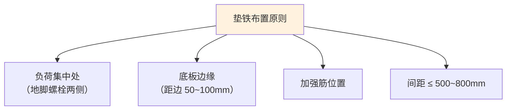

# 第3章 设备就位与找正调平

> [!important] 章节定位
> 第3章是 GB 50231 **最核心的通用工艺章节**，涵盖从设备吊装就位、垫铁配置、地脚螺栓紧固到精找正（三表法）和灌浆的全流程。所有暖通旋转机械（风机、水泵）的安装精度均依赖本章技术。

---

## 一、垫铁布置

### 1.1 垫铁的作用

| 功能 | 说明 |
|------|------|
| **传递载荷** | 将设备重量及运转动载荷均匀传递至基础 |
| **调整标高** | 通过增减垫铁组数/厚度实现设备标高调整 |
| **调整水平度** | 通过垫铁组高度差实现设备水平度调整 |
| **二次灌浆空间** | 垫铁支撑设备底板→底板与基础间留灌浆空间（≥25mm） |

### 1.2 垫铁类型与选用

| 垫铁类型 | 图示 | 材质 | 适用场景 |
|----------|------|------|----------|
| **平垫铁** | 矩形平板，厚度设计 | Q235 钢/铸铁 | 所有设备通用，承受主要载荷 |
| **斜垫铁** | 楔形，成对使用，斜度 1:20~1:40 | Q235 钢 | 精确调整标高和水平度，与平垫铁配对 |
| **开口垫铁** | U 形开口 | Q235 钢 | 设备底座已固定在基础时，从侧面插入 |
| **钩头成对斜垫铁** | 带钩头的楔形垫铁对 | Q235 钢 | 有振动或冲击的设备，防止垫铁松动脱出 |
| **调整垫铁** | 带调节螺栓的精密垫铁 | 合金钢 | 精密设备微调（精度 0.01mm） |

### 1.3 垫铁布置原则



| 布置原则 | 具体规定 |
|----------|----------|
| **地脚螺栓两侧** | 每根地脚螺栓旁至少 1 组垫铁（多数规范要求两侧各1组） |
| **设备底座边缘** | 垫铁组距设备底座边缘 **50～100mm** |
| **垫铁组间距** | **500～800mm**，视设备刚度和载荷分布调整 |
| **垫铁面积** | 垫铁与基础接触面积须满足：A ≥ C × (Q₁+Q₂)/R（C=安全系数1.5~2，Q₁=设备重+地脚螺栓预紧力，Q₂=运转载荷，R=基础混凝土抗压强度） |
| **叠放层数** | 每组垫铁总层数 ≤ **5 层**（含平垫铁+斜垫铁对），放置顺序：厚在下、薄在上 |

### 1.4 垫铁安装质量要求

| 检查项目 | 合格标准 | 检测方法 |
|----------|:--------:|----------|
| **垫铁与基础接触面积** | ≥ 75% | 塞尺检查四周 |
| **垫铁水平度** | ≤ 1/1000 | 水平尺 |
| **垫铁组露出设备底座** | 10～30mm | 钢板尺 |
| **垫铁组间高差** | ≤ 1mm | 水准仪/平尺 |
| **斜垫铁搭接长度** | ≥ 全长的 3/4 | 钢板尺 |
| **焊牢要求** | 调平后垫铁组各层间点焊固定 | 目检 |

---

## 二、地脚螺栓

### 2.1 地脚螺栓类型

| 类型 | 特点 | 适用场景 |
|------|------|----------|
| **固定地脚螺栓** | 一次浇灌在基础中，不可拆卸 | 中小型设备、无振动设备 |
| **活动地脚螺栓** | 通过锚板锚固，螺栓可拆卸/调整 | 大型设备、需移位设备 |
| **胀锚地脚螺栓** | 膨胀管胀开锚固（后置式） | 已硬化基础的后期增设 |
| **粘结地脚螺栓** | 化学锚栓，注入粘结剂固定 | 已硬化基础、精度要求高的场合 |

### 2.2 地脚螺栓安装要求

| 项目 | 技术要求 |
|------|----------|
| **垂直度** | 螺栓应垂直，偏差 ≤ 螺栓总长的 1/100 |
| **露出长度** | 螺母拧紧后螺栓露出 2~3 扣螺纹 |
| **距孔壁距离** | 地脚螺栓距孔壁各侧 ≥ 15mm |
| **底部距孔底** | 地脚螺栓下端距孔底 ≥ 50mm |
| **防转措施** | 活动地脚螺栓在锚板槽内应有防转措施（T形头必须正确入槽） |
| **油脂保护** | 螺纹部分涂抹防锈油脂，裸露部分包裹保护 |

### 2.3 地脚螺栓紧固

| 紧固步骤 | 操作要求 |
|----------|----------|
| **① 预紧** | 对称交错循环拧紧，初始扭矩为终拧扭矩的 30~50% |
| **② 终拧** | 按设计扭矩值（或计算值），均匀拧紧到规定力矩 |
| **③ 复拧** | 终拧后对所有螺栓恢复一遍规定扭矩，防止早期松弛 |
| **④ 检查** | 用小锤轻击螺母，无松动声、无弹性振动 |

> [!tip] 暖通常见设备地脚螺栓扭矩参考值
> | 螺栓规格 | M12 | M16 | M20 | M24 | M30 |
> |:--------:|:---:|:---:|:---:|:---:|:---:|
> | 扭矩(N·m) | 40~50 | 80~100 | 150~180 | 250~280 | 450~500 |

---

## 三、找正方法（三表法）

### 3.1 找正层次

| 步骤 | 内容 |
|:----:|------|
| **一次找正（粗找正）** | 设备就位后测量标高、中心线，偏差控制在允许范围 |
| **二次找正（精找正）** | 地脚螺栓紧固后精确测量，通过垫铁微调 |

### 3.2 三表法 — 旋转机械联轴器对中

三表法是旋转机械（风机-电机、泵-电机）联轴器精密对中的标准方法，使用 **3 块百分表** 同时测量径向偏差和轴向偏差。

#### 表架布置

```
        电机端              泵/风机端
        
         [D1]  ─────── 联轴器  ───────  [D1']
    ┌────○                              ○────┐
    │  ○ [A1]                      [A1'] ○   │
    │                                         │
    │           百分表架布置:                  │
    │  • 1块径向表 (R) → 测径向跳动          │
    │  • 2块轴向表 (A1, A2) → 测轴向偏差     │
    └─────────────────────────────────────────┘
           A1 和 A2 相隔 180° 布置
```

#### 测量原理

| 表位 | 测量方向 | 反映偏差 |
|:----:|:--------:|----------|
| **径向表 (R)** | 垂直于轴线 | 两轴**径向位移**（平行偏差/不对中量） |
| **轴向表 (A1)** | 平行于轴线 | 两轴**轴向偏差**（角偏差/张口量） |
| **轴向表 (A2)** | 平行于轴线 (180°对面) | 校核 A1 读数，消除轴窜影响 |

#### 测量步骤

| 步骤 | 操作 | 说明 |
|:----:|------|------|
| **1** | 表架固定在一端联轴器上，表头接触另一端联轴器 | 表针预压 1~2mm |
| **2** | 转动两轴同步旋转（0°→90°→180°→270°） | 盘车同步，消除联轴器加工误差 |
| **3** | 记录 4 个方位的 R、A1、A2 读数 | 回到 0° 应回零（±0.01mm 内） |
| **4** | 计算：径向偏差 = R 读数范围/2；轴向偏差 = (A1-A2) 读数差/2 | 消除轴窜的系统误差 |
| **5** | 根据计算结果调整电机底板垫铁高度和位置 | 调整量 = 计算偏差 × 修正系数 |

#### 允许偏差

| 联轴器类型 | 径向偏差 | 轴向偏差 |
|------------|:--------:|:--------:|
| **弹性联轴器** | ≤ 0.05mm | ≤ 0.05mm（端面间隙 ≤ 0.05mm） |
| **刚性联轴器** | ≤ 0.03mm | ≤ 0.02mm |
| **齿式联轴器** | ≤ 0.08mm | ≤ 0.05mm |
| **膜片联轴器** | ≤ 0.03mm | ≤ 0.03mm |

> [!tip] 三表法的数学本质
> 用 3 块表同时测量可**一次盘车同时获取径向和轴向偏差数据**，且两块轴向表 (A1, A2) 的相对读数可自动消除因轴窜（轴向窜动）带来的测量误差。A1 读数和 A2 读数之和的理论值应为常数，偏离常数即为轴向偏差的真实值。

---

## 四、灌浆

### 4.1 灌浆时机

| 条件 | 说明 |
|------|------|
| 设备精找正完成 | 标高、水平度、对中精度确认合格 |
| 地脚螺栓已紧固 | 预紧+终拧完成并检验 |
| 垫铁组已点焊 | 垫铁组各层点焊固定 |
| 隐蔽工程验收完成 | 三方（建设/监理/施工）签字确认 |

### 4.2 一次灌浆 vs 二次灌浆

| 项目 | 一次灌浆 | 二次灌浆 |
|------|----------|----------|
| **时机** | 地脚螺栓预留孔→设备就位前 | 设备精找正后 |
| **对象** | 地脚螺栓孔 | 设备底板下的空隙 |
| **材料** | 细石混凝土（C30以上） | 无收缩灌浆料（推荐）/细石混凝土 |
| **作用** | 固定地脚螺栓 | 传递设备载荷至基础，防止底板振动 |

### 4.3 灌浆工艺要求

| 工艺环节 | 技术要求 |
|----------|----------|
| **灌浆前清理** | 基础表面凿毛→清水冲洗→润湿 24h→灌浆前吸干表面明水 |
| **模板支设** | 模板距设备底板边缘 ≥ 60mm，模板高度高于底板底面 ≥ 50mm |
| **灌浆料搅拌** | 严格按产品说明水灰比，机械搅拌 ≥ 3min |
| **灌浆方式** | 从一侧连续灌注，不得间断，用竹条/钢筋振捣排除空气 |
| **养护** | 灌浆后覆盖湿布养护 ≥ 7天，期间不得碰撞设备 |
| **拆模** | 养护 24h 后拆模，修整外露面 |

> [!warning] 灌浆注意事项
> - 环境温度 < 5°C 时不得灌浆（冬季施工须有保温措施）
> - 二次灌浆层厚度 ≥ **25mm**，以利于浆料流动填充
> - 灌浆后设备上不得进行任何敲击、焊接作业
> - 有振动设备（风机、泵）必须使用无收缩灌浆料，避免开裂

### 4.4 灌浆检查

| 检查项目 | 合格标准 |
|----------|:--------:|
| 灌浆层与设备底板接触 | 紧密贴合，无空隙 |
| 灌浆层表面 | 平整、无裂纹 |
| 外露面修整 | 抹面光滑，倒角处理 |
| 养护记录 | 完整记录温度、湿度、养护天数 |

---

## 🔗 相关页面

- 施工准备完成 → 第2章 施工准备
- 风机专用安装要求 → 第6章 风机安装
- 泵类专用安装要求 → 第7章 泵类设备安装
- 试运转 → 第9章

---

← 返回 GB50231-2009-章节索引|GB50231-2009 章节索引
