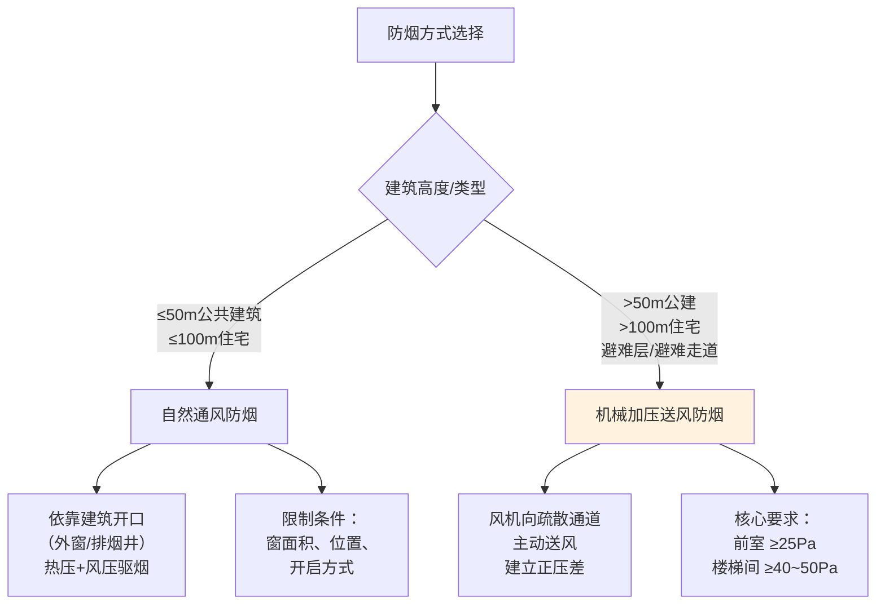
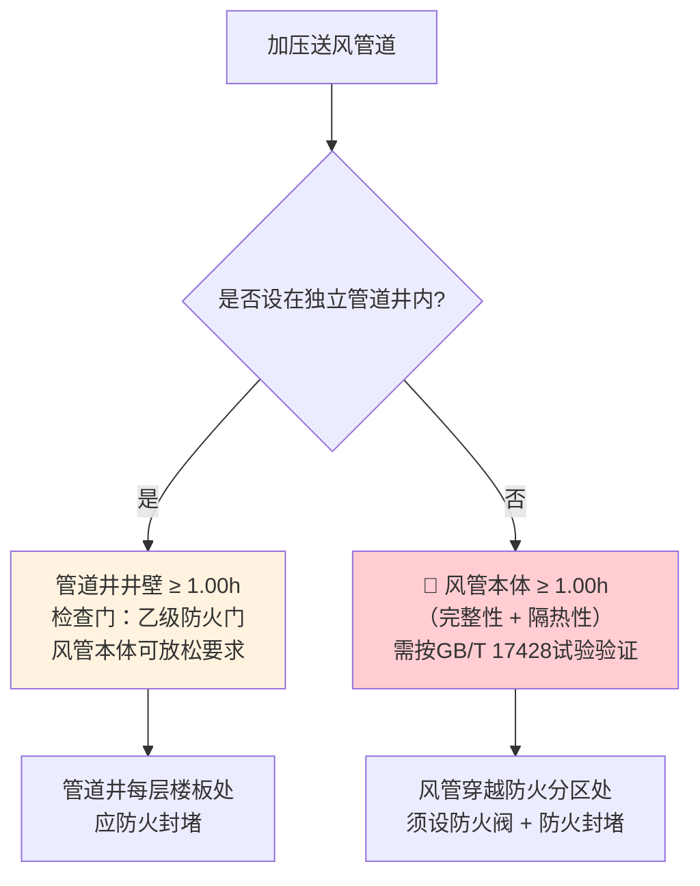

# 第3章 防烟系统设计

> [!abstract] 本章概要
> GB 51251-2017 第3章规定了建筑防烟系统的设计要求，包括**自然通风防烟**和**机械加压送风防烟**两种方式。核心目标是在火灾时维持前室、楼梯间及避难层（间）的正压环境，阻止烟气侵入人员疏散通道。本章重点条文为 **3.3.9 条（管道井耐火极限）**。

---

## 一、防烟方式对比

| 对比维度 | 自然通风防烟 | 机械加压送风防烟 |
|----------|:------------:|:-----------------:|
| **原理** | 热压+风压自然排烟 | 风机主动送风，维持正压 |
| **适用建筑** | ≤50m 公建 / ≤100m 住宅 | >50m 公建 / >100m 住宅 / 避难层 |
| **核心要求** | 可开启外窗面积满足规定 | 前室 ≥25Pa，楼梯间 ≥40~50Pa（余压） |
| **可靠性** | 依赖室外气象条件 | 主动控制，可靠性高 |
| **造价** | 低 | 高（风机+管道+控制系统） |
| **对风管要求** | 无（或仅排烟井） | **加压送风管道（需耐火）** |

---

## 二、机械加压送风核心设计要求

### 2.1 加压送风部位

| 建筑部位 | 加压要求 | 余压值 |
|----------|----------|:------:|
| **楼梯间** | 应设置加压送风系统 | **40~50 Pa** |
| **前室（合用前室）** | 应设置加压送风系统 | **25~30 Pa** |
| **避难层（间）** | 应设置加压送风系统 | 与楼梯间相同 |
| **避难走道** | 入口设前室，加压强 | 25~30 Pa |

> [!warning] 余压控制
> - 前室与走道压差 **25~30 Pa**
> - 楼梯间与前室压差 **40~50 Pa**
> - 超压时需通过**旁通阀泄压**或**变频调节**，防止疏散门难以开启（门开启力 ≤100N）

### 2.2 加压送风量

| 建筑类型 | 送风量计算方式 | 参考试值 |
|----------|:------------:|----------|
| **楼梯间** | 按附录E计算（同时开门数×门洞风速） | 25000~45000 m³/h |
| **前室** | 按附录E计算 | 15000~25000 m³/h |
| **避难层** | 按开口截面风速 ≥0.7m/s 计算 | 按实际面积 |

---

## 三、🔥 3.3.9 条——加压送风管道耐火极限要求

> [!danger] 🔴 3.3.9 条 —— 核心强制性条文
> **机械加压送风系统应采用管道送风，且不应采用土建风道。加压送风管道应符合下列规定：**

| 设置位置 | 耐火极限要求 | 附加要求 | 责任主体 |
|----------|:----------:|----------|:--------:|
| **设置在独立的管道井内** | 管道井井壁耐火极限 ≥ **1.00h** | 检查门采用**乙级防火门** | 建筑专业（管井）/ 暖通专业确认 |
| **未设置在管道井内**（水平布置或与非消防管道共井） | 送风管道耐火极限 ≥ **1.00h** | 管道本体需满足 1.0h 耐火极限（完整性 + 隔热性） | 暖通专业（风管选材/构造） |

### 3.3.9 条文解读

> [!important] 管井 vs 管道的关键区别
> - **有独立管井**：管井井壁替代风管承担耐火分隔功能 → 风管本体可用常规镀锌钢板
> - **无独立管井**（走道吊顶内/与其他管道共井/水平明装）：风管本体必须满足 **1.0h 耐火极限** → 需采用防火包裹、成品耐火风管或等效方案
> - **土建风道被明确禁止**：不得借用建筑风道替代金属风管（表面粗糙、漏风量大、耐火不可靠）

---

## 四、加压送风口设置

| 风口位置 | 设置要求 |
|----------|----------|
| **楼梯间** | 每隔 **2~3 层** 设置一个常开式百叶送风口 |
| **前室** | 每层设置一个常闭式送风口（火灾时联动开启该层及上下相邻层） |
| **避难层** | 按计算确定风口数量和面积 |

> [!tip] 送风口风速限制
> 加压送风口的风速不宜大于 **7 m/s**，避免噪音过大并保证气流组织均匀。

---

## 五、防烟系统设计关联条文

| 关联条文 | 内容 | 对应笔记 |
|----------|------|:--------:|
| 3.1 自然通风防烟 | 可开启外窗面积要求 | — |
| 3.2 机械加压送风 | 风机选型、风道布置 | 本章 |
| **3.3.9** | 🔴 管道井耐火极限 / 风管耐火极限 | ⭐本章重点 |
| 3.3.10 | 加压送风管道材料要求 | 第7章 系统施工 |
| 3.3.11 | 加压送风机设置要求 | 第5章 排烟系统设计(续) |
| 附录 C | 防烟系统常见设计参数 | 参考数据 |
| 附录 E | 加压送风量计算方法 | 计算依据 |

---

## 🔗 相关页面导航

- 📑 **章节索引**：GB51251-2017-章节索引
- 🔥 **4.4.8 排烟风管耐火极限**：第4章 排烟系统设计
- 🔧 **风管施工方案**：第7章 系统施工
- 🧪 **耐火试验方法**：GBT17428-2009 通风管道耐火试验方法
- 📐 **建筑防火母规范**：GB50016-2014 建筑设计防火规范(2018版)
- 📋 **标准总览**：中国标准索引

---

← 返回 GB51251-2017-章节索引|GB51251-2017 章节索引
