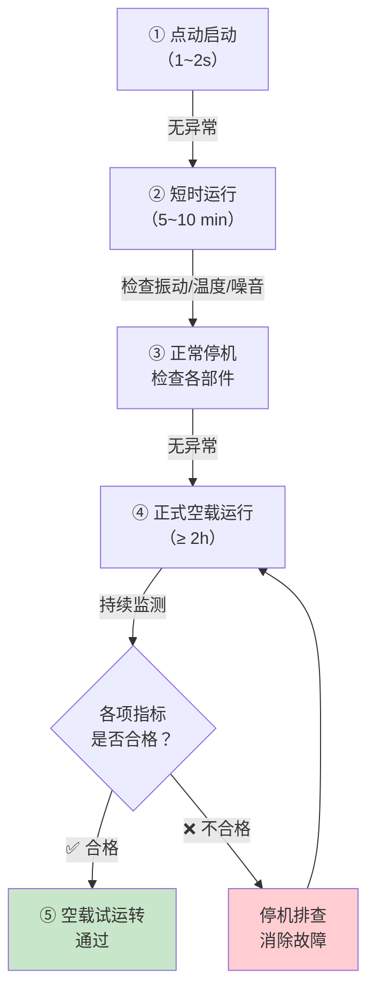

# 第4-5章 设备装配与试运转

> [!important] 章节定位
> 第4章（设备拆卸与装配）和第9章（试运转）合并记述，涵盖设备从零部件装配到系统试运转的**全过程质量管控**。风机、水泵等暖通旋转机械的装配精度和试运转合格判定，直接影响设备运行寿命和能耗。

---

## 第一部分：设备装配（第4-5章）

### 一、装配前准备

#### 1.1 清洗

| 清洗对象 | 清洗要求 | 注意事项 |
|----------|----------|----------|
| **零部件** | 清除防锈油/油脂/铁锈/污垢，露出金属表面 | 加工面用绸布擦拭，非加工面可用棉布 |
| **滚动轴承** | 拆除包装后单独清洗 | 防锈油封可用煤油/汽油清洗，再用洁净润滑油浸洗 |
| **油路/气道** | 管道内部吹扫→酸洗→中和→钝化→冲洗 | 确保无铁锈、焊渣、杂质残留 |
| **密封面** | 精细清洗，不得有划伤 | 用不起毛的洁净布或麂皮擦拭 |

> [!warning] 清洗注意事项
> - 精密加工面（轴承座孔、轴颈）严禁使用钢丝刷或金属刮刀
> - 清洗后的零件须晾干或用压缩空气吹干，**不得残留清洗液**
> - 立即涂防锈油或润滑油，防锈期一般不超过 72h

#### 1.2 润滑

| 润滑部位 | 润滑剂选用 | 施加要求 |
|----------|-----------|----------|
| **滚动轴承** | 锂基润滑脂（通用）；高温场合用聚脲基脂 | 填充量 = 轴承空间 1/3~1/2，过量→发热 |
| **滑动轴承** | 机械油（牌号按设备说明书） | 油环浸入深度、油杯油面高度按说明书要求 |
| **齿轮箱** | 工业齿轮油（按齿面载荷、转速选粘度） | 油面在油标 1/2~2/3 处 |
| **风机轴承箱** | 专用润滑油（推荐 ISO VG32/VG46） | 油面在油窗 1/3~2/3 处 |
| **联轴器** | 膜片联轴器—不需润滑；齿式联轴器—二硫化钼锂基脂 | 齿式联轴器填满齿隙 |
| **开式链条/链轮** | 高温链条油 | 薄层涂抹，不可过量 |

---

### 二、紧固件连接

#### 2.1 螺栓连接通则

| 要求 | 具体规定 |
|------|----------|
| **紧固顺序** | 从中间向四周、对称交错、**分次拧紧**（预紧→终拧→复拧） |
| **垫圈配置** | 螺母下必须设平垫圈；有振动场合加弹簧垫圈或防松螺母 |
| **螺栓穿入方向** | 垂直方向—螺母在上侧（防松脱坠落）；水平方向—同一设备方向应一致 |
| **紧定螺钉** | 紧定螺钉露出长度 ≤ 2 倍螺距 |
| **螺纹防护** | 外露螺纹涂防锈油或安装防护帽 |

#### 2.2 常用螺栓扭矩参考值

| 螺栓规格 | M8 | M10 | M12 | M16 | M20 | M24 | M30 |
|:--------:|:--:|:---:|:---:|:---:|:---:|:---:|:---:|
| **4.8级 (N·m)** | 10~15 | 25~35 | 40~55 | 80~110 | 150~180 | 250~280 | 450~500 |
| **8.8级 (N·m)** | 25~30 | 50~60 | 80~100 | 180~220 | 350~400 | 550~600 | 950~1050 |

> [!tip] 风机/泵底座螺栓
> - 风机底座螺栓 → 通常 8.8 级，M16~M24，扭矩 80~280 N·m
> - 泵底座螺栓 → 通常 4.8~8.8 级，按上表执行
> - **关键点**：有减振器时扭矩不宜过高，以免过约束破坏减振效果

#### 2.3 联轴器装配对中要求

| 联轴器类型 | 径向偏差 | 轴向偏差(端面间隙) | 暖通常见设备 |
|-----------|:--------:|:------------------:|-------------|
| **弹性柱销联轴器** | ≤ 0.05mm | ≤ 0.05mm | 离心风机、水泵 |
| **膜片联轴器** | ≤ 0.03mm | ≤ 0.03mm | 高压风机、大功率泵 |
| **梅花形弹性联轴器** | ≤ 0.05mm | ≤ 0.05mm | 小功率风机 |
| **皮带轮** | 两轮宽度中心偏差 ≤ 0.5mm/m | 两轴平行度 ≤ 0.5mm/m | 皮带传动风机 |

---

### 三、过盈配合装配

| 装配方式 | 适用场景 | 操作要点 |
|----------|----------|----------|
| **压入法** | 轴承内圈与轴、联轴器与轴 | 均匀施压，按基准面逐渐压入，不得敲击单侧 |
| **热装法** | 大型轴承、联轴器、叶轮 | 加热油浴：120°C~150°C；加热时间≥30min，均匀膨胀 |
| **冷装法** | 轴套、衬套 | 轴件在液氮或干冰中冷却收缩后装配 |
| **温差法（大过盈量）** | 风机叶轮与主轴 | 加热轮毂（150~200°C）+ 冷却轴（-30~-50°C）→ 一次装配到位 |

> [!warning] 热装注意事项
> - 轴承加热温度严禁超过 **120°C**（超过将影响轴承钢回火硬度）
> - 联轴器和叶轮加热温度不宜超过 **200°C**
> - 加热后应在 **2 分钟内** 完成装配，防止热损失导致卡滞

---

## 第二部分：试运转（第9章）

### 四、试运转前的必备条件

#### 4.1 试运转条件检查表

| 检查项 | 具体要求 | 状态 |
|--------|----------|:----:|
| **安装完成** | 设备安装结束，二次灌浆养护期满（≥7天） | ☐ |
| **润滑到位** | 润滑油/脂牌号、油位符合说明书要求 | ☐ |
| **冷却水接通** | 冷却水路畅通，压力、流量满足要求（如轴承箱冷却） | ☐ |
| **电气接线** | 电机接线正确、绝缘电阻合格（≥0.5MΩ）、接地可靠 | ☐ |
| **安全防护** | 联轴器护罩、皮带罩安装牢固，旋转部件外露无尖锐物 | ☐ |
| **手动盘车** | 盘动转子灵活无卡滞、无异响、无刮擦 | ☐ |
| **转向确认** | 电机**点动**运行，确认旋转方向与箭头一致 | ☐ |
| **仪表校验** | 压力表、温度计、振动传感器已校验且在有效期内 | ☐ |
| **管道系统** | 风机进出口管道已连接，风阀/水阀处于试运转所需开度 | ☐ |
| **人员到位** | 操作人员和监护人员就位，应急停机按钮功能正常 | ☐ |

---

### 五、空载试运转

#### 5.1 空载试运转程序

#### 5.2 空载试运转监测指标

| 被监测参数 | 监测方法 | 合格标准 | 监测频率 |
|-----------|----------|:--------:|:--------:|
| **轴承温升** | 红外测温仪/数显温度计 | ≤ 40°C（温升），最高温度 ≤ 80°C | 每 30 min |
| **振动速度** | 手持式测振仪（mm/s RMS） | 风机/泵 ≤ 4.6 mm/s（功率≤15kW）；≤ 2.8 mm/s（功率>15kW） | 启动时/运行中/停机前 |
| **振动位移** | 百分表或涡流传感器 | ≤ 0.05mm（峰值） | 同上 |
| **运行电流** | 钳形电流表/配电柜电流表 | ≤ 电机铭牌额定电流；三相平衡偏差 ≤ 10% | 每 30 min |
| **异常噪音** | 听觉 + 听诊器 | 无金属摩擦声、撞击声、周期性异响 | 持续 |
| **密封泄漏** | 目视检查 | 轴承箱/机壳密封面无渗漏 | 持续 |

#### 5.3 风机空载试运转特殊要求

| 风机类型 | 空载状态 | 特殊检查项 |
|----------|----------|-----------|
| **离心风机** | 关闭进口/出口阀门（关死点附近）| 叶轮与机壳径向间隙均匀，无刮擦 |
| **轴流风机** | 叶片角度调至最小 | 叶片与风筒径向间隙均匀（2~3mm） |
| **屋顶风机** | 自然进风状态 | 风帽转动灵活、平衡 |

> [!warning] 离心风机空载时须关小阀门
> 空载时若全开进出风阀，风机功率可达额定功率的 **40%~70%**（与叶片型式有关），可能导致电机过载。正确做法：**关闭或关小进出风阀**，使风机在最小功率下空载运行。

---

### 六、负载试运转

#### 6.1 负载试运转程序

#### 6.2 各级加载检查要点

| 载荷阶段 | 运行时间 | 重点检查 |
|:--------:|:--------:|----------|
| **25%** | ≥ 30 min | 排除气蚀/喘振初步迹象；确认系统阻力值 |
| **50%** | ≥ 30 min | 轴承温度是否稳定上升；振动是否在允许范围内 |
| **75%** | ≥ 30 min | 电机电流是否接近正常；轴承温升曲线是否正常 |
| **100%** | ≥ 2 h | 全面性能测定—风量/风压/功率/效率/噪音 |

#### 6.3 负载试运转合格标准

| 判定项目 | 合格标准 |
|----------|:--------:|
| **轴承温度** | 温升 ≤ 40°C；滑动轴承 ≤ 65°C，滚动轴承 ≤ 80°C |
| **振动速度** | 刚性基础：≤ 4.6 mm/s (RMS)；柔性基础：≤ 7.1 mm/s (RMS) |
| **风量/风压** | 与设计值偏差 ≤ ±5%（或设备铭牌范围） |
| **运行电流** | ≤ 电机铭牌额定电流；三相电流最大偏差 ≤ 10% |
| **密封/泄漏** | 机壳密封面无气体/液体渗漏 |
| **噪音** | 风机出口 1m 处噪声 ≤ 设备铭牌值 + 3dB(A) |
| **连续运行稳定性** | 100% 载荷下无异常振动波动、无异常升温 |

---

### 七、试运转后工作

| 步骤 | 内容 |
|:----:|------|
| **① 停机** | 逐步降载→停机→关闭电源→挂"设备已停机"牌 |
| **② 热态检查** | 趁热检查各紧固件是否松动（热膨胀后可能有应力松弛） |
| **③ 润滑油/脂** | 检查油位是否变化，必要时补充；首次试运转后 72h 内更换润滑油 |
| **④ 记录** | 填写试运转记录表（时间、转速、温度、振动、电流、风量、风压） |
| **⑤ 复原** | 拆除试运转临时管路/仪器；恢复正式管道连接 |
| **⑥ 清理** | 清理现场，回收工具；移交操作手册至建设单位 |

> [!tip] 试运转记录即为工程验收核心依据
> 试运转记录须三方（建设、监理、施工）签字确认，是竣工验收文件的核心组成部分。记录缺失将导致工程**无法通过验收**。

---

## 🔗 相关页面

- 设备就位与找正 → [第3章 设备就位与找正调平](/knowledge/pipe-fitting-spec/第3章-设备就位与找正调平/)
- 风机安装技术 → [第6章 风机安装](/knowledge/pipe-fitting-spec/第6章-风机安装/)
- 泵类设备安装 → [第7章 泵类设备安装](/knowledge/pipe-fitting-spec/第7章-泵类设备安装/)
- 施工规范 → [GB50738-2011 通风与空调工程施工规范](/knowledge/pipe-fitting-spec/GB50738-2011-通风与空调工程施工规范/)
- 施工质量验收 → [GB50243-2016 通风与空调工程施工质量验收规范](/knowledge/pipe-fitting-spec/GB50243-2016-通风与空调工程施工质量验收规范/)
- 章节总览 → GB50231-2009-章节索引|GB50231-2009 章节索引

---

← 返回 GB50231-2009-章节索引|GB50231-2009 章节索引
