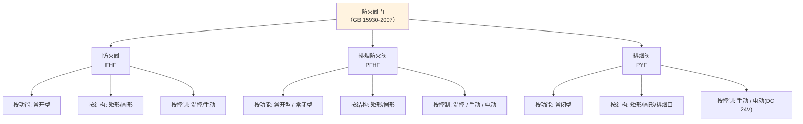

# 第4章 分类与标记

> [!important] 章节定位
> 第4章规定了防火阀门三大类（FHF / PFHF / PYF）的**分类体系**和**型号标记规则**。掌握本章的型号命名法是识别产品、核对订单、查验 CCC 证书的基本功——每一个型号字母都有确切的工程含义。

---

## 一、分类体系总览

### 1.1 三类阀门分类概览



---

## 二、按功能分类

| 功能代号 | 产品名称 | 常态 | 触发条件 | 动作方向 | 安装系统 |
|:--------:|----------|:----:|----------|:--------:|----------|
| **FHF** | 🔵 防火阀 | 常开 | 管道温度 ≥ 70°C | 开启 → **关闭** | 通风 / 空调 |
| **PFHF** | 🟡 排烟防火阀 | 常开或常闭 | 管道温度 ≥ 280°C | 常开→关闭；常闭→先开→280°C关闭 | 机械排烟 |
| **PYF** | 🔴 排烟阀 | 常闭 | 火灾信号（手动/电动 DC 24V） | 关闭 → **开启** | 机械排烟 |

> [!tip] 功能代号记忆法
> - **F**HF：**F**ire Damper → **F**（防火）= 70°C
> - **P**FHF：**P** = 排烟（Pái yān）→ 280°C
> - **P**YF：**P** = 排烟 + **Y** = 阀（Fá → 代号取 Y）→ 常闭排烟

---

## 三、按结构形式分类

| 结构代号 | 结构形式 | 适用阀门 | 典型尺寸范围 |
|:--------:|----------|:--------:|-------------|
| **J** | 矩形（矩形截面） | FHF / PFHF / PYF | 200×200 ~ 2000×1250 mm |
| **Y** | 圆形（圆形截面） | FHF / PFHF / PYF | φ100 ~ φ1500 mm |
| **K** | 排烟口（多叶式） | PYF 专属 | 与吊顶/墙面配合 |

### 3.1 矩形 vs 圆形选型要点

| 对比维度 | 矩形 (J) | 圆形 (Y) |
|----------|:--------:|:--------:|
| **风管匹配** | 矩形风管系统 | 圆形风管系统（常见于螺旋风管） |
| **空间利用** | 适应扁宽空间 | 适应管井/竖井 |
| **密封性** | 四角漏风较难控制 | 圆周密封，漏风量更小 |
| **制造成本** | 较低 | 较高 |
| **常见规格** | 配合矩形风管长边/短边 | 配合圆形风管直径 |

---

## 四、按控制/动作方式分类

| 动作代号 | 控制方式 | 说明 | 适用阀门 |
|:--------:|----------|------|:--------:|
| **W** | 温控 | 温感器熔断自动关闭（70°C / 280°C） | FHF / PFHF |
| **S** | 手动 | 手动操作启闭 | 三类均有 |
| **D** | 电动 DC 24V | 消防控制中心远程 DC 24V 信号控制 | PFHF / PYF |
| **SD** | 手动 + 电动 | 手动优先 + 远程电动 | PFHF / PYF |
| **WD** | 温控 + 电动 | 温控自动 + 远程电动复位/控制 | PFHF |

### 4.1 各阀门的典型控制配置

| 阀门类型 | 标配控制 | 可选扩展 |
|----------|:--------:|----------|
| **FHF 防火阀** | **W**（温控 70°C） | W + 手动复位；W + 信号反馈（微动开关） |
| **PFHF 排烟防火阀** | **W**（温控 280°C） | W + **SD**（手动 + 电动 DC 24V 开启/复位） |
| **PYF 排烟阀** | **D**（电动 DC 24V） | **SD**（手动 + 电动）；D + 阀位反馈信号 |

---

## 五、型号标记规则

### 5.1 型号组成

```text
□  □  □  -  □  ×  □  -  □
│  │  │      │     │      └─ 动作方式代号（如 W / SD）
│  │  │      │     └─────── 尺寸：圆形直径 φmm 或 矩形长边 mm
│  │  │      └───────────── 尺寸：矩形短边 mm（圆形不标注此项）
│  │  └──────────────────── 结构代号：J（矩形）/ Y（圆形）/ K（排烟口）
│  └─────────────────────── 功能代号：FHF / PFHF / PYF
└────────────────────────── 自定义标记（可选，制造商代号）
```

### 5.2 标记示例

#### 示例 1：标准防火阀（70°C 矩形温控）

```text
FHF J - 800 × 500 - W
```

| 字段 | 含义 |
|:----:|------|
| **FHF** | 防火阀（功能代号） |
| **J** | 矩形结构 |
| **800 × 500** | 矩形截面：长边 800mm × 短边 500mm |
| **W** | 温控自动关闭（70°C） |

> 解读：安装在通风/空调矩形风管（800×500mm）上，平时常开，烟气温度达 70°C 时自动关闭。

#### 示例 2：排烟防火阀（280°C 圆形电动+温控）

```text
PFHF Y - φ800 - SD
```

| 字段 | 含义 |
|:----:|------|
| **PFHF** | 排烟防火阀（功能代号） |
| **Y** | 圆形结构 |
| **φ800** | 圆形截面：直径 800mm |
| **SD** | 手动 + 电动 DC 24V 控制 |

> 解读：安装在机械排烟圆形风管（φ800mm）上，可手动或 DC 24V 电动开启，280°C 时温控自动关闭。

#### 示例 3：排烟阀（常闭型远程电控）

```text
PYF J - 1000 × 600 - SD
```

| 字段 | 含义 |
|:----:|------|
| **PYF** | 排烟阀（功能代号） |
| **J** | 矩形结构 |
| **1000 × 600** | 矩形截面：长边 1000mm × 短边 600mm |
| **SD** | 手动 + 电动 DC 24V 控制 |

> 解读：安装在排烟系统支管端部（1000×600mm），平时常闭，火灾时手动或 DC 24V 信号开启排烟。

#### 示例 4：带制造商前缀的完整型号

```text
XX-FHF J - 630 × 400 - W
```

> 前缀 **XX** 为制造商自定义代号（如企业缩写），其余部分同上。

---

## 六、标记快速对照速查表

| 阀门类型 | 常见功能代号 | 常见结构 | 常见动作 | 典型完整标记示例 |
|----------|:----------:|:------:|:------:|-----------------|
| 🔵 通风防火阀 | **FHF** | J（矩形） | W | `FHF J-800×400-W` |
| 🟡 排烟防火阀（常开） | **PFHF** | J/Y | W | `PFHF J-1000×500-W` |
| 🟡 排烟防火阀（常闭电动） | **PFHF** | J/Y | SD | `PFHF Y-φ630-SD` |
| 🔴 排烟阀（电动） | **PYF** | J/Y/K | SD | `PYF J-800×600-SD` |
| 🔴 排烟阀（手动） | **PYF** | J/Y | S | `PYF Y-φ500-S` |

---

## 七、标记与 CCC 认证的关联

| 检查要点 | 说明 |
|----------|------|
| **铭牌标记须完整** | 铭牌上应标有完整型号标记、制造商、出厂日期 |
| **CCC 证书上的型号** | 须与产品铭牌上的型号标记一致 |
| **覆盖原则** | CCC 证书上的主检型号应能覆盖同系列派生型号（结构相同、尺寸/动作方式不同） |
| **进场核验** | 按 第7章 检验规则+标志 核对铭牌信息与 CCC 证书的一致性 |

> [!warning] 工程警示
> 型号中的动作方式字母（W / SD / WD）直接对应控制接线的复杂程度：
> - **W**（纯温控）→ 无电气接线需求
> - **SD**（手动+电动）→ 须预留 DC 24V 信号线和反馈信号线
> - 预埋/预敷管线时应依据型号提前确认

---

## 🔗 相关页面

- 三类阀门术语定义 → 第3章 术语与定义
- 产品性能指标 → 第5章 技术要求
- 检验规则与铭牌要求 → 第7章 检验规则+标志
- 防火阀安装位置（母规范） → GB50016-2014 建筑设计防火规范(2018版)
- 防排烟系统阀门选型 → GB51251-2017 建筑防烟排烟系统技术标准
- 章节总览 → GB15930-2007-章节索引|GB15930-2007 章节索引

---

← 返回 GB15930-2007-章节索引|GB15930-2007 章节索引
