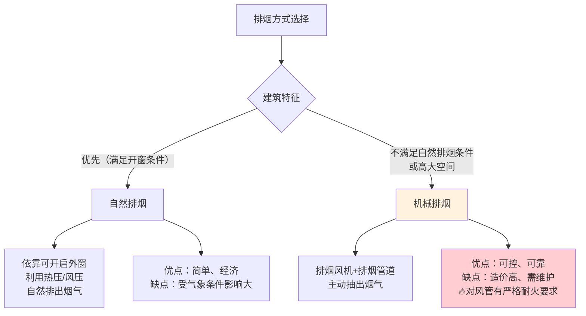
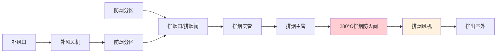
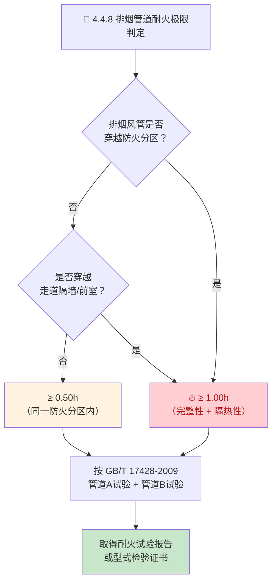

# 第4章 排烟系统设计

> [!abstract] 🔥 本章是 GB 51251-2017 最核心章节
> 第4章规定了建筑排烟系统的全部设计要求，包括**自然排烟**和**机械排烟**两种方式，以及排烟量计算方法。**4.4.8 条是整部标准中风管耐火极限的核心条文**，直接影响风管材质选择、施工方案和工程验收。

---

## 一、排烟方式对比

| 对比维度 | 自然排烟 | 机械排烟 |
|----------|:------:|:------:|
| **原理** | 热压+风压，烟气自然上升排出 | 排烟风机主动抽吸 |
| **排烟口/窗** | 可开启外窗，手/自动开启 | 排烟阀+排烟口，电动开启 |
| **排烟管道** | 无 | **有，需满足耐火极限要求** |
| **适用场景** | 满足开窗面积要求的建筑 | 高大空间、内区房间、规范强制性要求 |
| **可靠性** | 受天气、风向影响 | 主动控制，可靠性高 |
| **造价** | 低 | 中高（含风机、耐火风管、控制系统） |

---

## 二、机械排烟系统组成

### 2.1 防烟分区划分

| 空间类型 | 最大防烟分区面积 | 最大边长 |
|----------|:---------------:|:--------:|
| 公共建筑/工业建筑（净高 ≤6m） | **500 m²** | ≤ 60 m |
| 公共建筑/工业建筑（净高 >6m） | **1000 m²** | ≤ 60 m |
| 汽车库 | **2000 m²** | ≤ 60 m |

---

## 三、排烟量计算

### 3.1 排烟量计算方法

| 空间类型 | 排烟量计算依据 | 最小值 |
|----------|---------------|:------:|
| 公共建筑/工业建筑（净高 ≤6m） | 防烟分区面积 × **60 m³/(h·m²)** | **15000 m³/h** |
| 公共建筑/工业建筑（净高 >6m） | 按附录A（火灾增长系数+清晰高度） | — |
| 中庭（体积 ≤17000m³） | **6 次/h** 换气 | **102000 m³/h** |
| 中庭（体积 >17000m³） | **4 次/h** 换气 | **102000 m³/h** |
| 走道（仅有走道排烟时） | 走道面积 ×60 m³/(h·m²) | **13000 m³/h** |
| 汽车库 | 按 GB 50067 | — |

> [!tip] 储烟仓与清晰高度
> - **储烟仓厚度** ≥ 净高的 10%，且 ≥ 500mm
> - **最小清晰高度** ≥ 1.6m + 0.1×净高（保证人员疏散时视线清晰）

---

## 四、🔥🔥 4.4.8 条——排烟管道耐火极限（核心条文）

> [!danger] 🔴 4.4.8 条 —— 排烟管道耐火极限（整部标准最核心条款）
> **排烟管道应符合下列规定：**

| 设置工况 | 耐火极限要求 | 适用场景 | 检验依据 |
|----------|:----------:|----------|:--------:|
| **一般情况**（同一防火分区内） | ≥ **0.50h** | 排烟风管位于同一防火分区内部 | GB/T 17428-2009 |
| **穿越防火分区时** | ≥ **1.00h** | 排烟风管从一个防火分区进入另一个防火分区 | GB/T 17428-2009 |
| **设置在走道吊顶内** | ≥ **0.50h** | 走道是人员疏散通道，保证排烟可靠性 | GB/T 17428-2009 |
| **穿越疏散走道隔墙** | ≥ **1.00h** | 保护疏散通道的防火安全 | GB/T 17428-2009 |
| **穿越前室/楼梯间** | ≥ **1.00h** | 保护核心疏散通道 | GB/T 17428-2009 |

### 4.4.8 判定流程图

### 4.4.8 条文说明 —— 三种排烟风管构造方案

> [!important] 4.4.8 条文说明（技术指引）
> 条文说明明确排烟风管可通过以下三种方案满足耐火极限：

| 方案 | 构造 | 适用场景 | 造价 |
|:----:|------|----------|:----:|
| **方案一** | 镀锌钢板 + **防火包裹**（防火板/岩棉+防火涂料） | 0.5h~1.0h 常规工程 | 中 |
| **方案二** | 镀锌钢板 + **内衬防火材料**（硅酸钙板） | 空间受限，0.5h | 中高 |
| **方案三** | **成品耐火风管**（硅酸钙板/玻镁板工厂预制） | ≥1.0h 重要工程 | 高 |

> [!tip] 方案选择建议
> - **普通商业/住宅**：方案一（镀锌钢板 + 防火包裹）最经济
> - **超高层/重要公共建筑**：方案三（成品耐火风管）保证 1.5h~2.0h 耐火
> - **方案二（内衬）** 施工困难、维护不便，仅限特殊空间使用

---

## 五、补风系统（第5章 补风系统）

> [!note] 补风系统原是第5章内容，此处并入排烟系统设计

### 5.1 补风量要求

| 补风方式 | 补风量要求 | 备注 |
|----------|-----------|------|
| **自然补风** | ≥ 排烟量的 **50%** | 优先，利用建筑开口 |
| **机械补风** | ≥ 排烟量的 **50%** | 不满足自然补风时 |

### 5.2 补风管道耐火极限 —— 第 5.2.7 条

> [!warning] 5.2.7 条 —— 补风管道耐火极限
> 补风管道的耐火极限不应低于：

| 设置工况 | 耐火极限 |
|----------|:--------:|
| 穿越防火分区 | ≥ **1.00h** |
| 同一防火分区内 | ≥ **0.50h** |

### 5.3 补风系统设计要点

| 要点 | 要求 |
|------|------|
| **补风口位置** | 设在储烟仓以下，距地面 ≤ 6m |
| **补风口风速** | 自然补风 ≤ 3 m/s；机械补风 ≤ 10 m/s |
| **补风防火阀** | 补风管道上设 **70°C 防火阀**（非 280°C） |

---

## 六、排烟系统设计速查

| 参数 | 要求 | 条文 |
|------|------|:----:|
| 防烟分区最大面积（≤6m净高） | 500 m² | 4.2.4 |
| 排烟量（≤6m净高） | 面积×60 m³/h·m²，≥15000 | 4.6.3 |
| 中庭排烟量 | 4~6次/h，≥102000 | 4.6.5 |
| 储烟仓厚度 | ≥净高10%且≥500mm | 4.6.2 |
| 排烟口距最远点 | ≤ 30 m | 4.4.12 |
| 🔴 **排烟管耐火（同分区）** | ≥ **0.50h** | **4.4.8** |
| 🔴 **排烟管耐火（穿分区）** | ≥ **1.00h** | **4.4.8** |
| 补风管道耐火（同分区） | ≥ 0.50h | 5.2.7 |
| 补风管道耐火（穿分区） | ≥ 1.00h | 5.2.7 |

---

## 🔗 相关页面导航

- 📑 **章节索引**：GB51251-2017-章节索引
- 💨 **排烟口/阀布置 + 风速限值**：第5章 排烟系统设计(续)
- 🔒 **管道井耐火 3.3.9**：[第3章 防烟系统设计](/knowledge/pipe-fitting-spec/第3章-防烟系统设计/)
- 🔧 **风管施工三种方案对比**：[第7章 系统施工](/knowledge/pipe-fitting-spec/第7章-系统施工/)
- 🧪 **耐火试验方法**：GBT17428-2009 通风管道耐火试验方法
- 🎛️ **联动控制逻辑**：[第6章 系统控制](/knowledge/pipe-fitting-spec/第6章-系统控制/)
- 📋 **标准总览**：[中国标准索引](/knowledge/pipe-fitting-spec/中国标准索引/)

---

← 返回 GB51251-2017-章节索引|GB51251-2017 章节索引
