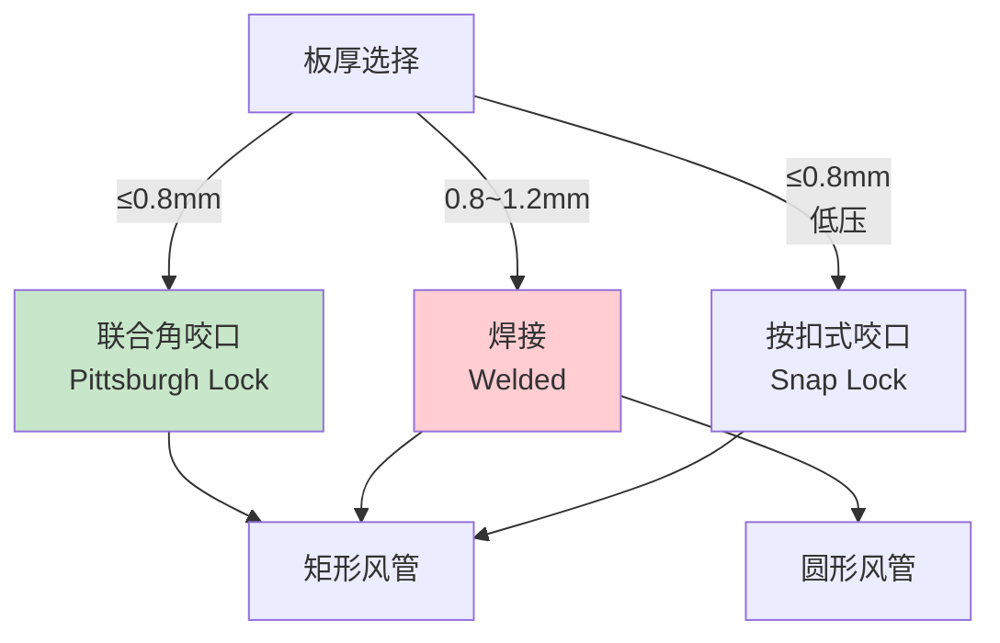
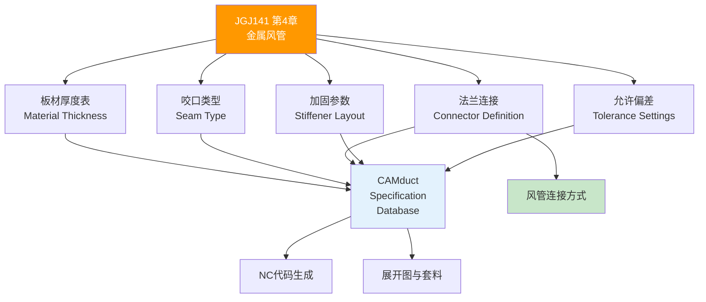

# 第4章 金属风管

> [!important] ⭐ 核心章节
> 第 4 章是 JGJ 141-2017 中**与 CAMduct 关联最密切、数据密度最高**的核心章节。它规定了矩形/圆形金属风管的板材厚度表、连接工艺（咬口/焊接/法兰）、共板法兰(TDF)做法、加固/加强筋要求以及全部允许偏差值——这些数据是 CAMduct **Specification 配置的直接源头**。

---

## 4.1 矩形风管板材厚度表（★核心数据表）

JGJ 141-2017 第 4.2 节给出了矩形镀锌钢板风管按长边尺寸和压力等级的完整厚度表：

| 长边尺寸 b (mm) | 低压 P≤500Pa | 中压 500<P≤1500Pa | 高压 P>1500Pa |
|----------------|:----------:|:---------------:|:-----------:|
| b ≤ 320 | 0.50 | 0.50 | 0.75 |
| 320 < b ≤ 450 | 0.50 | 0.60 | 0.75 |
| 450 < b ≤ 630 | 0.60 | 0.75 | 0.75 |
| 630 < b ≤ 1000 | 0.75 | 0.75 | 1.00 |
| 1000 < b ≤ 1250 | 0.75 | 1.00 | 1.00 |
| 1250 < b ≤ 2000 | 1.00 | 1.00 | 1.20 |
| 2000 < b ≤ 4000 | 1.20 | 1.20 | 按设计 |

> [!tip] CAMduct 直接映射
> 将此表数据直接输入 CAMduct **Spec Editor** → **Material Thickness** 表，按三个 Pressure Class × 七个长边尺寸区间建立映射。这是生成符合中国标准的 NC 加工代码的**第一步**。详见 矩形风管制造。

### 4.1.1 不锈钢板与铝板厚度修正

| 材质 | 厚度修正方式 |
|------|------------|
| **不锈钢板** | 当厚度 ≥ 1.0mm 时，可比同规格镀锌钢板**减薄 0.1~0.2mm** |
| **铝板** | 当厚度 ≥ 1.0mm 时，应比同规格镀锌钢板**加厚 0.1~0.2mm** |

---

## 4.2 圆形风管壁厚表

圆形风管因力学性能优越（环向受力均匀），同压力条件下壁厚可比矩形**减薄一级**：

| 直径 D (mm) | 低压 | 中压 | 高压 |
|------------|:----:|:----:|:----:|
| D ≤ 320 | 0.50 | 0.50 | 0.60 |
| 320 < D ≤ 450 | 0.50 | 0.60 | 0.75 |
| 450 < D ≤ 1000 | 0.60 | 0.75 | 0.75 |
| 1000 < D ≤ 1250 | 0.75 | 0.75 | 1.00 |
| 1250 < D ≤ 2000 | 0.75 | 1.00 | 1.20 |
| D > 2000 | 1.00 | 1.20 | 按设计 |

> CAMduct 中圆形风管使用 **Spiral Duct** 或 **Round Duct** 模块，板材厚度通过 **Round Material Definition** 配置。详见 圆形风管制造。

---

## 4.3 风管咬口工艺

JGJ 141-2017 规定金属矩形风管采用**咬口连接**为主，特殊情况可采用焊接。

### 4.3.1 咬口形式选择

| 咬口形式 | 适用板厚 (mm) | 适用场景 | CAMduct Seam Type |
|----------|:----------:|----------|-------------------|
| **单咬口** | 0.5~0.8 | 低压小尺寸风管 | Pittsburgh (单平) |
| **联合角咬口** | 0.5~1.0 | 矩形风管纵向接缝（最常用） | Pittsburgh Lock |
| **转角咬口** | 0.5~0.8 | 矩形风管四角 | Corner Seam |
| **按扣式咬口** | 0.5~0.8 | 无法兰连接的直管段 | Snap Lock |
| **立咬口** | 0.8~1.2 | 圆形/矩形大口径风管 | Standing Seam |

### 4.3.2 咬口质量要求

| 检验项目 | 要求 |
|----------|------|
| 咬口缝宽度 | 均匀一致，偏差 ≤ 1mm |
| 咬口缝紧密性 | 无开裂、无脱扣 |
| 咬口折角 | 平直，折角偏差 ≤ 2° |
| 镀锌层损伤 | 咬口处镀锌层损伤面积 ≤ 10% 表面积，损伤处须做防腐处理 |

---

## 4.4 焊接工艺要求

当板厚 > 1.2mm 或密封等级为 D 级（高压）时，应采用**焊接**代替咬口：

| 焊接形式 | 适用板厚 | 工艺要点 |
|----------|:------:|----------|
| **电阻点焊** | 0.8~1.2 | 焊点间距 50~100mm，适用于镀锌钢板 |
| **气焊** | 0.5~2.0 | 薄板常用，火焰调节为中性焰 |
| **氩弧焊 (TIG)** | 0.8~3.0 | 不锈钢/铝板首选，焊接质量高 |
| **CO₂气体保护焊** | ≥ 1.2 | 碳钢板，效率高 |

> [!warning] 焊接注意
> 镀锌钢板焊接时须注意锌蒸气防护，焊后须对焊缝做**防腐处理**（刷富锌漆或环氧漆）。

---

## 4.5 法兰连接

### 4.5.1 角钢法兰

| 风管长边 (mm) | 角钢规格 | 螺栓规格 | 螺栓孔距 (mm) |
|:-----------:|:------:|:------:|:-----------:|
| ≤ 630 | L25×3 | M6 | ≤ 150（低压）/ ≤ 100（中高压） |
| 630~1250 | L30×3 | M8 | ≤ 100 |
| 1250~2000 | L40×4 | M8 | ≤ 100 |
| 2000~4000 | L50×5 | M10 | ≤ 100 |

### 4.5.2 共板法兰 (TDF) — ★CAMduct 核心工艺

**共板法兰 (TDF, Transverse Duct Flange)** 是 JGJ 141-2017 推荐的高效法兰连接方式，直接在风管板材端部滚压出法兰形状，无需额外角钢法兰。

| TDF 工艺参数 | 要求值 | CAMduct 对应 |
|:-----------|:------|-------------|
| 适用板厚 | 0.5~1.2 mm | Sheet Thickness Range |
| 法兰高度 | 30~35 mm | Flange Height |
| 法兰翻边宽度 | 7~9 mm | Flange Bend Width |
| 法兰连接件（卡条）间距 | ≤ 200 mm | Cleat Spacing |
| 法兰四角 | 须安装角插件 (Corner Piece) | Corner Piece Insertion |
| 密封胶条 | 粘贴于卡条内侧或法兰贴合面 | Gasket Application |

> [!tip] TDF in CAMduct
> CAMduct 内置 **TDF Connector** 类型，可直接在 **Connector Definition** 中选择 TDC/TDF Profile。配合正确的 Flange Height、Cleat Spacing、Corner Piece 参数，即可生成完整的 TDF 法兰风管 NC 代码。详见 风管连接方式。

---

## 4.6 风管加固与加强筋

### 4.6.1 加固起点

| 压力等级 | 矩形风管长边加固起点 | 圆形风管直径加固起点 |
|:------:|:------------------:|:------------------:|
| 低压 | > 630 mm | > 800 mm |
| 中压 | > 500 mm | > 630 mm |
| 高压 | > 400 mm | > 500 mm |

### 4.6.2 加固方式对比

| 加固方式 | 适用场景 | 间距要求 | 工艺要点 |
|----------|----------|:------:|----------|
| **角钢加固框** | 大尺寸矩形风管 | ≤ 1.5m | 框与风管铆接/焊接，框角部须有加强板 |
| **楞筋（压筋）加固** | 中小尺寸、板厚 ≥ 0.8mm | 筋间距 200~300mm | 凸筋高度 ≥ 3mm，筋条方向垂直于长边 |
| **点加固（铆接/焊接加强点）** | 配合保温钉、复合板 | — | 加固点须对上加固间距 |
| **内支撑（穿墙螺杆）** | 大跨度风管 > 2m | 水平和垂直双向布置 | 支撑杆须防腐蚀、风管内侧平滑无毛刺 |
| **Z 形/C 形加强筋** | 板厚 ≥ 1.0mm 的金属风管 | 筋间距 300~400mm | 与风管壁面贴紧，端部须弯折固定 |

---

## 4.7 允许偏差表

| 检验项目 | 允许偏差 | 检验方法 |
|----------|:------:|----------|
| 风管外径或外边长的偏差 | 外径 ≤ 300mm：±2mm；> 300mm：±3mm | 钢卷尺 |
| 风管管口平面度 | ≤ 10mm | 塞尺 + 检验平台 |
| 矩形风管两对角线之差 | 边长 ≤ 1000mm：≤ 3mm；> 1000mm：≤ 5mm | 钢卷尺 |
| 圆形风管椭圆度 | ≤ 直径 3‰ | 钢卷尺测量两垂直方向直径差 |
| 法兰平面度偏差 | ≤ 2mm | 塞尺 + 平台 |
| 风管板面不平度 | ≤ 5mm/m²（低压）/ ≤ 3mm/m²（中高压） | 1m 直尺 + 塞尺 |

---

## 4.8 与 CAMduct 的全链路映射

---

## 🔗 相关链接

- **压力等级与密封** → [第3章 基本规定](/knowledge/pipe-fitting-spec/第3章-基本规定/)
- **非金属风管** → [第5章 非金属风管](/knowledge/pipe-fitting-spec/第5章-非金属风管/)
- **风管配件** → [第6章 风管配件与部件](/knowledge/pipe-fitting-spec/第6章-风管配件与部件/)
- **风管制作工艺** → [第7章 风管制作](/knowledge/pipe-fitting-spec/第7章-风管制作/)
- **风管安装要求** → [第8章 风管安装](/knowledge/pipe-fitting-spec/第8章-风管安装/)
- **CAMduct 矩形制造** → 矩形风管制造
- **CAMduct 连接方式** → 风管连接方式
- **验收规范对照** → GB50243-2016 [第4章 风管与配件](/knowledge/pipe-fitting-spec/第4章-风管与配件/)

← 返回 JGJ141-2017-章节索引|JGJ141-2017 章节索引
