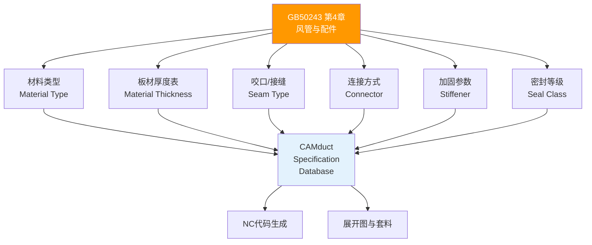

# 第4章 风管与配件

> [!important] ⭐ 核心章节
> 第 4 章是 GB 50243-2016 中**篇幅最长、条目最多、与 CAMduct 关联最紧密**的核心章节。它规定了风管及配件制作的全部质量要求，包括材料选择、板材厚度、制作偏差、加固要求和两项**强制性条文**（4.2.2、4.2.5）。

---

## 4.1 风管材料分类

GB 50243-2016 将风管材料分为三大类：

| 材料类别 | 具体材质 | 常用领域 | CAMduct 对应 |
|----------|----------|----------|-------------|
| **金属风管** | 镀锌钢板、不锈钢板、铝板 | 通用 HVAC 系统（占 70%+） | Sheet Metal — G90 / SS304 / Al |
| **非金属风管** | 酚醛(PF)、聚氨酯(PU)、玻纤复合板、无机玻璃钢、纤维增强硅酸钙板 | 防排烟（耐火）、保温一体化 | Composite / Phenolic / Fiberglass |
| **复合材料风管** | 内外金属面夹芯保温板（双壁风管） | 洁净空调、高标准空调风 | Double Wall / Insulated Panel |

> 材料选择直接影响 风管类型与规格 中 CAMduct 的 Material Definition。

---

## 4.2 板材厚度（★关键参数）

GB 50243-2016 第 4.2.3 条给出了金属风管板材厚度表，这是 CAMduct Specification 配置的**核心输入参数**。

### 4.2.1 矩形镀锌钢板风管板材厚度（mm）

| 长边尺寸 b (mm) | 低压 P≤500Pa | 中压 500<P≤1500Pa | 高压 P>1500Pa |
|----------------|-------------|-------------------|---------------|
| b ≤ 320 | 0.50 | 0.50 | 0.75 |
| 320 < b ≤ 450 | 0.60 | 0.60 | 0.75 |
| 450 < b ≤ 630 | 0.60 | 0.75 | 0.75 |
| 630 < b ≤ 1000 | 0.75 | 0.75 | 1.00 |
| 1000 < b ≤ 1250 | 0.75 | 1.00 | 1.00 |
| 1250 < b ≤ 2000 | 1.00 | 1.00 | 1.20 |
| 2000 < b ≤ 4000 | 1.20 | 1.20 | 按设计 |

> [!tip] CAMduct 映射
> 将此表数值直接输入 CAMduct **Spec Editor > Material Thickness** 表，按 Pressure Class × 大边尺寸建立映射。详见 数据库配置 和 矩形风管制造。

### 4.2.2 圆形金属风管板材厚度

圆形风管因结构优势（受力均匀），同条件下板材可比矩形**减薄一级**。具体数值参见 圆形风管制造。

---

## 4.3 风管制作允许偏差

| 检验项目 | 允许偏差 | 检验方法 |
|----------|----------|----------|
| 风管直径或长边尺寸 | 外径或外边长 ≤ 300mm：±2mm；> 300mm：±3mm | 钢卷尺 |
| 风管管口平面度 | ≤ 10mm | 塞尺 + 检验平台 |
| 矩形风管对角线之差 | ≤ 3mm（边长 ≤ 1000mm）/ ≤ 5mm（边长 > 1000mm） | 钢卷尺 |
| 圆形风管椭圆度 | ≤ 直径的 3‰ | 钢卷尺 |
| 法兰平面度偏差 | ≤ 2mm | 塞尺 |

> 以上偏差直接影响 CAMduct 输出精度和现场安装对口质量，应在 展开图与套料 环节预留工艺补偿量。

---

## 4.4 风管加固要求

GB 50243-2016 第 4.2.7~4.2.9 条对风管加固提出明确要求：

| 加固条件 | 加固方式 |
|----------|----------|
| 矩形风管长边 > 630mm（低压）/ **500mm**（中压）/ **400mm**（高压） | 必须设置加固措施 |
| 圆形风管直径 > 800mm | 须设置加固环或螺旋加强筋 |
| 非金属风管边长 > 1000mm | 须设置内部支撑或外部加固框 |

**常用加固形式**：

| 加固形式 | 适用场景 | 施工要点 |
|----------|----------|----------|
| **角钢加固框** | 大尺寸矩形风管 | 框间距 ≤ 1.5m |
| **压筋加固** | 中小尺寸矩形风管 | 凸筋高度 ≥ 3mm |
| **点加固（保温钉组合）** | 保温风管 | 配合 保温风管 复合板施工 |
| **内支撑** | 大尺寸风管（跨度 > 2m） | 支撑杆须耐腐蚀 |

---

## 4.5 主控项目（强制性条文）

### 🔴 4.2.2 — 风管材料品种、规格、性能

> [!danger] 强制性条文 4.2.2
> **风管制作所用材料品种、规格、性能与厚度应符合设计要求和国家现行有关标准的规定。**
>
> - **检验方法**：查验材料质量合格证明文件、性能检测报告；必要时复验
> - **判定**：任一材料不满足要求，**全批不合格**

### 🔴 4.2.5 — 防火风管材料

> [!danger] 强制性条文 4.2.5
> **防排烟系统、地下室及防火分区隔墙两侧的风管，其耐火极限应满足设计要求。防火风管的本体、框架与固定材料、密封垫料必须为不燃材料。**
>
> - **耐火极限**：通常要求 ≥ 1.0h（具体按设计要求）
> - **耐火试验**：按 GBT17428-2009 通风管道耐火试验方法 进行
> - **CAMduct 关联**：防火风管必须单独建立 Material Definition，标记为 **Fire Rated Duct**，板材选用纤维增强硅酸钙板或加厚镀锌钢板包裹耐火材料

---

## 4.6 一般项目

| 条目 | 内容 | 关键参数 |
|------|------|----------|
| 4.3.1 | 风管外观质量 | 表面平整、无裂纹、镀锌层无严重损伤 |
| 4.3.2 | 咬口缝质量 | 紧密、宽度均匀，折角平直 |
| 4.3.3 | 焊接风管质量 | 焊波均匀、无气孔夹渣、变形在允许范围内 |
| 4.3.4 | 法兰制作 | 螺栓孔距 ≤ 150mm（低压）/ ≤ 100mm（中高压） |
| 4.3.5 | 风管加固 | 加固筋排列均匀、高度一致 |

---

## 4.7 工艺性检测（4.2.6）

> [!important] 风管必须通过工艺性检测
> GB 50243 要求风管制作完成后，应在**正式批量生产前**或**工艺变更后**进行工艺性检测（首件检验），验证风管制作的**强度**和**严密性**是否符合设计和使用要求。

工艺性检测按**附录 C** 进行：
- 低压风管：漏光法（或漏风量法）
- 中压/高压风管：漏风量法

在 CAMduct 中，可根据首件检验结果调整 **Seam Type**、**Connector Type** 和 **Sealant Application** 参数，优化制造工艺。详见 展开图与套料。

---

## 4.8 与 CAMduct 的全链路关联

← 返回 GB50243-2016-章节索引|GB50243-2016 章节索引
