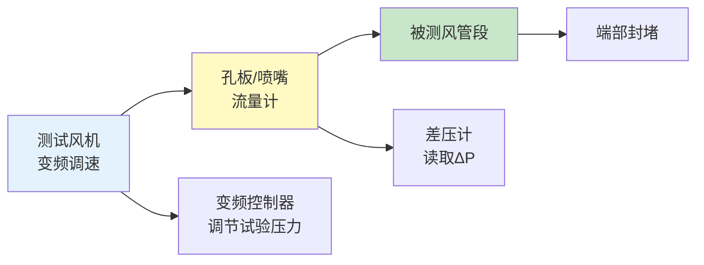

# 第4章 风系统检测

> [!important] ⭐ 核心章节
> 第 4 章是 JGJ/T 260-2011 中**与风管制造质量验证最直接相关**的核心章节。规定了风管漏风量检测（漏光法→低压、漏风量法→中高压）、风量平衡（风口风量偏差≤15%）以及风压检测的完整方法。检测结果是 CAMduct 风管制造质量的关键验证指标。

---

## 4.1 风管漏风量检测

### 4.1.1 检测方法选择原则

| 压力等级 | 检测方法 | 说明 |
|:------:|:------:|------|
| **低压（≤ 500Pa）** | **漏光法** | 定性检测，快速、低成本 |
| **中压（500~1500Pa）** | **漏风量法** | 定量检测，准确可靠 |
| **高压（> 1500Pa）** | **漏风量法** | 必须定量检测 |

> [!tip] CAMduct 质量验证
> 风管在 CAMduct 车间制作完成后，可抽样进行漏风量测试以验证咬口工艺和密封等级是否达标。测试不合格时应检查 **Seam Type**、**Sealant Application** 参数是否需要调整。详见 风管连接方式。

---

### 4.1.2 漏光法

#### 测试原理

在黑暗环境中将光源置于风管内部，从外部观察接缝处是否有光线透过。

#### 检测步骤

| 步骤 | 操作内容 |
|:--:|----------|
| 1 | 选择暗光环境（夜间或遮光室内） |
| 2 | 风管一端置入 **≥ 100W** 安全低压灯（36V），另一端封堵 |
| 3 | 观察者沿风管外侧逐段巡查，目视检查接缝是否漏光 |
| 4 | 用记号笔标记漏光点位置 |
| 5 | 记录漏光点数量及每处漏光长度 |

#### 判定标准

| 项目 | 合格标准 |
|:----:|----------|
| 漏光点密度 | **每 10m 接缝 ≤ 2 处漏光点** |
| 单点漏光长度 | **每处 ≤ 5cm**（连续漏光长度） |
| 条缝状漏光 | **不允许**（视为不合格，须返工） |

#### 不合格处理

| 情况 | 处理方式 |
|------|----------|
| 零星漏光点 | 密封胶涂补后复测 |
| 大面积漏光 | 风管段返工，重新咬口或更换法兰垫片 |
| 条缝状漏光 | 🔴 该段风管报废，检查 CAMduct Seam Definition 参数 |

---

### 4.1.3 漏风量法（定量检测）

#### 测试装置

#### 检测步骤

| 步骤 | 操作内容 |
|:--:|----------|
| 1 | 被测风管段两端封堵，预留进气口和测压口 |
| 2 | 连接测试风机、孔板流量计、差压计 |
| 3 | 启动风机，调节至规定试验压力 $P_{test}$（通常为工作压力） |
| 4 | 稳压运行 **≥ 3 min** 后读取差压计读数 |
| 5 | 根据孔板公式换算漏风量 $Q$ |
| 6 | 与允许漏风量 $Q_{allow}$ 比较，判定合格与否 |

#### 漏风量计算公式

$$Q = 0.01252 \times \alpha \times d^2 \times \sqrt{\frac{\Delta P}{\rho}}$$

式中：
- $Q$ — 漏风量 (m³/h)
- $\alpha$ — 孔板流量系数
- $d$ — 孔板孔径 (mm)
- $\Delta P$ — 孔板前后差压 (Pa)
- $\rho$ — 空气密度 (kg/m³)，标准状态取 1.2

#### 允许漏风量判定

| 密封等级 | 允许单位面积漏风量 $Q_{allow}$ (m³/h·m²) |
|:------:|:--------------------------------------:|
| **A 级** | $Q_{allow} \leq 0.1056 \times P_{test}^{0.65}$ |
| **B 级** | $Q_{allow} \leq 0.0352 \times P_{test}^{0.65}$ |
| **C 级** | $Q_{allow} \leq 0.0117 \times P_{test}^{0.65}$ |
| **D 级** | $Q_{allow} \leq 0.0039 \times P_{test}^{0.65}$ |

> 其中 $P_{test}$ 为试验压力 (Pa)。

---

## 4.2 风量平衡检测

### 4.2.1 检测方法

| 方法 | 适用场景 | 仪表 |
|------|----------|------|
| **风口风量法** | 各分支风口风量检测 | 风量罩/风速仪 × 风口面积 |
| **主风管风速法** | 总风管风量检测 | 毕托管 + 微压计 / 热球风速仪 |
| **风管断面风速法** | 直管段风量校核 | 风速仪（等面积分格法测量） |

### 4.2.2 风口风量检测（最常用）

#### 风口风量偏差标准

| 系统类型 | 风口风量允许偏差 | 检测仪表 |
|----------|:-------------:|----------|
| 一般空调送排风 | **≤ 15%** | 风量罩（推荐）/ 风速仪 |
| 洁净空调 | ≤ 10% | 风量罩 |
| VAV 变风量系统 | ≤ 10%（设计工况） | 风量罩 |

#### 风量罩检测步骤

| 步骤 | 操作 |
|:--:|------|
| 1 | 选择与风口尺寸匹配的风量罩底座 |
| 2 | 风量罩罩住风口，确保密封 |
| 3 | 读取稳定后的风量值 (m³/h) |
| 4 | 每个风口测量 2~3 次取平均值 |
| 5 | 计算实测风量与设计风量偏差：$\varepsilon = \frac{|Q_\text{实测} - Q_\text{设计}|}{Q_\text{设计}} \times 100\%$ |
| 6 | 判定：$\varepsilon \leq 15\%$ 为合格 |

### 4.2.3 系统总风量检测

| 检测位置要求 | 说明 |
|:----------|------|
| 测点位置 | 风机出口直管段，距上游局部构件 ≥ 5D（D 为管径），距下游 ≥ 2D |
| 断面网格 | 矩形风管按等面积分格法，每格 ≤ 0.05 m²；圆形风管按等面积环法，每环 ≥ 4 测点 |
| 仪表 | 毕托管 + 微压计（精度 ±0.5Pa） |

---

## 4.3 风压检测

### 4.3.1 检测内容

| 检测项目 | 检测点位置 | 仪表 |
|----------|----------|------|
| **风机全压** | 风机进出口各设测压断面 | 毕托管 + 微压计 |
| **风管静压** | 各层/各分支干管 | 静压取压管 + 微压计 |
| **末端风口余压** | 风口出口 | 微压计 |
| **过滤器前后压差** | 过滤段前后 | U 形管压差计 |

### 4.3.2 判定标准

| 项目 | 合格标准 |
|------|:------:|
| 风机全压 | 实测值 ≥ 设计值的 90% |
| 末端风口余压 | 设计值 ± 10% |
| 过滤器终阻力 | 达到初阻力 2 倍时更换 |

---

## 4.4 风系统检测汇总

| 检测项目 | 适用系统 | 方法 | 核心指标 |
|----------|:------:|------|:------|
| 风管漏风量 | 所有风系统 | 漏光法 / 漏风量法 | 按密封等级 A/B/C/D |
| 风口风量平衡 | 送排风系统 | 风量罩 | 偏差 ≤ 15% |
| 系统总风量 | 送排风系统 | 毕托管断面法 | ≥ 90% 设计值 |
| 风压 | 所有风系统 | 毕托管+微压计 | 风机全压 ≥ 90% 设计值 |

---

## 🔗 相关链接

- **水系统检测** → [第5章 水系统检测](/knowledge/pipe-fitting-spec/第5章-水系统检测/)
- **室内环境检测** → [第6章 室内环境检测](/knowledge/pipe-fitting-spec/第6章-室内环境检测/)
- **设备检测** → [第7章 设备检测](/knowledge/pipe-fitting-spec/第7章-设备检测/)
- **风管密封等级** → JGJ141-2017 [第3章 基本规定](/knowledge/pipe-fitting-spec/第3章-基本规定/)
- **风管严密性测试** → JGJ141-2017 [第8章 风管安装](/knowledge/pipe-fitting-spec/第8章-风管安装/)
- **CAMduct 连接方式** → 风管连接方式
- **验收规范** → GB50243-2016 [第4章 风管与配件](/knowledge/pipe-fitting-spec/第4章-风管与配件/)

← 返回 JGJT260-2011-章节索引|JGJ/T 260-2011 章节索引
