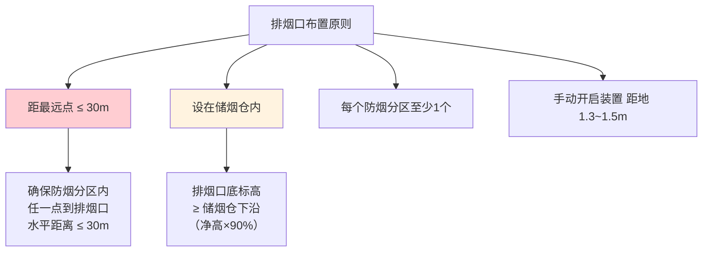
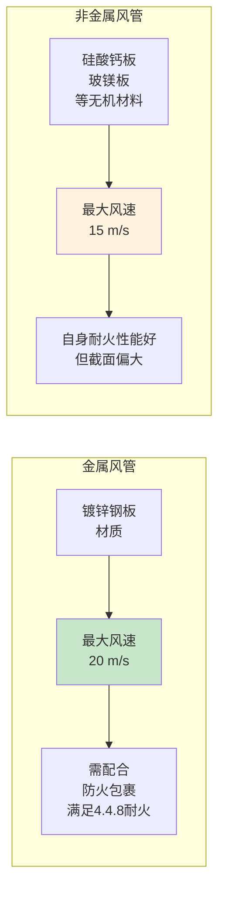

# 第5章 排烟系统设计（续）——排烟口、管道风速、风机选型

> [!abstract] 本章概要
> 本章承接 第4章 排烟系统设计，聚焦排烟系统的核心部件设计：排烟口/排烟阀的布置原则、排烟管道风速限值、以及排烟风机的选型要求。这些参数直接决定了排烟系统的性能和工程可行性。

---

## 一、排烟口与排烟阀布置

### 1.1 基本布置原则

### 1.2 排烟口设置要求

| 要求项 | 具体规定 |
|--------|----------|
| **距最远点水平距离** | ≤ **30 m**（防烟分区内任一点） |
| **安装高度** | 排烟口底边 ≥ 储烟仓下沿（≥ 净高的 90%） |
| **距可燃物距离** | ≥ **1.5 m** |
| **排列间距** | 排烟口之间距离 ≤ 60 m（走道） |
| **手动开启装置** | 距地面 **1.3~1.5 m**，标识清晰 |

> [!warning] 距最远点 30m 的由来
> 4.4.12 条规定排烟口距防烟分区最远点的水平距离不应大于 30m，这是保证排烟覆盖范围不出现死区的关键参数。设计中需要以排烟口为圆心、以30m为半径覆盖整个防烟分区。

### 1.3 排烟阀（常闭式排烟口）

| 技术要求 | 内容 |
|----------|------|
| **常态** | **常闭**（不同于通风系统的常开防火阀） |
| **火灾动作** | 接收火灾自动报警信号 → **电动或手动开启** |
| **复位方式** | 手动或电动复位 |
| **联锁信号** | 开启后反馈信号至消防控制室 |
| **产品标准** | 须符合 GB15930-2007 建筑通风和排烟系统用防火阀门\|GB 15930-2007（排烟阀 PYF 类） |

### 1.4 排烟防火阀（280°C）

> [!warning] 280°C 排烟防火阀 —— 排烟系统的"终极保险"
> 排烟防火阀安装在排烟风机入口总管处，常态**常开**，当排烟温度达到 **280°C ± 3°C** 时自动关闭，同时**联锁关闭排烟风机 + 补风风机**。对比通风系统的 70°C 防火阀，280°C 是考虑到火灾烟气温度更高的实际情况。

| 关键参数 | 值 | 依据 |
|----------|:---:|------|
| 动作温度 | **280°C** | GB 15930-2007 |
| 安装位置 | 排烟风机入口总管 | 4.4.10 |
| 联锁功能 | 关闭时联锁停止排烟风机+补风风机 | 6.1.1 |
| 耐火极限 | ≥ **1.50h** | GB 15930-2007 第5章 |

---

## 二、排烟管道风速限值

### 2.1 风速限值总表

> [!important] 风速限值是排烟管道截面设计的依据
> 排烟管道内风速直接影响管道噪音、沿程阻力及气流稳定性。必须区分材质选用对应上限。

| 风管材质 | 最大设计风速 (m/s) | 典型应用 |
|----------|:-----------------:|----------|
| **金属风管**（镀锌钢板） | **20 m/s** | 最常用方案，配合防火包裹 |
| **非金属风管**（硅酸钙板、玻镁板等） | **15 m/s** | 成品耐火风管 |
| **土建风道**（内表面光滑） | **10 m/s** | 仅限排烟井（不推荐） |
| **土建风道**（内表面粗糙） | **7 m/s** | 应尽量避免使用 |

### 2.2 管道截面计算

> [!tip] 风速与截面积的关系
> $$
> A = \frac{Q}{3600 \times v}
> $$
> 其中：$A$ = 风管截面积 (m²)，$Q$ = 排烟量 (m³/h)，$v$ = 设计风速 (m/s)

| 排烟量 Q (m³/h) | 金属风管 v=20 m/s | 非金属风管 v=15 m/s |
|:---:|:---:|:---:|
| 15000（最小） | 0.21 m² (≈ 500×400) | 0.28 m² (≈ 600×500) |
| 30000 | 0.42 m² (≈ 700×600) | 0.56 m² (≈ 800×700) |
| 50000 | 0.69 m² (≈ 900×800) | 0.93 m² (≈ 1000×1000) |
| 102000（中庭最小） | 1.42 m² (≈ 1200×1200) | 1.89 m² (≈ 1400×1400) |

---

## 三、排烟风机选型

### 3.1 风机类型

| 风机类型 | 特点 | 适用场景 |
|----------|------|----------|
| **离心风机（后倾）** | 高效、高压头、噪声低 | **首选**，适用于大多数排烟系统 |
| **轴流风机** | 风量大、压头低 | 阻力较小的排烟系统 |
| **混流风机** | 介于离心和轴流之间 | 空间受限场合 |
| **屋顶风机** | 直接安装在屋顶 | 高层建筑屋顶排烟 |

### 3.2 选型关键参数

| 参数 | 要求 | 备注 |
|------|------|------|
| **耐温等级** | ≥ **280°C** 连续运行 ≥ **30min** | 4.4.10 条 |
| **风量** | ≥ 计算排烟量 ×1.1（安全系数） | 考虑系统漏风 |
| **全压** | ≥ 系统总阻力（沿程+局部） | 含排烟口、防火阀、消声器阻力 |
| **备用风机** | 关键场所宜设**备用排烟风机** | 保证系统可靠性 |
| **电机防护** | 应选用**耐高温电机**或电机外置型 | 电机不得先于风机失效 |

> [!warning] 排烟风机必须在 280°C 下持续运行 ≥ 30min
> 这是 GB 51251-2017 第 4.4.10 条的强制性要求。普通通风风机无法满足，必须选用**消防排烟专用风机**，并取得 CCC 认证。

### 3.3 风机安装位置

| 安装位置 | 要求 |
|----------|------|
| **机房** | 应设在专用的风机房内，机房耐火极限 ≥ 2.0h（建筑耐火等级一、二级时） |
| **屋面** | 可露天安装，但电机需防水保护 |
| **风道内** | 不应将排烟风机设在需要排烟的空间内（避免吸入烟气前已被火损坏） |

---

## 四、加压送风管道风速限值（第3章补充）

| 管道部位 | 最大设计风速 |
|----------|:----------:|
| 加压送风口 | **7 m/s** |
| 加压送风管（金属） | **20 m/s** |
| 加压送风管（非金属） | **15 m/s** |

> [!note] 加压送风管道与排烟管道风速限值相同
> 二者均为金属 20 m/s、非金属 15 m/s。区别在于加压送风口限速 7 m/s（防止对疏散人员造成不适），而排烟口不限风速（仅在储烟仓高度内）。

---

## 五、排烟系统设计参数速查

| 设计参数 | 数值 | 条文 |
|----------|:----:|:----:|
| 排烟口距最远点 | ≤ **30 m** | 4.4.12 |
| 排烟口（阀）安装高度 | ≥ 储烟仓下沿 | 4.4.12 |
| 排烟口手动装置高度 | **1.3~1.5 m** | 4.4.12 |
| 金属风管最大风速 | **20 m/s** | 4.4.7 |
| 非金属风管最大风速 | **15 m/s** | 4.4.7 |
| 排烟风机耐温 | ≥ **280°C / 30min** | 4.4.10 |
| 排烟防火阀动作温度 | **280°C** | 4.4.10 |
| 加压送风口风速 | ≤ **7 m/s** | 3.3.6 |

---

## 🔗 相关页面导航

- 📑 **章节索引**：GB51251-2017-章节索引
- 🔥 **4.4.8 排烟风管耐火极限**：第4章 排烟系统设计
- 🔒 **3.3.9 管道井耐火**：第3章 防烟系统设计
- 🔧 **风管施工三种方案**：第7章 系统施工
- 🎛️ **联动控制（280°C联锁停机）**：第6章 系统控制
- 🧪 **耐火试验**：GBT17428-2009 通风管道耐火试验方法
- 🚦 **防火阀门标准**：GB15930-2007 建筑通风和排烟系统用防火阀门
- 📋 **标准总览**：中国标准索引

---

← 返回 GB51251-2017-章节索引|GB51251-2017 章节索引
