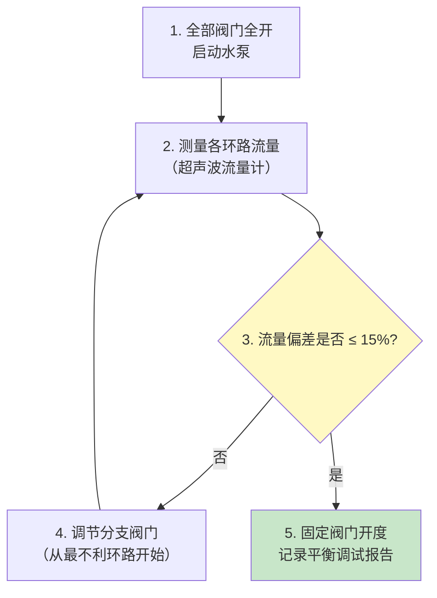

# 第5章 水系统检测

第 5 章规定了空调水系统（冷冻水、冷却水、热水）的检测方法，核心是管道的**水压试验**（强度与严密性）、**水力平衡**调试和**水流量测定**。

---

## 5.1 管道水压试验

### 5.1.1 试验压力

| 管道类型 | 试验压力 | 试验时间 |
|:------:|:------:|:------:|
| **冷/热水管道** | **1.5 倍工作压力**，且 ≥ 0.6MPa | ≥ 10 min |
| **冷却水管道** | 1.5 倍工作压力 | ≥ 10 min |
| **蒸汽管道** | 1.5 倍工作压力 | ≥ 10 min |
| **凝结水管道** | 1.0 倍工作压力 | ≥ 10 min |
| **制冷剂管道（气态）** | 按设计，通常 1.5~2.0 倍工作压力 | ≥ 24h（系统保压） |

> [!important] 关键判定
> 水压试验的合格标准：**在试验压力下稳压 ≥ 10min，压力下降 ≤ 0.02MPa，且管道所有连接处无渗漏、无变形**。

### 5.1.2 试验步骤

| 步骤 | 操作 |
|:--:|------|
| 1 | **注水排气**：从系统最低点注水，最高点排放空气 |
| 2 | **升压**：缓慢升压至试验压力（升压速率 ≤ 0.1 MPa/min） |
| 3 | **稳压**：在试验压力下保持 ≥ 10 min，检查压力降 |
| 4 | **检查**：全面检查所有焊缝、法兰、阀门、丝扣等连接处 |
| 5 | **降压**：试验合格后缓慢降压至工作压力，再次检查 |
| 6 | **记录**：填写水压试验记录表，各方签字确认 |

### 5.1.3 试验注意事项

| 注意点 | 说明 |
|------|------|
| **隔离设备** | 试验前须将不耐压设备（冷水机组、末端盘管等）隔离或断开 |
| **温度要求** | 环境温度 ≥ 5°C，防止冻裂 |
| **安全阀** | 试验管道须设置安全阀，压力设定为试验压力的 1.1 倍 |
| **排水** | 试验后须将系统内水排净，防止冬季冻裂 |

---

## 5.2 水力平衡

### 5.2.1 水力平衡目标

| 系统类型 | 流量允许偏差 |
|----------|:----------:|
| 空调冷冻水系统 | 各环路流量偏差 ≤ 15% |
| 冷却水系统 | 各冷却塔/冷凝器流量偏差 ≤ 10% |
| 热水采暖系统 | 各立管/环路流量偏差 ≤ 15% |

### 5.2.2 水力平衡步骤

### 5.2.3 水力平衡常用仪表

| 仪表 | 用途 | 精度 |
|------|------|:---:|
| 超声波流量计 | 管道外壁非接触测量水流量 | ±1% |
| 电磁流量计 | 导电液体流量，需安装在管道上 | ±0.5% |
| 平衡阀配套差压计 | 读取平衡阀两端压差，换算流量 | ±2% |
| 涡轮流量计 | 洁净水流，价格较低 | ±1.5% |

---

## 5.3 水流量测定

### 5.3.1 测定方法

| 方法 | 安装方式 | 适用管径 | 优点 |
|------|:------:|:------:|------|
| **超声波流量计（外夹式）** | 管道外壁 | DN25~DN3000 | 无需断管、不影响运行 |
| **电磁流量计** | 管道内嵌 | DN15~DN3000 | 精度最高 |
| **平衡阀 + 差压计** | 阀门自带测压孔 | 按平衡阀规格 | 配合水力平衡同步完成 |
| **容积法（量桶+秒表）** | 末端排水 | 小口径 | 简单、成本低 |

### 5.3.2 超声波流量计操作要点

| 要点 | 说明 |
|------|------|
| 安装位置 | 选直管段（上游 ≥ 10D，下游 ≥ 5D） |
| 管道表面处理 | 清除锈蚀、油漆，涂耦合剂 |
| 探头安装 | V 法（小管径）或 Z 法（大管径） |
| 多次测量 | 每点测量 3 次取平均值 |

---

## 5.4 水泵性能检测

| 检测项目 | 方法 | 判定 |
|----------|------|:---:|
| 流量 | 超声波流量计 | ≥ 90% 额定流量 |
| 扬程 | 泵进出口压力表读数 | ≥ 90% 额定扬程 |
| 轴功率 | 电流电压法 | ≤ 额定功率 |
| 效率 | 水力功率 ÷ 轴功率 | 偏差 ≤ 5% |
| 振动 | 振动仪测量轴承处 | ≤ 2.8 mm/s (RMS) |

> 详细设备检测见 第7章 设备检测。

---

## 5.5 水系统检测汇总

| 检测项目 | 核心参数 | 合格标准 |
|----------|------|:---:|
| 水压试验 | 1.5 倍工作压力 | ≥ 10min，压力下降 ≤ 0.02MPa，无渗漏 |
| 水力平衡 | 各环路流量 | 偏差 ≤ 15% |
| 水流量测定 | 总流量/分支流量 | 偏差 ≤ 10% |
| 水温 | 供回水温度 | 设计值 ± 1°C |

---

## 🔗 相关链接

- **风系统检测** → 第4章 风系统检测
- **室内环境检测** → 第6章 室内环境检测
- **设备检测** → 第7章 设备检测
- **验收规范** → GB50243-2016 第9章 空调水系统管道与设备安装

← 返回 JGJT260-2011-章节索引|JGJ/T 260-2011 章节索引
