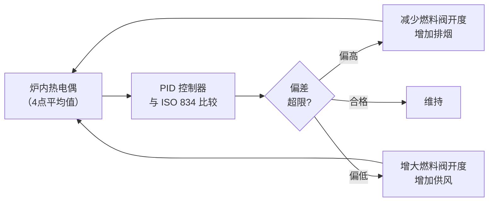

# 第5章 试验条件

> [!important] 章节定位
> 第5章定义了通风管道耐火试验的**核心试验条件**——标准升温曲线（ISO 834）和炉温控制要求。所有耐火试验的升温过程必须严格遵循该曲线，这是确保试验结果国际互认的基础。

---

## 一、标准升温曲线（ISO 834）

### 1.1 曲线函数

ISO 834 标准升温曲线的数学表达式：

> **T − T₀ = 345 log₁₀(8t + 1)**

| 符号 | 含义 | 单位 |
|:----:|------|:----:|
| **T** | t 时刻的炉内平均温度 | °C |
| **T₀** | 初始炉温（常温，一般 20°C） | °C |
| **t** | 试验持续时间 | min |

### 1.2 标准升温曲线数据表

| 时间 t (min) | 计算温度 T (°C) | 温升速率 (°C/min) |
|:-----------:|:---------------:|:-----------------:|
| 0 | 20（室温） | — |
| 5 | 576 | ~111 |
| 10 | 679 | ~21 |
| 15 | 739 | ~12 |
| 20 | 781 | ~8.4 |
| 30 | 842 | ~6.1 |
| 45 | 902 | ~3.6 |
| 60 | 945 | ~2.4 |
| 90 | 1006 | ~1.3 |
| 120 | 1049 | ~0.7 |
| 180 | 1110 | ~0.4 |
| 240 | 1153 | ~0.3 |

> [!tip] 曲线特征解读
> - **前 5 分钟升温极快**（~556°C 温差），模拟火灾初期快速增长阶段（轰燃）
> - **10 分钟后升温速率迅速衰减**，呈对数函数特性
> - **60 分钟达 945°C**，接近大多数建筑火灾的充分发展温度
> - **120 分钟达 1049°C**，模拟长时间火灾场景

### 1.3 ISO 834 曲线图

```
  T(°C)
 1200│                                    ╭───
     │                              ╭─────╯
 1000│                        ╭─────╯
     │                  ╭─────╯
  800│            ╭─────╯
     │      ╭─────╯
  600│ ╭────╯
     │╭╯
  400│╯
     │
  200│
     │
    0└────┬────┬────┬────┬────┬────┬────┬────
     0    30   60   90  120  150  180  210  240
                      t(min)
```

---

## 二、炉温控制要求

### 2.1 温度偏差限值

| 时间阶段 | 允许偏差 | 说明 |
|----------|:--------:|------|
| **0~5 min** | ±15%（相对值）| 初期升温极快，控制难度高 |
| **5~10 min** | ±15% → ±10%（过渡）| 过渡区间 |
| **10 min 以上** | ±10%（相对值）或 ±100°C（绝对值），取大值 | 稳定阶段，以绝对值为主 |

> **公式表达**：
> - 当 T < 1000°C 时：偏差 ≤ ±10% T
> - 当 T ≥ 1000°C 时：偏差 ≤ ±100°C

### 2.2 温度控制的实现



### 2.3 温度偏差的合格判定

| 判定项 | 标准 |
|--------|------|
| **单点偏差** | 允许个别热电偶短时间超出偏差限，但在总试验时间内，各热电偶读数偏差超出限值的时间累计 ≤ 总时长的 5% |
| **平均偏差** | 4 点平均温度与标准曲线偏差必须在限值内 |
| **不合格处理** | 如温度控制无法满足要求，试验结果无效，须重做 |

---

## 三、其他试验条件

### 3.1 炉内压力

| 参数 | 值 | 备注 |
|------|:--:|------|
| **基准压力** | 20 Pa | 炉内相对于环境大气的正压 |
| **允许偏差** | ±3 Pa | — |
| **测量高度** | 管道试件中心高度 | — |

### 3.2 环境条件

| 条件 | 要求 |
|------|------|
| **试验大厅温度** | 5°C ~ 35°C |
| **试验大厅相对湿度** | ≤ 85% |
| **通风** | 良好的通风排烟系统，确保试验人员安全 |
| **试件养护** | 试件在试验前须在 20±5°C、湿度 50±20% 条件下养护至规定龄期 |

### 3.3 A类试验附加条件

| 参数 | 要求 |
|------|:--:|
| **管内空气流速** | 3 ± 0.5 m/s（冷空气） |
| **管内空气温度** | 常温（不加热） |
| **管内流量** | 按管道截面积 × 3m/s 计算 |

---

## 四、试验条件对比（A类 vs B类）

| 试验条件 | A类（外部火） | B类（内部火） |
|----------|:------------:|:------------:|
| **炉温曲线** | ISO 834 | ISO 834 |
| **炉内压力** | 20 ± 3 Pa | 20 ± 3 Pa |
| **管内条件** | 冷空气 3m/s 流通 | 自然对流（无强制通风） |
| **受火面** | 管道外表面 | 管道内表面 |
| **测温面** | 管道外表面（非受火面） | 管道内表面（非受火面） |

---

## 🔗 相关页面

- 试验设备配置 → 第4章 试验设备
- A类试验（外部火）流程 → 第6章 管道A类试验(外部火)
- B类试验（内部火）流程 → 第7章 管道B类试验(内部火)

---

← 返回 GBT17428-2009-章节索引|GBT17428-2009 章节索引
