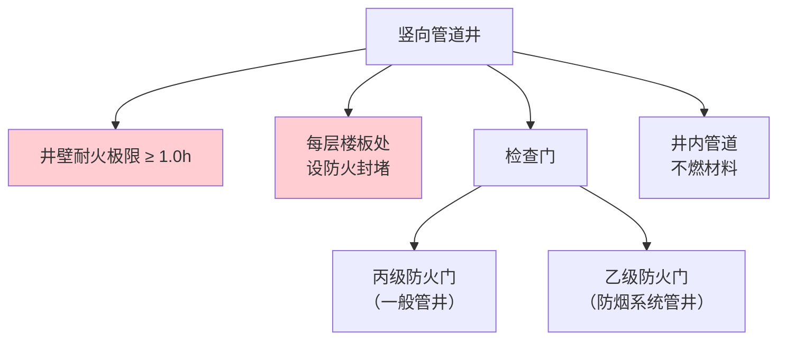
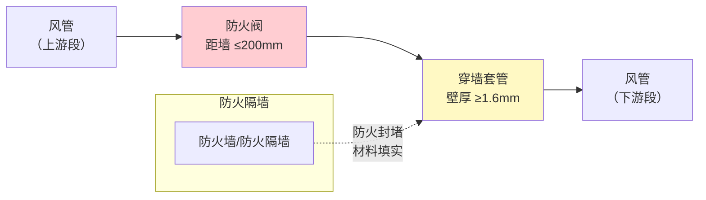

# 第6章 建筑构造（管道井防火与穿越封堵）

> [!important] 章节定位
> GB 50016-2014 第6章"建筑构造"规定了防火墙、防火隔墙、管道井、变形缝等建筑构件的防火要求。对暖通风管专业而言，核心在于**6.2.9 条（管道井）** 和 **6.3.5 条（风管穿越防火分隔封堵）**。管道井是竖向风管的主要敷设通道，其防火构造直接决定风管系统的防烟防火能力。

---

## 一、管道井防火要求（第 6.2.9 条）

### 1.1 管道井井壁耐火极限

> [!warning] 强制性条文 6.2.9
> 建筑内的电缆井、管道井……等竖向井道，井壁的耐火极限不应低于 **1.00 h**。

| 项目 | 要求 | 说明 |
|------|------|------|
| **井壁材料** | 不燃材料 | 砖墙、混凝土墙、加气混凝土砌块等 |
| **井壁耐火极限** | ≥ **1.00 h** | 防止火灾在竖向井道内快速蔓延 |
| **井壁厚度** | 按材料燃烧性能和耐火极限核算 | 一般 ≥ 100mm（砖墙/混凝土） |

### 1.2 每层楼板封堵

| 要求项 | 具体内容 |
|--------|----------|
| **封堵位置** | 管道井应在**每层楼板处**进行封堵 |
| **封堵材料** | 采用**不低于楼板耐火极限**的不燃材料或防火封堵材料 |
| **封堵目的** | 防止火灾通过管道井竖向蔓延（阻断"烟囱效应"） |

> [!tip] 管道井"烟囱效应"
> 竖向管道井是火灾蔓延的高速通道——热烟气在竖井内上升速度可达 3~5 m/s，几秒内即可从低层窜至顶层。每层楼板封堵是将竖井分割为独立防火单元、阻断烟囱效应的**最关键措施**。

### 1.3 检查门防火等级

| 管井类型 | 检查门防火等级 | 说明 |
|----------|:------------:|------|
| **一般管道井** | **丙级防火门** | 耐火极限 ≥ 0.5 h |
| **防烟系统管道井** | **乙级防火门** | 耐火极限 ≥ 1.0 h |
| **防火墙上的门** | **甲级防火门** | 耐火极限 ≥ 1.5 h |

| 防火门等级 | 耐火极限 | 适用位置 |
|:--------:|:--------:|----------|
| 甲级 | ≥ 1.5 h | 防火墙 |
| 乙级 | ≥ 1.0 h | 防烟管井、疏散楼梯间 |
| 丙级 | ≥ 0.5 h | 一般管道井 |

### 1.4 井内管道要求

| 要求项 | 具体内容 |
|--------|----------|
| **管道材料** | 井内敷设的管道（含风管）必须采用**不燃材料**制作 |
| **风管连接** | 井内风管不应有法兰连接（或确保法兰处密封可靠） |
| **保温材料** | 如需保温，应采用 **A 级不燃材料** |

---

## 二、风管穿越防火分隔封堵（第 6.3.5 条）

### 2.1 核心要求

> [!warning] 强制性条文 6.3.5
> 防烟、排烟、供暖、通风和空气调节系统中的管道，在穿越防火隔墙、楼板和防火墙处的**孔隙应采用防火封堵材料封堵**。

### 2.2 穿越不同防火构件的封堵要求

| 穿越部位 | 封堵要求 | 辅助措施 |
|----------|----------|----------|
| **防火墙** | 防火封堵材料填实 + 设置防火阀（9.3.11条） | 防火墙两侧各 2m 风管采用防火保护 |
| **防火隔墙** | 防火封堵材料填实 + 设置防火阀 | 同防火墙 |
| **楼板** | 防火封堵材料填实 | 套管厚度 ≥ 1.6mm |
| **变形缝** | 两侧设置防火阀 + 防火封堵 | 变形缝处柔性接管须 A 级不燃 |

### 2.3 防火封堵材料要求

| 材料类型 | 常见产品 | 性能要求 |
|----------|----------|----------|
| **防火堵料** | 有机堵料、无机堵料 | 耐火极限不低于穿越构件的耐火极限 |
| **防火包** | 膨胀型防火包 | 遇火膨胀，填充空隙 |
| **防火板** | 硅酸钙板、防火石膏板 | 用于较大孔洞封堵 |
| **防火密封条** | 膨胀型密封条 | 用于缝隙密封 |

### 2.4 穿墙风管构造示意

---

## 三、变形缝处的风管要求

### 3.1 变形缝两侧防火阀设置

| 要求项 | 具体内容 |
|--------|--------|
| **条文依据** | GB 50016 第 9.3.11 条第④款 |
| **设置要求** | 穿越防火分隔处的**变形缝两侧**均应设置防火阀 |
| **目的** | 变形缝是建筑防火的最薄弱环节之一，火灾时变形缝两侧位移可能导致风管断裂，两侧设阀形成双保险 |

### 3.2 变形缝处风管材料

| 要求 | 说明 |
|------|------|
| **柔性短管** | 变形缝处必须采用 **A 级不燃** 柔性短管 |
| **不得使用** | 普通帆布软接（B1 级难燃）**不得**用于变形缝处 |

---

## 四、防火墙管道穿越限制

### 4.1 第 6.1.5 条 —— 防火墙上不得随意开洞

> [!danger] 强制性条文 6.1.5
> 防火墙上不应开设门、窗、洞口，**确需开设时，应设置不可开启或火灾时能自行关闭的甲级防火门、窗**。

| 含义 | 对风管工程的影响 |
|------|-----------------|
| 防火墙上**原则上不得开风管洞口** | 风管应尽量避免穿越防火墙 |
| 确需穿越时 | 必须设置防火阀 + 防火封堵，且风管两侧 2m 范围内须防火保护 |

---

## 五、风管制造中的管道井接口要点

| 制造/施工环节 | 接口要求 | 关联标准 |
|--------------|----------|:--------:|
| **井内风管板材** | 必须选用不燃材料（镀锌钢板/不锈钢） | 本章 1.4 |
| **穿墙风管段** | 穿越防火墙/防火隔墙两侧各 2m 的管段须防火保护 | 第9章3节 风管材料与保温燃烧性能 |
| **穿墙套管** | 钢制套管，壁厚 ≥ 1.6mm，套管与风管间防火封堵 | GB50738-2011 通风与空调工程施工规范 |
| **防火阀距墙** | ≤ 200mm，阀与墙之间风管用 ≥ 1.6mm 厚钢板 | 第9章2节 通风与空调系统防火阀设置 |
| **每层封堵** | 管道井每层楼板处用不燃材料封堵 | 本章 1.2 |
| **检查门** | 检修口设在便于操作位置，防火门等级与管井匹配 | 本章 1.3 |

---

## 📊 管道井防火要求速查表

| 构件/部位 | 耐火极限 | 材料要求 | 防火门等级 |
|-----------|:--------:|----------|:----------:|
| 管道井井壁 | ≥ 1.0 h | 不燃材料 | — |
| 管道井检查门（一般） | — | — | **丙级**（≥0.5h） |
| 防烟系统管道井检查门 | — | — | **乙级**（≥1.0h） |
| 井内风管 | — | **不燃材料** | — |
| 每层楼板封堵 | ≥ 楼板耐火极限 | 不燃封堵材料 | — |
| 穿越防火墙封堵 | ≥ 防火墙耐火极限 | 防火封堵材料 | — |

---

## 🔗 相关页面

- 防火阀六类必设位置 → 第9章2节 通风与空调系统防火阀设置
- 风管材料与保温燃烧性能 → 第9章3节 风管材料与保温燃烧性能
- 风管安装穿越结构要求 → GB50738-2011 通风与空调工程施工规范
- 防排烟系统风管 → GB51251-2017 建筑防烟排烟系统技术标准
- 章节总览 → GB50016-2014-章节索引|GB50016-2014 章节索引

---

← 返回 GB50016-2014-章节索引|GB50016-2014 章节索引
