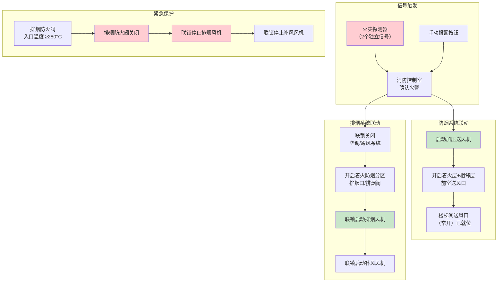
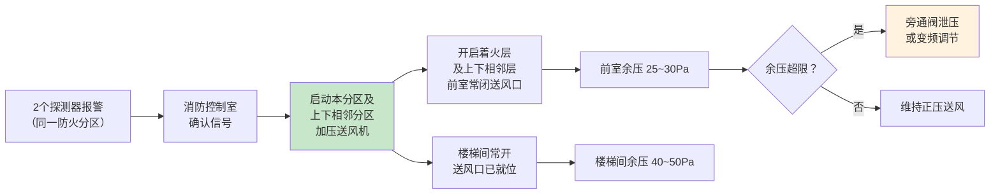
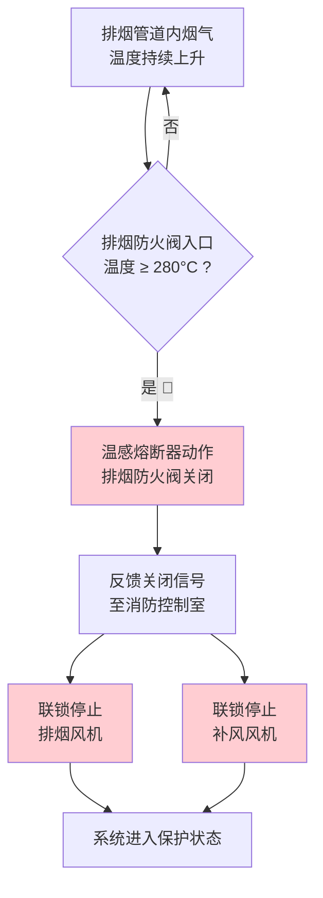

# 第6章 系统控制

> [!abstract] 本章概要
> GB 51251-2017 第6章规定了防烟排烟系统的控制要求，包括**火灾自动报警联动控制**和**手动控制**两种方式。核心逻辑链条：**火灾探测器报警 → 防火阀关闭 → 排烟阀开启 → 排烟风机启动**。所有控制信号须反馈至**消防控制室**，实现全程监控。

---

## 一、控制架构总览

---

## 二、联动控制核心逻辑

### 2.1 完整联动时序

> [!important] 🔥 火灾报警 → 联动控制全流程

| 时序 | 动作 | 触发条件 | 执行对象 |
|:----:|------|----------|----------|
| **T+0** | 火灾确认 | **2 个独立火灾探测器**报警（同一防火分区） | 消防控制室主机 |
| **T+1** | 关闭非消防系统 | 火灾确认信号 | 关空调、关通风、关电辅热 |
| **T+2** | 启动防烟系统 | 火灾确认信号 | 加压送风机启动 → 前室送风口开启 |
| **T+3** | 启动排烟系统 | 火灾确认信号 | 排烟阀/口全开 → 排烟风机启动 |
| **T+4** | 启动补风系统 | 排烟风机运行信号 | 补风风机启动 / 补风口开启 |
| **T+n** | 280°C 紧急停机 | 排烟防火阀入口温度 ≥280°C | 排烟防火阀关闭 → 联锁停排烟风机+补风机 |

### 2.2 防烟系统（加压送风）联动

> [!tip] 加压送风余压控制
> 前室与走道压差 **25~30 Pa**，楼梯间 **40~50 Pa**。超压时通过**旁通阀泄压**或**风机变频**调节，确保疏散门开启力 ≤ 100N。

### 2.3 排烟系统联动

| 步骤 | 动作 | 关键要求 |
|:----:|------|----------|
| 1 | 接收火灾确认信号 | 消防控制室发出指令 |
| 2 | 关闭通风空调系统 | 防止空气循环助燃 |
| 3 | **全开着火防烟分区的排烟口/阀** | 该分区内所有排烟阀同步开启 |
| 4 | 联锁启动排烟风机 | 排烟阀开启信号作为风机启动条件 |
| 5 | 联锁启动补风风机 | 排烟风机运行后，补风系统投入 |

---

## 三、280°C 排烟防火阀关闭联动

> [!danger] 🔴 280°C 紧急停机联锁
> 这是排烟系统的**最后一道防线**。当火灾持续发展，排出烟气温度达到 280°C 时，意味着火源温度已极高，继续排烟可能损坏风机甚至引入更多氧气助燃。

---

## 四、手动控制

### 4.1 手动控制方式

| 控制位置 | 控制方式 | 控制权限 |
|----------|----------|:--------:|
| **消防控制室** | 手动直接控制盘（硬线） | ⭐最高 |
| **现场手动按钮** | 排烟口/阀旁的手动开启装置 | 就地优先执行 |
| **风机控制柜** | 就地启停按钮 | 检修/测试用 |

### 4.2 手动控制要求

> [!important] 手动控制设计原则
> - **消防控制室**应能**手动直接控制**防排烟风机的启停（硬线连接，不经过联动控制器）
> - 控制盘的启停按钮应**独立于自动联动**，确保自动系统失效时仍可手动操控
> - 排烟口/阀应设置**现场手动开启装置**，距地 1.3~1.5m
> - 手动控制信号应**反馈至消防控制室**，显示风机和阀门状态

---

## 五、供电要求

| 要求项 | 具体内容 |
|--------|----------|
| **负荷等级** | 按建筑类别确定（一级/二级消防负荷） |
| **双电源** | 末端自动切换（重要建筑） |
| **保护** | 消防风机不得装设过负荷保护切断装置（仅报警不跳闸） |
| **线缆** | 应采用**耐火电缆**或**矿物绝缘电缆** |

---

## 六、控制逻辑速查表

| 触发事件 | 控制动作 | 反馈信号 |
|----------|----------|----------|
| 2 个探测器报警 | 启动加压送风机 + 开送风口 | 风机运行、阀门开到位 |
| 2 个探测器报警 | 启动排烟风机 + 全开排烟阀 | 风机运行、阀门开到位 |
| 排烟风机运行 | 启动补风风机 | 补风风机运行 |
| 280°C 排烟防火阀动作 | 停排烟风机 + 停补风风机 | 阀门关到位、风机停止 |
| 消防控制室手动指令 | 启/停任意防排烟风机 | 执行状态反馈 |
| 现场手动按钮 | 开/关排烟口/阀 | 阀门状态反馈 |
| 前室超压 | 旁通阀开启 / 风机降频 | 压差值恢复正常 |

---

## 七、与火灾自动报警系统的关系

> [!warning] 防排烟联动依赖 FAS
> 防排烟系统的联动控制**必须与火灾自动报警系统（FAS）集成**。GB 51251 第6章的设计前提是建筑已按 GB 50116《火灾自动报警系统设计规范》设置了 FAS。

| FAS 组件 | 防排烟联动作用 |
|----------|---------------|
| **感烟探测器** | 防烟分区火灾确认信号（需 2 个独立信号） |
| **感温探测器** | 辅助确认 + 防误报 |
| **手动报警按钮** | 人工确认火灾信号 |
| **消防控制室主机** | 综合判断 → 发出联动指令 |
| **输入/输出模块** | 连接风机、阀门，采集/输出信号 |

---

## 🔗 相关页面导航

- 📑 **章节索引**：GB51251-2017-章节索引
- 🔥 **4.4.8 排烟风管耐火极限**：[第4章 排烟系统设计](/knowledge/pipe-fitting-spec/第4章-排烟系统设计/)
- 💨 **排烟口/阀 + 风机选型**：第5章 排烟系统设计(续)
- 🔒 **3.3.9 管道井耐火**：[第3章 防烟系统设计](/knowledge/pipe-fitting-spec/第3章-防烟系统设计/)
- 🔧 **施工安装**：[第7章 系统施工](/knowledge/pipe-fitting-spec/第7章-系统施工/)
- 📐 **调试验收**：[第8章 系统调试与验收](/knowledge/pipe-fitting-spec/第8章-系统调试与验收/)
- 🚦 **防火阀门标准**：GB15930-2007 建筑通风和排烟系统用防火阀门
- 📋 **标准总览**：[中国标准索引](/knowledge/pipe-fitting-spec/中国标准索引/)

---

← 返回 GB51251-2017-章节索引|GB51251-2017 章节索引
