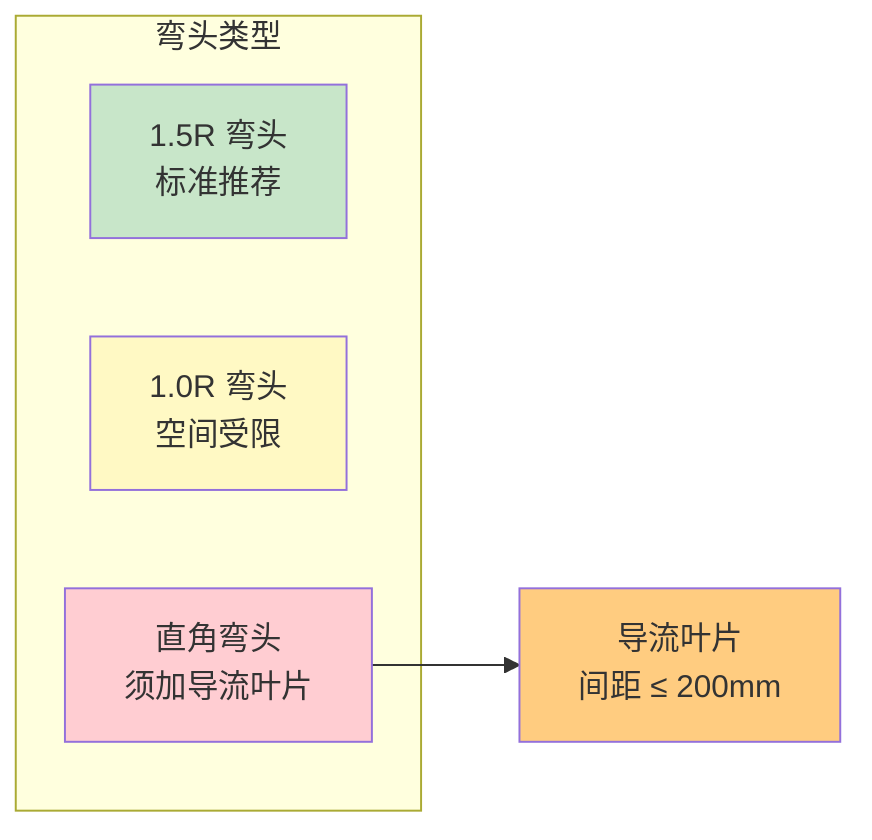

# 第6章 风管配件与部件

第 6 章规定了通风管道系统中各类**配件（弯头、变径、三通）** 和 **部件（风阀、消声器、天圆地方）** 的制作要求。这些配件是风管系统的关键节点，其几何精度和气流特性直接影响系统阻力和运行效果。

---

## 6.1 弯头（90° 矩形/圆形弯头）

### 6.1.1 弯头曲率半径

| 弯头类型 | 曲率半径 R | 适用场景 | 局部阻力 |
|:------:|:---------:|----------|:------:|
| **1.5 倍半径弯头** | R = 1.5 × 风管宽度/直径 | 标准送排风系统（推荐） | 较小 |
| **1.0 倍半径弯头** | R = 1.0 × 风管宽度/直径 | 空间受限处 | 中等 |
| **直角弯头** | R = 0（直角转向） | 必须采用时须加导流叶片 | 较大 |

> [!tip] CAMduct 弯头设置
> 在 CAMduct 的 **Fitting Library** 中，弯头 (Elbow) 可设置为 **1.5R / 1.0R / Custom Radius**，并支持分段数设定。推荐使用 **1.5R** 作为默认值以降低系统阻力。详见 管件制造(弯头三通等)。

### 6.1.2 弯头导流叶片

当采用**直角弯头**或空间受限无法采用 1.0R/1.5R 弯头时，必须设置**导流叶片**以降低阻力：

| 导流叶片参数 | 要求 |
|:----------|------|
| **叶片间距** | ≤ 200 mm（等间距分布） |
| **叶片曲率** | 与弯头内弧同心 |
| **叶片材质** | 与风管同材质（镀锌钢板/不锈钢） |
| **叶片固定方式** | 铆接或点焊于弯头内壁 |
| **叶片数量** | 弯头宽度 ÷ 200 - 1（至少 1 片） |

---

## 6.2 变径（大小头）

### 6.2.1 变径类型

| 变径类型 | 形式 | 适用场景 | 气流特性 |
|:------:|------|----------|:------:|
| **单面偏变径** | 一面保持平直，另一面偏斜 | 贴顶/贴墙安装 | 偏流较大 |
| **双面偏变径** | 两侧对称偏斜 | 标准安装（推荐） | 气流均匀 |

### 6.2.2 变径扩散角/收缩角

| 变径方向 | 推荐角度 | 最大角度 |
|:------:|:-----:|:-----:|
| **扩散（小→大）** | ≤ 15° | ≤ 30° |
| **收缩（大→小）** | ≤ 30° | ≤ 60° |

> [!note] 变径长度计算
> 双面偏变径长度 L = (B - b) / (2 × tan(θ/2))，其中 B 为大端尺寸，b 为小端尺寸，θ 为扩散/收缩角。

---

## 6.3 三通

### 6.3.1 三通类型

| 三通类型 | 结构形式 | 气流特性 | 制作难度 |
|:------:|----------|:------:|:------:|
| **插接三通（直通三通）** | 主管直通、支管插入 | 支管局部阻力大 | ⭐ 简单 |
| **T 型三通** | 两分支与主管成 90° | 气流分配均匀 | ⭐⭐ 中等 |
| **Y 型三通** | 两分支斜向汇入/分流 | 阻力最小（推荐） | ⭐⭐⭐ 较复杂 |
| **裤裆三通** | 圆弧过渡分流 | 大流量分流 | ⭐⭐⭐ 复杂 |

### 6.3.2 Y 型三通夹角

| 应用 | 推荐夹角 |
|------|:-----:|
| 送风系统分流 | 30°~45° |
| 排风系统汇流 | 30°~45° |
| 除尘系统（含颗粒物） | ≤ 30° |

> CAMduct 三通通过 **Fitting Library > Tee/Wye** 定义，支持 T 型、Y 型和自定义参数。详见 管件制造(弯头三通等)。

---

## 6.4 风阀

### 6.4.1 风阀类型

| 风阀类型 | 功能 | 制作要求 |
|----------|------|----------|
| **手动调节阀** | 风量调节 | 叶片启闭灵活，全开/全闭标记清晰 |
| **电动调节阀** | 自动风量调节 | 执行器与阀体匹配，关闭时漏风率 ≤ 5% |
| **止回阀** | 防倒流 | 重力式或弹簧式，阀板关闭严密 |
| **防火阀** | 70°C/280°C 熔断关闭 | 🔴 必须独立支吊架，与防火墙间距 ≤ 200mm |
| **排烟防火阀** | 280°C 熔断关闭 | 🔴 必须符合 GB15930 认证 |

### 6.4.2 风阀严密性

| 阀门类型 | 允许漏风量 |
|----------|:------:|
| 调节阀（关闭时） | ≤ 5% 额定风量 |
| 止回阀（反向） | ≤ 3% 额定风量 |
| 防火阀 | 按 GB15930 规定的漏烟量 |

---

## 6.5 消声器

### 6.5.1 消声器类型

| 类型 | 消声原理 | 适用频率 | 应用场景 |
|:----:|----------|:------:|----------|
| **阻性消声器（片式/管式）** | 吸声材料（玻璃棉/矿棉）吸收声能 | 中高频 | 空调送排风管 |
| **抗性消声器（膨胀腔）** | 声波反射干涉 | 低频 | 风机出口 |
| **阻抗复合消声器** | 阻性+抗性结合 | 宽频 | 高标准降噪要求 |
| **微穿孔板消声器** | 微孔共振吸声 | 宽频 | 洁净空调（无纤维脱落） |

### 6.5.2 消声器制作要求

| 项目 | 要求 |
|------|------|
| **吸声材料** | 填充均匀密实，覆面材料（玻璃布）防护，防止纤维吹出 |
| **穿孔板** | 穿孔率 20%~30%，孔径 2~5mm，板面平整 |
| **外壳** | 采用 ≥ 0.8mm 镀锌钢板，法兰连接 |
| **气流速度** | 通过消声器风速 ≤ 8 m/s（阻性）/ ≤ 12 m/s（抗性） |

---

## 6.6 天圆地方（方圆变径）

**天圆地方**是矩形风管与圆形风管之间的过渡管件。

| 参数 | 要求 |
|------|------|
| **过渡长度** | 一般为 (矩形长边 - 圆直径) × 1.5~2.0 倍 |
| **制作方式** | 展开下料 → 折弯 → 咬口/焊接 |
| **板面分块** | 4 个三角形平面 + 4 个曲面过渡，曲面部分可增加分块数 |
| **接口处理** | 矩形端按矩形法兰，圆形端按圆形法兰 |

> CAMduct 中天圆地方通过 **Fitting Library > Transition (Rect to Round)** 定义，可设定过渡长度和分段数。详见 管件制造(弯头三通等)。

---

## 🔗 相关链接

- **金属风管** → [第4章 金属风管](/knowledge/pipe-fitting-spec/第4章-金属风管/)
- **风管制作** → [第7章 风管制作](/knowledge/pipe-fitting-spec/第7章-风管制作/)
- **风管安装** → [第8章 风管安装](/knowledge/pipe-fitting-spec/第8章-风管安装/)
- **防火阀标准** → GB15930-2007 建筑通风和排烟系统用防火阀门
- **CAMduct 管件制造** → 管件制造(弯头三通等)
- **风管连接方式** → 风管连接方式

← 返回 JGJ141-2017-章节索引|JGJ141-2017 章节索引
