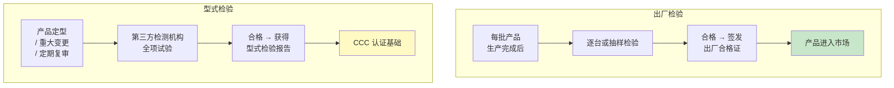
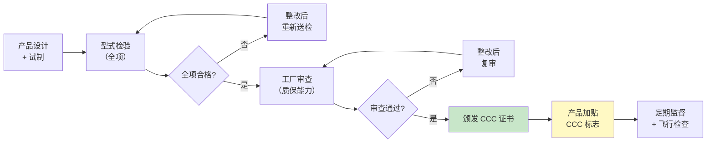

# 第7章 检验规则 + 第8章 标志

> [!important] 章节定位
> 第7章和第8章共同构成 GB 15930-2007 的**准入合规体系**——检验规则告诉你"怎么证明产品合格"，标志告诉你"合格产品长什么样"。两章内容紧密关联：通过检验的产品才能加贴标志，标志信息又反哺检验追溯。本章合并阐述，便于系统理解防火阀门的市场准入要求。

---

## 一、检验分类

### 1.1 两类检验的核心区别

GB 15930-2007 将检验分为**出厂检验**和**型式检验**两类：

| 对比维度 | 出厂检验 | 型式检验 |
|----------|----------|----------|
| **时机** | 每批产品生产完成出厂前 | 产品定型、重大变更、定期复查（通常每 2~3 年） |
| **频次** | **每批次** | 周期性或事件驱动 |
| **检验范围** | 关键项目（抽检） | **全项检验**（第5章所有技术要求） |
| **执行主体** | 生产企业质检部门 | **第三方检测机构**（CMA/CNAS 认可实验室） |
| **判定用途** | 批次放行 | CCC 认证、型式批准 |
| **报告效力** | 出厂合格证 | 型式检验报告（CCC 认证核心文件） |
| **法律后果** | 不合格批次不得出厂 | 不合格则产品不得取得认证、不得上市销售 |

---

## 二、出厂检验

### 2.1 出厂检验项目

| 序号 | 检验项目 | 检验方法 | 技术要求条款 | 必检/抽检 |
|:----:|----------|:--------:|:-----------:|:--------:|
| 1 | **外观检查** | 目测 + 量具 | 铭牌完整、标识清晰、无损伤变形 | 逐台 |
| 2 | **尺寸检查** | 钢卷尺、游标卡尺 | 法兰尺寸、外形尺寸符合图纸 | 抽检 |
| 3 | **手动操作** | 手动启闭 3 次 | 操作灵活、无卡阻、到位准确 | 逐台 |
| 4 | **电控操作**（如适用） | 通额定电压试验 | DC 24V/AC 220V 下动作正常 | 逐台 |
| 5 | **温感器动作温度** | 恒温箱 1°C/min 升温 | 70±2°C / 280±3°C | 抽检 |
| 6 | **漏风量** | 漏风量测试台 300Pa | ≤500 / ≤200 m³/(h·m²) | 抽检 |
| 7 | **绝缘电阻**（如适用） | 500V 兆欧表 | ≥ 20 MΩ | 逐台 |

### 2.2 抽样方案

| 参数 | 要求 |
|------|------|
| **抽样方式** | 同一批次、同一型号的产品中**随机抽取** |
| **抽样比例** | 按标准规定的 AQL（可接受质量水平）或百分比抽样 |
| **温感器抽检** | 每批次至少抽取 3 件温感器进行动作温度试验 |
| **漏风量抽检** | 每批次至少抽取 1 台进行漏风量试验 |

> [!tip] 批量与抽样数量参考
> | 批量范围 | 抽样数量 |
> |----------|:--------:|
> | 1 ~ 15 | 2 台 |
> | 16 ~ 50 | 3 台 |
> | 51 ~ 150 | 5 台 |
> | 151 ~ 500 | 8 台 |
> | > 500 | 13 台 |

### 2.3 判定规则

| 情形 | 处置 |
|------|------|
| **全部合格** | 整批接收，签发合格证 |
| **发现 1 项不合格** | 加倍抽样复检；复检仍不合格 → 整批返回 |
| **发现致命缺陷** | 整批立即停止出厂，已出厂的同批产品召回 |
| **逐台检验项目不合格** | 不合格品单独标记，修理后重新检验，仍不合格则报废 |

---

## 三、型式检验

### 3.1 型式检验触发条件

> [!warning] 以下情况必须进行型式检验

| 序号 | 触发条件 |
|:----:|----------|
| ① | **新产品试制定型**——首批生产前 |
| ② | **产品结构、材料、关键工艺**发生重大变更 |
| ③ | **转厂生产**——变更生产场地 |
| ④ | **停产 2 年以上恢复生产** |
| ⑤ | **CCC 认证**初次申请或换证 |
| ⑥ | **监督抽查**或用户对质量提出重大质疑 |
| ⑦ | 正常生产情况下，**每 2~3 年**进行一次定期型式检验 |

### 3.2 型式检验项目（全项）

| 序号 | 试验项目 | 对应第6章 | 对应第5章 |
|:----:|----------|:--------:|:--------:|
| 1 | 外观与标志检查 | — | 铭牌、标识 |
| 2 | **耐火试验** | 二 | 一 |
| 3 | **温感器动作温度试验** | 三 | 二 |
| 4 | **漏风量试验** | 四 | 三 |
| 5 | **启闭可靠性试验（50次）** | 五 | 四 |
| 6 | **耐盐雾腐蚀试验** | 六 | 六 |
| 7 | 绝缘电阻试验 | 七 | 五 |
| 8 | 控制功能电压范围试验 | 七 | 五 |

### 3.3 型式检验抽样

| 参数 | 要求 |
|------|------|
| **抽样基数** | ≥ 10 台（正式生产后） |
| **试样数量** | 至少 **3 台**（每项试验可分别抽样） |
| **抽样方式** | 在生产企业成品库或市场流通中随机抽取 |

### 3.4 判定规则

| 情形 | 处置 |
|------|------|
| 全部项目合格 | 型式检验**通过** |
| 耐火试验不合格 | **一票否决**——判为不合格，不允许复检 |
| 其他项目 1 项不合格 | 可加倍抽样对该项复检；复检合格→通过；复检不合格→不通过 |
| 2 项及以上不合格 | 判为不合格，不允许复检 |

> [!danger] 耐火试验一票否决
> 耐火试验是防火阀门最核心的安全性能指标。一旦耐火试验不合格，意味着产品在真实火灾中无法起到应有的防火隔断作用，因此**不允许复检**，直接判定型式检验不合格。

---

## 四、标志、铭牌与包装（第8章）

### 4.1 铭牌内容要求

每台防火阀门必须在**阀体显著位置**设置铭牌，铭牌应清晰耐久，内容至少包括：

| 序号 | 铭牌项目 | 示例 | 说明 |
|:----:|----------|------|------|
| ① | **产品名称** | 防火阀 / 排烟防火阀 / 排烟阀 | 明确产品类型 |
| ② | **产品型号** | FHF-W-630×500 | 按第4章命名规则 |
| ③ | **公称尺寸** | 630×500 (mm) | 宽×高 |
| ④ | **公称动作温度** | 70°C / 280°C | 防火阀70°C / 排烟防火阀280°C |
| ⑤ | **耐火时间** | 1.5 h | 不低于1.5h |
| ⑥ | **执行标准** | GB 15930-2007 | 标准编号 |
| ⑦ | **出厂编号** | 20260525001 | 唯一标识，可追溯 |
| ⑧ | **出厂日期** | 2026-05 | 年月 |
| ⑨ | **制造商名称** | ××消防设备有限公司 | 全称 |
| ⑩ | **CCC 标志** | — | 通过 CCC 认证后加贴 |

### 4.2 其它标志要求

| 项目 | 要求 |
|------|------|
| **气流方向箭头** | 在阀体上清晰标示，箭头方向与系统气流方向一致 |
| **开/关位置指示** | 应能直观判断叶片处于"开"还是"关"状态 |
| **手动操作标识** | 操作手柄或按钮处有明确的操作方向和标识 |
| **铭牌材料** | 金属铭牌（铝或不锈钢），铆接或螺钉固定，不得使用粘贴式纸质铭牌 |

> [!warning] 铭牌信息与 CCC 证书的一致性
> 铭牌上的**产品型号、制造商名称、执行标准**必须与 CCC 认证证书完全一致。消防验收时，验收人员会逐一核对铭牌信息与证书，任何不一致将被视为不合格。

### 4.3 包装与随行文件

| 项目 | 要求 |
|------|------|
| **包装防护** | 阀门包装应能防止运输过程中的碰撞、变形和雨淋 |
| **叶片保护** | 叶片处于全开或全关状态固定，防止运输中振动损坏 |
| **随行文件** | 每台阀门应附带：① 出厂合格证 ② 安装使用说明书 ③ CCC 证书复印件（认证产品） |

---

## 五、CCC 认证流程概要

| 阶段 | 关键节点 | 周期 |
|------|----------|:----:|
| **型式检验** | 送 3 台试样至指定实验室，按第6章全项试验 | 1~2 个月 |
| **工厂审查** | 审核企业质量管理体系、生产设备、检验能力 | 1 个月 |
| **获证后监督** | 每年至少 1 次工厂监督检查 + 产品抽检 | 持续 |

---

## 六、风管制造中的验收要点

| 验收环节 | 检查内容 | 依据 |
|----------|----------|------|
| **进场验收** | 核对铭牌信息与 CCC 证书、产品合格证一致 | 本章 4.1 |
| **外观检查** | 阀体无变形、叶片灵活、气流箭头清晰 | 本章 2.1 |
| **手动测试** | 手动启闭 3 次，确认灵活、到位准确 | 本章 2.1 |
| **温感器** | 目检温感元件完好，无松动、无锈蚀 | 本章 4.1 |
| **文件核验** | CCC 证书、型式检验报告在有效期内 | 本章 五 |
| **安装前确认** | 阀门类型（FHF/PFHF/PYF）与设计图纸一致 | [第3章 术语与定义](/knowledge/pipe-fitting-spec/第3章-术语与定义/) |

---

## 🔗 相关页面

- 技术指标要求 → [第5章 技术要求](/knowledge/pipe-fitting-spec/第5章-技术要求/)
- 试验方法详解 → [第6章 试验方法](/knowledge/pipe-fitting-spec/第6章-试验方法/)
- 三类阀门定义 → [第3章 术语与定义](/knowledge/pipe-fitting-spec/第3章-术语与定义/)
- 防火阀安装要求 → [GB50243-2016 通风与空调工程施工质量验收规范](/knowledge/pipe-fitting-spec/gb50243-2016-通风与空调工程施工质量验收规范/)
- 防火设计规范 → GB50016-2014 建筑设计防火规范(2018版)
- 章节总览 → GB15930-2007-章节索引|GB15930-2007 章节索引

---

← 返回 GB15930-2007-章节索引|GB15930-2007 章节索引
