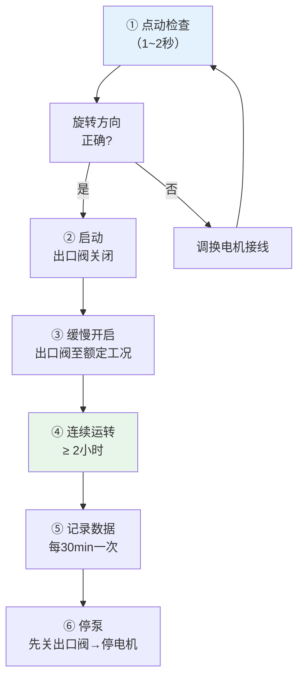

# 第7章 泵类设备安装

> [!important] 章节定位
> 第7章规定了离心泵、轴流泵、混流泵、管道泵等泵类设备的安装与验收要求。暖通空调水系统中，**离心泵**（卧式端吸/双吸）和**管道泵**（立式管道泵）是最常见的两类。泵的找正对中精度（径向/轴向偏差）是决定泵运行寿命和振动水平的核心技术。

---

## 一、泵安装前检查

### 1.1 通用检查

| 检查项目 | 要求 |
|----------|------|
| **核对铭牌** | 型号、流量、扬程、转速、功率与设计一致 |
| **外观** | 泵体无裂纹、砂眼；加工面无锈蚀、无碰伤 |
| **盘车检查** | 手动盘动转子，转动灵活、无卡滞、无摩擦声 |
| **轴承润滑** | 轴承座清洁，润滑脂加注量适当（滚动轴承填充 2/3） |
| **密封** | 机械密封或填料密封完好，无泄漏 |

---

## 二、离心泵安装

### 2.1 离心泵结构示意

```
         出水管 ↑
         ┌──────┴──────┐
         │   泵   体    │ ← 蜗壳式
   进水 →│  ┌─叶轮─┐   │
   管    │  └──────┘   │
         │     泵轴     │──── 联轴器 ──── 电机
         └─────────────┘
                ↑
            底座（槽钢框架）
                ↑
          减振器/垫铁 → 基础
```

### 2.2 离心泵安装精度

| 项目 | 允许偏差 | 检测方法 |
|------|:--------:|----------|
| **泵体水平度**（纵向） | ≤ 0.1/1000 | 框式水平仪置于泵轴或泵壳剖分面 |
| **泵体水平度**（横向） | ≤ 0.1/1000 | 框式水平仪置于泵壳剖分面 |
| **泵体标高** | ±10mm | 水准仪从基准点引测 |
| **泵体中心线** | ±10mm | 钢卷尺/经纬仪 |

> [!tip] 离心泵水平度要求为何比风机更严格？
> 离心泵转速通常更高（1450/2900 rpm），且输送介质为不可压缩的水，对中不良引起的振动力远大于气体介质。0.1/1000 的水平度要求是保证机械密封寿命和轴承寿命的关键。

---

## 三、管道泵安装

### 3.1 管道泵特点

| 特点 | 说明 |
|------|------|
| **立式结构** | 电机在上、泵体在下，直接串联在管道中 |
| **省空间** | 不需要专门基础，直接安装在管道上 |
| **无对中问题** | 电机与泵同轴设计，免联轴器对中 |
| **适用场合** | 暖通空调循环水泵、供水增压泵、小流量高扬程工况 |

### 3.2 管道泵安装要求

| 项目 | 技术要求 |
|------|----------|
| **安装位置** | 安装在管道直管段，前后应设检修空间 |
| **管道支撑** | 泵体进出口管道必须单独支撑，不得让泵体承受管道重量 |
| **减振** | 泵体与管道法兰间设**橡胶软接头**（避震喉） |
| **垂直度** | 立式管道泵须确保泵轴垂直，偏差 ≤ 0.1mm/m |
| **排气** | 泵体最高点设排气阀，首次运行前必须排气 |
| **水流方向** | 泵体上有水流方向箭头，严禁反向安装 |

> [!warning] 管道泵管口受力控制
> 管道泵最常见的故障根源是**管道应力传递到泵体**，导致泵壳变形→叶轮擦壳→机械密封泄漏。必须确保：
> - 泵进出口的配对法兰自由对正，无强制撬动
> - 法兰螺栓按对角线顺序均匀拧紧
> - 管道支吊架在泵的 ±1m 范围内必须加密设置

---

## 四、找正对中（径向/轴向偏差）

### 4.1 泵与电机联轴器对中标准

泵与电机联轴器对中采用 [第3章 设备就位与找正调平](/knowledge/pipe-fitting-spec/第3章-设备就位与找正调平/)#三、找正方法（三表法）|三表法，精度要求如下：

| 联轴器外径 (mm) | 径向偏差 (mm) | 轴向偏差 (mm) | 端面间隙 (mm) |
|:---------------:|:------------:|:------------:|:------------:|
| **≤ 100** | ≤ 0.05 | ≤ 0.05 | 2～4 |
| **100～200** | ≤ 0.05 | ≤ 0.05 | 3～5 |
| **200～400** | ≤ 0.08 | ≤ 0.08 | 4～6 |
| **400～600** | ≤ 0.10 | ≤ 0.10 | 5～7 |
| **> 600** | ≤ 0.15 | ≤ 0.15 | 6～8 |

### 4.2 径向偏差与轴向偏差详解

```
   径向偏差（平行不对中）              轴向偏差（角度不对中/张口）
   
    泵轴 ═══════════                   泵轴 ═══════════
                     ↕ 径向偏差                            ╲
    电机轴 ═══════                         电机轴 ════════  ╱ ←张口
                                                ↕ 轴向偏差(上下表读数差)
```

| 偏差类型 | 产生原因 | 后果 |
|----------|----------|------|
| **径向偏差** | 两轴中心线不重合、平行偏移 | 产生径向交变力→轴承磨损、振动↑ |
| **轴向偏差** | 两轴不平行、有夹角（张口） | 联轴器弹性元件受交变压缩/拉伸→过早疲劳破坏 |
| **综合不对中** | 径向+轴向偏差同时存在 | 常见情况，需综合调整 |

### 4.3 对中调整方法

| 步骤 | 操作 | 调整量计算 |
|:----:|------|------------|
| **1** | 测量偏差量（三表法 4 个方位读数） | — |
| **2** | 计算电机底板垫铁调整量 | 前后加垫量 = (测量偏差 × 电机底脚间距)/联轴器到前底脚距离 |
| **3** | 先调轴向偏差（增减前后垫铁高度差） | 后侧加垫 = (张口值 × 后底脚到联轴器距离)/联轴器直径 |
| **4** | 再调径向偏差（整体抬升或下降电机） | 所有底脚垫铁等量增减 |
| **5** | 复测 → 微调 → 复测 | 循环至合格 |
| **6** | 调整合格后，紧固地脚螺栓 + 复测 | 确保紧固后偏差不变化 |

> [!tip] 快速经验判断
> 如果径向偏差向上偏 0.1mm → 所有电机垫铁各减薄约 0.1mm（或用薄垫片）
> 如果轴向偏差（上张口）0.05mm → 电机后底脚加垫约 (0.05 × L)/D（L=后底脚至联轴器距离，D=联轴器直径）

---

## 五、泵配管要求

| 项目 | 技术要求 |
|------|----------|
| **管道重量** | 不得由泵体承受，须设独立支吊架 |
| **管道应力** | 配管法兰与泵进出口法兰自由对中，偏差 ≤ 1mm，不得强制拽拉 |
| **异径管** | 泵进口设**偏心大小头**（顶平），防止气蚀；出口设同心大小头 |
| **过滤器** | 泵进口设 Y 型过滤器（40~60目），防止杂质进入叶轮 |
| **止回阀** | 泵出口设止回阀（缓闭式），防止水锤 |
| **软接头** | 泵进出口均设橡胶软接头，减小振动传递 |
| **压力表** | 泵进出口各设压力表（进口为真空压力表），用于监控运行工况 |

---

## 六、试运转

### 6.1 试运转前检查

| 检查项 | 要求 |
|--------|------|
| 泵及管道系统完整性 | 所有连接紧固、密封完好 |
| 电机绝缘 | ≥ 0.5MΩ |
| 电机转向 | 点动确认与泵箭头一致 |
| 轴承润滑 | 油位/脂量正常 |
| 冷却/密封水 | 如有轴封冷却水已接通 |
| 排气 | 泵体及吸入管已排尽空气 |

### 6.2 试运转程序



### 6.3 试运转监控指标

| 监控项目 | 合格标准 | 检测工具 |
|----------|:--------:|----------|
| **轴承温升** | ≤ 35°C | 测温仪 |
| **轴承最高温度** | ≤ 75°C（滚动）/ ≤ 70°C（滑动） | 测温仪 |
| **振动速度** | ≤ 4.5mm/s（额定工况） | 测振仪 |
| **机械密封泄漏** | ≤ 5mL/h（目测呈雾状→合格，滴流→不合格） | 量杯 |
| **填料密封泄漏** | 8~15 滴/min（需保持少量泄漏以冷却和润滑） | 目测计数 |
| **运行电流** | ≤ 电机额定电流，无异常波动 | 钳形表 |
| **噪音** | ≤ 85dB(A)（距泵 1m 处） | 声级计 |
| **出口压力** | 稳定在设计值 ±5% | 出口压力表 |
| **试运转时间** | ≥ 2 小时连续 | 计时 |

### 6.4 常见试运转故障及处理

| 故障现象 | 可能原因 | 处理措施 |
|----------|----------|----------|
| **启动后无出水** | 泵内空气未排尽 / 进口堵塞 / 转向错误 | 重新排气→清洗过滤器→改变转向 |
| **流量/扬程不足** | 叶轮堵塞→转速不足→进口管漏气 | 拆检清理→检查电压/频率→检查管路密封 |
| **振动/噪音大** | 对中不良→地脚松动→气蚀→基础刚度不足 | 重新对中→紧固螺栓→改善吸入条件→基础加固 |
| **轴承过热** | 润滑不足→对中偏差→轴承损坏 | 补充油脂→重新对中→更换轴承 |
| **机械密封泄漏** | 安装不良→密封面损坏→泵轴弯曲 | 重新安装密封→更换密封→校正泵轴 |

---

## 🔗 相关页面

- 基础验收和施工准备 → [第2章 施工准备](/knowledge/pipe-fitting-spec/第2章-施工准备/)
- 垫铁布置与三表法找正 → [第3章 设备就位与找正调平](/knowledge/pipe-fitting-spec/第3章-设备就位与找正调平/)
- 风机安装对比参考 → [第6章 风机安装](/knowledge/pipe-fitting-spec/第6章-风机安装/)
- 空调水系统质量验收 → [GB50243-2016 通风与空调工程施工质量验收规范](/knowledge/pipe-fitting-spec/GB50243-2016-通风与空调工程施工质量验收规范/)
- 施工工艺要求 → [GB50738-2011 通风与空调工程施工规范](/knowledge/pipe-fitting-spec/GB50738-2011-通风与空调工程施工规范/)

---

← 返回 GB50231-2009-章节索引|GB50231-2009 章节索引
