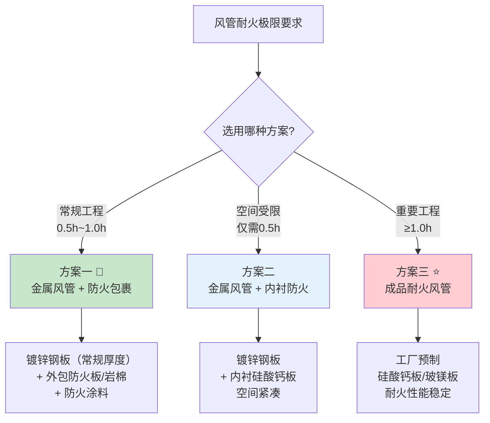
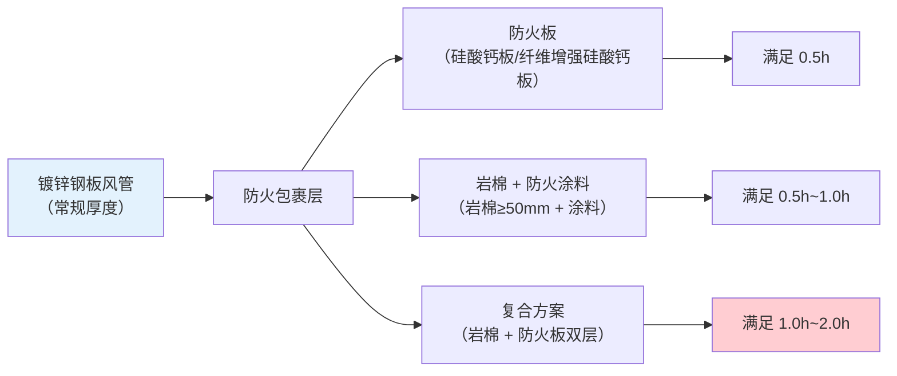
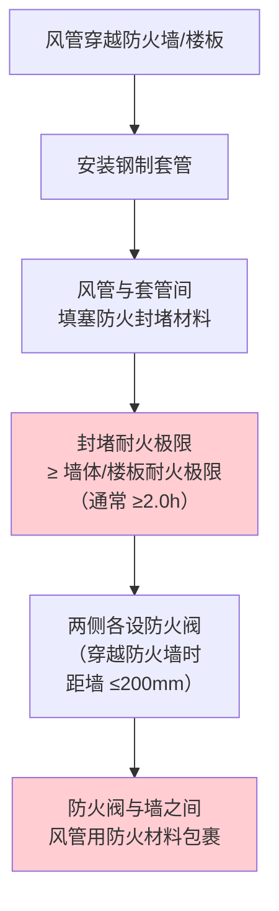

# 第7章 系统施工

> [!abstract] 本章概要
> GB 51251-2017 第7章规定了防烟排烟系统的施工要求，对风管制作安装、支吊架耐火、防火包裹施工、及穿越防火结构密封提出了**高于常规空调风管**的严格要求。本章核心内容：**三种耐火风管构造方案对比**，是满足 4.4.8 条和 3.3.9 条耐火极限要求的关键施工指南。

---

## 一、🔥 三种耐火风管构造方案对比

> [!danger] 🔴 核心施工方案——如何满足 4.4.8 条和 3.3.9 条的耐火极限要求
> 依据 GB 51251-2017 第 4.4.8 条条文说明和第 7 章施工要求，排烟/加压送风管道可通过以下三种方案满足耐火极限。

### 1.1 三种方案总览

### 1.2 三种方案详细对比

| 对比维度 | 方案一：金属+防火包裹 | 方案二：金属+内衬 | 方案三：成品耐火风管 |
|----------|:-------:|:-----:|:------:|
| **构造** | 镀锌钢板 + 外包防火板/岩棉+防火涂料 | 镀锌钢板 + 内衬硅酸钙板/防火板 | 工厂预制硅酸钙板/玻镁板风管 |
| **耐火机理** | 外包层隔绝高温、延迟钢板升温 | 内衬层直接承受高温烟气冲刷 | 材料本身不燃、导热系数低 |
| **可达耐火极限** | 0.5h~2.0h（取决于包裹方案） | 0.5h（内衬材料厚度限制） | 0.5h~3.0h（按产品型号） |
| **施工难度** | ⭐⭐⭐ 中等（需包裹作业+质量控制） | ⭐⭐⭐⭐ 较高（内衬拼接、密封难） | ⭐⭐ 较低（工厂预制、现场拼接） |
| **占用空间** | 大（增加外包层厚度） | 中（内衬减风管内径） | 大（壁厚大于钢板风管） |
| **造价** | **★★☆** 中（最常用方案） | ★★★ 中高 | ★★★ 高（材料+配件贵） |
| **施工质量控制** | 关键：包裹连续无空隙、支吊架处不断开 | 关键：内衬连接密封、无烟气泄漏 | 关键：板材连接、配件与风管匹配 |
| **适用场景** | 🔥 **最常用**，常规商业/住宅 | 空间极为受限（较少使用） | ⭐ 超高层/重要公共建筑 |
| **验收依据** | GB/T 17428 耐火试验报告 | GB/T 17428 耐火试验报告 | 产品型式检验报告 + GB/T 17428 |

### 1.3 方案一：金属风管 + 防火包裹（详解）

| 包裹材料 | 最小厚度 | 可达耐火极限 | 施工要点 |
|----------|:--------:|:----------:|----------|
| 防火板（硅酸钙板） | ≥ 9mm | 0.5h | 接缝错开，螺钉固定间距 ≤200mm |
| 岩棉毡 + 防火涂料 | 岩棉 ≥50mm | 0.5h~1.0h | 钢丝网固定，涂料均匀覆盖无漏涂 |
| 岩棉 + 防火板双层 | 岩棉50mm + 板9mm | 1.0h~2.0h | 内层岩棉 + 外层防火板，连续无空隙 |
| 纤维增强防火板 | ≥ 12mm | 1.0h~2.0h | 双层错缝，撑杆加固 |

> [!warning] 防火包裹施工关键质量控制点
> - **连续性**：包裹必须**连续无中断**，风管转弯、变径、三通处不得断开
> - **支吊架处**：支吊架穿过包裹层处需做**局部加强包裹**（耐火垫块+密封）
> - **法兰处**：法兰外侧必须被包裹材料完整覆盖
> - **防潮**：岩棉类包裹须有防水/防潮保护层（铝箔/镀锌钢板外护层）

### 1.4 方案三：成品耐火风管（详解）

| 材料类型 | 密度 (kg/m³) | 导热系数 [W/(m·K)] | 典型耐火极限 |
|----------|:------------:|:------------------:|:----------:|
| **硅酸钙板风管** | 800~1200 | 0.15~0.25 | 0.5h~3.0h |
| **玻镁板风管** | 900~1300 | 0.20~0.35 | 0.5h~2.0h |
| **纤维水泥板风管** | 1100~1500 | 0.30~0.45 | 1.0h~2.0h |

> [!tip] 成品耐火风管选型
> - **超高层建筑**（>100m）：推荐 ≥ 1.5h 耐火，首选硅酸钙板成品风管
> - **大型商业综合体**：≥ 1.0h，硅酸钙板或玻镁板均可
> - **地铁/隧道/地下空间**：≥ 1.5h，需额外防潮处理

---

## 二、风管制作与安装要点

### 2.1 板材连接方式

| 连接方式 | 适用场景 | 排烟风管要求 |
|----------|----------|:----------:|
| **咬口连接** | 薄钢板（δ ≤1.2mm） | ✅ 允许，需做耐火密封处理 |
| **焊接** | 厚钢板（δ >1.2mm） | ✅ 推荐，密封性好 |
| **法兰连接** | 各厚度 | ✅ **推荐**，便于拆装检修 |
| **插接（承插）** | 成品耐火风管 | ✅ 注意插接深度和密封 |
| **铆接（单独使用）** | — | ❌ **禁止单独采用铆接**（密封不满足耐火要求） |

### 2.2 密封材料要求

> [!warning] 排烟风管密封材料必须是耐高温材料

| 密封部位 | 材料要求 | 耐火温度 |
|----------|----------|:--------:|
| 法兰垫片 | **耐火密封垫**（不得用普通橡胶） | ≥ **280°C** |
| 法兰密封胶 | **耐火密封胶**（硅酮类/无机类） | ≥ **280°C** |
| 防火包裹接缝 | 防火密封胶 + 耐火胶带 | ≥ 280°C |

### 2.3 风管加固

| 风管大边尺寸 (mm) | 金属风管加固间距 | 非金属风管加固间距 |
|:---:|:---:|:---:|
| ≤800 | 无需加固 | 按产品说明书 |
| 800~1250 | ≤ 1000mm（或角钢加固） | ≤ 600mm |
| 1250~2000 | ≤ 600mm（角钢/槽钢） | ≤ 400mm |
| >2000 | ≤ 400mm（槽钢/组合加固） | ≤ 400mm，设中撑 |

---

## 三、支吊架耐火要求

> [!important] 🔴 支吊架不得先于风管失效
> 排烟风管支吊架的耐火极限应**不低于所支撑风管的耐火极限**。若风管满足 1.0h 耐火，支吊架也必须能在 1.0h 内保持承载力。

| 支吊架构件 | 耐火措施 |
|------------|----------|
| **吊杆/横担** | 钢材本身耐火性能好，但截面积需考虑高温折减（安全系数 ≥2.0） |
| **膨胀螺栓** | 不得直接暴露于高温，需有防火保护（防火涂料/防火包裹覆盖） |
| **管卡/托架** | 排烟风管支吊架间距 ≤ 空调风管间距 × **0.8** |
| **固定点** | 楼板/梁上固定点必须有防火保护层覆盖 |

| 风管类型 | 支吊架最大间距（水平） |
|----------|:-------------------:|
| 金属风管（排烟） | **≤ 2.4 m**（常规空调为 3.0m） |
| 非金属排烟风管 | **≤ 1.8 m** |
| 垂直风管 | **≤ 3.6 m**（每层至少 1 个固定支架） |

---

## 四、穿越防火结构密封

### 4.1 穿越防火墙/楼板

### 4.2 防火封堵材料

| 封堵材料 | 适用场景 | 耐火极限 |
|----------|----------|:--------:|
| **防火堵料（有机/无机）** | 套管与风管间隙填充 | ≥ 2.0h |
| **防火密封胶** | 缝隙 ≤ 10mm | ≥ 2.0h |
| **防火包** | 较大孔洞填充 | ≥ 2.0h |
| **防火板** | 孔洞封堵 + 套管外覆盖 | ≥ 2.0h |
| **矿棉/岩棉（配合密封胶）** | 背衬填充材料 | ≥ 2.0h |

### 4.3 穿越变形缝

> [!warning] 穿越变形缝的特殊处理
> - 变形缝**两侧**均需设**防火阀**（距缝 ≤200mm）
> - 变形缝处的柔性短管必须为 **A 级不燃材料**
> - 柔性短管长度 ≤ **200mm**（不得用柔性短管代替刚性风管长距离穿越）

---

## 五、管道井内风管施工

| 施工环节 | 要求 |
|----------|------|
| **管井封堵** | 风管安装后**立即**封堵楼板孔洞（每层） |
| **封堵耐火等级** | 不低于楼板耐火极限（≥ 1.5h~2.0h） |
| **管井检查门** | **乙级防火门**（耐火 ≥1.0h） |
| **竖向风管固定** | 每层设固定支架，不得仅靠楼板封堵承重 |

---

## 六、施工质量检查要点速查

| 检查项目 | 关键指标 | 检验方法 |
|----------|----------|----------|
| **防火包裹连续性** | 无中断、无破口、支吊架处加强 | 目视 + 手触检查 |
| **密封材料** | 必须是耐火材料（非普通橡胶） | 查材料证明文件 |
| **支吊架间距** | ≤ 2.4m（金属）/ ≤1.8m（非金属） | 尺量 |
| **防火封堵** | 不留孔隙，耐火≥墙/板耐火极限 | 目视 + 查防火封堵检测报告 |
| **防火阀安装** | 距墙 ≤200mm，手动复位正常 | 尺量 + 手动测试 |
| **耐火试验报告** | 风管耐火方案须有 GB/T 17428 试验报告 | 查文件 |
| **法兰垫片** | 耐火密封垫（耐温 ≥280°C） | 查材料证明 |

---

## 🔗 相关页面导航

- 📑 **章节索引**：GB51251-2017-章节索引
- 🔥 **4.4.8 排烟风管耐火极限**：[第4章 排烟系统设计](/knowledge/pipe-fitting-spec/第4章-排烟系统设计/)
- 🔒 **3.3.9 管道井耐火**：[第3章 防烟系统设计](/knowledge/pipe-fitting-spec/第3章-防烟系统设计/)
- 🧪 **耐火试验方法 (GB/T 17428)**：GBT17428-2009 通风管道耐火试验方法
- 📐 **施工验收 (GB 50243)**：[GB50243-2016 通风与空调工程施工质量验收规范](/knowledge/pipe-fitting-spec/GB50243-2016-通风与空调工程施工质量验收规范/)
- 🔩 **施工过程 (GB 50738)**：[GB50738-2011 通风与空调工程施工规范](/knowledge/pipe-fitting-spec/GB50738-2011-通风与空调工程施工规范/)
- 🚦 **防火阀门 (GB 15930)**：GB15930-2007 建筑通风和排烟系统用防火阀门
- 📋 **标准总览**：[中国标准索引](/knowledge/pipe-fitting-spec/中国标准索引/)

---

← 返回 GB51251-2017-章节索引|GB51251-2017 章节索引
