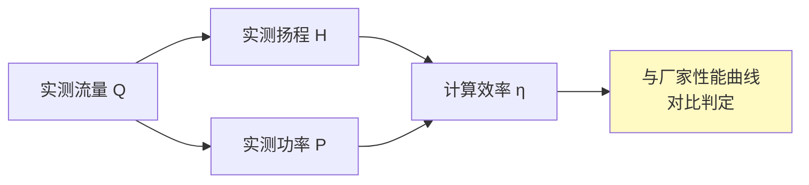

# 第7章 设备检测

第 7 章规定了 HVAC 系统中主要设备（风机、水泵、空调机组）的**性能检测**方法和判定标准。设备检测是系统调试和竣工验收的关键环节，验证设备实际运行参数是否满足设计要求。

---

## 7.1 风机检测

风机是通风空调系统的核心动力设备，检测项目涵盖转速、电流、风量、风压、轴承温度和振动。

### 7.1.1 风机转速检测

| 检测方法 | 仪表 | 精度 |
|----------|------|:---:|
| 光电转速表 | 贴反光条于转轴/联轴器 | ±1 rpm |
| 接触式转速表 | 接触转轴端面 | ±1 rpm |
| 频闪仪 | 调节频闪频率与转速同步 | ±0.5% |
| 变频器面板 | 直接读取变频输出频率换算 | ±0.1Hz |

> 实测转速与额定转速偏差 ≤ 5%。

### 7.1.2 电机电流检测

| 检测方法 | 仪表 | 注意事项 |
|----------|------|----------|
| 钳形电流表 | 钳表（精度 1.5 级） | 分别测量三相电流，检查三相平衡 |
| 配电柜电流表 | 柜面电流表 | 仅作参考 |

| 判定 | 标准 |
|:---:|------|
| 满载电流 | ≤ 电机铭牌额定电流 |
| 三相不平衡度 | ≤ 10%（max - min）/ avg |

### 7.1.3 轴承温度检测

> [!important] 关键安全参数
> 轴承温度是风机安全运行的核心监控指标。

| 检测仪表 | 测量位置 | 判定标准 |
|:------:|:------:|:---:|
| 红外测温仪 | 轴承座外表面 | — |
| 贴片式热电偶 | 轴承座测温孔 | — |
| 双金属温度计 | 轴承座自带 | — |

| 轴承类型 | 最高允许温度 | 报警温度 |
|:------:|:--------:|:------:|
| **滚动轴承** | **≤ 80°C** | 70°C |
| **滑动轴承** | **≤ 65°C** | 60°C |

> [!warning] 温升异常处理
> 轴承温度超过允许值或温升过快（> 5°C/10min），须立即停机检查润滑、对中、轴承游隙等问题。

### 7.1.4 风机振动检测

| 测量位置 | 仪表 | 判定标准 |
|:------:|------|:---:|
| 轴承座（水平、垂直、轴向） | 振动仪（速度传感器） | ≤ 2.8 mm/s RMS（刚性支撑） |
|  |  | ≤ 4.5 mm/s RMS（弹性支撑） |

### 7.1.5 风机风量/风压检测

| 检测项目 | 方法 | 仪表 | 判定 |
|:------:|------|------|:---:|
| 风量 | 风管断面风速法 / 风量罩 | 毕托管/风速仪 | ≥ 90% 额定风量 |
| 全压/静压 | 进出口测压断面 | 毕托管 + 微压计 | ≥ 90% 设计值 |

> 详细风量风压检测方法见 [第4章 风系统检测](/knowledge/pipe-fitting-spec/第4章-风系统检测/)。

---

## 7.2 水泵检测

### 7.2.1 检测项目

| 检测项目 | 方法 | 仪表 | 判定标准 |
|:------:|------|------|:---:|
| **流量** | 超声波流量计 / 平衡阀测压 | 超声波流量计 | ≥ 90% 额定流量 |
| **扬程** | 泵进出口压力差 + 位差 | 精密压力表（0.4 级） | ≥ 90% 额定扬程 |
| **转速** | 光电转速表 | 转速表 | 偏差 ≤ 3% |
| **轴功率** | 电流电压法 P = √3·U·I·cosφ·η | 功率计 / 钳表 | ≤ 额定功率 |
| **效率** | 水力功率 ÷ 轴功率 | — | 偏差 ≤ 5% |
| **轴承温度** | 红外测温仪 | 测温仪 | ≤ 80°C（滚动）/ ≤ 65°C（滑动） |
| **振动** | 振动仪 | 振动仪 | ≤ 2.8 mm/s RMS |

### 7.2.2 水泵性能曲线验证

---

## 7.3 空调机组检测

### 7.3.1 组合式空调机组（AHU）

| 检测项目 | 方法 | 判定标准 |
|:------:|------|:---:|
| **送风量** | 机组出口风管断面法 | ≥ 95% 额定风量 |
| **机外余压** | 出口静压 | ≥ 90% 额定值 |
| **供冷量** | 进出风焓差法 / 冷冻水量法 | ≥ 90% 额定值 |
| **供热量** | 进出风焓差法 / 热水量法 | ≥ 90% 额定值 |
| **漏风率** | 机组内漏风检测 | ≤ 3%（机组内）/ ≤ 2%（机外） |

### 7.3.2 风机盘管（FCU）

| 检测项目 | 方法 | 判定标准 |
|:------:|------|:---:|
| 风量（高/中/低档） | 风口风量罩 | ≥ 90% 铭牌风量 |
| 供冷量 | 焓差法 | ≥ 90% 额定值 |
| 噪声 | 声级计（A 声级） | ≤ 铭牌噪声 + 2 dB(A) |
| 水阻力 | 进出口压力差 | ≤ 铭牌值 × 1.1 |

### 7.3.3 冷水机组

| 检测项目 | 方法 | 判定标准 |
|:------:|------|:---:|
| 制冷量 | 冷冻水流量 × 温差 × 比热 | ≥ 90% 额定值 |
| COP / EER | 制冷量 ÷ 输入功率 | ≥ 铭牌值 × 0.95 |
| 冷冻水出水温度 | 温度计 | 设计值 ± 0.5°C |
| 压缩机电流 | 钳形电流表 | ≤ 额定电流 |

---

## 7.4 冷却塔检测

| 检测项目 | 方法 | 判定标准 |
|:------:|------|:---:|
| 冷却水量 | 超声波流量计 | ≥ 90% 额定值 |
| 进出水温差 | 温度计 | 设计值 ± 1°C |
| 风机电流 | 钳形电流表 | ≤ 额定电流 |
| 飘水率 | 飘水量 ÷ 循环水量 | ≤ 0.01% |

---

## 7.5 设备检测记录表模板

| 设备名称 | 型号 | 编号 | 检测日期 |
|:------:|:---:|:---:|:------:|
| | | | |

| 检测项目 | 设计值 | 实测值 | 偏差 | 判定 |
|:------:|:---:|:---:|:---:|:---:|
| 转速 (rpm) | | | | |
| 电流 (A) | | | | |
| 轴承温度 (°C) | | | | |
| 振动 (mm/s) | | | | |
| 风量 (m³/h) | | | | |
| 全压 (Pa) | | | | |

---

## 🔗 相关链接

- **风系统检测** → [第4章 风系统检测](/knowledge/pipe-fitting-spec/第4章-风系统检测/)
- **水系统检测** → [第5章 水系统检测](/knowledge/pipe-fitting-spec/第5章-水系统检测/)
- **室内环境检测** → [第6章 室内环境检测](/knowledge/pipe-fitting-spec/第6章-室内环境检测/)
- **GB 50231 机械设备安装** → GB50231-2009 [第6章 风机安装](/knowledge/pipe-fitting-spec/第6章-风机安装/)
- **GB 50243 设备安装验收** → GB50243-2016 [第7章 风机与空气处理设备安装](/knowledge/pipe-fitting-spec/第7章-风机与空气处理设备安装/)
- **GB 50738 施工规范** → GB50738-2011 [第8章 风机与空气处理设备安装](/knowledge/pipe-fitting-spec/第8章-风机与空气处理设备安装/)

← 返回 JGJT260-2011-章节索引|JGJ/T 260-2011 章节索引
