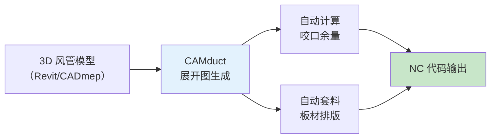
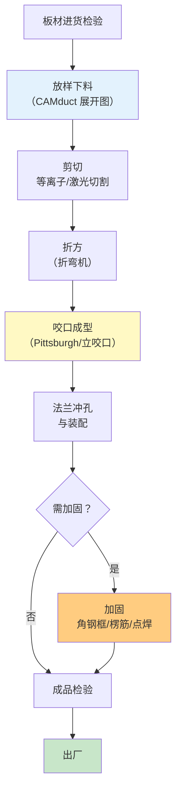

# 第7章 风管制作

第 7 章是 JGJ 141-2017 的**工艺操作章**，详细规定了风管从板材到成品的**全流程制作工艺**：放样下料、剪切折方、咬口成型、法兰冲孔装配，以及风管加固的四种主要方式（点焊、铆接、楞筋、角钢）。本章内容与 CAMduct 的 **NC 加工序列**和**展开图生成逻辑**直接对应。

---

## 7.1 放样下料

### 7.1.1 放样原则

| 原则 | 要求 |
|------|------|
| **基准面** | 以风管内壁为放样基准（矩形风管按内边长计算） |
| **咬口余量** | 放样时须预留咬口搭接余量（单咬口 6~10mm，联合角咬口 8~12mm） |
| **法兰翻边余量** | 预留法兰翻边宽度 7~10mm |
| **板材套料** | 尽量减少废料，板材利用率 ≥ 85% |
| **排版方向** | 矩形风管纵向接缝沿长边方向，尽量减少纵向接缝数量 |

### 7.1.2 CAMduct 中的放样

> 在 CAMduct 中，放样下料由 **Unfolding Engine** 自动完成，操作人员需确保 **Material Definition** 中咬口余量和法兰余量参数设置正确。详见 展开图与套料。

---

## 7.2 剪切与折方

### 7.2.1 剪切方式

| 剪切方式 | 适用板厚 (mm) | 特点 |
|:------:|:----------:|------|
| **手动剪板机** | ≤ 0.8 | 小批量、简单直线剪切 |
| **电动剪板机** | ≤ 3.0 | 大批量生产，精度 ±0.5mm |
| **等离子切割** | 0.5~6.0 | 任意形状、CAMduct 直接驱动（NC） |
| **激光切割** | 0.5~3.0 | 高精度 ±0.2mm，适合洁净风管 |

> [!tip] CAMduct 剪切对应
> CAMduct NC 代码通过 **Plasma/Laser Cutter Definition** 控制切割路径和工艺参数（切割速度、割缝补偿等）。

### 7.2.2 折方（折弯）

| 参数 | 要求 |
|------|------|
| **折弯半径** | ≥ 板材厚度（通常 1.5t~2t） |
| **折弯角度** | 90° ± 1° |
| **折弯线偏差** | ≤ 1mm |
| **镀锌层保护** | 折弯处镀锌层不得出现裂纹或剥落 |

> CAMduct 通过 **Press Brake Definition** 定义折弯工序参数。

---

## 7.3 咬口成型

### 7.3.1 咬口类型选择（详见第4章）

| 咬口形式 | 板厚范围 | 接缝位置 | 工艺要点 |
|:------:|:------:|----------|----------|
| **联合角咬口** | 0.5~1.0mm | 矩形风管纵向四角 | 最常用，咬口紧密、抗拉强度高 |
| **按扣式咬口** | 0.5~0.8mm | 直管段圆周/矩形纵向 | 无需法兰连接，安装快速 |
| **单咬口** | ≤ 0.8mm | 拼接加宽板面 | 搭接宽度 6~10mm |
| **立咬口** | 0.8~1.2mm | 大口径圆形风管 | 立边高度 10~15mm |

### 7.3.2 咬口质量检验

| 检验项目 | 要求 | 检验方法 |
|----------|------|:------:|
| 咬口宽度均匀性 | 偏差 ≤ 1mm | 游标卡尺 |
| 咬口紧密性 | 无开裂脱扣 | 目测 + 塞尺 |
| 咬口折角平直度 | 偏差 ≤ 2° | 角度尺 |
| 镀锌层损伤 | 损伤面积 ≤ 10%，补防腐 | 目测面积法 |

### 7.3.3 CAMduct 咬口配置

在 CAMduct 中，咬口类型在 **Seam Definition** 中选择：

| CAMduct Seam Type | 对应国标 |
|-------------------|----------|
| Pittsburgh Lock | 联合角咬口 |
| Snap Lock | 按扣式咬口 |
| Single Seam | 单咬口 |
| Standing Seam | 立咬口 |
| Groove Seam | 转角咬口 |

---

## 7.4 法兰冲孔与装配

### 7.4.1 法兰冲孔参数

| 压力等级 | 螺栓孔距 (mm) | 螺栓规格 | 孔的加工方式 |
|:------:|:----------:|:------:|:----------:|
| 低压 | ≤ 150 | M6~M8 | 冲孔（推荐）/ 钻孔 |
| 中压 | ≤ 100 | M8 | 冲孔 |
| 高压 | ≤ 100 | M8~M10 | 冲孔，孔位须对中 |

### 7.4.2 法兰装配要求

| 项目 | 要求 |
|------|------|
| 法兰与风管连接方式 | 铆接（板厚 ≤ 1.2mm）/ 焊接（板厚 > 1.2mm） |
| 铆钉间距 | ≤ 100mm（低压）/ ≤ 65mm（中高压） |
| 法兰翻边 | 翻边宽度 7~10mm，翻边面平整、紧贴法兰 |
| 法兰密封面处理 | 清除油污、铁锈，密封垫片平整粘贴 |
| 共板法兰(TDF) | 法兰滚压成型后直接插入角插件 + 卡条固定，详见 [第4章 金属风管](/knowledge/pipe-fitting-spec/第4章-金属风管/)#4.5.2 共板法兰 (TDF) |

---

## 7.5 风管加固工艺

JGJ 141-2017 规定了四种主要加固方式：

### 7.5.1 加固方式一览

| 加固方式 | 适用场景 | 间距/位置 | 工艺要点 |
|----------|----------|:------:|----------|
| **点焊加固** | 矩形风管大平面、板厚 ≥ 0.8mm | 间距 300~400mm 梅花形排列 | 焊点熔深 ≥ 板厚 50%，不烧穿 |
| **铆接加固** | 板厚 ≤ 1.0mm 的镀锌钢板 | 间距 200~300mm | 铆钉直径 ≥ 3mm，抽芯铆钉/实心铆钉 |
| **楞筋（压筋）加固** | 矩形风管大平面，板厚 ≥ 0.8mm | 筋间距 200~300mm | 凸筋高度 ≥ 3mm，方向垂直于长边 |
| **角钢加固框** | 大尺寸风管，长边 > 1000mm | 框间距 ≤ 1.5m | L30~L50 角钢，与风管壁铆接/焊接 |

### 7.5.2 加固起点

| 压力等级 | 矩形风管长边加固起点 | 备注 |
|:------:|:------------------:|------|
| 低压 | > 630 mm | — |
| 中压 | > 500 mm | — |
| 高压 | > 400 mm | — |

### 7.5.3 CAMduct 加固配置

| CAMduct 加固类型 | 国标对应 |
|------------------|----------|
| **Stiffener Frame (角钢)** | 角钢加固框 |
| **Bead / Cross Break (压筋)** | 楞筋加固 |
| **Tie Rod (拉杆)** | 内支撑加固 |
| **Spot Weld Pattern** | 点焊加固 |

加固参数在 CAMduct 的 **Stiffener Definition** 中配置，根据 Pressure Class 和长边尺寸自动判断是否需要加固及加固方式。NC 代码会包含加固筋的定位点和加工指令。

---

## 7.6 风管制作流程总览

---

## 🔗 相关链接

- **压力等级与密封** → [第3章 基本规定](/knowledge/pipe-fitting-spec/第3章-基本规定/)
- **金属风管材料与厚度** → [第4章 金属风管](/knowledge/pipe-fitting-spec/第4章-金属风管/)
- **非金属风管制作** → [第5章 非金属风管](/knowledge/pipe-fitting-spec/第5章-非金属风管/)
- **风管配件制作** → [第6章 风管配件与部件](/knowledge/pipe-fitting-spec/第6章-风管配件与部件/)
- **风管安装** → [第8章 风管安装](/knowledge/pipe-fitting-spec/第8章-风管安装/)
- **CAMduct 展开与套料** → 展开图与套料
- **NC 代码生成** → NC代码生成
- **矩形风管制造** → 矩形风管制造
- **风管连接方式** → 风管连接方式

← 返回 JGJ141-2017-章节索引|JGJ141-2017 章节索引
