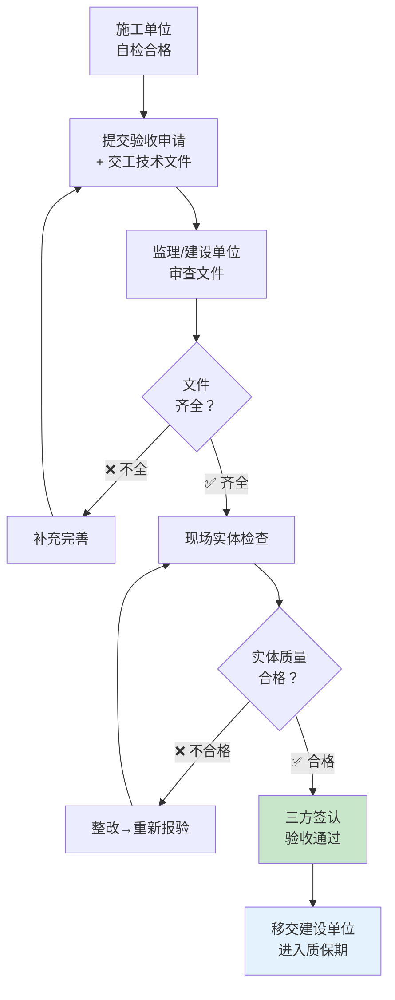

# 第8-9章 工程验收

> [!important] 章节定位
> GB 50231-2009 第9章（试运转后的工程验收）规定了机械设备安装工程的**验收程序、文件清单和质量记录要求**。工程验收是设备安装的最后关口——交工技术文件的完整性直接影响是否通过竣工验收。

---

## 一、验收程序总览

---

## 二、交工技术文件清单

### 2.1 必交文件（15项）

| 序号 | 文件名称 | 文件性质 | 编制方 | 说明 |
|:----:|----------|:------:|:------:|------|
| 1 | 📋 **交工技术文件目录** | 汇总类 | 施工 | 列出所有提交文件的编号/名称/页数 |
| 2 | 📐 **竣工图** | 图纸类 | 施工 | 标注实际安装尺寸/位置，设计变更处须有"竣工图章" |
| 3 | 📦 **设备开箱检验记录** | 进场类 | 施工+监理 | 型号/规格/数量/外观/附件/随机文件核对 |
| 4 | 🏗️ **设备基础复验记录** | 土建类 | 施工+监理 | 基础坐标/标高/预留孔/预埋件偏差，附测量数据 |
| 5 | 🔩 **垫铁布置隐蔽工程记录** | 隐蔽类 | 施工+监理 | 垫铁规格/数量/位置/接触面/点焊确认，附影像资料 |
| 6 | 🔧 **地脚螺栓隐蔽工程记录** | 隐蔽类 | 施工+监理 | 地脚螺栓规格/垂直度/紧固扭矩/防转措施，附影像资料 |
| 7 | 🧱 **二次灌浆隐蔽工程记录** | 隐蔽类 | 施工+监理 | 灌浆料牌号/配合比/灌浆日期/养护条件/试块强度报告 |
| 8 | 📏 **设备安装精度检验记录** | 质量类 | 施工+监理 | 标高/水平度/同轴度/垂直度测量值 vs 允许偏差 |
| 9 | ⚙️ **联轴器对中记录** | 质量类 | 施工+监理 | 径向偏差/轴向偏差测量数据（三表法读数） |
| 10 | 🔄 **设备试运转记录** | 性能类 | 施工+监理+建设 | 空载/负载试运转时间、温度、振动、电流、风量/风压数据 |
| 11 | 🔌 **电气设备试验记录** | 电气类 | 施工+监理 | 绝缘电阻/耐压试验/接地电阻/电机空载电流 |
| 12 | 🛢️ **润滑/冷却系统检查记录** | 系统类 | 施工 | 润滑油牌号/油位/冷却水流量压力/无渗漏确认 |
| 13 | ⚠️ **设计变更通知单** | 变更类 | 设计+建设 | 所有设备变更的位置/型号/参数须有设计方签字确认 |
| 14 | 🔍 **工程质量检验评定表** | 评定类 | 监理+建设 | 分项→分部→单位工程质量等级评定 |
| 15 | ✍️ **竣工验收报告** | 结论类 | 三方 | 最终结论：合格/不合格；质保期起算日期 |

### 2.2 文件编制要点

| 文件类型 | 核心要求 |
|----------|----------|
| **隐蔽工程记录** | 须附影像资料（垫铁布置、地脚螺栓、灌浆前后对比），三方当场签认，**不得事后补签** |
| **精度检验记录** | 实测数据须用墨水笔（非铅笔）填写，修改处划改并签章，不得涂改覆盖 |
| **试运转记录** | 每次启停均须记录时间、温度/振动/电流变化趋势，异常波动须注明原因和处理措施 |
| **竣工图** | 设计变更直接在施工图上用红笔标注 → 加盖"竣工图章"（含编制人/审核人/日期） |

---

## 三、质量检验记录要求

### 3.1 暖通设备关键检验项目

#### 风机安装检验记录

| 检验项目 | 允许偏差 | 检验方法 | 测量工具 |
|----------|:--------:|----------|----------|
| 设备平面位置 | ±10mm | 经纬仪/钢尺测量 | 钢卷尺 |
| 设备标高 | ±10mm | 水准仪测量 | 水准仪 |
| 水平度（纵向） | ≤ 0.10/1000 | 框式水平仪 | 框式水平仪（0.02mm/m） |
| 水平度（横向） | ≤ 0.20/1000 | 框式水平仪 | 框式水平仪 |
| 叶轮与机壳间隙 | 轴流：2~3mm；离心：3~5mm | 塞尺 | 塞尺 |
| 联轴器径向偏差 | ≤ 0.05mm | 百分表（三表法） | 百分表 |
| 联轴器轴向偏差 | ≤ 0.05mm | 百分表（三表法） | 百分表 |
| 减振器压缩量 | 均匀一致，各点偏差 ≤ 2mm | 钢板尺 | 钢板尺 |

#### 水泵安装检验记录

| 检验项目 | 允许偏差 | 检验方法 |
|----------|:--------:|----------|
| 设备平面位置 | ±10mm | 经纬仪/钢尺测量 |
| 设备标高 | ±5mm | 水准仪测量 |
| 水平度（纵向） | ≤ 0.10/1000 | 框式水平仪 |
| 水平度（横向） | ≤ 0.20/1000 | 框式水平仪 |
| 联轴器径向偏差 | ≤ 0.05mm（弹性） | 三表法 |
| 联轴器轴向偏差 | ≤ 0.05mm（弹性） | 三表法 |

### 3.2 试运转检验记录（风机/泵专用）

| 记录参数 | 空载 | 25%载荷 | 50%载荷 | 75%载荷 | 100%载荷 |
|----------|:----:|:------:|:------:|:------:|:-------:|
| 运行时间 (min) | ≥120 | ≥30 | ≥30 | ≥30 | ≥120 |
| 轴承温度 (°C) | | | | | |
| 振动速度 (mm/s) | | | | | |
| 运行电流 (A) | | | | | |
| 风量/流量 | — | | | | |
| 风压/扬程 | — | | | | |
| 噪音 dB(A) | | | | | |
| 密封泄漏 | | | | | |

> [!tip] 记录格式
> 上表为示意模板，实战中按监理提供的统一表格填写。每个参数须填写 3 次以上读数（开始/中间/结束），以判断运行参数是否稳定。

---

## 四、验收判定标准

### 4.1 合格判定

| 判定层级 | 合格条件 |
|----------|----------|
| **分项工程** | 主控项目 100% 合格 + 一般项目 ≥ 80% 合格（且最大值 ≤ 1.2 × 允许偏差） |
| **分部工程** | 所含分项工程全部合格 |
| **单位工程** | 所含分部工程全部合格 + 质量控制资料完整 + 观感质量合格 |
| **竣工验收** | 所有交工技术文件齐全 + 实体质量检验合格 + 试运转数据达标 + 三方签认 |

### 4.2 常见不合格项及处理

| 常见问题 | 处理方式 |
|----------|----------|
| **垫铁接触面 < 75%** | 拆除重新研磨垫铁底面或基础面，重新检查 |
| **二次灌浆开裂** | 凿除开裂部分，重新清理湿润后补灌（用料同原灌浆料） |
| **联轴器对中超差** | 松开电机地脚螺栓→垫铁微调→重新紧固→复测 |
| **试运转轴承温升超标** | 检查润滑是否充分→检查冷却水→拆检轴承→必要时更换 |
| **试运转振动超标** | 检查地脚螺栓紧固→检查对中→检查转子动平衡→必要时返厂 |
| **文件缺失** | 能补办的即时补签；隐蔽记录缺失→须专项鉴定或复查方案 |

---

## 五、暖通工程验收与 GB 50243 的衔接

| 验收节点 | GB 50231 要求 | GB50243-2016 通风与空调工程施工质量验收规范\|GB 50243 补充 |
|----------|---------------|------------------|
| **设备基础验收** | 坐标/标高/螺栓孔 | + 基础强度报告（试块试验） |
| **设备就位** | 垫铁+地脚螺栓（通用） | + 减振器选型与压缩量 |
| **找正对中** | 三表法（通用） | + 风机与风管法兰的柔性连接检查 |
| **试运转** | 空载/负载程序（通用） | + 风量/风压/噪声的系统级测定 |
| **交工文件** | 15 项通用清单 | + 风管严密性试验报告 + 系统调试报告 |

---

## 六、验收后的移交与质保

| 环节 | 要求 |
|------|------|
| **移交时间** | 三方签认竣工验收报告后即时移交 |
| **移交内容** | 设备实体 + 全部钥匙/工具/备件 + 交工技术文件（一式三份） |
| **质保期起算** | 自竣工验收合格之日起算（通常 1~2 年，合同中明确） |
| **操作培训** | 施工单位应对建设单位操作人员进行设备运行、维护、常见故障排除培训 |
| **质保期内缺陷处理** | 施工单位在收到通知后 48h 内响应，非人为损坏免费维修/更换 |

---

## 🔗 相关页面

- 设备装配与试运转要求 → 第4-5章 装配与试运转
- 施工准备与设备进场 → 第2章 施工准备
- 风机安装技术 → 第6章 风机安装
- 泵类设备安装 → 第7章 泵类设备安装
- 通风空调施工质量验收 → GB50243-2016 通风与空调工程施工质量验收规范
- 章节总览 → GB50231-2009-章节索引|GB50231-2009 章节索引

---

← 返回 GB50231-2009-章节索引|GB50231-2009 章节索引
