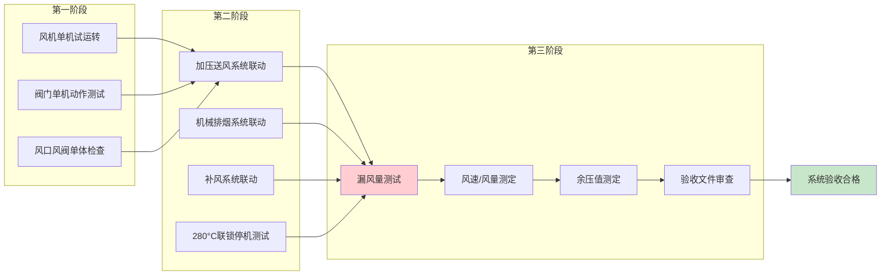
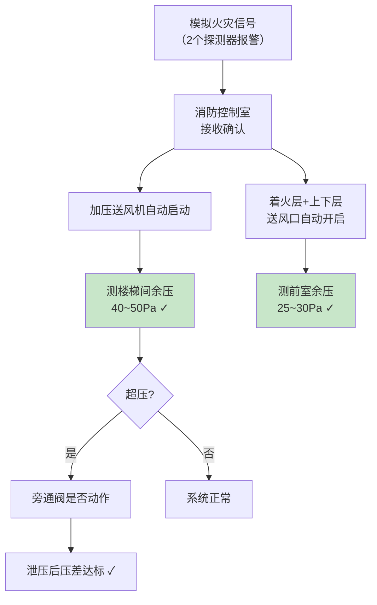
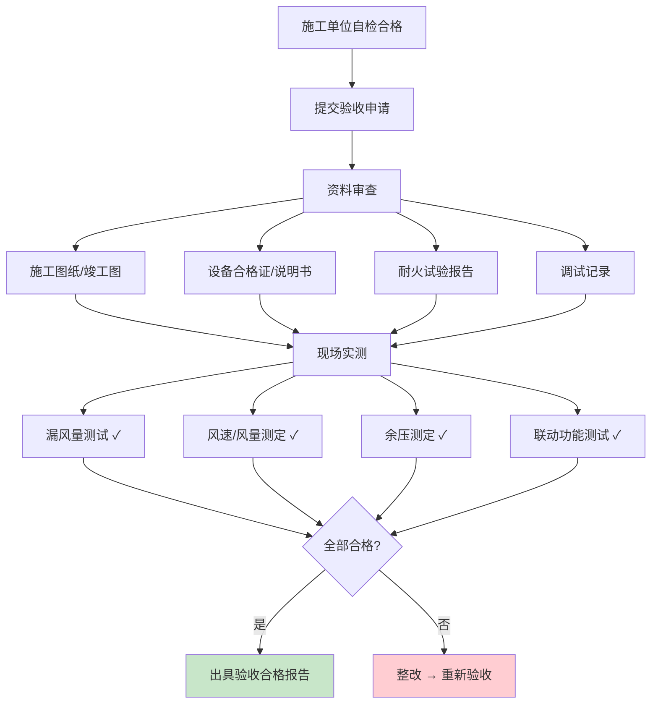

# 第8章 系统调试与验收

> [!abstract] 本章概要
> GB 51251-2017 第8章规定了防烟排烟系统的调试程序，必须按照 **单机调试 → 联动调试 → 验收** 三个阶段逐级推进。第9章验收要求并入本章，共同构成从调试到交付的完整质量控制闭环。核心测试项包括：**漏风量测试、风速/风压测试、联动控制功能测试**。

---

## 一、调试程序总览

---

## 二、第一阶段：单机调试

### 2.1 风机单机试运转

| 调试项目 | 要求 | 测试方法 |
|----------|------|----------|
| **启动电流** | 正常范围内（不超过额定电流 6 倍） | 钳形电流表 |
| **运行电流** | ≤ 额定电流 | 钳形电流表 |
| **轴承温升** | ≤ 40°C（滑动）/ ≤ 60°C（滚动） | 红外测温仪 / 温度计 |
| **振动** | 符合设备说明书要求 | 振动计 |
| **转向** | 与设计一致 | 目视检查 |
| **运行时间** | 连续运行 ≥ **2 小时**无异常 | 计时 |

> [!warning] 排烟风机试运转注意事项
> - 排烟风机在常温下试运转，不得计入 280°C/30min 耐温运行时间
> - 风机进出口**柔性接头**必须安装到位，防止振动传递
> - 风机**减振器**在试运转后需检查位移量

### 2.2 阀门单机动作测试

| 阀门类型 | 测试内容 | 合格标准 |
|----------|----------|----------|
| **排烟阀（常闭）** | 电动开启 / 手动开启 | 100% 开启，信号反馈正常 |
| **排烟防火阀（280°C）** | 手动关闭 / 复位功能 | 关闭严密，信号反馈正常 |
| **防火阀（70°C）** | 手动关闭 / 复位功能 | 关闭严密，信号反馈正常 |
| **加压送风口（常闭）** | 电动 / 手动开启 | 100% 开启，信号反馈正常 |

### 2.3 风口风阀单体检查

| 检查项 | 要求 |
|--------|------|
| 排烟口/送风口安装位置 | 与设计图纸一致，偏差 ≤ 50mm |
| 手动开启装置 | 距地 1.3~1.5m，操作灵活 |
| 标识 | 阀门有明显启闭标识和铭牌 |
| 外观 | 无变形、无锈蚀、涂层完好 |

---

## 三、第二阶段：联动调试

### 3.1 加压送风系统联动

### 3.2 机械排烟系统联动

| 联动步骤 | 动作 | 验证方法 |
|:---:|------|----------|
| 1 | 模拟着火防烟分区 2 个探测器报警 | 发烟枪/加热器 |
| 2 | 消防控制室确认信号 | 查看 FAS 主机 |
| 3 | 着火分区所有排烟阀自动开启 | 现场目视 + 信号反馈确认 |
| 4 | 排烟风机自动启动 | 电流表、风量测试 |
| 5 | 补风风机自动启动 | 电流表、风速测试 |
| 6 | 空调/通风系统自动关闭 | 现场确认停转 |

### 3.3 280°C 联锁停机联动

> [!danger] 🔴 280°C 联锁停机测试（模拟温感）
> 测试方法：手动触发排烟防火阀的**温感熔断器（模拟 280°C）**，验证以下联锁：

| 验证项目 | 合格标准 |
|----------|----------|
| 排烟防火阀关闭 | 严密关闭，信号反馈正确 |
| 排烟风机停止 | 联锁停机，无延时 |
| 补风风机停止 | 联锁停机，无延时 |
| 消防控制室显示 | 阀门关闭、风机停止信号正确 |

### 3.4 手动控制联动

| 控制位置 | 测试内容 |
|----------|----------|
| 消防控制室手动控制盘 | 直接启/停排烟风机、加压送风机 |
| 现场手动开启装置 | 手动开启排烟口/阀，信号反馈 |
| 风机控制柜 | 就地启/停（检修用，信号反馈至控制室） |

---

## 四、第三阶段：验收测试

### 4.1 🔴 漏风量测试（核心验收项）

> [!important] 漏风量测试是验收的"一票否决项"
> 排烟风管按 GB 50243 的**中压系统**要求进行漏风量测试。漏风量超标意味着排烟量不足、火灾时烟气无法有效排出，是消防验收**必查项**。

| 测试参数 | 要求 | 依据 |
|----------|------|:------:|
| **测试压力** | **中压系统**（工作压力 500~1500 Pa） | GB 50243-2016 |
| **允许漏风量** | $Q \leq 0.0352 \times P^{0.65} \times S$ | GB 50243 公式 |
| **测试方法** | 定压法（恒压法）或流量法 | GB 50243 附录 C |
| **分段测试** | 主管道逐段测试，支管可合并 | — |
| **防火阀处** | 测试时防火阀处于关闭状态，阀门本身不得纳入风管漏风量 | — |

> [!tip] 简化理解
> 金属矩形风管（中压系统），单位面积允许漏风量：
> - 测试压力 500Pa 时：约 **2.0 m³/(h·m²)**
> - 测试压力 1000Pa 时：约 **3.1 m³/(h·m²)**
> - 测试压力 1500Pa 时：约 **4.0 m³/(h·m²)**

### 4.2 风速/风量测定

| 测定位置 | 测试内容 | 合格标准 |
|----------|----------|----------|
| **排烟口** | 排烟风速/风量 | ≥ 设计值的 90% |
| **加压送风口** | 送风风速 | ≤ **7 m/s** |
| **排烟总管** | 总排烟量 | ≥ 设计值的 90% |
| **补风口** | 补风风速/风量 | ≥ 排烟量的 50% |

> [!warning] 风速测定注意事项
> - 测定截面应选择在**气流平稳段**（距上游局部构件 ≥5D，距下游 ≥2D）
> - 矩形风管：将截面分成若干个等面积小矩形，逐点测定取均值
> - 圆形风管：按等面积环法布点

### 4.3 风压/余压测定

| 测定部位 | 压差要求 | 测试条件 |
|----------|:--------:|----------|
| **前室 - 走道** | **25~30 Pa** | 加压送风系统全开，一层门开启 |
| **楼梯间 - 前室** | **40~50 Pa** | 加压送风系统全开，三层门开启 |
| **避难层** | 与楼梯间相同 | 系统全开 |

### 4.4 风管耐火极限核查

> [!danger] 🔴 耐火极限核查（文档审查）
> 消防验收时，必须提供排烟/加压送风管道的耐火极限证明文件：

| 文件类型 | 要求 |
|----------|------|
| **耐火试验报告** | 按 GB/T 17428-2009 试验，覆盖实际使用的风管构造 |
| **防火包裹施工记录** | 包裹材料、厚度、施工日期、施工人员签字 |
| **成品耐火风管** | 产品型式检验报告 + 出厂合格证 |
| **防火封堵检测报告** | 穿越防火结构处的封堵耐火试验或检测报告 |

---

## 五、验收程序

---

## 六、维护管理要求（第9章摘要）

| 维护项 | 周期 | 内容 |
|--------|:----:|------|
| **功能检测** | **每半年** ≥1 次 | 风机运转、阀门动作、风速风量、联动控制 |
| **风机** | 每半年 | 轴承润滑、皮带张紧、电机绝缘 |
| **阀门** | 每半年 | 手动/电动动作、温感器完好、复位正常 |
| **风管** | 每年 | 防火包裹完整性、支吊架牢固、密封无破损 |
| **消防控制室** | 每半年 | 联动信号测试、手动控制盘功能 |

> [!warning] 维护记录
> 每次维护检测结果须形成**书面记录并归档（附录F）**，保存期不少于 **5 年**。

---

## 七、验收测试指标速查

| 测试项目 | 关键指标 | 合格标准 |
|----------|----------|:--------:|
| 漏风量 | 单位面积漏风量 m³/(h·m²) | ≤ GB 50243 中压系统限值 |
| 排烟量 | 总排烟量 | ≥ 设计值 90% |
| 排烟口风速 | 各排烟口 | 均匀，无明显过低点 |
| 加压送风口风速 | 各送风口 | ≤ 7 m/s |
| 前室余压 | 前室-走道 | 25~30 Pa |
| 楼梯间余压 | 楼梯间-前室 | 40~50 Pa |
| 联动响应时间 | 探测报警→风机启动 | ≤ 60s |
| 280°C 联锁停机 | 手动触发→风机停止 | ≤ 30s |

---

## 🔗 相关页面导航

- 📑 **章节索引**：GB51251-2017-章节索引
- 🔥 **4.4.8 排烟风管耐火极限**：[第4章 排烟系统设计](/knowledge/pipe-fitting-spec/第4章-排烟系统设计/)
- 🔒 **3.3.9 管道井耐火**：[第3章 防烟系统设计](/knowledge/pipe-fitting-spec/第3章-防烟系统设计/)
- 🎛️ **联动控制逻辑**：[第6章 系统控制](/knowledge/pipe-fitting-spec/第6章-系统控制/)
- 🔧 **施工安装方案**：[第7章 系统施工](/knowledge/pipe-fitting-spec/第7章-系统施工/)
- 📐 **施工质量验收 (GB 50243)**：[GB50243-2016 通风与空调工程施工质量验收规范](/knowledge/pipe-fitting-spec/gb50243-2016-通风与空调工程施工质量验收规范/)
- 🧪 **耐火试验方法 (GB/T 17428)**：GBT17428-2009 通风管道耐火试验方法
- 📋 **标准总览**：[中国标准索引](/knowledge/pipe-fitting-spec/中国标准索引/)

---

← 返回 GB51251-2017-章节索引|GB51251-2017 章节索引
