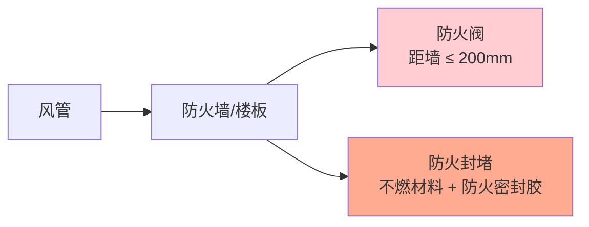

# 第8章 风管安装

第 8 章是 JGJ 141-2017 的**现场实施章**，规定了风管系统安装的全部技术要求：支吊架间距与选材、法兰垫片材料、风管穿越建筑结构、柔性短管长度，以及风管严密性测试方法。

---

## 8.1 支吊架

### 8.1.1 支吊架间距

| 风管类型 | 风管长边/直径 (mm) | 水平安装最大间距 (m) | 垂直安装最大间距 (m) |
|:------:|:----------------:|:----------------:|:----------------:|
| **金属矩形风管** | ≤ 400 | 4.0 | 4.0 |
|  | > 400 | 3.0 | 4.0 |
| **金属圆形风管** | ≤ 400 | 4.0 | 4.0 |
|  | > 400 | 3.0 | 4.0 |
| **非金属风管** | ≤ 400 | 3.0 | 3.0 |
|  | 400~1000 | 2.5 | 3.0 |
|  | > 1000 | 2.0 | 3.0 |

### 8.1.2 支吊架选材

| 风管长边 (mm) | 横担 (角钢/槽钢) | 吊杆直径 | 膨胀螺栓 |
|:----------:|:-------------:|:-----:|:-----:|
| ≤ 630 | L30×3 | ≥ φ8 | M8 |
| 630~1250 | L40×4 | ≥ φ10 | M10 |
| 1250~2000 | L50×5 或 [8 | ≥ φ12 | M12 |
| 2000~4000 | [10 或 [12 | ≥ φ16 | M16 |

### 8.1.3 支吊架设置位置

| 位置 | 要求 |
|------|------|
| 直管段 | 按间距均匀布置 |
| 弯头两端 | 各设一处（≤ 500mm 范围内） |
| 变径两端 | 各设一处 |
| 防火阀 | 🔴 **必须独立设置支吊架**，阀前后各一处 |
| 消声器 | 两端各设一处 |
| 风管末端 | 末端封堵处须设吊架 |

> [!warning] 支吊架注意事项
> - 支吊架不得设在风口、阀门、检查门处
> - 支吊架与风管之间须设**防腐垫木**或**橡胶垫**（非金属风管必须）
> - 防排烟风管的支吊架须采取**防火保护**（涂防火涂料或包覆）

---

## 8.2 法兰垫片

### 8.2.1 垫片材料选择

| 系统类型 | 推荐垫片材料 | 禁用材料 |
|----------|:----------:|:------:|
| 一般空调送排风（≤ 70°C） | 闭孔海绵橡胶板、橡胶板（厚度 3~5mm） | — |
| 高温排风（> 70°C） | 石棉橡胶板、耐热橡胶板 | 普通橡胶 |
| 防排烟系统 | 🔴 **不燃材料**：石棉绳、陶瓷纤维绳、柔性石墨板 | 可燃密封胶、橡胶 |
| 洁净空调 | 闭孔海绵橡胶板（表面光滑洁净） | 石棉制品（粉尘） |
| 腐蚀性排风 | 耐酸碱橡胶板、聚四氟乙烯板 | 普通金属垫片 |

### 8.2.2 垫片安装要求

| 项目 | 要求 |
|------|------|
| 垫片厚度 | 3~5mm（橡胶类）/ 5~8mm（石棉绳） |
| 垫片宽度 | 与法兰密封面等宽 |
| 接头方式 | 梯形或榫形搭接，搭接长度 ≥ 20mm |
| 粘贴方式 | 垫片粘贴于法兰一侧，不得凸入风管内 |
| 密封胶配合 | 中高压风管在垫片外缘加涂密封胶 |

---

## 8.3 风管穿越建筑结构

### 8.3.1 穿越墙体/楼板

| 项目 | 要求 |
|------|------|
| **穿越防火分区** | 🔴 必须设防火阀（距防火墙 ≤ 200mm），风管与墙体间用不燃材料封堵 |
| **穿越普通墙体** | 风管与墙体间用柔性材料填塞，预留沉降余量 |
| **穿越楼板** | 设套管（高出地面 ≥ 50mm），套管与风管间填柔性材料 |
| **穿越伸缩缝** | 风管两侧设置补偿措施（柔性短管或伸缩节） |

### 8.3.2 穿越处防火封堵

---

## 8.4 柔性短管

### 8.4.1 柔性短管要求

| 参数 | 要求 |
|:----:|------|
| **长度** | **150~300 mm** |
| **材料** | 一般系统：帆布、人造革、涂胶玻璃布 🔴 防排烟系统：**不燃材料**（硅胶玻纤布、不锈钢波纹管） |
| **安装位置** | 风机进出口、空调机组接口、振动设备连接处 |
| **安装方式** | 两端用法兰连接，不得用作变径或找平找正的补偿 |
| **松紧度** | 安装后保持适度松弛，严禁拉紧（失去隔振作用） |

> [!danger] 防排烟系统柔性短管
> GB 50243-2016 强制性条文 **5.2.7** 明确规定：**防排烟系统柔性短管必须采用不燃材料**。严禁使用帆布、普通人造革等可燃材料。

---

## 8.5 风管严密性测试

### 8.5.1 测试方法选择

| 压力等级 | 测试方法 | 测试标准 |
|:------:|:------:|----------|
| **低压（≤ 500Pa）** | 漏光法 | 每 10m 接缝漏光点 ≤ 2 处（每处 ≤ 5cm） |
| **中压（500~1500Pa）** | 漏风量法 | 按密封等级 C 级允许漏风量 |
| **高压（> 1500Pa）** | 漏风量法 | 按密封等级 D 级允许漏风量 |

### 8.5.2 漏光法

| 步骤 | 操作 |
|:--:|------|
| 1 | 在暗环境中，风管一端设光源（≥ 100W 安全灯），逐段检测 |
| 2 | 风管外侧检查，记录漏光点位置、数量 |
| 3 | 合格标准：**每 10m 接缝漏光点 ≤ 2 处，每处漏光长度 ≤ 5cm** |
| 4 | 漏光点用密封胶修补后复测 |

### 8.5.3 漏风量法

| 步骤 | 操作 |
|:--:|------|
| 1 | 连接测试装置：风机 → 孔板/喷嘴流量计 → 被测风管段 → 封堵 |
| 2 | 加压至试验压力（工作压力的 1.0 倍） |
| 3 | 稳压后读取流量计差压，换算漏风量 Q (m³/h) |
| 4 | 合格标准：$Q \leq Q_{\text{允许}}$（按 JGJ/T 260-2011 JGJT260-2011 [第4章 风系统检测](/knowledge/pipe-fitting-spec/第4章-风系统检测/)|第4章 公式计算） |

### 8.5.4 允许漏风量

| 密封等级 | 允许漏风量 Q (m³/h·m²) | 适用压力 |
|:------:|:--------------------:|:------:|
| A 级 | ≤ 0.1056 × P^0.65 | ≤ 500Pa |
| B 级 | ≤ 0.0352 × P^0.65 | ≤ 1000Pa |
| C 级 | ≤ 0.0117 × P^0.65 | ≤ 1500Pa |
| D 级 | ≤ 0.0039 × P^0.65 | > 1500Pa |

> 其中 P 为试验压力 (Pa)，Q 为单位面积漏风量。

---

## 8.6 安装质量要求汇总

| 检验项目 | 允许偏差/要求 |
|----------|:------:|
| 水平风管水平度 | ≤ 3mm/m，全长 ≤ 20mm |
| 垂直风管垂直度 | ≤ 2mm/m，全长 ≤ 20mm |
| 支吊架水平度 | ≤ 3mm |
| 法兰垫片 | 无脱落、无凸入管内 |
| 柔性短管 | 长度 150~300mm，无扭曲、无拉紧 |
| 风管清洁 | 管内无杂物、无积尘 |

---

## 🔗 相关链接

- **密封等级规定** → [第3章 基本规定](/knowledge/pipe-fitting-spec/第3章-基本规定/)
- **金属风管法兰参数** → [第4章 金属风管](/knowledge/pipe-fitting-spec/第4章-金属风管/)
- **风管制作工艺** → [第7章 风管制作](/knowledge/pipe-fitting-spec/第7章-风管制作/)
- **风系统检测方法** → JGJT260-2011 [第4章 风系统检测](/knowledge/pipe-fitting-spec/第4章-风系统检测/)
- **防火阀设置要求** → 第9章2节 通风与空调系统防火阀设置
- **CAMduct 连接方式** → 风管连接方式
- **CAMduct 安装建模** → 风管建模与设计

← 返回 JGJ141-2017-章节索引|JGJ141-2017 章节索引
