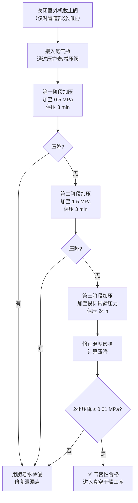

# 第9-10章 空调水系统管道与制冷剂管道

> [!important] 章节定位
> 第9章涵盖空调水系统管道（冷热水管、冷却水管、冷凝水管）的安装施工工艺，第10章涵盖制冷剂管道（铜管）的焊接、安装和检验。两章合并覆盖空调系统**冷热介质输送管路**的全部施工技术要求。

---

## 第一部分：空调水系统管道（第9章）

---

## 一、管道系统分类

| 管道系统 | 介质 | 工作温度范围 | 常用管材 |
|----------|------|:----------:|----------|
| **冷冻水系统** | 水或乙二醇溶液 | 供水 5~12°C / 回水 12~18°C | 无缝钢管、镀锌钢管 |
| **冷却水系统** | 水 | 进水 32~37°C / 出水 37~42°C | 无缝钢管、镀锌钢管 |
| **热水系统** | 水 | 供水 45~60°C / 回水 35~50°C | 无缝钢管 |
| **冷凝水系统** | 冷凝水 | 常温 | 镀锌钢管、PVC-U 管 |

> [!warning] 管材选用要点
> - 冷冻水和冷却水系统管径 DN ≤ 50mm 宜采用镀锌钢管，DN > 50mm 可采用无缝钢管
> - 冷凝水管道必须保证排水坡度（一般 ≥ 0.3%，沿水流方向下降），严禁倒坡
> - 热水系统管材须考虑热膨胀补偿

---

## 二、管道连接方式

### 2.1 焊接连接

| 项目 | 技术要求 |
|------|----------|
| **适用管材** | 无缝钢管（DN ≥ 50mm） |
| **焊接方法** | 手工电弧焊（SMAW）/ 氩弧焊打底+手工焊盖面（大管径） |
| **焊工资质** | 焊工须持相应项目的特种设备焊接操作证，且在有效期内 |
| **坡口要求** | 壁厚 ≥ 3mm 时开 V 形坡口，角度 60°±5°，钝边 1~2mm |
| **焊前清理** | 坡口两侧 20mm 范围内清除油污、铁锈、氧化皮 |
| **焊缝外观** | 无裂纹、气孔、夹渣、未熔合；余高 ≤ 2mm；咬边深度 ≤ 0.5mm |

### 2.2 螺纹连接

| 项目 | 技术要求 |
|------|----------|
| **适用管材** | 镀锌钢管（DN ≤ 50mm） |
| **螺纹加工** | 机械套丝，螺纹完整无断丝、烂牙，螺纹长度符合标准 |
| **密封填料** | 聚四氟乙烯生料带（PTFE）或液态密封胶，缠绕方向与拧入方向一致 |
| **拧紧要求** | 手工拧入 3~4 扣后用管钳继续拧紧，外露螺纹 2~3 扣 |
| **防腐处理** | 螺纹连接处外露螺纹部分须涂防锈漆 |

### 2.3 法兰连接

| 项目 | 技术要求 |
|------|----------|
| **适用管材** | 大管径（DN ≥ 65mm）或与设备/阀门连接处 |
| **法兰选型** | 平焊法兰或对焊法兰，压力等级满足设计工况 |
| **法兰面** | 焊接后法兰面应垂直于管中心线，偏斜度 ≤ 1mm |
| **垫片** | 材质按介质温度和压力选择（橡胶石棉板 / PTFE / 金属缠绕垫片），垫片居中不偏斜 |
| **螺栓紧固** | 对称、均匀、分次拧紧，力矩一致 |

### 2.4 沟槽连接

| 项目 | 技术要求 |
|------|----------|
| **适用管材** | 大管径钢管（DN ≥ 65mm），尤其适合镀锌钢管（避免焊接破坏镀锌层） |
| **沟槽加工** | 用专用滚槽机或切槽机加工，槽深和槽宽按管径和卡箍厂家规范 |
| **卡箍安装** | 胶圈置于沟槽内，卡箍扣合后均匀拧紧螺栓 |
| **适用场景** | 管道密集处、检修频繁处、不便于焊接操作的部位 |

---

## 三、管道安装要点

### 3.1 管道坡度要求

| 管道类型 | 坡度方向 | 最小坡度 |
|----------|----------|:--------:|
| **冷冻水管** | 供水干管沿水流方向上升排气，回水干管沿水流方向下降排水 | ≥ 0.2% |
| **冷却水管** | 沿水流方向下降 | ≥ 0.2% |
| **冷凝水管** | 沿水流方向下降（必须保证重力排水） | ≥ 0.3%（建议 0.5%） |
| **蒸汽管** | 沿蒸汽流动方向下降，疏水点设于低点 | ≥ 0.3% |

### 3.2 支吊架设置

| 管径 DN | 支吊架最大间距 | 特殊要求 |
|:-------:|:-------------:|----------|
| ≤ 25mm | 2.0m | — |
| 32~50mm | 3.0m | — |
| 65~100mm | 4.0m | 弯头、三通、阀门处须增设支架 |
| 125~200mm | 6.0m | — |
| ≥ 250mm | 8.0m | 必须进行强度和变形校核计算 |

> [!tip] 水管支吊架要点
> - 冷热水管道须设置**绝热木托**或**硬质保温垫块**，防止冷桥结露
> - 穿越楼板/墙体处设套管（高出地面 50mm，底部与楼板平齐）
> - 管道伸缩补偿：直线管段每 30~40m 设一个补偿器（自然补偿或波纹补偿器）

### 3.3 阀门安装

| 阀门类型 | 安装要求 |
|----------|----------|
| **闸阀 / 蝶阀** | 手柄/手轮不得朝下（不利于操作）；蝶阀阀板在全开位置时不得阻碍管道 |
| **截止阀** | 介质流向必须与阀体箭头一致（低进高出） |
| **止回阀** | 安装方向与介质流向一致；升降式止回阀只能水平安装 |
| **平衡阀** | 前后须留 ≥ 5 倍管径的直管段，安装后锁定开度 |
| **电动调节阀** | 阀体安装方向正确；执行器预留检修空间；接线按电气图纸 |

### 3.4 管道冲洗与试压

#### 冲洗要求

| 冲洗介质 | 冲洗流速 | 冲洗标准 |
|----------|:--------:|----------|
| **清洁水** | ≥ 1.5 m/s | 出口水色透明度与入口一致，无杂物 |
| **压缩空气（干管）** | ≥ 20 m/s | 排气口无铁锈、尘土 |

#### 水压试验

| 系统类型 | 试验压力 | 合格标准 |
|----------|:--------:|----------|
| **冷冻水/冷却水** | 工作压力的 1.5 倍且 ≥ 0.6 MPa | 稳压 10min 压降 ≤ 0.02 MPa，然后降至工作压力，检查无渗漏 |
| **热水系统** | 工作压力的 1.5 倍且 ≥ 0.6 MPa | 同上 |
| **冷凝水管** | 灌水试验（充满水） | 15min 不渗不漏 |

---

## 第二部分：制冷剂管道（第10章）

---

## 四、制冷剂管道系统概述

| 项目 | 内容 |
|------|------|
| **常用制冷剂** | R22、R410A、R407C、R134a |
| **管材** | 磷脱氧无缝铜管（TP2），符合 GB/T 17791 |
| **连接方式** | 硬钎焊（铜磷/银钎料焊接） |
| **管径范围** | φ6.35~φ54.0mm（多联式空调常用 φ6.35~φ28.6mm） |
| **工作压力** | R410A 系统设计压力 ≥ 4.0 MPa（压力远高于 R22 的 2.5 MPa） |

> [!warning] R410A 系统特殊要求
> R410A 工作压力约为 R22 的 **1.6 倍**，因此：
> - 铜管壁厚须比 R22 系统增大约 20%
> - 气密性试验压力更高（4.0 MPa 以上）
> - 必须使用与 R410A 兼容的冷冻机油（POE 合成油），避免矿物油混入

---

## 五、铜管焊接工艺

### 5.1 焊接方法

| 项目 | 技术要求 |
|------|----------|
| **焊接方法** | 硬钎焊（Brazing），非软钎焊（Soldering） |
| **钎料选择** | 铜磷钎料（BCuP 系列，含银 2%~15%）或银钎料（BAg 系列，含银 ≥ 45%） |
| **保护气体** | **必须通入氮气保护**（防止管内壁高温氧化生成黑色氧化皮），流量 0.1~0.2 L/min |
| **热源** | 氧乙炔火焰（中性焰）或丙烷火焰 |

### 5.2 焊接工序

### 5.3 焊接质量控制

| 检查项目 | 合格标准 |
|----------|----------|
| **焊缝外观** | 钎料填充饱满、圆滑，无气孔、裂纹、未熔合 |
| **管内清洁度** | 切开焊口管内壁应呈铜本色，无黑色氧化皮（氮气保护充分的标志） |
| **插接深度** | 管径 φ6.35~12.7mm：≥ 6mm；φ15.88~22.2mm：≥ 10mm；φ25.4~38.1mm：≥ 12mm |
| **承插间隙** | 钎焊毛细间隙 0.05~0.15mm |

> [!warning] 铜管焊接红线
> - **严禁不充氮焊接**：管内壁产生黑色氧化皮会堵塞毛细管和电子膨胀阀
> - **严禁用钢锯切割铜管**：铁屑嵌入铜管会导致腐蚀穿孔
> - **严禁水冷降温**：急速冷却导致焊缝开裂和铜管热应力变形

---

## 六、制冷剂管道安装

### 6.1 管道布置原则

| 原则 | 要求 |
|------|------|
| **路径最短** | 减少弯头数量，减小沿程阻力和回油困难的风险 |
| **避免积液** | 水平管段沿制冷剂流动方向保持 ≥ 0.5% 坡度 |
| **回油弯** | 室内外机高差 > 5m 时，竖直气管底部设回油弯；每 6~8m 追加一个回油弯 |
| **分歧管** | 水平安装（不得竖直），前后留 ≥ 500mm 直管段 |
| **支撑固定** | 铜管支吊架间距：φ6.35~15.88mm → 1.5m；φ19.05~28.6mm → 2.0m；≥ φ31.8mm → 2.5m |

### 6.2 分歧管安装

| 项目 | 技术要求 |
|------|----------|
| **安装方向** | 水平安装，分歧管进出口方向不得装反 |
| **直管段要求** | 分歧管前后至少保留 500mm 直管段，避免涡流影响分液均匀性 |
| **焊接保护** | 分歧管焊接时须用湿布包裹分歧管体，防止过热导致内部变形 |
| **管径匹配** | 分歧管型号必须与所连接的主管/支管管径匹配 |

---

## 七、气密性试验

> [!important] 🔑 气密性试验是制冷系统安装的**最关键检验环节**

### 7.1 试验压力

| 制冷剂类型 | 试验压力 (MPa) | 保持时间 |
|:----------:|:--------------:|:--------:|
| **R410A** | 4.0~4.15 | 24 小时 |
| **R22** | 2.8~3.0 | 24 小时 |
| **R407C/R134a** | 3.0~3.3 | 24 小时 |

### 7.2 试验步骤

### 7.3 温度修正

气压受温度影响显著，24h 保压期间的压降须经温度修正：

> **修正公式**：$$\Delta P_{修正} = P_{初始} - P_{最终} \times \frac{T_{初始} + 273}{T_{最终} + 273}$$

| 判定标准 | 要求 |
|----------|------|
| **R410A 系统** | 修正后 24h 压降 ≤ 0.01 MPa（约 0.1 kg/cm²） |
| **R22 系统** | 修正后 24h 压降 ≤ 0.01 MPa |

> [!tip] 气密性试验要点
> - 必须使用**干燥氮气**，严禁用氧气或压缩空气（含水蒸气和杂质）
> - 分阶段加压，每阶段用肥皂水检查所有焊口和连接处
> - 记录初始和终止时环境温度，用于温度修正计算
> - 气密性合格后方可进行真空干燥和制冷剂充注

---

## 八、真空干燥与制冷剂充注

### 8.1 真空干燥

| 项目 | 技术要求 |
|------|----------|
| **真空泵** | 双级旋片式真空泵，极限真空度 ≥ 0.1 Pa |
| **抽真空目标** | 系统压力 ≤ 100 Pa（约 0.75 Torr） |
| **保真空** | 达到目标真空度后保持 ≥ 1 小时，压力回升 ≤ 50 Pa |
| **目的** | 除去系统内水蒸气和不凝性气体，防止冰堵和腐蚀 |

### 8.2 制冷剂充注

| 项目 | 要求 |
|------|------|
| **充注时机** | 真空干燥合格后 |
| **充注量** | 按设备厂家铭牌标称量 ± 以液管长度计算的附加量 |
| **充注方式** | 液态充注（钢瓶倒置，通过液管截止阀充入） |
| **充注精度** | 使用电子秤计量，偏差 ≤ 充注量的 ± 2% |

---

## 🔗 相关页面

- 冷热源设备与空调末端设备安装 → [第11章 空调设备安装](/knowledge/pipe-fitting-spec/第11章-空调设备安装/)
- 风机与空气处理设备安装 → [第8章 风机与空气处理设备安装](/knowledge/pipe-fitting-spec/第8章-风机与空气处理设备安装/)
- 管道保温与防腐 → [第12章 防腐与绝热](/knowledge/pipe-fitting-spec/第12章-防腐与绝热/)
- 质量验收标准（水系统） → [GB50243-2016 通风与空调工程施工质量验收规范](/knowledge/pipe-fitting-spec/GB50243-2016-通风与空调工程施工质量验收规范/)
- 系统调试与试运行 → [第16章 系统试运行与调试](/knowledge/pipe-fitting-spec/第16章-系统试运行与调试/)

---

← 返回 GB50738-2011-章节索引|GB50738-2011 章节索引
