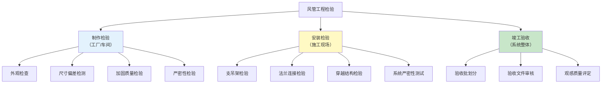
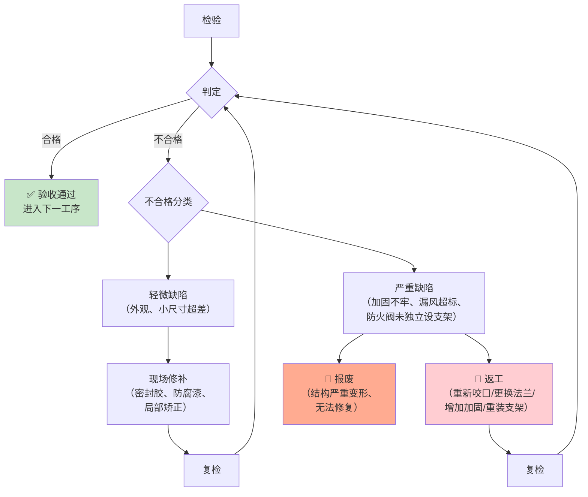

# 第9章 检验与验收

> [!important] ⭐ 质量控制核心章
> 第 9 章是 JGJ 141-2017 的**质量把关章**，规定了风管制作和安装全过程的质量检验内容、方法和判定标准，以及工程验收的批次划分和文件要求。本章的允许偏差表是 CAMduct 风管车间 **QC 检验表单**的直接数据源。

---

## 9.1 检验分类

JGJ 141-2017 将风管工程的检验分为三个层次：

---

## 9.2 风管制作检验

### 9.2.1 外观质量检验

| 序号 | 检验项目 | 质量要求 | 检验方法 | 检验数量 |
|:----:|----------|----------|:------:|:------:|
| 1 | **板材表面** | 无锈蚀、无严重划痕、镀锌层无大面积剥落 | 目测 | 全数 |
| 2 | **咬口缝** | 紧密无开裂、宽度均匀、折角平直 | 目测 + 游标卡尺 | 全数 |
| 3 | **焊缝** | 焊缝饱满、无咬边/气孔/裂纹、焊后防腐处理 | 目测 + 放大镜 | 全数 |
| 4 | **法兰面** | 平整无翘曲、清除油污铁锈、密封垫片完整粘贴 | 目测 | 全数 |
| 5 | **加固件** | 铆钉/焊点牢固、加固框无松动、楞筋清晰均匀 | 目测 + 手扳检查 | 全数 |
| 6 | **镀锌层损伤修复** | 损伤面积 ≤ 10%，已涂富锌漆或环氧漆修补 | 目测面积法 | 全数 |
| 7 | **风管内外清洁** | 管内无杂物、无积尘、无油污 | 目测 | 每个检验批抽查 ≥ 20% |

### 9.2.2 尺寸偏差检验

#### 9.2.2.1 矩形风管尺寸允许偏差

| 序号 | 检验项目 | 风管规格 | 允许偏差 | 检验方法 |
|:----:|----------|:------:|:------:|----------|
| 1 | **外边长 (W × H)** | b ≤ 300mm | **±2 mm** | 钢卷尺，管口四边各测一处 |
| 2 | **外边长 (W × H)** | b > 300mm | **±3 mm** | 钢卷尺，管口四边各测一处 |
| 3 | **对角线之差** | b ≤ 1000mm | **≤ 3 mm** | 钢卷尺，管口两对角线 |
| 4 | **对角线之差** | b > 1000mm | **≤ 5 mm** | 钢卷尺，管口两对角线 |
| 5 | **管口平面度** | 所有规格 | **≤ 10 mm** | 平尺 + 塞尺 |
| 6 | **风管长度 (L)** | L ≤ 1200mm | **±2 mm** | 钢卷尺 |
| 7 | **风管长度 (L)** | L > 1200mm | **±3 mm** | 钢卷尺 |
| 8 | **板面不平度** | 低压风管 | **≤ 5 mm/m²** | 1m 直尺 + 塞尺 |
| 9 | **板面不平度** | 中压/高压风管 | **≤ 3 mm/m²** | 1m 直尺 + 塞尺 |

#### 9.2.2.2 圆形风管尺寸允许偏差

| 序号 | 检验项目 | 风管规格 | 允许偏差 | 检验方法 |
|:----:|----------|:------:|:------:|----------|
| 1 | **外径** | D ≤ 300mm | **±2 mm** | 钢卷尺，两垂直方向各测一次取平均值 |
| 2 | **外径** | D > 300mm | **±3 mm** | 钢卷尺，两垂直方向各测一次取平均值 |
| 3 | **椭圆度** | 所有规格 | **≤ 3‰ D**（直径的千分之三） | 钢卷尺，测两垂直方向直径差 |
| 4 | **风管长度** | L ≤ 1200mm | **±2 mm** | 钢卷尺 |
| 5 | **风管长度** | L > 1200mm | **±3 mm** | 钢卷尺 |
| 6 | **管口平面度** | 所有规格 | **≤ 5 mm** | 平尺 + 塞尺 |

#### 9.2.2.3 椭圆形风管尺寸允许偏差

| 序号 | 检验项目 | 允许偏差 | 检验方法 |
|:----:|----------|:------:|----------|
| 1 | **长轴 (A)** | ≤ 300mm: ±2mm；> 300mm: ±3mm | 钢卷尺 |
| 2 | **短轴 (B)** | ≤ 300mm: ±2mm；> 300mm: ±3mm | 钢卷尺 |
| 3 | **端面椭圆度** | ≤ 3‰ 长轴 | 钢卷尺，测两垂直方向轴差 |

### 9.2.3 咬口质量检验

| 序号 | 检验项目 | 质量要求 | 检验方法 | 检验数量 |
|:----:|----------|----------|:------:|:------:|
| 1 | **咬口宽度均匀性** | 偏差 ≤ 1mm | 游标卡尺，每段风管测 3 处 | 抽查 ≥ 20% |
| 2 | **咬口紧密性** | 无开裂、无脱扣 | 目测 + 0.1mm 塞尺（不通过） | 抽查 ≥ 20% |
| 3 | **咬口折角平直度** | 偏差 ≤ 2° | 角度尺 | 抽查 ≥ 10% |
| 4 | **搭接长度** | 单咬口 ≥ 6mm，联合角咬口 ≥ 8mm | 游标卡尺 | 抽查 ≥ 10% |

### 9.2.4 法兰质量检验

| 序号 | 检验项目 | 质量要求 | 检验方法 | 检验数量 |
|:----:|----------|----------|:------:|:------:|
| 1 | **法兰平面度** | ≤ 2mm | 平尺 + 塞尺 | 每个检验批抽查 ≥ 20% |
| 2 | **法兰螺栓孔距** | 低压 ≤ 150mm，中高压 ≤ 100mm | 钢卷尺 | 每个检验批抽查 ≥ 20% |
| 3 | **法兰铆钉间距** | 低压 ≤ 100mm，中高压 ≤ 65mm | 钢卷尺 | 抽查 ≥ 10% |
| 4 | **法兰翻边宽度** | 7~10mm，均匀一致 | 游标卡尺 | 抽查 ≥ 10% |
| 5 | **法兰角部密合性** | 法兰四角拼缝 ≤ 1mm | 塞尺 | 抽查 ≥ 10% |
| 6 | **TDF 卡条间距** | ≤ 200mm | 钢卷尺 | 抽查 ≥ 20% |
| 7 | **TDF 角插件** | 四角必须安装，插入到位 | 目测 | 全数 |

### 9.2.5 加固质量检验

| 序号 | 检验项目 | 质量要求 | 检验方法 |
|:----:|----------|----------|:------:|
| 1 | **加固间距** | 角钢加固框 ≤ 1.5m；楞筋 200~300mm；点焊 300~400mm | 钢卷尺 |
| 2 | **角钢加固框铆接/焊接** | 铆钉牢固无松动，焊点熔深 ≥ 板厚 50% | 目测 + 手扳 |
| 3 | **楞筋高度** | ≥ 3mm | 深度尺 |
| 4 | **楞筋方向** | 垂直于风管长边方向 | 目测 |
| 5 | **点焊加固** | 梅花形排列，不烧穿板面 | 目测 |
| 6 | **内支撑拉杆防腐** | 支撑杆须防腐处理，风管内侧无毛刺 | 目测 |
| 7 | **加固后板面不平度** | 低压 ≤ 5mm/m²；中高压 ≤ 3mm/m² | 1m 直尺 + 塞尺 |

### 9.2.6 制作阶段严密性检验

| 检验项目 | 压力等级 | 检验方法 | 检验数量 |
|----------|:------:|----------|:------:|
| **车间漏风量抽检** | 低压 | 漏光法 | 每种规格抽查 ≥ 5%，且不少于 2 段 |
| **车间漏风量抽检** | 中压 | 漏风量法或漏光法（初检）+ 漏风量法（复检） | 每种规格抽查 ≥ 10%，且不少于 3 段 |
| **车间漏风量抽检** | 高压 | 漏风量法 | 每种规格抽查 ≥ 20%，且不少于 5 段 |
| **洁净系统风管** | 全部 | 漏风量法 | 100% 逐段检测 |

> [!tip] CAMduct QC 集成
> 车间漏风量抽检结果应反馈至 CAMduct Specification，若某规格风管合格率偏低，需检查对应的 **Seam Type**、**Seal Class**、**Sealant Application** 参数是否需要优化调整。

---

## 9.3 风管安装检验

### 9.3.1 支吊架安装检验

| 序号 | 检验项目 | 质量要求 | 检验方法 |
|:----:|----------|----------|:------:|
| 1 | **支吊架间距** | 水平安装：≤ 400mm 风管 ≤ 4.0m，> 400mm ≤ 3.0m；垂直安装：≤ 4.0m | 钢卷尺 |
| 2 | **支吊架水平度** | 偏差 ≤ 3mm | 水准仪 / 水平尺 |
| 3 | **横担规格** | 与风管长边匹配（L30~L50 角钢 或 [8~[12 槽钢） | 游标卡尺 |
| 4 | **吊杆直径** | ≥ φ8（≤ 630mm）/ ≥ φ10（630~1250mm）/ ≥ φ12（1250~2000mm） | 游标卡尺 |
| 5 | **膨胀螺栓** | M8~M16，与吊杆直径匹配，锚固深度 ≥ 40mm | 目测 + 抽查 |
| 6 | **支吊架防腐** | 镀锌或涂防锈漆两遍，无锈蚀 | 目测 |
| 7 | **防火阀独立支架** | 🔴 防火阀**必须**独立设置支吊架，阀前后各一处 | 目测，全数检查 |
| 8 | **防排烟风管支架防火** | 支吊架须涂防火涂料或包覆，耐火极限 ≥ 所支撑风管 | 目测 + 防火涂料检测报告 |

### 9.3.2 法兰连接检验

| 序号 | 检验项目 | 质量要求 | 检验方法 |
|:----:|----------|----------|:------:|
| 1 | **法兰垫片材料** | 符合系统类型要求（一般：闭孔海绵橡胶板；防排烟：🔴 不燃材料） | 查验材料合格证 |
| 2 | **垫片厚度** | 橡胶类 3~5mm，石棉绳 5~8mm | 游标卡尺 |
| 3 | **垫片安装** | 粘贴于法兰一侧，无脱落、无凸入管内 | 目测 |
| 4 | **垫片接头** | 梯形或榫形搭接，搭接长度 ≥ 20mm | 目测 + 钢卷尺 |
| 5 | **螺栓紧固** | 十字交叉法分次均匀拧紧，无松动 | 力矩扳手（抽查 ≥ 10%） |
| 6 | **螺栓朝向** | 同一风管段螺栓头方向一致（一般朝上或朝检修侧） | 目测 |
| 7 | **密封胶** | 中高压风管法兰外缘加涂密封胶 | 目测 |
| 8 | **TDF 卡条** | 卡条安装到位，无松动，间距 ≤ 200mm | 手扳 + 钢卷尺 |

### 9.3.3 风管穿越结构检验

| 序号 | 检验项目 | 质量要求 | 检验方法 |
|:----:|----------|----------|:------:|
| 1 | **穿越防火分区** | 🔴 必须设防火阀，距防火墙 ≤ 200mm | 钢卷尺，全数检查 |
| 2 | **穿越处防火封堵** | 不燃材料填塞密实 + 防火密封胶，无可见缝隙 | 目测 |
| 3 | **穿越普通墙体** | 风管与墙体间柔性材料填塞，预留沉降余量 | 目测 |
| 4 | **穿越楼板套管** | 设金属套管，高出地面 ≥ 50mm，套管与风管间填柔性材料 | 钢卷尺 + 目测 |
| 5 | **穿越伸缩缝** | 两侧设补偿措施（柔性短管或伸缩节） | 目测 |

### 9.3.4 柔性短管检验

| 序号 | 检验项目 | 质量要求 | 检验方法 |
|:----:|----------|----------|:------:|
| 1 | **长度** | 150~300mm | 钢卷尺 |
| 2 | **材料** | 一般系统：帆布/涂胶玻璃布；防排烟：🔴 不燃材料（硅胶玻纤布/不锈钢波纹管） | 查验材料合格证 |
| 3 | **安装松紧度** | 安装后保持**适度松弛**，严禁拉紧 | 目测 + 手感 |
| 4 | **连接方式** | 两端法兰连接，不得用作变径或找平找正 | 目测 |

### 9.3.5 安装后系统严密性测试

| 压力等级 | 测试方法 | 测试比例 | 记录要求 |
|:------:|:------:|:------:|:------:|
| **低压 (≤ 500Pa)** | 漏光法 | 按系统抽查 ≥ 15% | 记录漏光点位置、数量、修补情况 |
| **中压 (500~1500Pa)** | 漏风量法 | 按系统抽查 ≥ 20%，且不少于 1 个系统 | 记录试验压力、漏风量、判定结论 |
| **高压 (> 1500Pa)** | 漏风量法 | 🔴 **全部系统逐一测试** | 记录试验压力、漏风量、判定结论 |
| **洁净系统** | 漏风量法 | 100% 逐段检测 | 逐段记录 |

> [!warning] 严密性不合格处理
> 安装后严密性测试不合格时，应：① 排查漏点（加压后肥皂水法/超声波法）；② 针对性修补（密封胶/更换垫片）；③ 修补后复测；④ 若仍不合格，扩大测试范围至该系统的全部风管段。

---

## 9.4 验收批划分

### 9.4.1 制作验收批

| 划分原则 | 批量规定 |
|----------|----------|
| **按材质与规格** | 同一材质、同一规格（长边/直径在同档内）、同一压力等级的风管为一个验收批 |
| **金属矩形风管** | 每 100 段为一个检验批（不足 100 段按一批计） |
| **金属圆形风管** | 每 200 段为一个检验批 |
| **非金属风管** | 每 50 段为一个检验批 |
| **配件及部件** | 同一类型每 100 件为一个检验批 |

### 9.4.2 安装验收批

| 划分原则 | 批量规定 |
|----------|----------|
| **按系统** | 同一通风/空调系统或子系统为一个安装验收批 |
| **按楼层/防火分区** | 大型系统中可按楼层或防火分区划分 |
| **支吊架** | 同一系统内，每个检验批抽查 ≥ 10% 的支吊架，且不少于 5 个 |
| **严密性测试** | 按 9.3.5 的测试比例确定 |

### 9.4.3 检验批抽样比例汇总

| 检验阶段 | 检验项目类别 | 最低抽样比例 |
|:------:|:----------:|:----------:|
| 制作检验 | 外观质量（咬口/焊缝/法兰面） | 全数 |
| 制作检验 | 尺寸偏差 | 抽查 ≥ 10%，且不少于 3 段 |
| 制作检验 | 法兰质量（螺栓孔距/平面度） | 抽查 ≥ 20% |
| 制作检验 | 加固质量 | 抽查 ≥ 10% |
| 制作检验 | 车间漏风量 | 低压 ≥ 5% / 中压 ≥ 10% / 高压 ≥ 20% |
| 安装检验 | 支吊架 | 抽查 ≥ 10%，且不少于 5 个 |
| 安装检验 | 法兰连接 | 抽查 ≥ 20%，且不少于 5 对法兰 |
| 安装检验 | 穿越结构 | 全数检查防火分区穿越处 |
| 安装检验 | 系统漏风量 | 低压 ≥ 15% / 中压 ≥ 20% / 高压 100% |

---

## 9.5 允许偏差汇总表（★ 核心 QC 表格）

> [!important] QC 检验表单数据源
> 下表汇总了 JGJ 141-2017 第 9 章全部允许偏差值，可直接用于制作 CAMduct 车间 **QC 检验表单**或 ERP 系统中的质检模块。

### 9.5.1 矩形风管允许偏差总表

| 序号 | 检验项目 | 规格条件 | 允许偏差 | 检验工具 | 抽样比例 |
|:----:|----------|----------|:------:|----------|:------:|
| 1 | 外边长 W / H | ≤ 300mm | ±2 mm | 钢卷尺 | ≥ 10% |
| 2 | 外边长 W / H | > 300mm | ±3 mm | 钢卷尺 | ≥ 10% |
| 3 | 对角线之差 | b ≤ 1000mm | ≤ 3 mm | 钢卷尺 | ≥ 10% |
| 4 | 对角线之差 | b > 1000mm | ≤ 5 mm | 钢卷尺 | ≥ 10% |
| 5 | 管口平面度 | 所有 | ≤ 10 mm | 平尺 + 塞尺 | ≥ 10% |
| 6 | 风管长度 | L ≤ 1200mm | ±2 mm | 钢卷尺 | ≥ 5% |
| 7 | 风管长度 | L > 1200mm | ±3 mm | 钢卷尺 | ≥ 5% |
| 8 | 板面不平度 | 低压 | ≤ 5 mm/m² | 1m 直尺 + 塞尺 | ≥ 10% |
| 9 | 板面不平度 | 中压/高压 | ≤ 3 mm/m² | 1m 直尺 + 塞尺 | ≥ 10% |
| 10 | 咬口宽度均匀性 | 所有 | ±1 mm | 游标卡尺 | ≥ 20% |
| 11 | 咬口折角偏差 | 所有 | ≤ 2° | 角度尺 | ≥ 10% |
| 12 | 法兰平面度 | 所有 | ≤ 2 mm | 平尺 + 塞尺 | ≥ 20% |
| 13 | 法兰螺栓孔距 | 低压 | ≤ 150 mm | 钢卷尺 | ≥ 20% |
| 14 | 法兰螺栓孔距 | 中压/高压 | ≤ 100 mm | 钢卷尺 | ≥ 20% |
| 15 | 法兰铆钉间距 | 低压 | ≤ 100 mm | 钢卷尺 | ≥ 10% |
| 16 | 法兰铆钉间距 | 中压/高压 | ≤ 65 mm | 钢卷尺 | ≥ 10% |
| 17 | 法兰翻边宽度 | 所有 | 7~10 mm | 游标卡尺 | ≥ 10% |
| 18 | 法兰角部拼缝 | 所有 | ≤ 1 mm | 塞尺 | ≥ 10% |
| 19 | TDF 卡条间距 | 所有 | ≤ 200 mm | 钢卷尺 | ≥ 20% |

### 9.5.2 圆形风管允许偏差总表

| 序号 | 检验项目 | 规格条件 | 允许偏差 | 检验工具 | 抽样比例 |
|:----:|----------|----------|:------:|----------|:------:|
| 1 | 外径 | D ≤ 300mm | ±2 mm | 钢卷尺 | ≥ 10% |
| 2 | 外径 | D > 300mm | ±3 mm | 钢卷尺 | ≥ 10% |
| 3 | 椭圆度 | 所有 | ≤ 3‰ D | 钢卷尺 | ≥ 10% |
| 4 | 风管长度 | L ≤ 1200mm | ±2 mm | 钢卷尺 | ≥ 5% |
| 5 | 风管长度 | L > 1200mm | ±3 mm | 钢卷尺 | ≥ 5% |
| 6 | 管口平面度 | 所有 | ≤ 5 mm | 平尺 + 塞尺 | ≥ 10% |

### 9.5.3 安装允许偏差总表

| 序号 | 检验项目 | 允许偏差/要求 | 检验工具 | 抽样比例 |
|:----:|----------|:------:|----------|:------:|
| 1 | 水平风管水平度 | ≤ 3 mm/m，全长 ≤ 20 mm | 水准仪 / 水平尺 | ≥ 10% |
| 2 | 垂直风管垂直度 | ≤ 2 mm/m，全长 ≤ 20 mm | 线坠 + 钢卷尺 | ≥ 10% |
| 3 | 支吊架水平度 | ≤ 3 mm | 水平尺 | ≥ 10%，且 ≥ 5 个 |
| 4 | 支吊架间距偏差 | ±50 mm | 钢卷尺 | ≥ 10% |
| 5 | 法兰垫片凸入管内 | **不允许** | 目测 | ≥ 20% |
| 6 | 柔性短管长度 | 150~300 mm | 钢卷尺 | 全数 |
| 7 | 柔性短管扭曲/拉紧 | **不允许** | 目测 | 全数 |
| 8 | 风管内外清洁 | 无杂物、无积尘 | 目测 | ≥ 20% |

### 9.5.4 严密性允许值总表

| 密封等级 | 允许漏风量公式 | 适用压力范围 | 测试方法 |
|:------:|:------------:|:----------:|:------:|
| **A 级** | $Q \leq 0.1056 \times P^{0.65}$ (m³/h·m²) | ≤ 500 Pa | 漏光法 / 漏风量法 |
| **B 级** | $Q \leq 0.0352 \times P^{0.65}$ (m³/h·m²) | ≤ 1000 Pa | 漏风量法 |
| **C 级** | $Q \leq 0.0117 \times P^{0.65}$ (m³/h·m²) | ≤ 1500 Pa | 漏风量法 |
| **D 级** | $Q \leq 0.0039 \times P^{0.65}$ (m³/h·m²) | > 1500 Pa | 漏风量法 |

> 其中 P 为试验压力 (Pa)，通常取风管工作压力。详细检测方法和计算见 JGJT260-2011 第4章 风系统检测。

---

## 9.6 验收文件

### 9.6.1 制作阶段验收文件

| 序号 | 文件名称 | 内容要求 | 是否必须 |
|:----:|----------|----------|:------:|
| 1 | **风管制作质量检验记录** | 逐批记录的尺寸偏差、外观质量、加固质量检查数据 | ✅ 必须 |
| 2 | **板材/型材质量证明文件** | 镀锌钢板、角钢、铆钉、密封垫片等原材料合格证及检测报告 | ✅ 必须 |
| 3 | **车间漏风量检测报告** | 按压力等级规定的抽检比例，记录每段风管的试验压力和实测漏风量 | ✅ 必须 |
| 4 | **焊接工艺评定报告** | 高压/特殊材质风管的焊接工艺评定记录（如有焊接） | 适用时 |
| 5 | **防腐处理记录** | 镀锌层损伤修补、焊缝防腐处理记录 | 适用时 |

### 9.6.2 安装阶段验收文件

| 序号 | 文件名称 | 内容要求 | 是否必须 |
|:----:|----------|----------|:------:|
| 1 | **风管安装质量检验记录** | 支吊架、法兰连接、穿越结构、柔性短管等安装质量检查数据 | ✅ 必须 |
| 2 | **系统漏风量测试报告** | 按系统逐项记录的试验压力、实测漏风量、允许漏风量、判定结论 | ✅ 必须 |
| 3 | **隐蔽工程验收记录** | 吊顶内、管井内等隐蔽部位的风管安装质量（含照片） | ✅ 必须 |
| 4 | **防火封堵验收记录** | 风管穿越防火分区的封堵做法、材料、照片 | ✅ 必须 |
| 5 | **支吊架承载力计算书** | 大口径风管（长边 > 2000mm）支吊架受力验算 | 适用时 |

### 9.6.3 竣工验收文件

| 序号 | 文件名称 | 说明 |
|:----:|----------|------|
| 1 | **风管工程竣工报告** | 综合汇总制作与安装两大阶段的全部检验记录 |
| 2 | **观感质量评定表** | 风管安装观感质量（横平竖直、法兰整齐、支架牢固）评定 |
| 3 | **竣工验收报告** | 按 GB 50243-2016 附录格式编制的正式验收文件 |

---

## 9.7 不合格品处置

---

## 9.8 与 CAMduct QC 集成的建议

| JGJ 141 第9章内容 | CAMduct QC 集成方式 |
|:----------------|:------------------|
| **允许偏差表** | 将偏差值输入 CAMduct **Quality Control Template**，设置自动判定规则 |
| **车间漏风量检测** | 为每个 Production Batch 生成带有唯一编号的 QC 记录标签（Barcode/QR），关联测试数据 |
| **检验批管理** | 按 CAMduct Job 的 Production Batch 自动划分检验批，生成检验批台账 |
| **不合格品追溯** | 通过 CAMduct Job → Batch → Item 的追溯链追溯到具体的 Seam Type / Specification 参数 |
| **验收文件自动生成** | 从 CAMduct 数据库导出 QC 数据自动生成验收报告（.csv / .xlsx / .pdf） |

---

## 🔗 相关链接

- **压力等级与密封等级** → 第3章 基本规定
- **金属风管允许偏差（制作基准）** → 第4章 金属风管#4.7 允许偏差表
- **风管制作工艺要求** → 第7章 风管制作
- **风管安装工艺要求** → 第8章 风管安装
- **检测方法与漏风量公式** → JGJT260-2011 第4章 风系统检测
- **验收规范判定标准** → GB50243-2016 第4章 风管与配件
- **CAMduct QC 系统** → 矩形风管制造

← 返回 JGJ141-2017-章节索引|JGJ141-2017 章节索引
