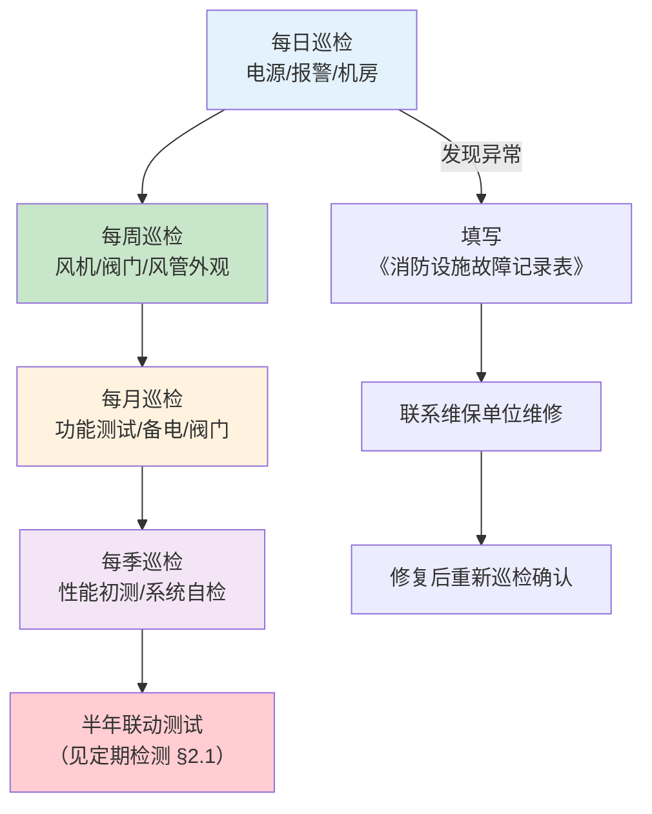

# 第9章 系统维护管理

> [!abstract] 本章概要
> GB 51251-2017 第9章规定了建筑防烟排烟系统在交付使用后的**全生命周期维护管理**要求，包括日常巡检制度、定期检测计划、维护记录档案管理以及常见故障的应急处理预案。防排烟系统是**"养兵千日、用兵一时"**的消防安全设施，日常维护质量直接决定火灾时能否可靠动作。

---

## 一、日常巡检制度

防排烟系统的日常巡检按周期分为四个层级：**每日、每周、每月、每季度**，由物业消防管理人员或消防维保单位执行。

### 1.1 巡检项目总表

| 检查周期 | 检查项目 | 检查内容与方法 | 合格标准 |
|:--------:|----------|---------------|----------|
| **每日** | 控制柜电源指示灯 | 目视检查控制柜面板指示灯状态 | 主电源指示灯亮、备电指示灯正常（绿色） |
| **每日** | 消防控制室报警信号 | 在消防控制室查看防排烟相关报警信号 | 无故障报警、无屏蔽信号 |
| **每日** | 风机房环境 | 巡视风机房，查看有无漏水、异物、异味 | 机房干燥整洁，风机周围无杂物堆积 |
| **每周** | 风机外观检查 | 目视检查风机外壳、叶轮、传动皮带 | 无锈蚀、无变形、皮带张紧度正常 |
| **每周** | 阀门外观检查 | 查看防火阀、排烟阀、排烟防火阀外观 | 阀门本体无锈蚀、操作手柄位置正常 |
| **每周** | 风管外观检查 | 巡视可见段风管 | 风管无破损、无脱落、支吊架牢固 |
| **每月** | 控制柜功能测试 | 将控制柜切换至"手动"模式，点动启停风机 | 风机启停正常，无异常振动或噪声 |
| **每月** | 备用电源切换 | 切断主电源，检测备用电源自动切换功能 | 切换时间 ≤ 15秒，风机可正常启动 |
| **每月** | 排烟防火阀手动测试 | 手动关闭/复位排烟防火阀 | 关闭灵活、复位顺畅、信号反馈正常 |
| **每月** | 挡烟垂壁功能测试 | 测试活动式挡烟垂壁的下降动作 | 下降平稳无卡阻、到位信号正常 |
| **每季度** | 风机性能初测 | 启动风机后测量风量、风压基本参数 | 风量不低于设计值的 90% |
| **每季度** | 控制系统自检 | 触发消防控制室系统自检程序 | 所有模块应答正常、无开路/短路报错 |
| **每季度** | 风管泄漏初查 | 对可见段风管进行目视/听声检查 | 无明显漏风声、无破损开口 |

### 1.2 巡检流程图

---

## 二、定期检测

### 2.1 半年联动测试

每半年至少进行一次**全面联动功能测试**，这是消防安全管理的强制性要求：

| 测试项目 | 测试方法 | 判定标准 |
|----------|----------|----------|
| **火灾报警联动** | 在任意楼层触发烟感/温感探测器（或手动报警按钮） | 本层及相邻层排烟阀自动开启、排烟风机自动启动、补风机联动运行、加压送风机联动启动 |
| **消防控制室远程控制** | 在消防控制室手动操作启/停各防排烟风机 | 远程启停正常，状态反馈信号与现场一致 |
| **280°C 排烟防火阀联锁** | 手动触发排烟防火阀 280°C 熔断关闭 | 关闭信号反馈至消防控制室，联锁停止对应排烟风机 |
| **电源切换联动** | 切断主电→备电投入→恢复主电 | 全过程风机保持运行或能自动重启动 |
| **应急广播/声光报警联动** | 联动测试期间确认相关区域警报正常 | 声光报警器动作，应急广播播放疏散指令 |

### 2.2 年度全面检测

| 检测项目 | 检测内容 | 技术要求 |
|----------|----------|----------|
| **风量/风压测试** | 使用风速仪、微压计全面测量各风口风量、前室/楼梯间余压 | 加压送风量 ≥ 设计值；前室余压 25~30Pa；楼梯间余压 40~50Pa |
| **排烟量测试** | 在排烟风机出口处测量总排烟量 | 不低于设计排烟量的 **90%** |
| **漏风量测试** | 按 GB 50243 方法对风管系统进行分段漏风量测试 | 低压系统 ≤ 3.6 m³/(h·m²)、中压 ≤ 2.4 m³/(h·m²)、高压 ≤ 1.2 m³/(h·m²) |
| **风机绝缘电阻** | 测量电机绕组对地绝缘电阻 | ≥ 0.5 MΩ |
| **阀门全数动作测试** | 对所有防火阀、排烟阀、排烟防火阀逐一操作测试 | 100% 正常启闭、信号反馈率 100% |
| **耐火保护层检查** | 检查风管防火包裹、防火板等耐火保护层完整性 | 无脱落、无破损、无受潮失效 |

> [!warning] 年度检测不合格项处理
> 年度检测中发现的**任何不合格项**必须在 **30日内** 完成整改并复测合格，整改期间应采取加强巡检等临时保障措施确保消防安全。检测报告和整改记录应归档保存，保存期限不少于 **5年**。

---

## 三、维护记录档案

### 3.1 档案分类与内容

| 档案类别 | 内容 | 保存期限 |
|----------|------|:--------:|
| **系统竣工档案** | 设计图纸、竣工图、设备清单、产品合格证、调试报告、验收记录 | 永久 |
| **日常巡检记录** | 每日/每周/每月/每季巡检表、签字确认 | ≥ 3年 |
| **定期检测报告** | 半年联动测试报告、年度全面检测报告（含数据） | ≥ 5年 |
| **维修/改造记录** | 故障报修单、维修工单、部件更换记录、改造方案与验收记录 | 永久 |
| **人员培训记录** | 消防管理人员培训记录、实操考核记录 | ≥ 3年 |

### 3.2 档案管理要求

- 维护记录应使用**专用表格**，填写完整、字迹清晰、不得随意涂改
- 电子档案与纸质档案**双轨并行**，电子档案每周自动备份
- 物业管理单位变更时，消防设施档案应**完整移交**，交接双方签字确认
- 消防主管部门检查时应能**即时提供**最近两年的全部巡检和检测记录

---

## 四、故障处理预案

防排烟系统最常见的三类故障及其应急处理方案：

### 4.1 风机故障

| 故障现象 | 可能原因 | 排查步骤 | 应急措施 |
|----------|----------|----------|----------|
| 风机无法启动 | 电源缺相/电机烧毁/控制回路故障 | ①检查电源电压 ②测量电机绝缘 ③检查接触器/继电器 | 立即联系维保单位，**24h内**完成修复；期间加强该区域人工巡检 |
| 风机运行异常振动 | 叶轮不平衡/轴承磨损/地脚螺栓松动 | ①停机检查叶轮 ②听轴承声音 ③紧固螺栓 | 如振动幅度超限（≥4.6mm/s），立即停机检修 |
| 风量明显不足 | 皮带打滑/风阀未开启到位/风管堵塞 | ①张紧或更换皮带 ②检查阀门开启角度 ③内窥检查风管 | 皮带调整可在日常维护中完成；风管堵塞需专业清理 |

### 4.2 防火阀卡阻

| 故障现象 | 可能原因 | 排查步骤 | 处理方案 |
|----------|----------|----------|----------|
| 阀门无法手动关闭 | 阀轴锈蚀/叶片变形卡死/异物卡入 | ①喷松动剂润滑阀轴 ②检查叶片间隙 ③清除异物 | 润滑后手动反复操作 ≥10次；叶片变形需更换阀门 |
| 阀门关闭不严（漏风） | 密封条老化/叶片变形/阀体变形 | ①漏光法检查密封面 ②更换密封条 ③校正叶片 | 密封条更换周期建议 3~5 年 |
| 信号反馈异常 | 微动开关故障/线路接触不良/模块故障 | ①检查微动开关触点 ②测量线路通断 ③更换模块 | 按附录F记录并报消防控制室确认信号恢复 |

### 4.3 控制柜断电

| 场景 | 故障描述 | 应急处理 | 预防措施 |
|------|----------|----------|----------|
| 主电源断电 | 市电停电或配电回路跳闸 | ①确认备用电源自动投入 ②检查配电柜开关状态 ③通知物业电工恢复供电 | 每月测试一次备电自动切换功能 |
| 备用电源失效 | 蓄电池老化/充电模块故障 | ①立即启动应急发电机（如有） ②联系更换蓄电池 ③挂牌警示 | 蓄电池每 3 年更换一次；充电模块每半年检测 |
| 控制柜内部故障 | 变频器/PLC/继电器故障 | ①切换至手动直启模式（旁路控制） ②紧急采购备件 ③通知厂家维修 | 常备关键继电器/接触器/熔断器等备件 |

> [!danger] 故障处理基本原则
> 1. **优先恢复基本功能**：任何故障处理应以保证系统能在手动模式下启动运行为第一目标
> 2. **挂牌警示**：系统处于维修停用状态时，必须在消防控制室和风机房悬挂醒目标识，并通知所有相关方
> 3. **限时修复**：一般故障 24 小时内修复，重大故障（风机损坏/全面断电）72 小时内修复，超时需向消防主管部门报备
> 4. **追溯闭环**：每次故障处理后必须填写《消防设施故障处理记录表》，并在修复后一周内重新进行功能验证测试

---

## 🔗 相关页面

- 📑 **章节索引**：GB51251-2017-章节索引
- 🔥 **排烟系统设计**：第4章 排烟系统设计
- 🎛️ **系统控制**：第6章 系统控制
- 🔧 **系统施工（日常维修参考）**：第7章 系统施工
- 📐 **调试验收指标（年度检测参考）**：第8章 系统调试与验收
- 📋 **标准总览**：中国标准索引

---

← 返回 GB51251-2017-章节索引|GB51251-2017 章节索引
