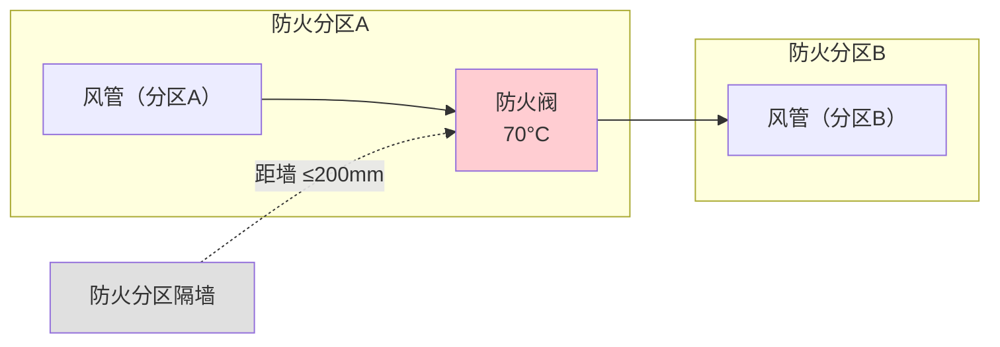
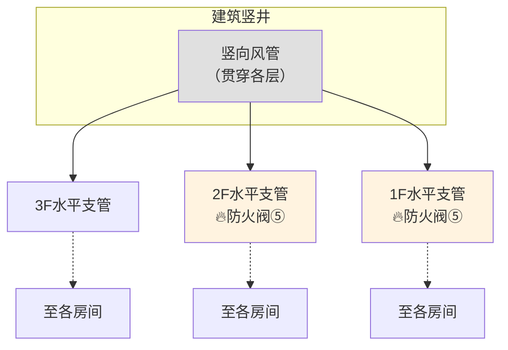
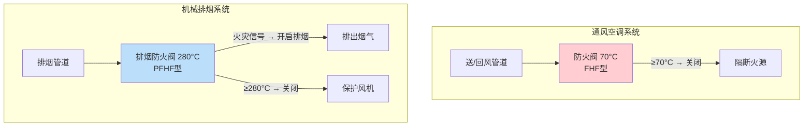

# 第9.2节 通风与空调系统防火阀设置 ⭐

> [!important] 章节定位 —— HVAC 防火设计核心
> GB 50016-2014 第9.3.11 条是暖通通风防火设计的**最核心条文**，规定了通风空调系统风管上必须设置公称动作温度 70°C 防火阀的六类位置。该条文是所有风管工程施工图中防火阀布点的**唯一法律依据**，违反即构成消防设计缺陷。同时，本条还需与 GB 15930-2007（产品标准）和 GB 51251-2017（防排烟标准）配合理解：防火阀（70°C）与排烟防火阀（280°C）虽然都叫"阀"，但安装在**不同系统、不同位置、不同动作逻辑**，严禁混淆。

---

## 一、第 9.3.11 条 —— 六类必设防火阀位置 🔥

> [!danger] 强制性条文 9.3.11
> 通风、空气调节系统的风管在下列部位应设置**公称动作温度为 70°C 的防火阀**：

### 📍 六类必设位置全表

| 序号 | 设置部位 | 具体场景 | 设阀原因 |
|:----:|----------|----------|----------|
| **①** | **穿越防火分区处** | 风管穿过防火分区隔墙/楼板 | 阻止火灾通过风管从一个防火分区蔓延至相邻分区 |
| **②** | **穿越通风、空气调节机房的房间隔墙和楼板处** | 风管进出空调机房、新风机房 | 保护核心设备，防止机房火灾外溢或外部火灾侵入设备 |
| **③** | **穿越重要的或火灾危险性大的场所的房间隔墙和楼板处** | 变配电室、档案室、贵重物品库房、锅炉房等 | 保护重要功能区域 |
| **④** | **穿越防火分隔处的变形缝两侧** | 建筑伸缩缝、沉降缝、抗震缝处 | 变形缝是防火薄弱环节，两侧设阀形成双保险 |
| **⑤** | **垂直风管与每层水平风管交接处的水平管段上** | 竖井风管接入每层支管的三通/弯头处 | 阻断火灾通过竖向管道井向上蔓延（烟囱效应） |
| **⑥** | **公共建筑内厨房的排油烟管道**（按防火分区设置，在与竖向排风管连接的支管处） | 商业厨房、酒店厨房排油烟管 | 厨房油脂积聚+明火=极高火灾风险；设 150°C 防火阀（区别于常用 70°C） |

### 🔄 特殊情况

| 情形 | 附加要求 |
|------|----------|
| **公共建筑的浴室、卫生间和厨房竖向排风管** | 应采取防止回流措施，或在**每层支管上**设置公称动作温度 70°C 的防火阀 |

---

## 二、六类位置详解

### 2.1 ① 穿越防火分区处

| 关键参数 | 要求 |
|----------|------|
| **设阀位置** | 紧靠防火分区隔墙 |
| **距墙距离** | ≤ **200 mm** |
| **阀与墙之间风管** | 壁厚 ≥ **1.6mm**，两端各 2m 范围须防火保护 |
| **穿越处封堵** | 风管与隔墙间缝隙须防火封堵材料填实 |

### 2.2 ② 穿越空调机房隔墙/楼板处

> [!tip] 为什么机房出入口必须设阀？
> 空调机房内集中了风机、空调箱、配电柜等设备，是**火灾易发区和高价值设备集中区**。设防火阀可实现：
> - 机房火灾→阀关闭→不蔓延至建筑其它区域
> - 外部火灾→阀关闭→保护昂贵设备

### 2.3 ③ 穿越重要场所隔墙/楼板处

| 典型重要场所 | 火灾风险 | 防护要求 |
|-------------|----------|----------|
| **变配电室** | 电气火灾高发 | 双向防火阀 |
| **档案室/资料库** | 纸质易燃物集中 | 防火阀+自动灭火 |
| **通信机房** | 电子设备集中 | 防火阀+气体灭火 |
| **贵重物品库** | 财产保护 | 防火阀+门禁联动 |

### 2.4 ④ 穿越变形缝两侧

> [!warning] 变形缝设阀要点
> 1. **两侧均须设**防火阀 —— 只设一侧不满足要求
> 2. 柔性短管须为 **A 级不燃**材料（普通帆布软接 B1 级不可用）
> 3. 变形缝处建筑位移可能拉裂风管，两侧设阀确保任一侧损坏时另一侧仍能隔断

### 2.5 ⑤ 垂直与水平风管交接处

| 场景 | 设阀位置 | 理由 |
|------|----------|------|
| 竖井主风管 → 每层水平支管 | 在**水平管段上**，靠近三通/弯头处 | 隔断每层火灾烟气进入竖井 |
| 各层回风支管 → 竖井回风干管 | 在**水平支管上** | 同上 |

### 2.6 ⑥ 厨房排油烟管道

| 要素 | 说明 |
|------|------|
| **动作温度** | **150°C**（厨房排油烟专用防火阀，不同于常规 70°C） |
| **设阀位置** | 按防火分区设置，在**与竖向排风管连接的支管处** |
| **特殊性** | 厨房油烟温度高于普通通风，70°C 阀会频繁误动作 |

---

## 三、防火阀安装通用要求

| 要求项 | 具体内容 | 依据 |
|--------|----------|:----:|
| **安装位置** | 防火阀**宜靠近防火分隔处**设置 | 9.3.11 |
| **距墙距离** | 距墙表面**不应大于 200mm** | GB 50243 |
| **阀墙间风管** | 壁厚 ≥ **1.6mm** 的钢板制作 | GB 50738 |
| **穿越封堵** | 风管与防火墙之间缝隙须**防火封堵材料**严密填实 | 6.3.5 |
| **暗装检修口** | 吊顶等隐蔽部位须设**检修口**，便于测试和复位 | GB 50243 |
| **防火保护** | 阀门两侧各 **2.0m** 范围内风管须防火保护 | GB 50243 |
| **联锁控制** | 防火阀关闭时联锁关闭相应送风机/排风机 | 9.1.6 + GB 51251 |
| **手动复位** | 防火阀必须能**手动复位**（不得自动复位） | GB 15930 |

---

## 四、防火阀（70°C）与排烟防火阀（280°C）的关键区别

> [!danger] 常见致命错误
> 在**通风空调系统上用 280°C 阀** 或 在**排烟系统上用 70°C 阀**——两者功能完全不同，严禁混淆！

| 对比维度 | 防火阀（本条所指） | 排烟防火阀 |
|----------|:-----------------:|:----------:|
| **标准依据** | GB 50016 第 9.3.11 条 | GB 51251-2017 第 6 章 |
| **安装系统** | **通风/空调系统** | **机械排烟系统** |
| **动作温度** | **70°C** | **280°C** |
| **常态** | 常开 | 常开或常闭 |
| **动作逻辑** | 70°C → **关闭** → 隔断火源 | 280°C → **关闭** → 停止排烟、保护风机 |
| **安装位置** | 六类必设位置（见上表） | 排烟风机入口、排烟支管接干管处 |
| **产品标准** | GB 15930（FHF 型） | GB 15930（PFHF 型） |
| **误装后果** | 若装在排烟系统→排烟时 150°C 烟气导致误关→排烟失效 | 若装在通风系统→70°C 时不动作→无法隔断火源 |

---

## 五、风管制造与施工中的防火阀接口要点

| 制造/施工环节 | 接口要求 | 关联 |
|--------------|----------|------|
| **法兰匹配** | 阀门两端法兰与风管法兰规格一致，螺栓孔对齐 | 风管连接方式 |
| **管段长度** | 防火阀**前后各 2.0m** 风管须防火保护（≥ 阀门同等耐火极限） | GB 50243 6.2.3 |
| **三通/弯头** | 防火阀附近的管件不应影响阀门叶片全行程启闭 | 管件制造(弯头三通等) |
| **柔性接头** | 阀门两端**不应**直接连接柔性短管 | 柔性短管耐火不足 |
| **检修口** | 吊顶/隔墙对应位置必须留设检修口 | GB 50243 |
| **气流方向** | 阀门上的气流箭头**必须**与系统气流方向一致 | 反向安装导致阀门无法关闭 |
| **信号线** | 带微动开关的防火阀须预留信号线接口（DC 24V 无源干接点） | BAS/消防联动 |

---

## 🔗 相关页面

- 通风系统一般规定 → 第9章1节 供暖通风和空气调节—般规定
- 风管材料与保温燃烧性能 → 第9章3节 风管材料与保温燃烧性能
- 管道井防火构造 → 第6章 建筑构造(管道井防火)
- 防火阀门产品标准（定义、型号、性能）→ GB15930-2007 建筑通风和排烟系统用防火阀门
- 防排烟系统阀门控制逻辑 → GB51251-2017 建筑防烟排烟系统技术标准
- 风管施工规范（阀门安装工艺要求）→ GB50738-2011 通风与空调工程施工规范
- 风管安装验收（防火阀安装验收）→ GB50243-2016 通风与空调工程施工质量验收规范
- 章节总览 → GB50016-2014-章节索引|GB50016-2014 章节索引

---

← 返回 GB50016-2014-章节索引|GB50016-2014 章节索引
