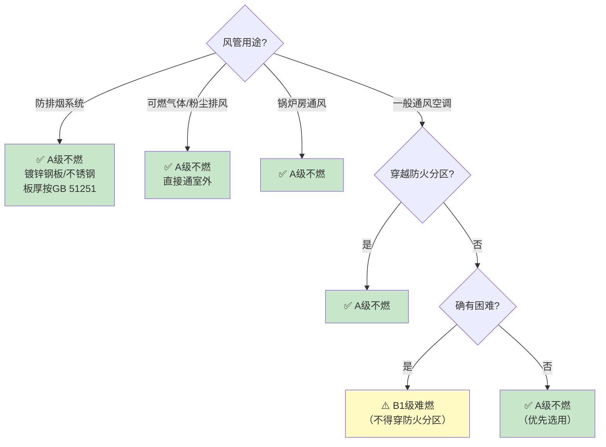

# 第9.3节 风管材料与保温燃烧性能

> [!important] 章节定位
> GB 50016-2014 第9.3.13~9.3.16 条是风管**材料选型的强制性依据**。规定了风管本体材料、保温绝热材料、柔性短管的燃烧性能等级要求。对于风管制造而言，材料的燃烧性能等级（A 级不燃 / B1 级难燃）直接决定板材选型和工艺方案，是 CAMduct 材料数据库配置的强制输入参数。

---

## 一、燃烧性能等级体系

### 1.1 中国建筑材料燃烧性能分级（GB 8624）

| 等级 | 名称 | 定义 | 典型风管/保温材料 |
|:----:|------|------|-------------------|
| **A 级** | **不燃材料** | 空气中火烧或高温作用时**不起火、不微燃、不碳化** | 镀锌钢板、不锈钢、玻璃棉、岩棉、硅酸钙板 |
| **B1 级** | **难燃材料** | 火烧或高温时**难起火、难微燃、难碳化**，火源移除后燃烧停止 | 橡塑保温（B1级）、酚醛泡沫、阻燃聚氨酯 |
| B2 级 | 可燃材料 | 火烧时起火或微燃，移除火源后仍可持续燃烧 | 普通木材、普通聚苯乙烯 |
| B3 级 | 易燃材料 | 极易被点燃，燃烧迅速 | 汽油、酒精等（极少用于建筑材料） |

> [!tip] A 级 vs B1 级速判
> - **A 级**：扔进火里烧不着——金属、岩棉、玻璃棉
> - **B1 级**：扔进火里会着，但拿出来就灭了——阻燃橡塑、阻燃酚醛

---

## 二、风管本体材料要求

### 2.1 一般规定（9.3.13）

> [!warning] 强制性条文 9.3.13
> 通风、空气调节系统的风管应采用**不燃材料**制作。

| 场景 | 材料要求 | 说明 |
|------|:--------:|------|
| **一般通风空调风管** | **A 级**（不燃） | 镀锌钢板、不锈钢板等金属材料 |
| **确有困难时** | 可降为 B1 级（难燃） | ⚠️ 但这种风管**不得穿越防火分区** |
| **防排烟风管** | **A 级**（不燃） | 强制要求，无例外 |

### 2.2 特殊排风系统（9.3.14）

> [!danger] 强制性条文 9.3.14
> 排除、输送有燃烧或爆炸危险气体、蒸气和粉尘的排风系统，其风管应采用**不燃材料**并应**直接通到室外安全处**。

| 要素 | 要求 |
|------|------|
| **材料** | **A 级不燃**（无例外） |
| **排放方式** | 直接通室外安全处（不得排入竖井或共用排风道） |
| **适用系统** | 可燃气体排风、粉尘排风、易燃蒸气排风 |

### 2.3 锅炉房通风（9.3.16）

| 系统 | 材料要求 |
|------|:--------:|
| 燃油锅炉房通风 | **A 级**不燃 |
| 燃气锅炉房通风 | **A 级**不燃 |
| 锅炉房事故排风 | **A 级**不燃 |

### 2.4 风管材料选用决策矩阵

---

## 三、保温绝热材料燃烧性能要求（9.3.15）

> [!warning] 强制性条文 9.3.15
> 通风、空气调节系统的风管及设备采用的**绝热材料**，其燃烧性能等级应符合规定。

### 3.1 保温材料分级要求

| 应用场景 | 燃烧性能等级 | 常见适用材料 | 常见禁用材料 |
|----------|:-----------:|-------------|-------------|
| **穿越防火分区、穿越机房隔墙/楼板处的风管** | **A 级**（不燃） | 岩棉板/管壳、玻璃棉板/管壳、硅酸铝棉 | ❌ 橡塑保温（即使是B1级）、聚氨酯 |
| **电加热器前后 800mm 范围内** | **A 级**（不燃） | 岩棉管壳、硅酸钙管壳 | ❌ 橡塑、聚氨酯、酚醛 |
| **设于建筑物内的一般通风空调风管** | ≥ **B1 级**（难燃） | 橡塑保温（B1级）、酚醛泡沫、阻燃聚氨酯 | ❌ B2 级普通橡塑 |
| **室内明装管道** | ≥ B1 级 | 同一般风管 | ❌ B2 级 |
| **室外风管** | ≥ B1 级 + 防水 | 闭孔橡塑（B1级）+ 铝皮保护 | — |

### 3.2 保温材料分级速查

| 材料 | 燃烧等级 | 适用温度 | 穿越防火分区可用? |
|------|:--------:|:--------:|:----------------:|
| **岩棉** | A 级 | ≤ 650°C | ✅ 可以 |
| **玻璃棉** | A 级 | ≤ 350°C | ✅ 可以 |
| **硅酸铝棉** | A 级 | ≤ 1000°C | ✅ 可以 |
| **硅酸钙** | A 级 | ≤ 1050°C | ✅ 可以 |
| **橡塑（B1级）** | B1 级 | ≤ 105°C | ❌ 不可以 |
| **酚醛泡沫** | B1 级 | ≤ 120°C | ❌ 不可以 |
| **阻燃聚氨酯** | B1 级 | ≤ 120°C | ❌ 不可以 |
| **普通聚氨酯** | B2/B3 级 | ≤ 100°C | ❌ 禁用 |

> [!danger] 关键记忆点
> **凡是穿越防火分区、穿越机房隔墙/楼板、电加热器附近的风管，保温必须用 A 级不燃材料。** B1 级橡塑保温虽然阻燃，但在这些关键部位仍然不允许使用。

---

## 四、柔性短管（软连接）材料要求

### 4.1 不同系统的柔性短管要求

| 使用部位 | 材料燃烧等级 | 推荐材料 | 长度 |
|----------|:----------:|----------|:----:|
| **一般通风空调系统** | ≥ **B1 级** | 帆布、硅胶玻纤布（B1级） | 150~250 mm |
| **防排烟系统** | **A 级** | 防火硅胶玻纤布、不锈钢波纹管 | 150~250 mm |
| **变形缝处** | **A 级** | 防火硅胶玻纤布 | 按位移量补偿 |
| **风机进出口**（防排烟） | **A 级** | 防火硅胶玻纤布 | 150~250 mm |

### 4.2 柔性短管禁用场景

| 禁止 | 原因 |
|------|------|
| ❌ 防排烟系统用普通帆布 (B1) | 火灾时帆布首先被烧穿 → 排烟系统失效 |
| ❌ 变形缝处用 B1 级材料 | 变形缝是防火薄弱环节，材料必须不燃 |
| ❌ 防火阀两侧直接接柔性短管 | 柔性短管耐火性能无法满足 1.5h 要求 |
| ❌ 电加热器附近用 B1 级软接 | 高温可能导致 B1 级材料燃着 |

---

## 五、风管制造中的材料合规要点

### 5.1 板材进场验证

| 验证项 | 方法 | 标准 |
|--------|------|------|
| **材质证明** | 核对材质证明书，确认材质牌号 | GB/T 2518（镀锌板） |
| **燃烧等级报告** | 保温材料须有第三方燃烧性能检测报告 | GB 8624 |
| **板材厚度** | 千分尺/游标卡尺实测 | JGJ 141 |
| **镀锌层重量** | 镀锌层测厚仪 | ≥ 275 g/m²（双面） |

### 5.2 CAMduct 材料数据库配置

| CAMduct 参数 | 对应规范要求 |
|-------------|-------------|
| Material Type | 镀锌钢板=不燃 A 级 |
| Insulation Type | 穿越防火分区处 → Rockwool (A 级)；一般区域 → Elastomeric (B1 级) |
| Insulation Thickness | 按热工计算，同时满足防火要求 |
| Flexible Connector | 防排烟 → Fire-rated (A 级)；一般通风 → Standard (B1 级) |

---

## 📊 风管材料燃烧性能速查总表

| 管道部位 | 本体材料 | 保温材料 | 柔性短管 |
|----------|:--------:|:--------:|:--------:|
| 穿越防火分区 | A 级 | A 级 | A 级 |
| 穿越机房隔墙/楼板 | A 级 | A 级 | A 级 |
| 电加热器 ±800mm | A 级 | A 级 | A 级 |
| 一般通风空调（不穿越防火分区） | A 级（优先）或 B1 级 | ≥ B1 级 | ≥ B1 级 |
| 防排烟系统 | **A 级** | **A 级** | **A 级** |
| 可燃气体/粉尘排风 | **A 级** | **A 级** | **A 级** |
| 锅炉房通风 | **A 级** | **A 级** | **A 级** |
| 变形缝处 | A 级 | A 级 | **A 级** |
| 管道井内 | **A 级** | A 级 | — |

---

## 🔗 相关页面

- 防火阀设置位置 → 第9章2节 通风与空调系统防火阀设置
- 管道井防火构造 → 第6章 建筑构造(管道井防火)
- 通风系统一般规定 → 第9章1节 供暖通风和空气调节—般规定
- 保温风管制作 → 保温风管
- 风管类型与规格 → 风管类型与规格
- 风管耐火试验 → GBT17428-2009 通风管道耐火试验方法
- 风管施工规范 → GB50738-2011 通风与空调工程施工规范
- 章节总览 → GB50016-2014-章节索引|GB50016-2014 章节索引

---

← 返回 GB50016-2014-章节索引|GB50016-2014 章节索引
